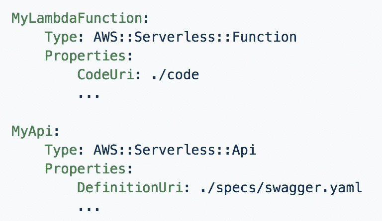
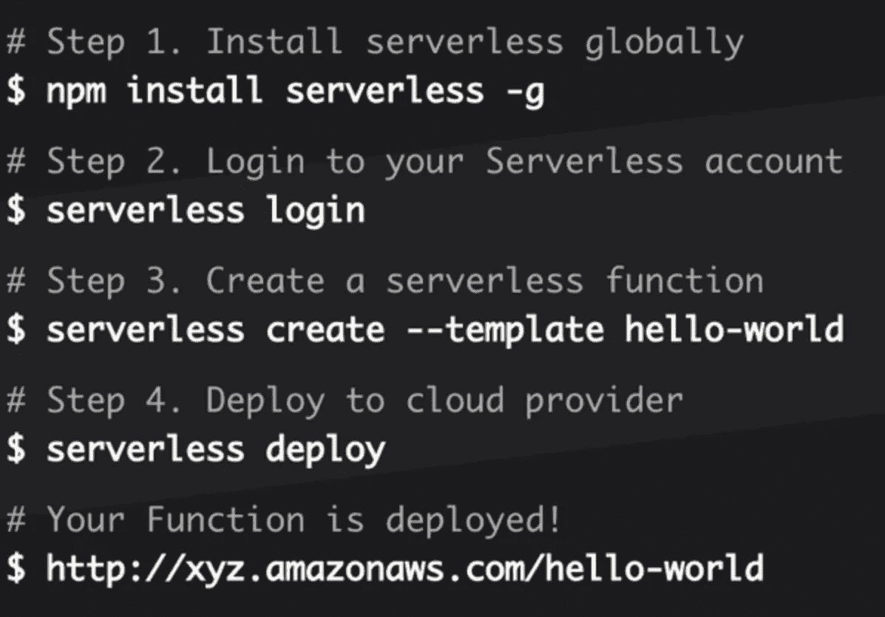

# 最流行的无服务器部署工具

> 原文：<https://medium.com/hackernoon/the-most-popular-deployment-tools-for-serverless-2385cc3d289e>

当开始在[无服务器](https://hackernoon.com/tagged/serverless)和功能即服务中编写软件时，默认云供应商的控制台是起点。然而，一旦应用程序变得复杂，就需要一个合适的部署工具。这篇文章涵盖了最流行的无服务器部署工具。

# 云提供商的方式

每个云供应商都提供了一种部署功能的简单方法:

*   **AWS** 有一个用于部署 Lambda 函数的 [CLI，以及本文中涉及的两个工具(SAM 和 Chalice)。](https://docs.aws.amazon.com/lambda/latest/dg/vpc-ec-upload-deployment-pkg.html)
*   **微软 Azure** 推荐使用 [Visual Studio 来部署函数](https://docs.microsoft.com/en-us/azure/azure-functions/functions-develop-vs)，它也支持使用 [Azure CLI](https://docs.microsoft.com/en-us/azure/azure-functions/deployment-zip-push) 来部署函数。
*   **Google Cloud** 提供了[部署云功能](https://cloud.google.com/functions/docs/deploying/) *的不同方式。*推荐使用 [*gcloud 命令行工具*](https://cloud.google.com/sdk/gcloud/reference/functions/deploy) 。
*   **IBM Cloud** 提供 [IBM Cloud CLI](https://console.bluemix.net/docs/openwhisk/bluemix_cli.html#cloudfunctions_cli) 。

# 平台

无服务器部署平台实现的不仅仅是部署您的代码——它们的功能多种多样，包括无服务器应用程序建模、代码管理、可视化和多云支持。

## AWS SAM

SAM — [无服务器应用模型](https://github.com/awslabs/serverless-application-model/blob/master/HOWTO.md) —是一种以简单的方式描述和部署无服务器应用的方法。它扩展了 AWS CloudFormation，提供了定义 AWS Lambda 函数、API 网关和 DynamoDB 表的简化方法。它支持 Lambda 函数的运行时。AWS SAM 仅支持部署在 AWS 上的应用程序。

AWS SAM 应用以 [SAM 格式](https://github.com/awslabs/serverless-application-model/blob/master/versions/2016-10-31.md)描述，这是 JSON 或 YAML，使用 [AWS SAM CLI](https://github.com/awslabs/aws-sam-cli) 部署。开始使用[本指南](https://github.com/awslabs/serverless-application-model/blob/master/HOWTO.md)。AWS SAM 还有一个活动的[松弛通道](https://awssamopensource.splashthat.com/)。

*Describing an application using AWS SAM (source: AWS)*

*Deploying a function using the AWS SAM CLI (source: AWS)*

## 普鲁米

Pulumi 致力于成为“作为代码的云本地基础设施”框架，旨在为任何云提供无服务器功能、容器应用和数据基础设施的云开发模型。Pulumi CLI 工具是使用 Pulumi 的主要方式，它部署到不同的提供商:AWS、Azure、GCP、OpenStack 以及 Kubernetes。Pulumi 还创建了 [Pulumi Cloud Framework](https://pulumi.io/quickstart/cloudfx/index.html) ，它允许您对基础设施和应用程序逻辑进行编程，特别适合无服务器应用程序，并且与云无关。Pulumi 有一个[活跃的 Slack 社区](https://slack.pulumi.io/)，在 GitHub 上也有[。](https://github.com/pulumi)

*Deploying and managing infrastructure using Pulumi (source: TechCrunch)*

## 无服务器框架

无服务器框架是一个[开源工具](https://serverless.com/framework/)，用于管理和部署无服务器功能。它支持多种[编程](https://hackernoon.com/tagged/programming)语言和云提供商。今年早些时候，它引入了两个额外的工具——[事件网关](https://serverless.com/event-gateway/)，它提供了一个抽象层来轻松设计复杂的无服务器应用程序，以及[无服务器仪表板](https://serverless.com/dashboard/)，用于更好地管理应用程序和协作。无服务器框架应用程序被写成 YAML 文件(称为 *serverless.yml* ),这些文件描述了无服务器应用程序的功能、触发器、权限、资源和各种插件。

[无服务器框架与其他工具](https://serverless.com/learn/comparisons/)的比较提供了一些关于框架差异化的见解。无服务器框架有一个活跃的 [GitHub 社区](https://github.com/serverless/serverless)。许多入门的例子可以在 GitHub 页面的[中找到。](https://github.com/serverless/examples)

*Deploying an application using Serverless Framework (source: serverless.com)*

## 斯塔克里

Stackery 的承诺是成为团队无服务器开发的最佳工具包。与 AWS SAM 和无服务器框架不同，从第一天起，Stackery 就引入了一个仪表板，用于可视化设计和构建无服务器应用。此外，它还提供了一个标准的 CLI，并宣布[它现在是基于 AWS SAM](http://www.stackery.io/blog/stackery-sam-announcement/) 构建的。

除了创建和部署无服务器应用程序，Stackery 还为团队提供强大的协作工具，包括回滚保护、自动构建打包和 GitHub 集成。

*Building serverless applications visually using Stackery (source: Stackery)*

# 工具

与平台不同，工具适用于特定的任务，并且主要围绕这些任务提供自动化。

## AWS 圣杯

[Chalice](https://aws.amazon.com/blogs/developer/chalice-1-0-0-ga-release/) 是 AWS 的一个框架，用于用 Python 编写无服务器应用程序，并允许快速创建和部署使用 AWS Lambda 的应用程序。Chalice 提供了一个命令行工具，用于创建、部署和管理应用程序，与常见的 AWS 服务集成，以及自动生成 IAM 策略。[GitHub 上有 Chalice。](http://chalice/)

## 顶点

[Apex](http://apex.run/) 是一个旨在让您轻松构建、部署和管理 AWS Lambda 的框架。Apex 的一个关键特性是，通过使用注入到构建中的 Node.js 填充程序，能够使用 AWS Lambda 本身不支持的语言。除了构建和部署功能之外，其他相关工具还提供测试、部署回滚和日志跟踪。 [Apex 在 GitHub 上有](https://github.com/apex/apex)。

## 建筑师

如果您正在 Node.js 中部署 AWS Lambda 函数，您应该查看一下 [Architect](https://arc.codes/) 。该框架使用明文清单来描述云基础设施，包括版本控制、快速部署和本地工作。[GitHub](https://github.com/arc-repos)上有建筑师。

## Claudia.js

在使用 AWS Lambda、Node.js 和 API Gateway 的开发人员中，一个受欢迎的项目是 [Claudia.js](https://claudiajs.com/) 。它支持通过一个命令部署 AWS Lambda 和 API 网关应用程序，仅使用标准的 NPM 软件包，并使管理多个版本变得容易。[在 GitHub](https://github.com/claudiajs) 上有 Claudia.js。

## 斯巴达

Go 编程语言变得越来越受欢迎，加上今年早些时候[宣布支持 AWS Lambda](https://aws.amazon.com/blogs/compute/announcing-go-support-for-aws-lambda/) ， [Sparta](https://gosparta.io/) 是一个框架，它将标准 Go 应用程序转换为自部署 AWS Lambda 支持的服务，同时所有配置和基础设施需求也作为 Go 类型编写。[斯巴达在 GitHub 上有](https://github.com/mweagle/Sparta)。

## 将（行星）地球化（以适合人类居住）

众所周知的基础设施代码服务 [Terraform](https://www.terraform.io/) 用于跨不同提供商管理和部署云堆栈。它还提供了一种部署无服务器应用的方法，包括 AWS Lambda 和 API Gateway。

## 扎帕

Zappa 可能是用 Python 部署无服务器 web 服务的最流行的工具，它可以轻松部署 web 应用程序，通常用 Flask 或 Django 编写。Zappa 包装了标准应用程序，并部署了 Lambda 函数来实现无服务器、可扩展的体验。GitHub 上有 Zappa。

# 摘要

正如我们所看到的，在过去的两年中，出现了许多用于部署和管理无服务器应用程序的工具。这些工具各有不同的侧重点，但最终，它们都有一个共同的目标——让开发人员能够在无服务器的情况下更快地迭代，而不会失去理智。

显然，部署只是无服务器之旅的一部分。其他方面包括性能、测试、安全性、调试和监控。必须解决其中的每一个问题，以实现完全无服务器的精神状态。

*最初发表于*[*【blog.epsagon.com】*](http://blog.epsagon.com/the-most-popular-deployment-tools-for-serverless)*。*