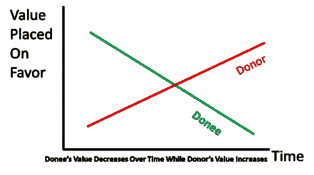

# 根据科学，最强大的礼物是什么？一句真诚的“谢谢”——原因如下

> 原文：<https://medium.com/hackernoon/the-most-powerful-gift-according-to-science-an-authentic-thank-you-heres-why-7fc0b1cbb071>

Image credit: rawpixel, via pixabay

研究员罗伯特·恰尔迪尼研究了构成强大礼物的要素。从科学的角度来看，礼物的“力量”是由它引发说服的互惠原则的程度来衡量的。接受者“回报”礼物的欲望越大，礼物的力量就越大。然而，礼物还有另一种力量来源，那就是它们对送礼者的影响。

如果你的目标是给你的老板、客户、员工和其他有价值的利益相关者一份难忘的商务礼物，准备好付出一些努力。恰尔迪尼总结道，最有效的礼物是:意义重大、出人意料、个性化和无条件。

**不胜感激**

现代和古代社会都非常欣赏互惠。这种情绪已经存在了很久，因为不对称的关系，其中一方主要给予，另一方主要接受，往往不会持久。事实上，对于收到礼物或帮助的传统回应是“非常感谢”，字面意思是“谢谢”。我现在有义务报答你。”

如果你送礼的目的是得到最高水平的回报，那么在选择礼物时你应该考虑的四个因素是:

**显著的** —这并不意味着昂贵。事实上，过于昂贵的礼物可能会使关系紧张，因为这可能会被视为一种公开的策略，要求一个过大的未来帮助。例如，如果你给一个偶然的商业熟人一块 500 美元的手表，他们可能会有所防备而不是感激。因此，礼物对接受者来说应该是有意义的，不一定是昂贵的。

意料之外的礼物——意料之中的礼物给人一种等价交换的感觉，不会让人产生回报送礼者的欲望。意想不到的礼物是令人愉快的，这增强了接受者回报的愿望。如果可能的话，在节日或老板生日之外送他一份礼物。如果你和老板关系良好，一份“我很欣赏你”的礼物，突如其来，会非常有力量。没有正确的关系，它会给人以令人毛骨悚然和自私自利的印象。

**个性化**——考虑“周到”而不是“有字母组合的”反映出对接受者的兴趣和/或热情的深入了解的礼物将会产生最大的影响。一个很好的例子是，根据他们的爱好或其他兴趣，你知道收件人会喜欢的书。

**无条件**——带有明显附加条件的礼物会产生相反的效果，让接受者感到不满，而不是感激。

**最好的礼物**

我很幸运，我可以为我的学生和企业家做些小事情。我喜欢帮助初创公司筹集资金、招募管理人才和建立合作关系。我同样喜欢推荐以前的学生去有前途的初创公司工作。我意识到，我很荣幸有时间和专业的网络来提供这样小，但有意义的帮助。

然而，坦率地说，花时间说“谢谢”的人数令人失望。这不仅有点令人沮丧，而且我也不太愿意为那些我只在他们需要时才听到消息的人提供未来的帮助。

事实证明，我在这方面很正常。行为研究人员已经证实，当人们之前得到感谢时，他们更愿意提供后续的帮助，而当他们之前的帮助没有得到承认时，他们则不愿这样做。

“谢谢”类似于与慈善捐赠相关的税收抵免。我不会为了获得税收减免而进行慈善捐赠。然而，这仍然是一个不错的附带福利。

企业家需要他们能得到的所有帮助，所以说“谢谢”不仅仅是礼貌，也是精明的创业战略。

**你如此珍视的恩惠可能已经被遗忘**

在 [***是的！50-科学证明的有说服力的方法***](http://www.amazon.com/Yes-Scientifically-Proven-Ways-Persuasive/dp/1416576142/ref=sr_1_1?s=books&ie=UTF8&qid=1283195674&sr=1-1) ，恰尔迪尼、戈尔茨坦和马丁描述了一种反直觉的现象，这种现象发生在帮忙或送礼物的人和接受者之间。

研究证实，接受礼物的人通常比提供礼物的人更看重礼物。然而，有趣的事情发生了，久而久之。在接受者的心目中，好感的相对价值*减少*，而在给予者的记忆中，好感的相对价值*增加*。

双方的看法都有道理。例如，如果我将某人的简历转发给一家初创公司，他们随后被录用了，这位员工可以正确地指出，他们必须在招聘过程中给公司留下深刻印象，并在被录用后展现价值。或者，我可能记得，如果没有我最初的推荐，员工可能没有机会证明自己。

**避免互惠敌意**

如上图所示，送礼物或帮忙的人(捐赠者)的理想时间是接受者(受赠者)仍然高度重视它的时候。久而久之，接受者的欣赏度会逐渐下降。给予者和接受者之间的差异持续增长，直到每一方给予恩惠/礼物的价值显著不同。

如果捐赠者希望在很长一段时间后寻求互惠，她可能会首先提醒受赠人。显然，这样的提醒应该是微妙的，以避免公开地将帮助和互惠要求联系起来。

向你的老板、导师或任何对你的事业有过重大帮助的人表达一句体贴的“谢谢”这一简单的礼物，包含了所有被科学证明可以引发互惠的元素，假设它是:重要的(他们足够关心你，重视你的感激)、意想不到的(不是敷衍)、个性化的(比如一张有意义的手写便条)和无条件的(它与“请求”无关)。

即使你没有得到任何回报，你也会感觉很棒，因为真诚地对某人说“谢谢”是你能给自己的最有意义的礼物之一。

*可以在推特上关注约翰:*[*@ johngreathouse*](https://twitter.com/#!/johngreathouse)*。*