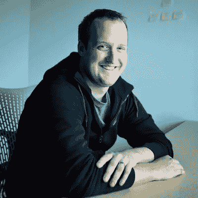
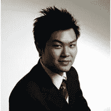
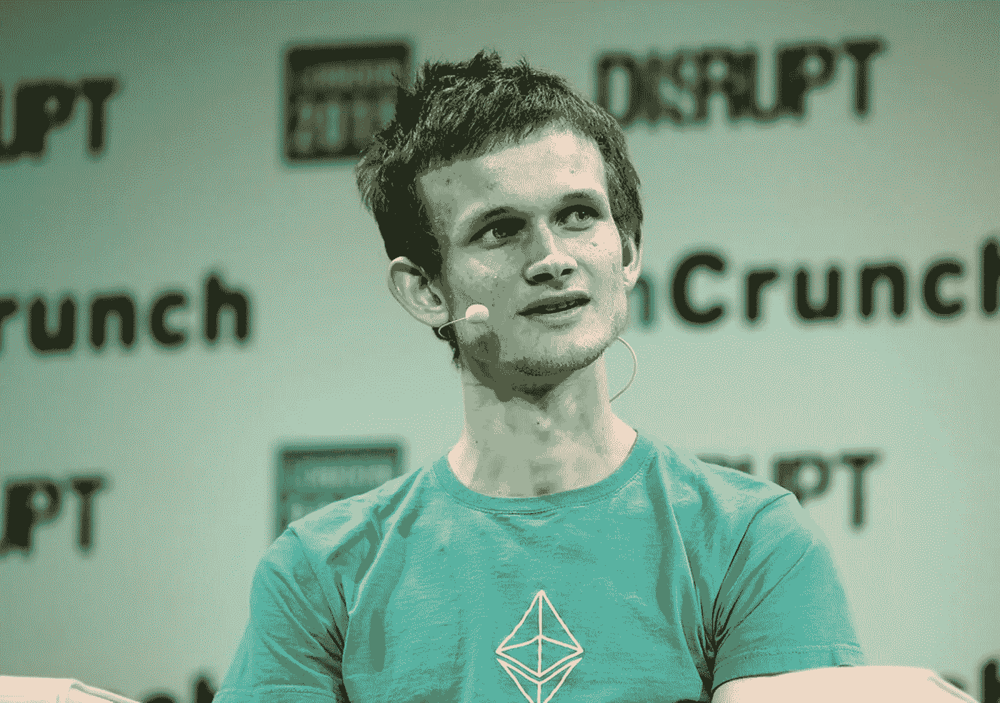

# 5 个吸毒的首席执行官

> 原文：<https://medium.com/hackernoon/the-most-successful-ceos-in-ico-738b6663ac4d>

加密行业是一个巨大的领域，它将来自 IT、技术领域的专业人士以及区块链和加密领域的真正专家团结在一起。密码专家在整个 T2 ICO 和区块链产业中的作用是巨大的，我们不会否认这一点。这些专家正在成为各种 ico 的顾问，从而帮助他们筹集大量资金。他们还在世界各地的加密会议上发言，告诉新手他们的经验，分享他们对新技术的看法。

密码专家也在 crypto media 工作，为任何愿意了解区块链世界的人积累了大量的内容。

没有这些专家，区块链就不会存在。这就是为什么我们很高兴分享一些最近最成功的首席执行官 ico。

## **泰德·利文斯顿**

首席执行官 KIK

泰德·利文斯顿是拥有超过 2.4 亿注册用户的聊天网络 Kik 的创始人兼首席执行官。Kik 成立于 2009 年，已经从投资者那里筹集了 1.205 亿美元。利文斯顿还对滑铁卢大学的 Velocity 基金保持着浓厚的兴趣。

Kik Messenger 是加拿大公司 Kik Interactive 推出的一款移动通讯应用，可在 iOS 和 Android 操作系统上免费下载。Kik 以其用户匿名功能而闻名，例如允许用户注册而无需提供电话号码。截至 2016 年 5 月，Kik Messenger 拥有约 3 亿注册用户。

Kik 的 ICO 销售持续了两周时间，从 2017 年 9 月 12 日到 9 月 26 日。这是 2017 年最受欢迎的 ico 之一，从 117 个国家的 10，026 名个人那里筹集了大约 5000 万美元。在一次预售中，还从机构投资者那里筹集了 5000 万美元。

在真正的北方技术会议上，Livingston 表达了他对区块链令人惊讶的看法:“几乎没有人应该关注它。”然后他解释道:

> “区块链每天都做些什么？它允许你拥有一个不可信的数据库。这可以用在很多方面，但大多数情况下，你仍然需要信任。”

令人惊讶的是，尽管他的声明，利文斯顿和他的 ICO 在区块链的帮助下筹集了数百万美元。

## **陈启昌**

Digixglobal 的联合创始人/首席执行官

Kai C. Chng 在华尔街的一家全球投资银行做了四年的外汇交易员。他是宾夕法尼亚大学沃顿商学院的国际项目学生，以优异的成绩毕业于 NYU·斯特恩商学院。

Digix 堆栈目前正由 [DigixGlobal](https://digix.global) 构建。Digix 是该公司最初的概念，他们致力于构建最初的 Digix 技术，发展业务合作伙伴关系，并最终为 DAO 创建治理工具。

一旦 DigixDAO governance 完成 DGD 令牌，DGD 的持有者将能够对任何人都可以提交的提案进行投票，而不仅仅是 DigixGlobal。

2016 年 3 月 30 日，DigixGlobal 在以太坊网络上进行了第一次 ICO，筹集了 550 万美元。

## **维塔利科·布特林**

以太坊

Vitalik Buterin 是一名俄裔加拿大作家和程序员。自 2011 年以来，他一直参与比特币社区，共同创办《比特币》杂志并为其撰写文章。首先，布特林以[以太坊项目](https://www.ethereum.org)的创始人而闻名，其次是比特币之后世界上最有价值和最受认可的加密货币平台。他有远见的项目拥有超过 650 亿美元的巨大市值，而且还在持续增长。

与此同时，只有 24 岁的维塔利克对不久的将来有着深远的计划。

以太是一种加密货币，其区块链由以太坊平台生成。以太网可以在帐户之间转移，并用于补偿参与挖掘节点所执行的计算。

## **约纳坦·本·西蒙**

CEO Matchpool

约纳坦·本·西蒙在区块链领域拥有六年的经验。他对他的加密产品的价值充满热情，并创建了 Matchpool 平台。

Matchpool 在短短 48 小时内筹集了超过 570 万美元，社区对其分散的匹配协议抱有很高的期望。

与大多数区块链项目类似，Matchpool 进行了一次[初始硬币发行](https://cointelegraph.com/tags/ico) (ICO)。

## **达洪飞**

NEO 的首席执行官

达洪飞是区块链分布式应用平台 NEO 的创始人。他也是区块链企业和机构发展公司 Onchain 的创始人和首席执行官。这两个项目都位于中国，是区块链在中国的第一个发展项目。

洪飞在亚洲赢得了区块链和加密货币专家的地位，现在是最受尊敬的加密专家之一，尤其是在中国用户采用、企业应用和政府监管领域。

达洪飞的加密货币故事始于 2014 年 AntShares(现在称为 NEO)和 Onchain 的成立。

NEO 的技术允许诸如以太坊之类的智能合约。然而，NEO 运行一个虚拟机，使开发人员能够用 C#、Java、Python 和其他流行的编码语言编写这些合同。结果是用户不再需要学习一门新的语言来编写智能合约。

以上信息摘自 [https://forico.io](https://forico.io/)