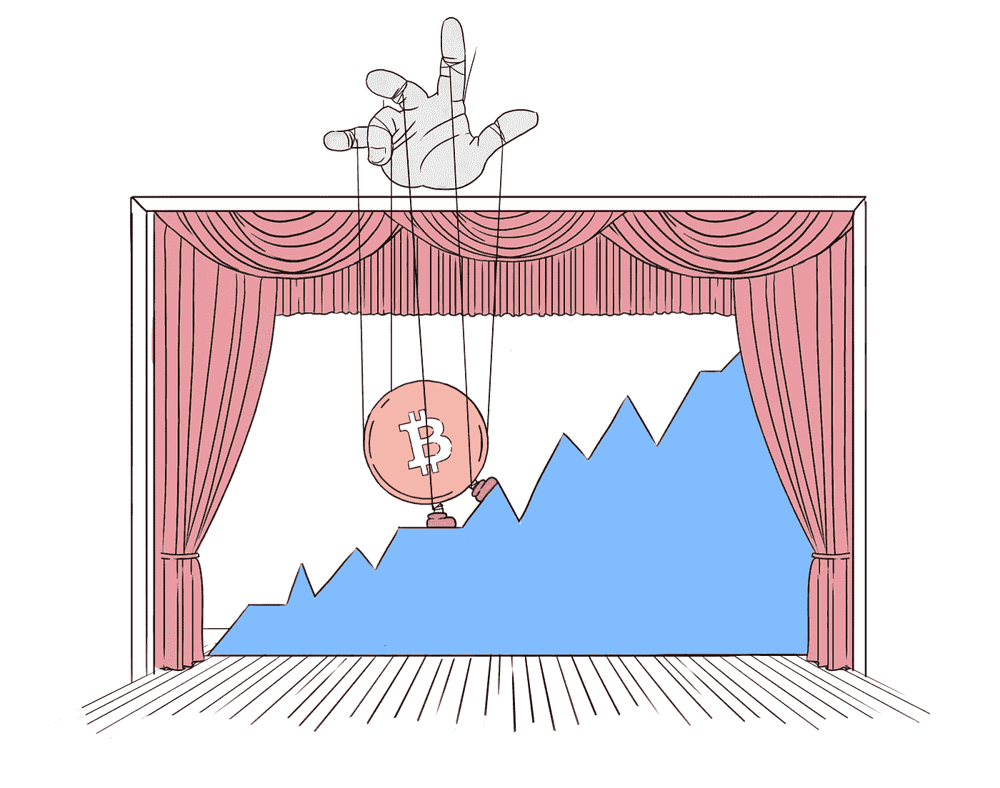
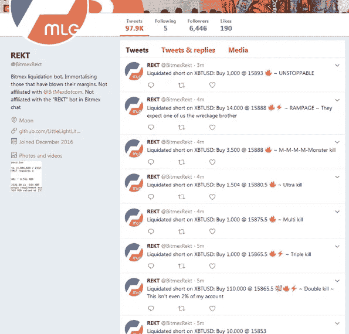
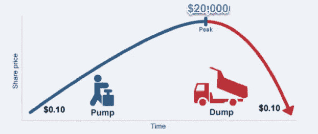
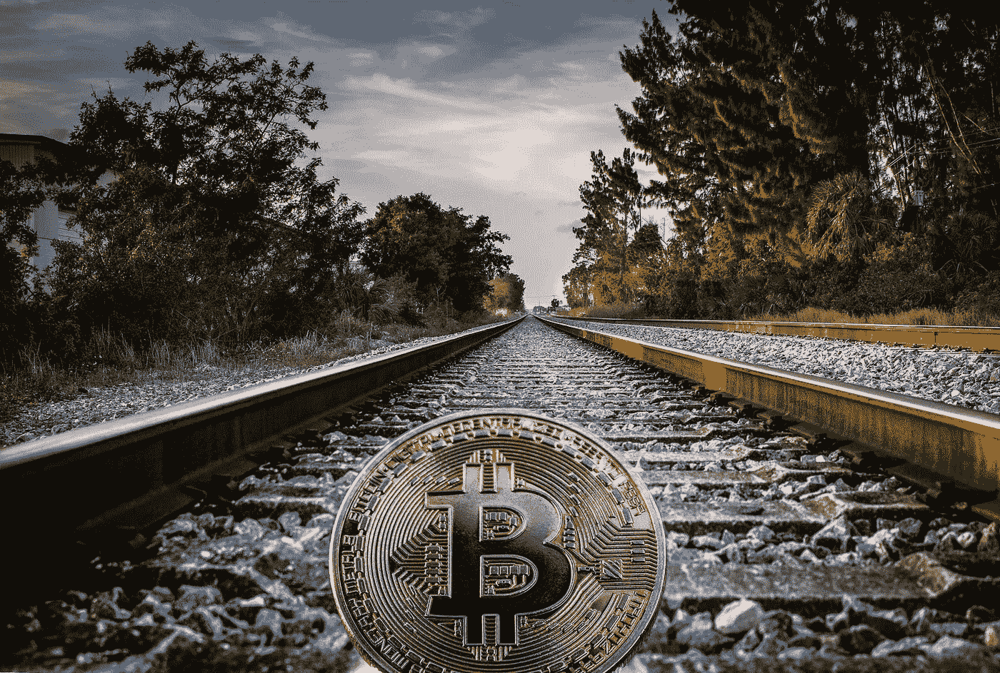

# 秘密市场的神秘操纵和如何管理

> 原文：<https://medium.com/hackernoon/the-mysterious-manipulation-of-crypto-markets-and-how-to-manage-5234e19e6e77>

# 操纵加密货币

根据 Investopedia，市场操纵的定义是:

> “人为抬高或压低证券价格或以其他方式影响市场行为以谋取私利的行为。”

我们在加密货币市场中经常看到这种人为的移动吗？你最好相信。事实上，由于加密货币及其市场的解除管制性质，**在加密货币市场中，操纵行为比几乎任何其他你可以交易的东西都更加猖獗**。由于加密货币的价值对情绪、情感和公众宣传非常敏感，许多人都倾向于推动不自然的价格运动，并从他人的损失中获利。不幸的是，许多人可以在没有任何监管分歧的情况下成功做到这一点。

Bitcoin’s value often gets moved by those who can manipulate it the best… whether we like it or not.

[Level 的](http://lvl.co/?r=CxEGyn1x)新的自动化做市商非常清楚，市场操纵可以以多种形式出现，越是让我们放松警惕，它就越可能成功。首先，[加密货币是围绕匿名设计的](https://anoncoin.net/Anonymity_of_cryptocurrencies/)。任何人都可以用自己的法令或密码进行买卖，任何人都可以交易硬币，而世界上的其他人都不会眨一下眼睛。那么，为什么这很重要呢？北海巨妖加密货币交易所的首席执行官 Jesse Powell 最近[提出了为什么他和其他交易所不实施更多监管的问题:](https://blog.kraken.com/post/1561/krakens-position-on-regulation/)

> “我们对传统市场如何运作所做的假设并不适用于加密市场，因此我们需要努力记住，在我们不必要地将特定要求强加于加密市场之前，我们首先为什么要强加该要求。”

截至 5 月下旬，美国司法部正在进行一项关于密码操纵的刑事调查。但是真的有什么可以做的吗？如果价格容易出现虚假波动，并且在历史上一直受到双向操纵，**从长期来看，这真的重要吗？对于垂涎于 2050 年[比特币](https://hackernoon.com/tagged/bitcoin)和以太坊的潜在价格的超级长线投资者来说，市场噪音可能没什么大不了的。但很多加密交易都涉及投资者，他们在更短的时间范围内关注各种货币的价格，人为的波动会极大地影响他们留在这个领域的能力。这些短期投资者中的许多人依赖于保证金投资(负责任或不负责)，由于 crypto 的巨大波动性，这些投资往往最终获得被称为** 的 [**保证金。**](https://www.investopedia.com/terms/m/margincall.asp)

A growing Twitter account dedicated to documenting any any instance of a short seller getting manipulated on the popular crypto exchange, Bitmex.

很难衡量应该对加密货币交易进行多少监管，因为缺乏监管正是许多人进入该资产类别的原因。加密空间需要保持其放松管制的性质，同时仍然尽量减少投资者的脆弱性。根据 CoinJournal 的 Gabriela Giancola 的说法，

> “就像所有事情一样，加密货币应该受到更多审查的原因也有利弊。然而，过多的繁文缛节会扼杀创造力，我们不能让这种情况发生在一个快速发展的行业。规章制度有助于建设整个空间。他们并不反对太空，而是创造长期区块链和加密空间的解决方案的一部分。”

# 操纵策略

我们中的许多人都听说过投资中这种或那种形式的市场操纵指控，但一个(或许多)人如何真正扭曲一个目前市值 3000 亿美元的加密货币行业？有几种“技术”和“策略”可以并且已经被用来将比特币和其他货币的价值转移到非自然的方向[，由于交易的不明显而没有任何追索权](https://theconversation.com/by-concealing-identities-cryptocurrencies-fuel-cybercrime-82282):

*   **清洗交易** —用自己的资金与自己进行买卖，以制造市场活动多于实际发生的假象
*   **抽取和倾销**——人为地购买过量的硬币，通常是成群结队地聚集资本，然后卖给不知情的交易者获利
*   **暗池交易——**大型资本投资者在标准交易所之外相互交易，以避免[滑点](https://www.investopedia.com/terms/s/slippage.asp)。
*   **先令—** 人为地为一枚硬币制造虚假的宣传和刺激，通常是为了个人利益或从另一方换取支付
*   **鲸鱼交易—** 使用像[买卖墙](https://www.investopedia.com/news/buy-and-sell-walls-cryptocurrencies-bitcoin-ethereum-ether-ripple/)这样的工具，拥有比大多数人更多资金的交易者能够将价格推向他们喜欢的方向，或者阻止价格偏离他们喜欢的方向

当我们全面审视比特币的整体历史价值时，我们会注意到什么样的事情呢？比特币是交易量和市场资本都最大的加密货币。这些日复一日、周复一周的泵能转化为整个硬币的总泵和转储吗？价格显然经历了一些重大波动，并呈指数级增长，特别是在 2017 年，然后在 2018 年上半年暴跌 70%以上。我们能确定这种程度的崩盘只是一次健康的调整吗，或者这可能是由鲸鱼、石油开采和倾倒集团或政府精心策划的价格操纵吗？(看着你，朝鲜)

现实情况是，在健康增长的条件下，如果没有外部因素操纵其价格，比特币的价格可能永远不会在一个日历年内从低于 780 美元的低点飙升至 19，700 美元以上的高点。是的，这确实是 2017 年比特币的价值范围，全年拥有比特币的人可能会经历一些严重的情绪高峰和低谷，就像 BTC 的价值一样。尽管加密货币没有真正的内在价值，但随着世界上越来越多的人采用它并希望获得它，加密货币仍然可以有一个健康的增长率。

为了深入了解具体和直接的市场操纵策略，我提到的一个例子是被称为洗盘交易的“策略”。基本的概念是在交易所同时创造买卖，给人一种在给定时间内交易量高于实际交易量的假象。因此，不知情的投资者得到的印象是，交易量正在增加，可能是在长期的休眠期后，最终以虚假的借口买入或卖出自己的硬币。

泵和倾卸集团是另一种形式的市场操纵。虽然它们不是加密领域的专利，但在特定的加密领域，法律上的不利因素较少，可以利用的市场影响更多。这就是为什么这些团体的密码市场如此成熟。泵和转储是有组织的一群人在一起的使命，同时购买大量的特定硬币，以便在很短的时间内推高它的价格。

Source: [microcapclub.com/2014/12/hard-mailer-pump-and-dump-performance-part-10/](https://microcapclub.com/2014/12/hard-mailer-pump-and-dump-performance-part-10/)

由于泵的价格迅速飙升，人们希望其他不知情的投资者会看到这一动向，并开始购买这些硬币，然后"**跳上前往 moonsville"** 的旅程，就在同一批人开始向不知情的交易者倾销他们人为膨胀的硬币时，这些交易者最终发现自己手里拿着几乎是空的袋子。这些团体每天都在组织进行这些交易，具有讽刺意味的是，这些泵和转储团体中的大多数人自己往往会赔钱，只是打着他们在成为最初泵的一部分后“卖得太晚”的幌子。实际上，只有组织者和集团的第二层成员受益，因为他们设定买入的时间，并且通常在自己的成员仍处于买入模式时第一个卖出。

# 这就是目前的情况

事实上，只有一种真正的方式可以让比特币的价格在不到一年的时间里上涨超过其价值的 2500%，然后在短短一个半月内下跌 70%。如果没有任何操纵市场的迹象是主要因素，这是不切实际的，没有一些预谋。如果这种资产的价值发生了根本性的变化，那么这种多数人认为仍处于初级阶段的货币就有理由出现剧烈的涨跌。

**然而，现在比特币改变世界的潜力和能力与 2011 年时一样，当时比特币的价值与一美元的价格短暂持平。**

现在它的价值是美元的 7000 倍。人们对区块链的存在有了更多的认识和了解，有更多的比特币可以从一只手流通到另一只手，有更多种类的硬币可供选择，对它未来改变世界和货币的能力有了更多的兴奋和乐观。

因此，在认识到比特币的价值应该以比目前更线性的方式增长的情况下，有几个原因可以解释为什么比特币还没有获得可以吸引更保守投资者的稳定性:

*   **媒体对加密货币的褒贬直接关系到市场对它的看法**。在一个价值完全基于市场感知的资产类别中，你可以肯定媒体会产生影响。这算不算操纵市场？绝对的。媒体机构是打算抬高还是压低价格仍有争议，但他们对比特币最新波动的讨论绝对会对市场产生影响。毫无疑问，美国消费者新闻与商业频道一则关于金正恩最新比特币抢劫案的爆炸性新闻将震撼市场。更重要的是，当 Ripple 的[首席执行官一年内第五次被带入“快钱”](https://www.cnbc.com/video/2018/03/07/ripple-ceo-brad-garlinghouse-on-fast-money.html)时，这直接支撑了单个硬币，通常是以牺牲其他值得关注的硬币为代价。
*   **比特币和其他硬币的感知价值通常会不断变化，这在很大程度上取决于其当前的价格。**作为在人与人之间转移价值的实际手段，加密货币被认为是一种不可思议的现象，可以在这方面改变世界。但是，当涉及到实际的价值储存时，有一个[强有力的理由来反对它的可行性](https://hackernoon.com/bitcoin-store-of-value-is-a-useless-use-case-f786b2ddbb25)。Hackernoon 的马特·沃德认为，

> 实际上没有理由拥有“价值储存”。“在一种(或多种)加密货币成为实际货币的情况下，即开始用于商业并渗透到大众市场，必须有相对稳定的定价。当供需相对一致时，价格几乎不会波动。”

*   **安全问题也是阻碍加密货币稳定的主要障碍。我们经常看到各种各样的个人钱包或加密货币交易所遭到新黑客攻击的故事。事实是，有很多人想简单地购买比特币，并将其安全地存放在某个地方，但不想把它放在他们不了解的钱包里，或放在不受监管、没有联邦存款保险公司保险的交易所。**

是的，加密市场的狂野西部在 2018 年仍然非常有效。一天中硬币价值的百分比波动可能需要花费一个月甚至一年的时间来复制。除非加密货币得到更广泛的采用，投资变得更具流动性，否则它们仍将非常容易受到个人买卖价格的操纵，甚至可能背后有大量美元价值。

这一点，再加上有一些总体的理智，是我个人从不投资超过我能承受的损失的原因。尽管我相信区块链的技术有一天会改变世界，但我绝不会愿意把我 80%的积蓄投入到一个不受监管的行业的巨大日常波动中。投资于这种每分钟都在有预谋的方向上波动和公然拉动的东西，需要非常强大的意志来保持理智。我只是要求我的读者研究比特币和其他具有特定用例的替代币最终会如何影响世界，尽管这很难，但要尽量避免价格的噪音和不稳定性。人们必须坚定地相信，硬币的价格将与加密货币的所有潜力所应达到的真实价值相一致，无论他们的道路有多崎岖。

***我在*** [***水平***](http://lvl.co/?r=CxEGyn1x) ***写深入的加密货币分析，对于加密这种被动的投资工具。参见我们在***[***Lvl.co***](http://lvl.co/?r=CxEGyn1x)***所做的分析以及参见我们在*** [***所做的其他分析我们的杂志***](https://medium...m_content=all) ***。如果你喜欢你所看到的，给这篇文章 50 个掌声！如果你讨厌它，就用 49 表示你的不满。***

*本文及相关内容仅供参考。这不应被视为投资建议，你应该咨询财务顾问，并在进行任何投资之前进行自己的研究和尽职调查。在引用证券或商品时，仅用于说明目的，并不意味着对证券或商品分类的任何立场。就提供或讨论的* [*级*](http://lvl.co/?r=CxEGyn1x) *服务而言，这些服务仅可用于* [*级*](http://lvl.co/?r=CxEGyn1x) *白名单资产。*