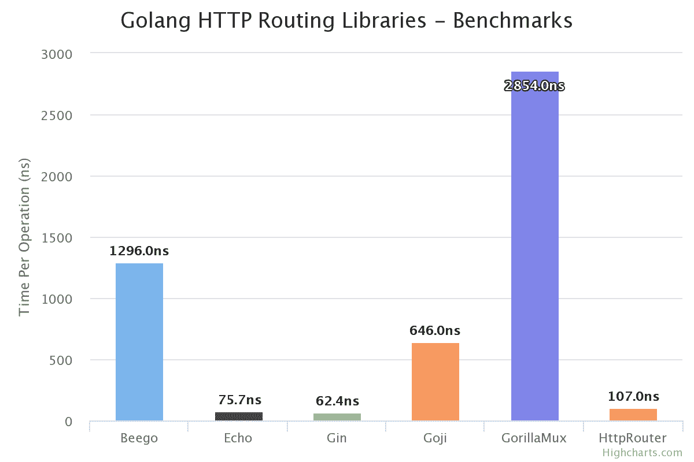
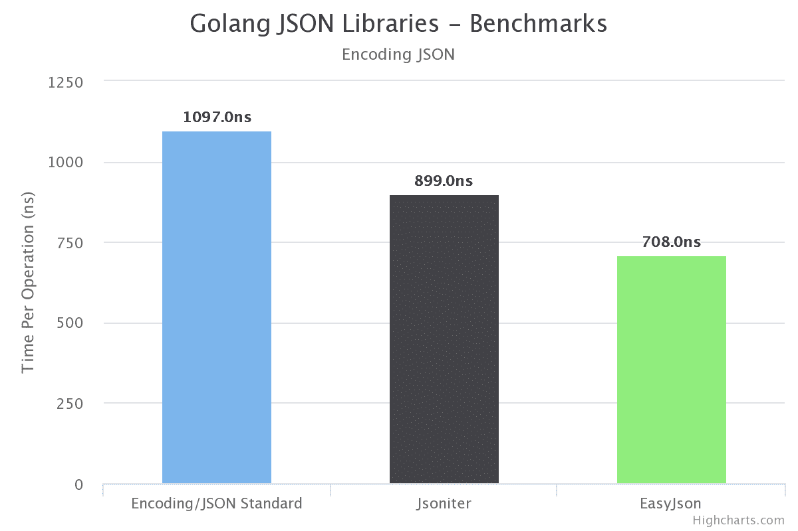
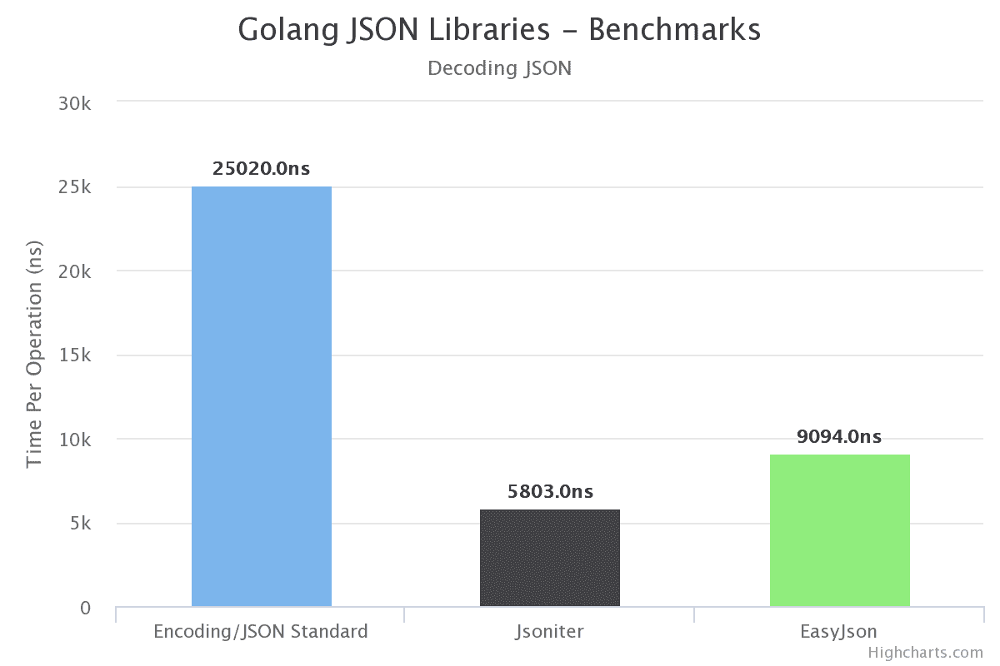

# 关于 Golang 框架和外部库的神话

> 原文：<https://medium.com/hackernoon/the-myth-about-golang-frameworks-and-external-libraries-93cb4b7da50f>

我写 Go 投入生产已经有一段时间了，真的很享受它的速度和可靠性。更小的构建规模，go-routines 提供的并发性，以及您可以直接在机器上运行构建的事实，使得 [Golang](https://hackernoon.com/tagged/golang) 非常可爱。

标准包的性能非常好，你可以创建一个生产就绪的微服务，而不需要任何外部库或框架。但这并不意味着 Go 中没有提供更大灵活性或更快速度的框架，它们只是不被优先考虑。

如果你问一个 Go 开发者你可以使用什么样的 web 框架或库，典型的答案是坚持使用标准库。具有讽刺意味的是,“golang 框架”在 google 上的最高搜索结果是关于为什么你不应该使用它们。


The top comment to a question about Go frameworks on HN

我对标准库的替代品做了一些研究，看看它们的性能如何，并对它们进行了基准测试。我将它们归类为构成微服务的基本组件。

所有性能指标评测都是在以下配置下进行的。虽然标准的[基准](https://hackernoon.com/tagged/benchmark)时间仅仅是`1s`，但是我运行了`10s`的所有测试，以便每个测试都有一致的周期。

```
Processor  - 2.7 GHz Intel Core i7RAM - 16GB - 16 GB 2133 MHz LPDDR3OS - MacOS High Sierrago version  - go1.11.1Bench Time 10s instead of standard 1sgo test -bench=. -benchtime=10s
```

## 按指定路线发送

标准的 http Go 服务器提供了一个很好的路由器，它可以读取查询参数，但是不能读取命名参数，

```
/students/:studentID/grades/:gradeID
```

任何具有上述嵌套资源的 REST 服务都必须使用外部路由库来解析它们。Gin，Echo，Beego，Gorilla Mux，Goji 都是比较受欢迎的几个(根据他们的 Github 以下)。
其中一些是成熟的中间件框架，也提供路由，一些只是路由库。

我对这些库的单个命名参数进行了基准测试，结果如下。Gin 拥有最快的路由器，紧随其后的是紧随其后的 Echo。



## JSON 序列化和反序列化

一旦一个 API 请求通过路由器命中并传递给控制器或处理程序，下一步就是解码请求 JSON 或编码，同时返回响应。

Go 有一个非常好的`encoding`包，支持像`json, XML, csv`这样的多种格式，但是快速浏览一下备选方案，你会看到大量的库。我用标准的`encoding/json`软件包对 Jsoniter、EasyJson 进行了基准测试，下面是结果。

下面是编码的结果，结果表明性能差异并不显著。



但是对于解码 JSON，`jsoniter`比标准编码包执行 5X 更快。



现在，如果您的请求被解码，下一步可能是应用您的业务逻辑，可能是做一些数据库操作。

## ORM 还是不是？

大多数流行语言依靠框架来构建与数据库交互的微服务。在 Java 世界中，Hibernate、Active Record for Rails 和 Django ORM 都非常流行。ORM(对象关系映射器)有时有助于更好地处理事务、表之间的关系，并有助于避免为简单的连接编写复杂的 SQL。

但是 Go again 有一个非常好的`database`标准库，它使得连接到关系数据库变得非常容易，也非常快。但是，一个棘手的问题是查询。当您查询一些行时，您必须手动映射行中的每个字段，然后将它们分配给一个`struct`。这是可行的，但很快就会变得混乱，并让您编写大量代码。`**sqlx**`是一个库，它允许你将整行扫描到你的结构变量中。

虽然`sqlx`减少了构建 CRUD 所需的典型行数，但你仍然会多次重复编写代码。使用 ORM 有助于减少这种情况，并专注于您的业务逻辑。

我对`database, database + sqlx, gorm , go-pg`进行了基准测试，下面是结果。令人惊讶的是，`go-pg`，一个 ORM 的执行速度比标准包甚至`sqlx`都要快。GORM 虽然在生态系统中非常有名，但速度相对较慢。


Querying 200K records from a postgres DB

在 API 调用的每一步中，都有更好的框架或外部库，这将使您的响应更快，并提供一些灵活性。

## 警告

虽然一些速度上的改进是显而易见的，但这本身并不应该成为远离标准库的理由。测试代码的难易程度，开源库的长期维护，团队的学习曲线都应该考虑在内。

尽管如此，我认为像`echo + jsoniter + go-pg`这样的东西以及 Go 标准库的所有令人惊叹的特性将是构建你的微服务和避免冗余代码的最快方法。

请分享你对 Go 图书馆的想法和经验。