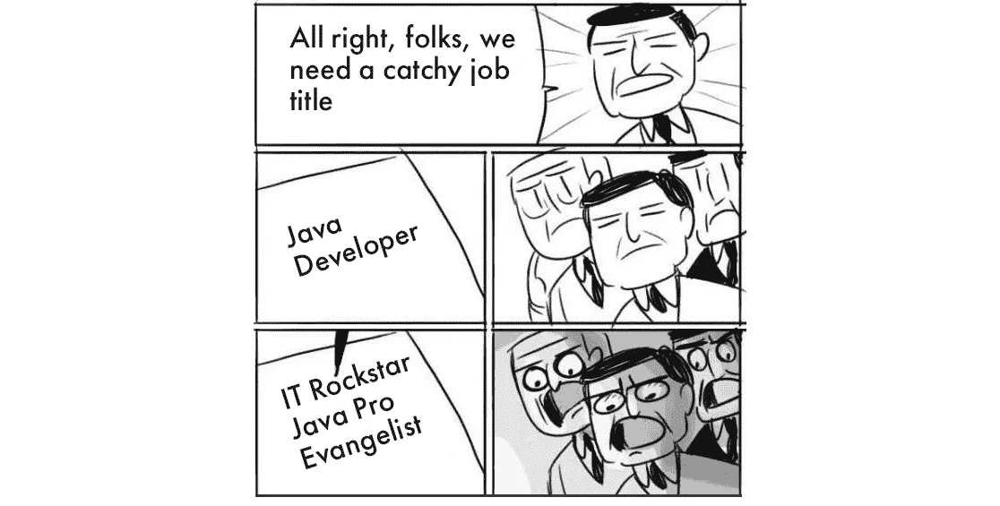
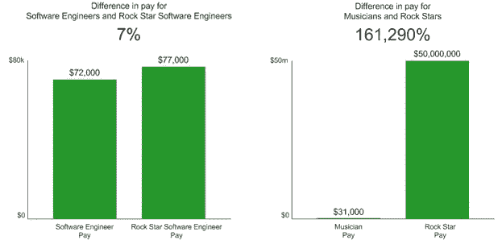
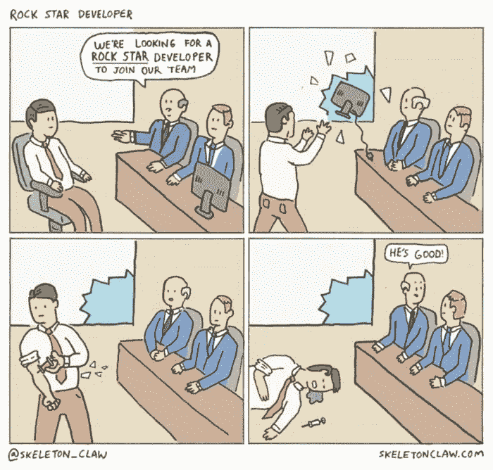
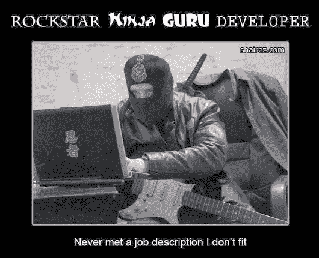

# “摇滚明星开发商”的神话

> 原文：<https://medium.com/hackernoon/the-myth-of-a-rockstar-developer-e6564bd51b5c>

## 为什么“创造性的”职称最终是一个坏主意。

Photo by [Maite Tiscar](https://unsplash.com/photos/Q8IIh_iulbI?utm_source=unsplash&utm_medium=referral&utm_content=creditCopyText) on [Unsplash](https://unsplash.com/?utm_source=unsplash&utm_medium=referral&utm_content=creditCopyText)

> “Rockstar developer 是一个被招聘人员滥用的过时表达。”——[吉姆·豪沃](https://www.quora.com/What-is-a-rockstar-programmer/answer/Jim-Haughwout)在 Quora 上

尽管如此，它还是经常出现在招聘信息中。

除了摇滚明星，还有忍者、黑客、大师、天才和许多其他响亮的同义词。它们要么取代常规的职位头衔，要么被挤进职位描述中。

不久前，[的确](http://blog.indeed.com/2017/12/14/weird-job-titles-the-year-in-review/)分析了古怪的招聘启事。他们发现，美国最受欢迎的头衔是“摇滚明星”和“大师”，其次是“忍者”、“天才”和“巫师”。令人惊讶的是，2017 年，属性“摇滚之星”的使用频率比 2015 年高出 19%。

你可以放心，在欧洲，公司也会寻找“摇滚明星”。

虽然这一切都始于一个无辜的营销伎俩，但寻找神话忍者、摇滚明星、古鲁或巫师已经对招聘过程中的所有参与者产生了负面影响。

Image credit: [GlossaryTech](https://blog.glossarytech.com/7-takeaways-on-how-software-developers-use-search-while-sourcing-a-job-30d499a0b16)

# **招聘公司**

## 程序员倾向于忽略标题不清晰的招聘广告。

Workopolis [的数据团队已经分析了](https://hiring.workopolis.com/article/thinkopolis-workopolis-data-reveals-how-to-optimize-job-postings/) 45 万份职位发布。他们的一个发现是，标题正规的招聘广告表现明显好于标题古怪的广告。例如，“数据分析师”的广告比“数据忍者”的广告表现好 14%。

## “摇滚明星”广告不会帮助公司筛选掉缺乏经验的候选人。

首先，你要牢记[邓宁-克鲁格效应](https://en.wikipedia.org/wiki/Dunning%E2%80%93Kruger_effect)。不是让顶尖人才申请你的“摇滚明星”广告，你可能会得到一群平庸的开发人员，他们对自己的能力有过高的评价。

> “如果你的项目不无聊，人才就会来。”Quora 上的 Chapley Watson

其次，那些符合“摇滚明星”条件的人可能不会看你的开场。他们会有兴趣为 Alphabet 或 SpaceX 等具有狂热地位的企业工作。

## 你的公司不想给“摇滚明星”开发者支付“摇滚明星”的薪水。

> *“我认为创造性头衔的产生是作为一种补偿员工的方式，这种方式花费更少，而不是支付更多。祝贺您——您已被提升为 00 代理！””——*[菲利普·米切尔](https://www.quora.com/What-do-you-think-about-job-titles-like-Jedi-or-Rockstar-Do-they-accomplish-anything/answer/Philip-Mitchell)在 Quora 上

2010 年，Nathan Hurst [比较了程序员与摇滚明星程序员和音乐家与摇滚明星的工资中位数的差异](http://blog.hirelite.com/what-developers-think-when-you-say-rock-star)。自那以后，这一趋势一直没有改变。

Image credit: Nathan Hurst for [Hirelite](http://blog.hirelite.com/what-developers-think-when-you-say-rock-star)

## **强势的职位头衔会让少数族裔求职者望而却步。**

事实表明，像“忍者”或“摇滚明星”这样的词主要针对年轻白人男性，而拒绝女性、不同种族背景的人或年长的候选人。

一旦英伟达把古怪的形容词从招聘广告中去掉，他们就多了 2.5 个女开发者的申请([快公司](https://amp.fastcompany.com/40514090/your-weird-job-titles-are-making-you-miss-the-best-candidates))！

## 最有可能的是，你不想雇佣摇滚明星。

摇滚明星是不合群的独行侠。虽然从远处看很吸引人，但在近处看却让人无法忍受，他们可能会成为你的有毒员工。他们可以给出很好的表现，但不会有效地解决问题。

> *“我不想和一个‘摇滚明星忍者程序员’一起工作。这种自负会对团队环境有害。”Quora 上的 Chapley Watson*

在他的文章[中，“我们解雇了我们的顶尖人才。这是我们做过的最好的决定。”Jonathan Solórzano-Hamilton 讲述了他们的超级明星首席开发人员如何差点扼杀了公司的项目。这个故事的寓意不仅仅是“不要雇佣摇滚明星”，而是，正如托尼·罗宾逊在后续文章](https://medium.freecodecamp.org/we-fired-our-top-talent-best-decision-we-ever-made-4c0a99728fde)中指出的:

*   从第一次面试开始就密切关注自己的软技能
*   不要把你的个人贡献者视为偶像
*   不要将整个项目的责任委托给一个执行者
*   像对待人类一样对待你的员工(而不是摇滚明星)

Image: [Rock Star Developer](http://skeletonclaw.com/image/166866328533) by [skeletonclaw.com](http://skeletonclaw.com/)

# **开发者**

## **不具体的职位头衔只会让开发人员感到困惑。**

当涉及到工作描述时，候选人需要清晰。他们需要了解公司是做什么的，在找谁，工作职责是什么。

> *“作为一名开发人员，当我在招聘信息中看到“聪明的”职位头衔时，它们几乎都是招聘公司不知道他们在找谁的标志。这是一个重大转变，因为我对与如此幼稚的组织合作不感兴趣。”Quora 上的乔纳·威廉姆斯*

## **“怪异”的职称会让开发人员产生很高的期望，并导致焦虑。**

三星的 Jo Franchetti 写道，与完美主义相关的焦虑在科技行业的员工中很常见。其中一个关键原因是:围绕“科技名人”(比如:大师、忍者、摇滚明星、天才)的炒作。虽然不太自立的工程师可能会觉得被要求苛刻的行业拒之门外，但有些人会因为试图掌握许多不同的技术而耗尽精力。

> *“摇滚明星暗示神奇思维或者[…]雇主想要加班。”Quora 上的尼古拉·马拉索乌*

## **古怪的广告可能会导致职业和学习目标的扭曲。**

许多年轻工程师关注的不是如何找到最优解，而是如何冷静地解决问题。它不再是关于超越一个人的技艺，而是关于名声。只需谷歌“如何成为摇滚明星开发者”，自己去看。

# **机构招聘人员**

## “创造性”的职位头衔通常会伤害客户公司的品牌。

代理招聘人员有责任成为客户公司的营销人员和品牌倡导者。“摇滚明星”广告通常不会对公司的品牌有太大帮助。相反，他们会严重损害客户作为雇主的声誉(除非他们被称为 Rockstar Games)。

## 怪异的广告无助于公司确定招聘目标。

如前所述，它们表明该公司无法清楚地说明它在寻找什么或谁。如果客户不确定自己的人才战略或招聘目标，作为招聘人员，你的任务就是教育和咨询客户。这包括说服他们放弃毫无意义的头衔。

## “摇滚明星”头衔削弱了软技能的重要性。

招聘人员必须明白，软技能和硬技能对开发人员同样重要。那么一个超级巨星和成为一个团队的忠诚成员有什么关系呢？古鲁和能够学习有什么关系？这些标题传达了完全相反的信息。

# **结论**

“摇滚明星开发者”是一个神话。所以，我们不要助长神话。

> *“把忍者、摇滚明星、天才留给漫画和古装派对；他们可能会让你失去真正的明星人才。”快速公司的莉迪亚·迪什曼*

## ***如果你是招聘公司:***

对候选人的要求要具体合理。不要试图寻找摇滚明星、忍者、古鲁或巫师。寻找解决问题的人。寻找那些给你的开发团队带来价值的人。

## ***如果你是开发者:***

在简历中保持谦逊。不要使用听起来很酷但毫无意义的头衔，因为它们不能描述你的工作。

## ***如果你是招聘人员:***

做你客户的顾问和律师。帮助他们更好地了解他们的组织需求，并专注于为他们找到合适的人才。

*感谢阅读！*

为这篇文章鼓掌，帮助他人发现我们👏👏👏

*订阅* [*我们的凯撒时事通讯*](http://eepurl.com/c9vHEH) *了解招聘、求职和柏林科技领域的最新动态！(我们每两个月发一次)*