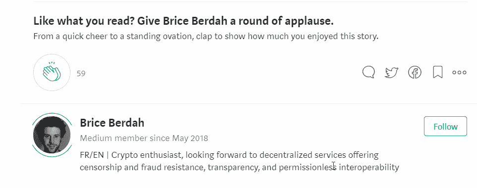

# 国家作为一种服务和它的部分公民权——一个好主意？

> 原文：<https://medium.com/hackernoon/the-nation-as-a-service-and-its-fractional-citizenship-a-good-idea-65f66c58c165>

虽然民族主义运动似乎正在蓬勃发展，但一个同样有趣的相反趋势正在悄然形成。尽管民族主义者希望只向最纯洁的同类提供国家服务，但其他国家正转向相反的方向:它们开始向非公民提供服务。

你会说法语吗？别致！Moi aussi(法国传统)。

爱沙尼亚是重塑国家角色和“公民”含义的先驱之一。自 e-residency 计划启动以来，已有近 3 万名世界公民提出申请。然而，电子爱沙尼亚才刚刚开始:这个国家的目标是[到 2025 年](/e-residency-blog/happy-3rd-birthday-to-our-global-e-resident-community-7143adc73994)达到 1000 万电子居民，而这个国家有 135 万“实体”公民。

当我们探索“国家即服务”需要什么时，你会注意到它的所有特性已经存在于常规国家中。NaaS 只是把它带得比国家本身更远，成为别的东西。

# 国家作为一种服务的诞生

我第一次在[中介绍这个概念是在一篇非常原始的文章](/@BBerdah/the-demise-of-nation-states-introducing-the-nation-as-a-service-naas-ef3bf9f494e3)中，这篇文章在 90 分钟内从我的头脑变成了媒介。它以一个故事开始，介绍了一个概念，这个概念吓坏了一些读者，伤害了其他人的政治敏感性。虽然激情可能是好的，但我想对它提供一种更正式的看法。

当我第一次介绍这一概念时，我将“国家即服务”的四大基石描述为:

> 我们过去所知道民族国家的概念已经过时了。常规国家正在分解或无能为力。
> 
> 在真空中，“数字国家”出现了。他们可能与真实的国家(如爱沙尼亚)联系在一起，完全是虚拟的，甚至筹集资金(ICO？)购买土地。
> 
> 这些数字国家将提供与我们现有国家相同的服务，但范围更窄:它们将主要关注商业法规。然后，最先进的可能会扩大他们的范围:金融，货币，医疗保健，教育…
> 
> 最后，公民将不再因出生而与国家联系在一起。市民将比较来自不同国家的报价，并选择他们的适合。他们可能需要为服务付费(Estionian e-residency 是 100€的一次性费用)。各国将相互竞争以吸引公民，极度的集中是可能的(赢者通吃的市场):不再有限制来控制一个国家可以拥有的公民数量。我们将观察“公民身份可移植性”的诞生——改变国籍将比改变互联网服务提供商更容易。

我仍然袖手旁观他们，但是允许我今天潜水更深。

# 国家服务的正式定义(NaaS)

让我们直奔主题:

国家即服务(NaaS)在订阅模式下提供数字部分公民身份。这个定义可能很短，但它相当密集，让我们有条不紊地展开它:

## NaaS 是数字原生的

NaaS 的概念是在最近几年出现的。第一个完全成熟的 NaaS 是 e-爱沙尼亚，它在 3 年前开放了其 e-residency。由于这些新国家从一开始就诞生在一个数字世界，我们观察到一个巨大的范式转变。

它转化为将数字概念融入国家的本质:

*   **数字优先**:所有公共服务都可以在线和远程获得。
*   **开放数据**:通过 API 向所有人开放公共数据。这允许为公共基础设施创建第三方服务:最容易掌握的例子是提供大多数大城市已有的火车/地铁/公共汽车出发时间的应用程序。
*   公共服务之间的数据可移植性:不再需要向每个公共服务重新提交信息。对相关服务的一次提交就足够了，因为访问权被可能需要它的其他公共服务共享(当然是在公民同意的情况下)。

这些概念在实践中可能很难想象，所以让我带你去爱沙尼亚，感谢 Kaspar kor jus(e-residency program 的总经理)。当他谈到儿子 Ruufus 的出生时，他描述了这在现实世界中的意义:

> 这些信息(医生在医院登记的孩子的姓名、性别、出生日期和父母)确实非常有用，因为政府的各个部门需要这些信息来更好地为新父母服务，例如安排健康检查、支持儿童护理和分配我们的育儿假津贴。在大多数国家，这将给初为人父母者带来额外的麻烦，但在爱沙尼亚，信息开始沿着我们被称为“X-road”的安全、分散的信息网络在各部门和机构之间自动流动。

请记住，电子爱沙尼亚是一个建立在常规国家之上的数字国家。现在想象一下，一个数字国家从一开始就能达到什么样的效率。

## NaaS 提供部分公民身份

NaaS 提供的公民身份不是完全的公民身份。到目前为止，爱沙尼亚电子居民可以开设一个爱沙尼亚银行账户并拥有一家企业，但他们不能在爱沙尼亚定居或投票。这一选择是出于实际原因:从小处着手要容易得多。

在接下来的几年里，我们将会看到 NaaS 提供的服务中增加新的功能。由于所有公民单一公民身份的想法已经支离破碎，这种逻辑将被推得更远。

将会有不同阶层的公民获得不同的服务。最基本的一层是唯一的身份验证协议，而最先进的一层将最终提供类似于我们目前的公民身份。

## NaaS 采用订阅模式

订阅模式是部分公民权的直接结果。由于公民身份现在由不同的部分组成，公民可以选择订阅或不订阅，我们可以设想为 NaaS 建立一个订阅模型，有几种不同的选择，从纯粹的[商业](https://hackernoon.com/tagged/business)公民身份到完全的公民身份。

到目前为止，在电子爱沙尼亚，提交候选人资格只需支付 100€的费用。在[未来的](https://hackernoon.com/tagged/future)，可能会采取不同功能的年/月订阅形式。下面是我看到的，从最基础的到最高级的。前两个已经以当前形式存在于爱沙尼亚电子居留系统中:

1.  **身份公民**:提供数字身份证，允许持有者向公共或私人服务机构证明其身份
2.  **商业公民身份**:提供在该国开立银行账户和开办企业的能力。
3.  **当地公民身份**:允许捐助者投票和参与当地(城市/地区)选举，并创建非政府组织。
4.  **政治公民权:**允许捐赠人在国家选举和其他公共协商中投票，如公民投票。
5.  订阅**国家医疗保健服务**
6.  参加**国家养老金计划**
7.  获得**正式公民身份**

*注意:所有这些不同的功能可能都有条件限制，例如成为 X 年的电子公民，以及额外的费用。*

## 公民身份可移植性

下面描述的 NaaS 所有三个特征的另一个直接结果是公民身份可移植性的概念。由于公民身份变得基于订阅，过去的边缘情况——改变国籍——将变得司空见惯。

事实上，随着越来越多的部分公民身份在订阅模式下可用，“潜在客户”可能会开始比较这些报价，这实质上是将公民身份置于相互竞争之中。有些人甚至会将不同的国籍组合起来。电子国家必须考虑到这一新趋势，并提供服务以促进从一种 NaaS 到另一种 NaaS 的转换。

# 结论

这篇文章只是一篇分析文章，给你一个框架，让你了解当前一个国家的定义正在发生的转变。我尽力避免任何形式的评判。

然而，我认为我在这篇文章中描述的正在进行的转变将会产生巨大的影响，其中许多还没有被预见到。我仍然不能真正理解对此的感受，我从好奇到愤怒，或者从着迷到绝望。你呢？

如果你喜欢这篇文章，请告诉我，并查看我的维基以获得更多类似的内容。 **别忘了拍拍它** **帮它传播:**可以一直按👏高达 50 次鼓掌。

本文是一篇原文(法语) [EcoCrypto.fr](https://ecocrypto.fr) 故事的翻译。