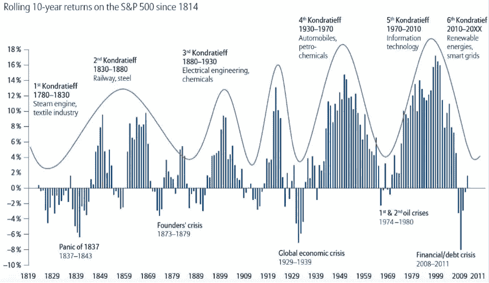
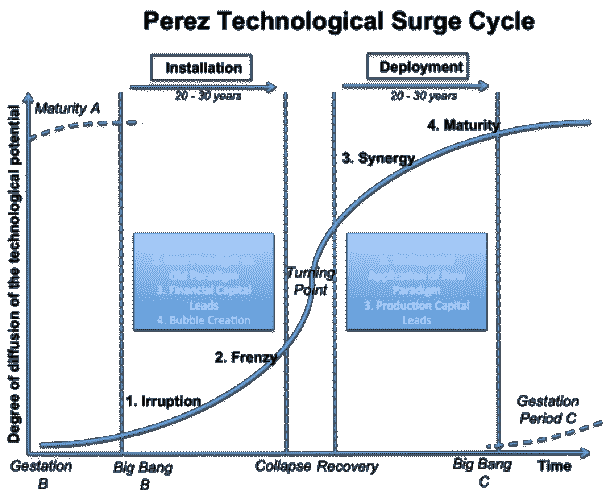
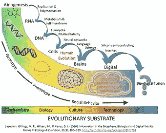
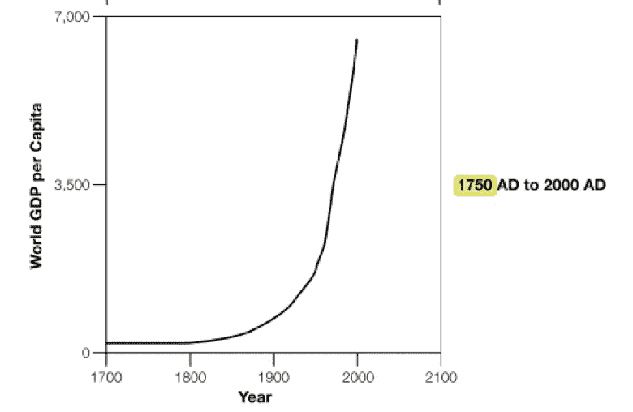

# 加密技术革命的本质:

> 原文：<https://medium.com/hackernoon/the-nature-of-the-crypto-technological-revolution-4eb883c54d56>

## 它是什么，对人类的未来意味着什么。

Crypto has the power to solve the innovation problem and unlock our technological future — dyson sphere

# 介绍

## 风投将加密视为另一场佩雷斯技术革命

[Carlota Perez](http://www.carlotaperez.org/) “关于技术革命的经典著作”已经成为风投界的 goto 框架，用于描述经济中观察到的技术变革和经济增长的规律:

> 马克·安德森:[“理解这个[软件]行业如何运作的最佳书籍。”](https://www.youtube.com/watch?v=JYYsXzt1VDc#t=2m30s)
> 
> [弗雷德·威尔逊](https://medium.com/u/9d9e7084d6cb?source=post_page-----4eb883c54d56--------------------------------)::[他的投资论文是基于这本书里的概念。](https://avc.com/2015/02/the-carlota-perez-framework/)
> 
> [Chris Dixon](https://medium.com/u/a8e3741de9e2?source=post_page-----4eb883c54d56--------------------------------):[技术革命发生在两个主要阶段](http://cdixon.org/2013/02/10/the-computing-deployment-phase/)

然而，加密不仅仅是下一次技术革命。密码有能力从根本上解决创新问题，开启我们人类的科技未来。

在研究加密的本质之前，让我们看看佩雷斯对以前技术革命的描述。

# 佩雷斯技术革命和技术经济范式

## 巨大的发展浪潮

Pérez 观察到，在过去的 250 年中，发展的巨大浪潮发生在可预测的周期中(也称为 Kondratievs，长波)，跨度约为 50 年(见下图 1)。

Figure 1 — three centuries of great surges

一个显而易见的问题:加密是下一次技术革命吗？

## 物理技术、技术革命和技术经济范式

在佩雷斯的框架内，每一次技术革命都是由一系列相互关联、生产率提高的技术推动的。

让我们用复杂性经济学家埃里克·拜因霍克的定义:

> **物理技术**:“将物质、能量和信息从一种状态转换为另一种状态以追求一个或多个目标的方法和设计。”[贝因霍克](https://www.amazon.com/Origin-Wealth-Remaking-Economics-Business/dp/1422121038/ref=sr_1_1?ie=UTF8&qid=1526054063&sr=8-1&keywords=origin+of+wealth)

物理技术的例子:

*   工具
*   航天器
*   计算机

Visual metaphor of a bone tool becoming a spinning spacecraft from 2001: a space odyssey

加密物理技术的示例:

*   加密原语(单向散列函数、公钥加密、数字签名)
*   Merkle 树
*   协议
*   加密钱包

现在，佩雷斯将一次 ***技术革命*** 定义为:

> *一个生产技术的互联系统，有能力转变整个经济的财富创造潜力*

*佩雷斯对技术革命的定义非常符合密码技术的套件，从密码和密码经济原语到智能合同、共识机制和 Dao。*

*进一步，佩雷斯将一个 ***技术经济范式*** 定义为:*

> *“这些技术应用的最佳实践逻辑和意识形态。”*

*同样，技术经济范式是对既定加密意识形态的恰当描述，包括:审查阻力、隐私、集体所有权、开源和去中心化。*

*到目前为止，crypto 非常适合 Perez 描述框架。*

## *佩雷斯技术革命的形成*

*根据佩雷斯的观点，[物理]技术革命的扩散发生在两个时期内。在*安装期*内，核心产业和基础设施到位，克服仍受先前技术经济范式控制的社会和机构的阻力。只有克服了这种阻力，才能进入部署期，在此期间，技术革命将会扩展到整个经济。*

*物理技术和社会制度阻力之间的相互作用导致了佩雷斯技术激增周期(见下图 2)。*

**

*Figure 2 — Perez Technological Surge Cycle*

*据几位著名的风险投资家称，crypto 是继 Perez 技术激增周期之后的另一场技术革命:*

> *[“使用 Carlota Perez 在《技术革命和金融资本》( 2002)中的工作作为框架，我们认为加密正在从入侵过渡到狂热”](https://ipfs.io/ipfs/QmZL4eT1gxnE168Pmw3KyejW6fUfMNzMgeKMgcWJUfYGRj/Placeholder%20Thesis%20Summary.pdf) [乔尔·莫内格罗](https://medium.com/u/44c9101c2548?source=post_page-----4eb883c54d56--------------------------------) & [克里斯·伯尼斯克](https://medium.com/u/2a8f9285c9aa?source=post_page-----4eb883c54d56--------------------------------)占位符论文摘要*
> 
> *" [2017 年是 crypto/区块链进入狂潮阶段的一年"](https://avc.com/2017/12/what-happened-in-2017/) [Fred Wilson](https://medium.com/u/9d9e7084d6cb?source=post_page-----4eb883c54d56--------------------------------)*

*当然，佩雷斯的工作对我们理解物理技术革命在经济中的传播做出了重大贡献。然而，**密码首先不是物理技术革命，密码主要是一套社会制度技术。***

# *加密技术革命的本质*

## *加密主要是一场社会技术革命*

*虽然加密技术集包括物理技术，但加密最具影响力的技术是社会、组织和机构技术:*

> *对于“建立经济和社会机构”和“执行能够实现定制社会经济协调的规则系统类型(即智能合同，Dao)，[区块链经济学](https://hal.archives-ouvertes.fr/hal-01382002/document)*
> 
> *“我认为这是一种组织人类的全新方式。”，[海军 Ravikant](https://medium.com/u/67f5049293c7?source=post_page-----4eb883c54d56--------------------------------)*

*Crypto 主要是一种 ***社交技术*** ，我们将其定义为:*

> *"组织人们追求一个或多个目标的方法和设计."拜因霍克*

*社交技术的例子:*

*   *机构*
*   *法律*
*   *分类账*
*   *语言*
*   *金钱*

*密码中的社交技术示例:*

*   *密码经济的基本要素(TCR，稳定硬币)*
*   *加密货币和代币*
*   *区块链账本*
*   *共识机制*
*   *智能合同*
*   *治理机制(专制、道民主)*
*   *分散组织(Dao、DAC)*

*作为一场社会技术革命，**密码的本质与过去 250 年中发生的一系列物理技术革命**有着根本的不同。*

## *秘密社会技术革命的本质*

*秘密的社会技术革命对社会、机构和经济具有多重影响:*

1.  *智能合约不仅使交易自动化，它们还[减少了机会主义和不确定性](https://hal.archives-ouvertes.fr/hal-01382002/document)，使得交易的执行比传统机构更加[高效。](http://Oliver E. Williamson - Wikipedia)*
2.  *Crypto 支持新类型的组织(包括 Dao 和 DAC)，这些组织[与传统公司竞争并缩小其边界](https://hal.archives-ouvertes.fr/hal-01382002/document)。*
3.  *加密将使目前被认为过于复杂或成本过高而难以管理的新型交易变得可行(例如，微支付、复杂的多方合同、直接民主)。*
4.  *业务模式的符号化可以实现更精确的一致、更强大的激励，其中:*、*、[、*代表了一种新的、不受信任的社会和经济协调和治理模式*、](https://hal.archives-ouvertes.fr/hal-01382002/document)、*、*、[、*、“让您轻松地实例化一个全新的人机组织*、](/@jacobscott/the-emergence-of-cryptoeconomic-primitives-14ef3300cc10)、*(* [*雅各布·霍恩*](https://medium.com/u/3898d6f79e89?source=post_page-----4eb883c54d56--------------------------------) *)**
5.  *Cryptoeconomics 将资本和技术融合在令牌模型中，并为投资者提供直接渠道，从而增加了风险融资的带宽。*

> *[“三年前，一个 20 岁的年轻人刚刚起步的非营利组织在一份白皮书和一个软件原型的基础上筹集了 2000 万美元。一年后，大众网上线。两年后(现在)，这是一个 300 亿美元的生态系统，投资者赚了 1000 倍。这是以太坊；这是非常了不起的。它正在改变世界。”](https://blog.bigchaindb.com/starships-and-tokens-d8c32728a24b) [特伦特·麦康纳](https://medium.com/u/f1cb98e196bc?source=post_page-----4eb883c54d56--------------------------------)*

*因此，虽然物理技术革命受到抵制，直到社会和机构适应并围绕新范式进行组织，但**隐蔽的社会技术革命正在提升这种适应和组织能力本身。***

## *通过重组构建模块实现新颖性和复杂性*

*正如复杂性科学家 W. Brian Arthur 所观察到的，技术是由积木组成的，它们以新的方式重新组合，形成越来越复杂的技术层次。Crypto 的开源范例支持选择和复制技术和商业模式构建模块，从而促进物理技术(例如可扩展性解决方案)、社交技术(例如 TCRs 等密码原语)和商业模式(例如分散所有权和奖励早期用户)之间的加速三方共同进化。(请参见 [Beinhocker](https://www.amazon.com/Origin-Wealth-Remaking-Economics-Business/dp/1422121038/ref=sr_1_1?ie=UTF8&qid=1526054063&sr=8-1&keywords=origin+of+wealth) 了解该车型的更多详情。)*

> *[“如果你想深入了解，你甚至可以说它们是互联网蜂群思维的可量化构件。”](/@jacobscott/the-emergence-of-cryptoeconomic-primitives-14ef3300cc10) [雅各布·霍恩](https://medium.com/u/3898d6f79e89?source=post_page-----4eb883c54d56--------------------------------)*

*Star Trek’s The Borg hive mind*

*然而， **crypto 不仅会加速技术进化和经济增长的速度，它还升级了进化机制本身。***

## *Crypto 升级了人机组织的遗传机制*

*包括有机体和经济在内的复杂系统在扩展时通常会经历一系列的元系统转换。*

> *[“元系统转换是通过进化出现的更高层次的组织或控制。”](http://(https://en.wikipedia.org/wiki/Metasystem_transition))*

*例如，在自然界中，遗传机制-基因组本身已经从蛋白质进化到 RNA，再到更稳定和精确复制的 DNA 分子。DNA 的进化，作为进化底物，支持了更复杂的生命形式，构成了地球生态复杂适应系统的[元系统](http://pespmc1.vub.ac.be/Papers/WWW-Super-Brain.pdf)跃迁。*

**

*[Schematic timeline of information and replicators in the biosphere: major evolutionary transitions in information processing](https://en.wikipedia.org/wiki/File:Major_Evolutionary_Transitions_digital.jpg)*

*同样，加密经济和资本主义经济之间最深刻的区别也在于遗传机制。在加密经济中，物理技术、社会技术和商业模式的设计被编码在区块链更稳定和可编程的进化基质中。*

*DNA 和加密元系统转换之间的相似之处是深远的:*

> *“语言通过 DNA、语音、书写和现在的软件进化而来，在每个阶段，这种符号代码都承载着秩序的进化” [Pierre Levy](https://www.amazon.co.uk/Collective-Intelligence-Mankinds-Emerging-Cyberspace/dp/0738202614) 。*

*这种**遗传机制在 crypto 中的进化将同样支持更复杂的人机有机体。***

> *[“区块链是数字生物。正如生物体通过 DNA 的变化而进化一样，区块链协议也通过代码的变化而进化。就像生物有机体一样，最具适应性的区块链将会生存下来并茁壮成长。”](/@FEhrsam/funding-the-evolution-of-blockchains-87d160988481) [弗雷德·威尔逊](https://medium.com/u/9d9e7084d6cb?source=post_page-----4eb883c54d56--------------------------------)*
> 
> *[“比特币是一种新生命形式的第一个例子。它生活和呼吸在互联网上。它活着是因为它可以付钱给人们让它活着。”拉尔夫·默克尔](http://merkle.com/papers/DAOdemocracyDraft.pdf)*

***Crypto 被设定为诱导一种*寒武纪大爆发*的更复杂的计算机和人机有机体在这种新的*系统内生成***[***技术作为生物学***](https://www.amazon.co.uk/dp/B002RI9W16/ref=dp-kindle-redirect?_encoding=UTF8&btkr=1)***。****

**为了预测 Crypto 的潜在影响，我们需要回顾一下以前的社交技术元创新的影响。**

# **加密技术革命对人类意味着什么**

## **在书写、科学方法和市场的规模上，密码是第一个元创新**

**我们发现，以下每一项社会技术元创新都引发了人类社会和经济秩序的元系统转变:**

*   **语言——公元前 30，000 年左右，第一个复杂的社会系统诞生了**
*   ****农业革命**——大约公元前 12500 年，植物和动物的驯化使人类从狩猎采集者走向村庄，最终走向文明**
*   ****文字**——导致了第一次文明，也是人类知识的基础~公元前 5000 年**
*   **科学方法创造了人类知识的爆炸和技术进步的速度~1750 年**
*   **股份公司和金融市场推动了经济复杂性和财富的指数增长，并形成了资本主义(见下图)~1850 年**
*   **数字经济/ **计算**和**互联网** - 1990**
*   ****Crypto**——过渡到“作为生物学的技术”的生成系统 2009…？**

**举一个例子:科学方法创造了人类知识的爆炸，加快了技术进步的时钟速度。结合股份公司和金融市场，以科学为燃料的技术刺激了现代资本主义经济秩序的形成，并推动了经济复杂性和财富的指数增长(见图 3)。所有这一切都是通过加速创新的过程:发明的商业化。**

****

**Figure 3 — Exponential growth in Economic Wealth from 1750 (Beinhocker)**

**那么加密会有什么影响呢？**

# **crypto 对人类的潜在影响是什么？**

**概括地说，加密元创新有潜力:**

*   **提升社会和经济的适应和组织能力**
*   **加快技术进步和经济增长的速度**
*   **升级遗传的进化机制，以支持更复杂的计算机和人机有机体的寒武纪大爆发**

**加密不仅有增加创新的潜力，还有加速技术发展和经济增长的潜力，以至于我们可以从根本上解决创新问题。这将引发一个元系统向后稀缺、后资本主义的丰富的秘密经济的转变，同时解决威胁我们物种的负面外部性(参见[里斯·林德马克](https://medium.com/u/7e7962706fb8?source=post_page-----4eb883c54d56--------------------------------)关于[向秘密资本主义转变的精彩文章](/@RhysLindmark/co-evolving-the-phase-shift-to-cryptocapitalism-by-founding-the-ethereum-commons-co-op-f4771e5f0c83)，以及[迈克尔·豪普特](https://medium.com/u/1bb9ddc26434?source=post_page-----4eb883c54d56--------------------------------)的远见卓识的[作品](https://michaelhaupt.com/blockchain-hype-or-hope-758181897820))。**

**但这仅仅是开始。有了这些能力，人类的目的可以从维持生计转变为真正的摘星，沿着 [Kardeshev 等级](https://en.wikipedia.org/wiki/Kardashev_scale)前进(见 [Trent McConaghy](https://medium.com/u/f1cb98e196bc?source=post_page-----4eb883c54d56--------------------------------) 的[地图](https://blog.bigchaindb.com/starships-and-tokens-d8c32728a24b)到达那里):**

*   **0 型文明控制不到地球上的能量事件**
*   **I 型文明控制着地球上的整个能量事件**
*   **第二类文明控制着从母星发出的全部能量**
*   **第三类文明控制着从主星系发出的全部能量**
*   **第四型文明控制着从主宇宙发出的全部能量**
*   **V 型文明控制着来自多个宇宙的全部能量**

**A map of an interstellar civilisation — from Prometheus**

**这可能看起来很牵强，但是当你回顾生命的旅程和秩序的进化，从无机物，通过有机分子，蛋白质，RNA，DNA，计算机和现在的区块链，你可以看到我们实际上已经走得比我们要走的路更远了…**

## **关于作者**

**作为创新和商业模式战略领域的学者，他建立并领导了数十亿美元的数字平台业务；贾斯汀现在研究、咨询和建议企业如何利用去中心化的商业模式来颠覆和改造行业。**

**贾斯汀目前的研究项目是开发一个分散化商业模式的剧本，利用新兴的加密经济原语结合平台战略、游戏化和忠诚度奖励商业模式。如果你有一个有趣的加密项目，希望得到建议，或者分享和发布你的使用案例，请联系:[https://www.linkedin.com/in/justinbanon/](https://www.linkedin.com/in/justinbanon/)**

**https://twitter.com/JBanon**