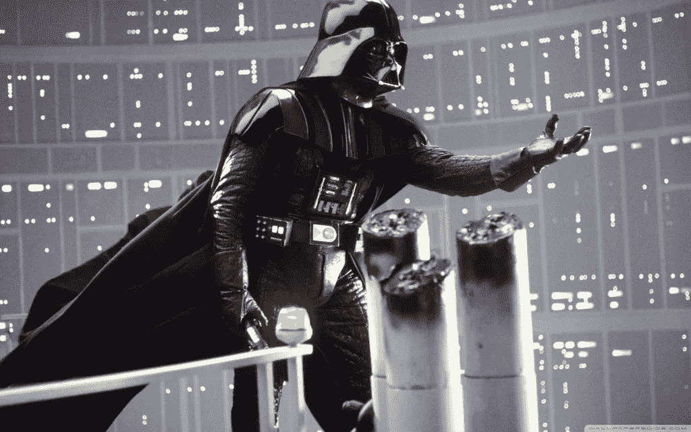

# 需要一个恶棍

> 原文：<https://medium.com/hackernoon/the-need-for-a-villain-ddfedcd827ff>

在电影中我明白了。好电影需要好反派。我喜欢的电影都有好的反派。在一些作品中，恶棍是主角。在电影的过程中，主角常常会慢慢变成对手。一个好的反派是一个伟大的讲故事的工具。在一个经典的*善恶*故事结构中，英雄被坏人的行为所激励，这推动了故事的发展。在一个*好人变坏*(或反之亦然)的故事中，人物的动机被研究并通过一个善恶对比的镜头展现出来。总的来说，一个恰当使用的反派角色常常会把电影提升到另一个层次。但是反派在现实生活中扮演什么角色呢？

我们人类给自己讲故事。我们把我们的生活看作是正在上演的电影或小说。我们把搬新家、找新工作或生孩子视为新篇章的开始。我们视自己为生活电影中的主角。在那里，我们喜欢的音乐变成了电影配乐，我们的宠物变成了漫画中的角色。这不仅是书籍和电影对我们心理的影响，也是我们的思想对我们构建故事的方式的影响。我们这样讲故事是因为我们这样看待我们的生活。然而我们的生活中经常缺少的是一个好的反派。

那么，在和平时期，在食物链的顶端，在我们不必每天为自己的生存而斗争的环境中，我们做些什么呢？我们*发明*反派。或者为我们发明它们。政客们尤其热衷于我们对复仇女神的需求。我们在体育、宗教、社会阶层以及生活的几乎每一个方面都构建了对手，这让我们有了不止一种看待世界的方式。社交媒体放大了观点之间的差异，并让用户屏蔽掉与他们认为正确的观点不一致的观点。每个人都在指责发布假新闻的每个人，这个世界似乎比十年前更加两极分化了。简而言之，另类右翼的原型主角是左翼社会正义战士的对手，反之亦然。

比特币创造者曾将央行视为主要的恶棍，而这正是本发明应该阻止的恶棍。然而，随着采用的增加，越来越多的分裂开始从*出现在*加密社区中。首先，它们被具体化为备用硬币，最近则被具体化为主网的叉子。人们互相指责对方被收买，搞阴谋，不忠于他们或 Satoshi 对电视网的任何设想。我们似乎都忘记了，在我们的生活中以及在比特币中，我们并不真正需要*一个恶棍。比特币不需要扰乱政府来繁荣甚至生存。没有人强迫任何人在这个领域做任何事情。整个实验的重点往往都迷失在淘金热中。不管你选择加入哪个网络，你都没有*去诋毁另一个网络的支持者。你甚至不必厌恶银行或政府。都是关于*合作*的。人们似乎认为捍卫一种观点的唯一方法是与反对它的观点进行辩论。情况并非总是如此。通常，支持某事比反对某事更有成效。我们不是政客，也不需要成为政客。如果我们试着做点贡献，我们都会过得更好。**

因此，总之——不要担心坏人，除了恐惧本身，没有什么可害怕的。恐惧，不确定和怀疑。那些是我们的敌人。那些，也许还有杰米·戴蒙，但那是另一回事了…