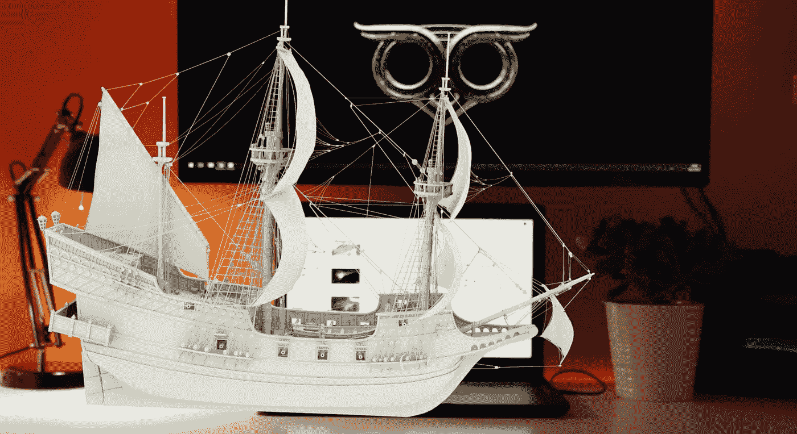
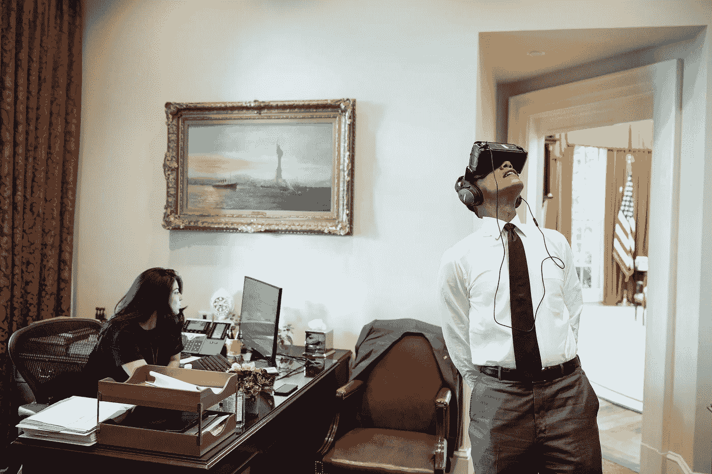
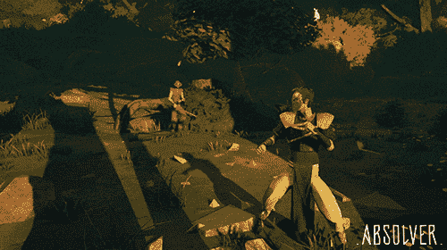
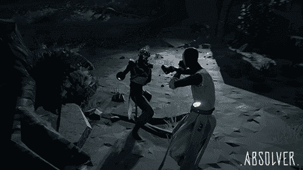
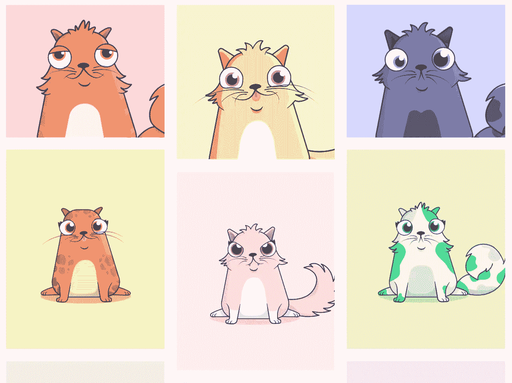
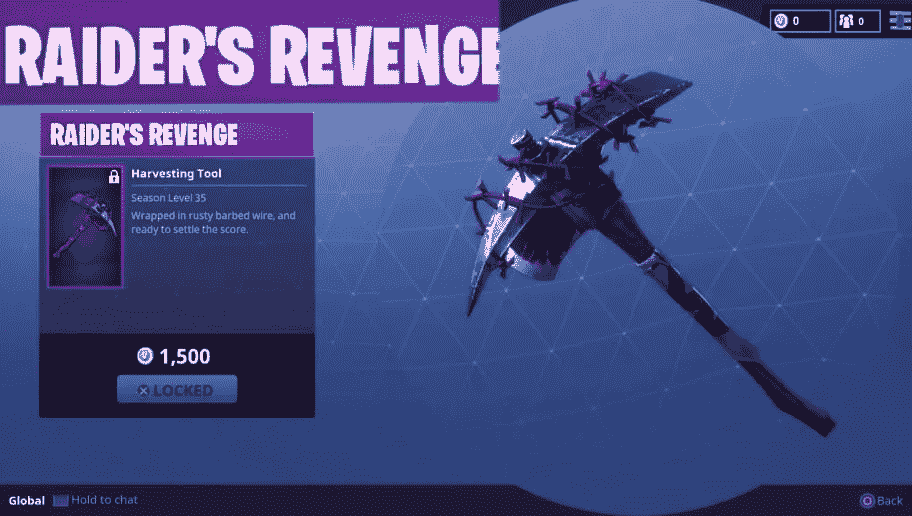
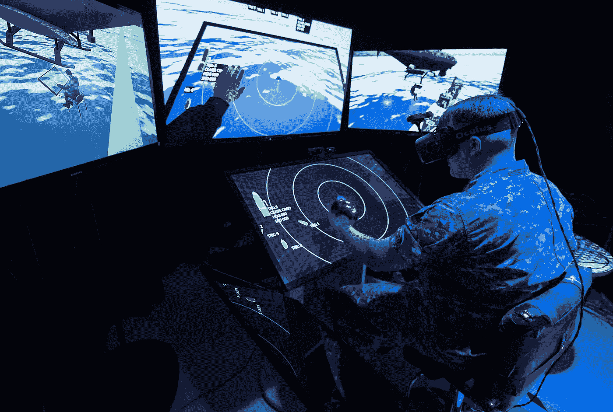
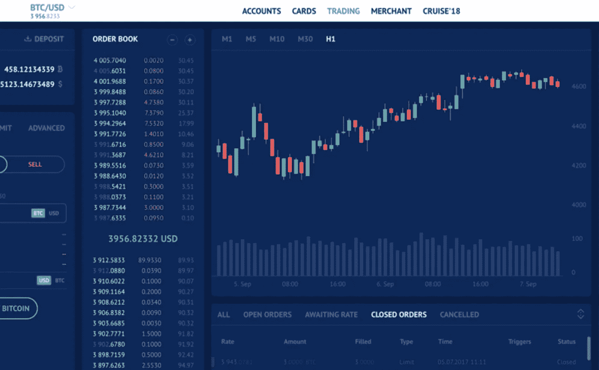

# 对虚拟资产交易所的需求

> 原文：<https://medium.com/hackernoon/the-need-for-a-virtual-asset-exchange-f4cd04e117f1>

A virtual ship floats in front of a workstation.

虚拟现实(VR)头戴设备将导致数字世界中区块链支持的虚拟对象的创建、分发和交易激增。Magic Leap One 是一款快速沉浸式虚拟现实耳机，最近的发布大张旗鼓地标志着下一代虚拟现实用例的快速发展。

**VR / AR / MR**

*虚拟现实* (VR)是一种身临其境的现实，戴上耳机即可体验。虚拟现实可以模拟真实世界，也可以完全由计算机生成。使用 360 度摄像机体验虚拟现实的人可以感觉身临其境，置身于真实世界或其他地方。

President Obama tries on a VR headset in the Oval Office.

*增强现实* (AR)是将虚拟物体强加于现实世界。AR 一般是通过智能手机体验的。例如，Snapchat AR 对象似乎在你的房间里四处漂浮，或者在你旁边的地上行走。AR 虚拟物体目前对现实世界的刺激没有太大的反应。

混合现实是真实世界和虚拟世界的融合，创造出新的环境。在 MR 中，虚拟和现实世界的物体可以共存并实时交互。尽管 MR 在教育、军事训练和医疗保健等领域有潜在的用途，但目前还没有广泛的 MR 平台或工具。

Augmented Reality Objects displayed in a room, viewed through smart phones and tablets.

**计算机生成的虚拟现实**

计算机生成的虚拟现实使用纯计算机生成的内容来创建虚拟现实体验。计算机生成的 VR 可以是预先创建的环境，用户可以探索该环境，或者可以在游戏中实时渲染该环境(因此可以对用户作出反应)。为了将计算机生成的虚拟现实概念化，想象一下在身临其境的 3D 环境中用虚拟现实耳机玩第一人称射击游戏，如堡垒之夜或使命召唤。

Computer generated game play from the game Absolver.

**区块链平台**

区块链技术现在可以在互不相识的各方之间实现安全、直接的交易。区块链及其平台的普及将使人们能够轻松追踪资产所有权和历史。此外，许多努力正在进行中，以使这些平台[可互操作](http://www.rayadvisors.com/blog/blockchain-interoperability)，以便在一个平台上购买的资产可以在一个独立但兼容的区块链平台上无缝销售或交易。加密货币和加密令牌建立在这些平台之上。

**不可替换的令牌**

一类被称为不可替换令牌(NFT)的区块链令牌越来越受欢迎。非专利技术可以是独特的，也可以是罕见的，这就造成了数字稀缺性，从而提高了它们的价值。创建者现在可以使用 NFT 在区块链平台或虚拟环境中构建和部署虚拟对象，其中包含对象的所有权和使用权。这些权利可以一起或分开买卖，购买者获得虚拟资产的所有权或使用权。

The popular game Crypto-Kitties was built using Non Fungible Tokens.

游戏 crypto-kitties 建立在以太坊的 ERC-721 令牌标准(一种 NFT)之上。最近，我提出了一个潜在的 NFT 标准( [ERC-1190](http://www.rayadvisors.com/erc-1190-proposal.html) )，它支持额外的功能( [Github](https://github.com/ethereum/EIPs/issues/1190) 、 [YouTube](https://www.youtube.com/watch?v=bGBTAOY62mY) 、[博客](http://www.rayadvisors.com/blog/erc-1190-token-standard))。

**游戏**

虚拟物体是游戏世界的重要组成部分。例如，Pokemon Go 使用手机 GPS 系统来定位、捕捉、战斗和训练虚拟生物，这些虚拟生物似乎出现在玩家的现实世界位置中。游戏中的物品、财产、资源和角色已经在被估价和交易为真钱。

许多流行的游戏环境使得由用户创建的虚拟对象的生产和商业化成为可能。目前，大多数基于游戏的虚拟资产都在非官方拍卖网站上交易。一些游戏设计者已经意识到交易虚拟物品的巨大市场已经在他们的游戏环境之外发展起来了。

The Raider’s Revenge was an item from the game Fortnite’s first season, that you could unlock at level 35 with 1,500 V-Bucks. Due to how early on it was available in the game, plus the high level a player had to be to obtain it, the amount of people wielding it is limited. It’s a proud badge for the veteran Fortnite fans out there. Source: [DBLTap](https://www.dbltap.com/posts/6031610-7-rarest-skins-in-fortnite).

**应用**

Magic Leap One 和 Hololens 等 VR 头戴设备制造商明白，他们的成功取决于他们平台上可用应用的范围和效用。这就是为什么他们试图吸引开发者为他们的产品开发应用程序。这也是为什么 Magic Leap One 耳机最初只向开发者和记者发布的原因。

虚拟现实将允许开发人员在考古、工程、机器人、娱乐、社会科学、治疗、心理学、医疗保健、培训、教育、工程、美术、建筑和营销等不同领域创建大量应用程序。娱乐和营销应用最有可能引领潮流。

我最近了解到一家区块链初创公司，它为客户(如主要的汽水制造商)创建独特的虚拟对象，并将它们放置在城市中有趣的位置。消费者可以前往虚拟令牌的位置，并使用初创公司的应用程序在手机上捕捉它。然后，他们可以在任何符合要求的便利店用代币兑换汽水。

娱乐、游戏和营销应用将越来越多地在我们的城市中放置虚拟物体，就像 2016 年的 Pokemon-Go 一样。这些虚拟物品中的许多将由 NFT 代币驱动，用户将能够以真实价值获取、兑换和转售这些代币。

A soldier trains using an Augmented Reality headset.

**虚拟资产交换机会**

尽管虚拟资产已经存在了一段时间，但拍卖网站上的巨大估值和巨大交易量还是一个相当新的现象。虚拟资产的繁荣创造了一个新的机会:虚拟资产交易所。

如前所述，如今大多数与游戏相关的虚拟资产都在非官方拍卖网站上交易。

Call of Duty’s game developers decided to call their in-game market ‘Black Market’.

游戏开发者可以创建自己的(真金白银)拍卖网站，但大多数人还没有这样做。这种不情愿可能是因为过去没有这样做。2011 年，一款名为《暗黑破坏神 3》的游戏在观察到游戏中的物品在非官方网站上交易后，创建了自己的拍卖行。坏演员和黑客开始利用官方拍卖行赚钱。一些热切的用户在官方拍卖行比在游戏本身更活跃。围绕在线拍卖行的潜在法律责任也是一个风险。官方拍卖行在几年内就关闭了。许多成功的游戏开发商都很保守，专注于游戏创作的核心能力，而不是管理相关市场。尽管如此，虚拟资产仍定期交易，并将继续如此。

加密货币交易所通常专注于在有限数量的货币对中实现交易。这些交换中的一些使得能够进行法定到加密货币的交易，而其他的仅使得能够进行加密到加密对的交易。加密货币交易所应该能够相对容易地处理 NFT 交易。然而，成功的交易所可能会选择专注于扩展其加密产品，而不是增加新的资产类别。

The interface of a cryptocurrency exchange.

因此，目前不存在用于游戏、娱乐、促销和营销的各种虚拟资产的主要区块链支持的交易平台。许多开发者已经探索了特定于游戏的交流，但是一种可以用于游戏以及其他目的的虚拟资产可以以新的令人兴奋的方式提高用户的参与度。这种资产可能很快就会充斥虚拟空间。当他们这样做时，人们会希望在一个可信的平台上买卖它们，用于其他虚拟资产、加密货币甚至真实货币。问题是:谁将创建第一个这样的交易所，以获得临界质量？

**结论**

VR 和 AR 终于成熟了。VR 头戴设备(来自 Magic Leap、Oculus 和索尼等)正在向全球观众介绍 VR 和 AR。这种趋势将与区块链支持的 NFT 的兴起相互作用，导致虚拟世界充满独特和罕见的数字对象，覆盖在现实世界上。下一批独角兽很可能是旨在促进这些虚拟资产轻松、安全交换的平台。

—

[沙恩雷](http://www.shaanray.com)

关注 [Lansaar Research](https://medium.com/lansaar) on Medium，了解最新的新兴技术和新的商业模式。