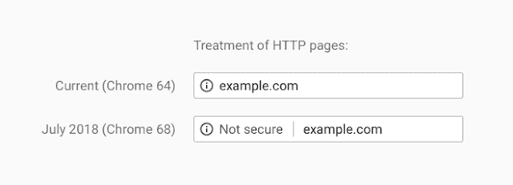
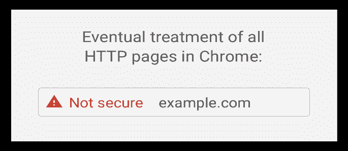
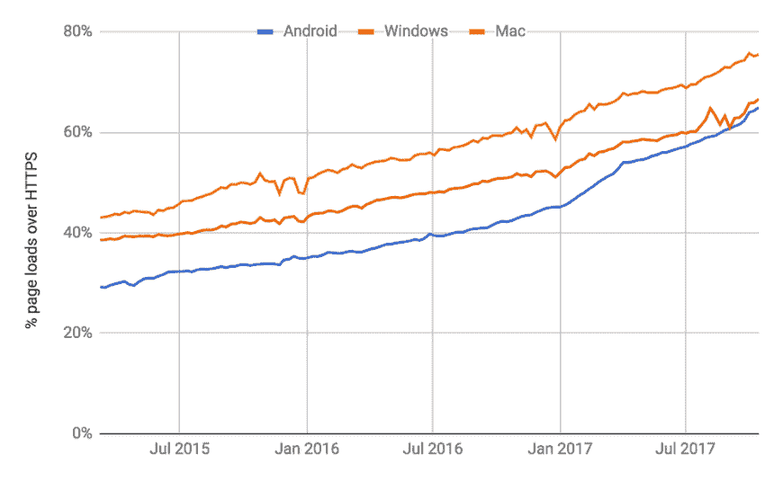
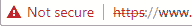

# 安全浏览的新时代

> 原文：<https://medium.com/hackernoon/the-new-age-of-secure-browsing-e4d1dca8875a>

# (SSL/TLS)

你知道吗，如果你的网站的 URL 不是以“https”开头，这意味着它没有使用任何加密，那么你的网站在谷歌搜索引擎上的排名就低于它应该被谷歌排名算法排名的位置。此外，从 2018 年 7 月开始，谷歌 Chrome 和其他浏览器将把所有没有配置安全加密连接的网站标记为“不安全”。

上面显示的变化是长期计划“HTTPS 无处不在”的一部分，谷歌几年前就部署了这个计划来鼓励网站所有者提高他们网站的安全性。你可能已经注意到，自 2017 年以来，当 HTTP 网站上的任何输入都是通过 Chrome 进行的；地址栏会立即显示“不安全”的通知。这将最终转变为包括一个红色警告标志，以帮助提高用户的意识，即他们与网站的通信容易受到攻击者的攻击，使他们能够真正了解网络的安全级别。

出于两个原因，谷歌决定在这场运动中加入一个渐进的过渡。首先，给予网站所有者足够的时间来正确配置他们的网站 HTTPS，其次，巧妙地保护红色警告标志的公众形象，使其真正表明网站的安全性应该受到质疑。此外，根据 Chrome 发布的统计数据，前 100 个网站中 HTTPS 的默认使用从 2016 年的 37 个增加到 2018 年初的 81 个。

# 为什么您需要安全浏览

如果您经常访问网站或者是拥有网站的组织的一部分，了解安全浏览网页意味着什么是有益的。这是指使用超文本传输协议(HTTP)的 HTTP 安全(HTTPS)扩展来访问网站。

当用户与只使用 HTTP 的网站交互时，他们之间来回发送的所有数据都是以明文形式进行的。因此，在这一过程中需要改善安全状况，这导致实施了 HTTPS 的三个主要特征:

*   首先，所有传输的数据都是加密的，这意味着明文被加密成密文，使得攻击者很难解密数据。
*   其次，需要对用户与之通信的网站进行身份验证，这通过提供标识该组织的证书来验证。
*   最后，HTTPS 提供了一种机制来检测传输中的数据篡改或损坏，这有助于数据完整性。

一个非常麻烦的情况是使用公共网络，比如咖啡店里的 Wi-Fi。如果用户与不实施 HTTPS 的网站通信，攻击者可以使用数据包嗅探器工具收集数据，这些工具试图在网络上拦截和收集数据包。例如，这使得攻击者能够以明文形式访问敏感信息；用户的登录信息。攻击者还可以修改传输的内容，这可能会诱使用户下载恶意软件。在极端情况下，在没有敏感信息被传递的情况下，攻击者仍然可以收集暴露用户行为和身份的信息。

网站不仅应该安全地保护用户，还应该提高品牌声誉，让用户信任他们正在访问的网站。自 2014 年以来，谷歌和其他搜索引擎一直在提升使用 HTTPS 的网站的排名。因此，如果一个组织希望在使用 HTTP 的同时提高他们的在线状态，那么一个简单的选择就是升级到推荐的 HTTPS 配置。

# 如何判断网站是否安全

为了确保在特定网站上的浏览是安全的，网络浏览器都在带有文本“安全”的 URL 旁边显示一个绿色的挂锁，后跟以 HTTPS 而不是 HTTP 开头的 URL。这意味着他们目前拥有网站正式拥有的有效 SSL/TLS 证书，并且配置正确。否则，将显示一个红色的警告标志，并带有文本“不安全”，以及一条穿过 https 文本的线，如下所示。

在这两种情况下，通过单击安全或不安全文本，总是可以找到关于 SSL/TLS 证书的更多信息，例如证书颁发给谁、证书是否过期，甚至有多少位用于加密。

用户应始终检查网站 URL，以确保它不会试图冒充另一个网站。这些网站可以配置 SSL/TLS 证书，但在这些情况下，网站本身是恶意的，同时试图表现出安全。这方面的一个例子是一个名为“**y0urcompany.com**”的钓鱼网站，如果 URL 显示“安全”,则不应该被信任。经常查看域名并检查任何拼写错误是很重要的。

# 如何在您的域上设置安全浏览

当一个网站迁移到 HTTPS，许多因素都要考虑，因此，专家的帮助应该是可用的，以确保优化配置。以下步骤简要描述了如何进行这种迁移。

1.  **购买 SSL/TLS 证书。**从单个、多域或通配符证书中选择您需要的类型。从单个域证书开始，它被颁发给一个特定的域，这是最便宜的选择。接下来是多域证书，通过添加通常在 5-10 个域范围内的替代地址，可以用于许多不同的域，这大约是单域证书价格的两倍。最后，我们有通配符证书，它保护一个域及其所有子域，其价格大约是多域证书的两倍。建议通过您的托管公司购买，因为他们通常会帮助安装证书。
2.  **配置 2048 位密钥**用于证书加密，因为这是推荐使用的安全级别。还建议使用最佳可用密码套件，禁用/避免过时的密码套件，因为它们通常存在漏洞。
3.  **设置重定向**强制所有当前的 HTTP 页面重定向到新的 HTTPS 页面。这可以通过使用规范链接(类似于“<link rel = " canonical " href = " https://…"/>”)将 301 重定向添加到网页的头部，或者通过将代码添加到。htaccess”文件来强制进行重定向。大多数网络主机都有助于这些配置。
4.  **更新整个网站的所有内部链接**以重定向到 HTTPS 页面，这消除了从 HTTP 重定向到每个页面的需要。Google 开发人员为内部链接推荐的最佳实践是使用协议相关的链接，这种链接不是声明使用什么协议，而是选择当前的配置。例如，将<a href = " http://example . com/">改为< a href="//example.com/" >。
5.  **在所有可能的情况下更新所有外部链接。可以使用 Bram van Damme 的脚本来检测网站上的混合内容。**
6.  **允许使用 robots.txt 文件对 HTTPS 网站进行爬网**，避免在 robots.txt 文件中使用“noindex”标签。这使得搜索引擎很容易抓取您的网站被索引和排名正确。
7.  **重新编制网站的索引**是一个需要时间的过程，尽管所有的浏览器都有不同的抓取网页的方法。谷歌的搜索控制台是一个免费的工具，可以帮助检查网站的索引状态，并协助优化网站和页面的可见性和存在。
8.  **使用 Qualys SSL Labs 之类的工具测试网站的配置**，该工具分析一个域并提出任何建议和最佳实践。该工具还显示当前的漏洞，并给出该领域的总体分数。

# 结论

建议使用 HTTPS 来保护传输的信息，在搜索引擎上获得公平的排名，并通过明显看到标有“安全”和挂锁(均为绿色)的 URL 来改善网站在公众心目中的合法性和安全性。

在网站上使用 HTTPS 表明传输中的数据受到加密保护，篡改该数据将被检测到，并且网站地址将被授权。这使得用户可以清楚地看到他们与网站的通信有多安全。使用 HTTPS 需要为 URL 配置 SSL/TLS 证书，可以为单个域、多个域或通配符子域购买该证书。

在过去的几年里，谷歌一直强烈建议网站所有者将他们的网站迁移到 HTTPS，这些安全的网站已经被搜索引擎提升了排名。所有使用 HTTP 的网站最终都会有“不安全”的标签和警告标志，它们的 URL 都是红色的，这更是将网站迁移到 HTTPS 的原因。他们提供了包含最佳实践和迁移说明的文档，以及有助于这一过程的工具，这些都可以在线获得。