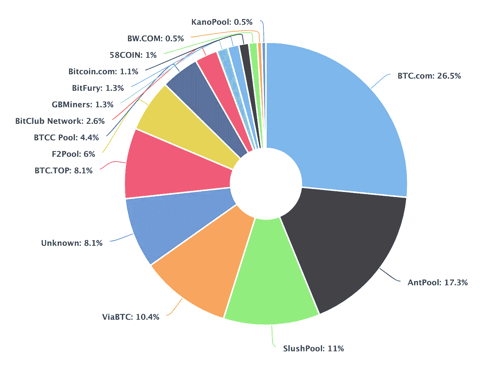
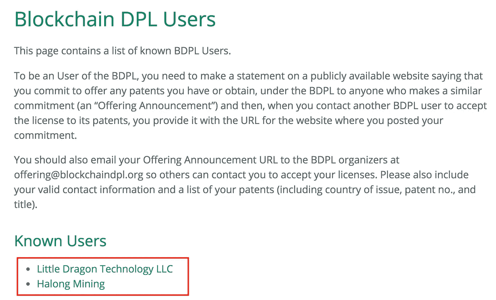
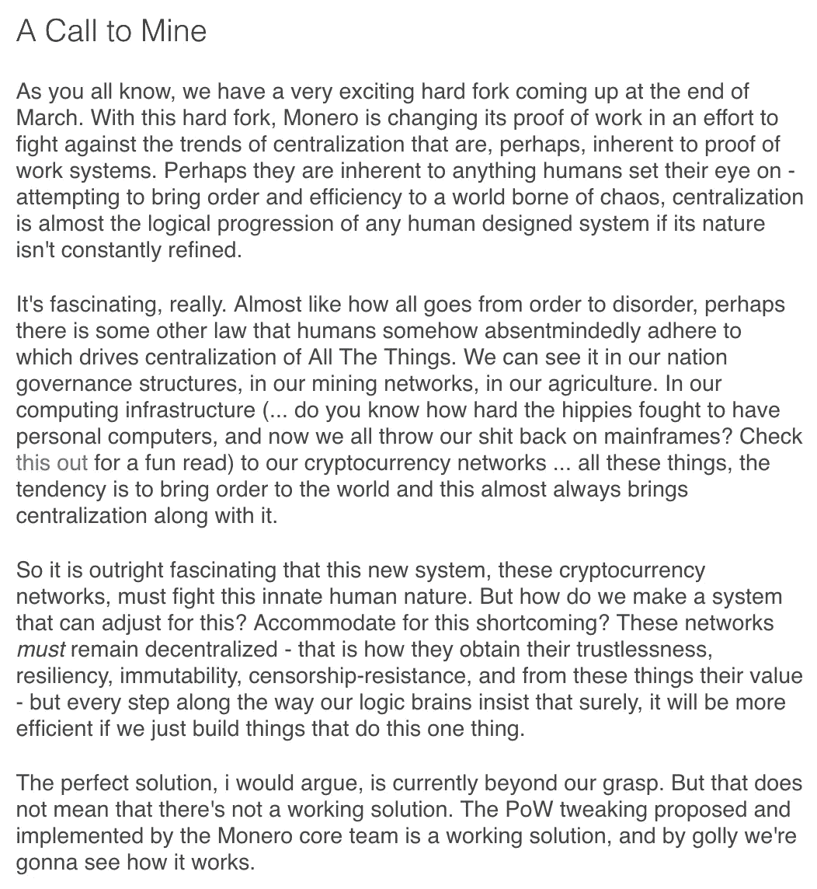

# 新的比特币辩论:工作变化的证据与防御性专利

> 原文：<https://medium.com/hackernoon/the-new-bitcoin-debate-proof-of-work-change-vs-defensive-patents-f13108f10ecc>

比特币的世界从来没有沉闷的时刻。在不到一年的时间里，它经受住了两项有争议的规模扩张提议:比特币现金和 Segwit 2x。

尽管这场闹剧在很大程度上已经平息，但一个新的争论主题正开始酝酿；这次是关于工作证明。

2 几周前，[c bra](https://medium.com/u/a604e879218b?source=post_page-----f13108f10ecc--------------------------------)发表了一封[致比特币社区](/@CobraBitcoin/an-open-letter-to-the-bitcoin-community-to-change-the-proof-of-work-algorithm-12a6545c20d0)的公开信，敦促他们考虑改变工作证明挖掘算法。在这篇文章中，他提出了三个要点:

1.  比特币挖矿在比特大陆变得越来越集中。
2.  最近的一份 Bernstein 报告计算出仅 2017 年比特大陆的利润就超过 30 亿美元。
3.  这令人担忧，因为比特大陆拥有 BTC.com 和蚂蚁池，这相当于比特币哈希值的 43.8%(2018 年 3 月 14 日)。

[https://blockchain.info/pools](https://blockchain.info/pools)

尽管 BTC.com 和安特普尔是矿池，但不清楚比特大陆拥有多少属于他们自己的采矿设备。拥有 30 亿美元的资金，比特大陆很有可能通过为自己创造更多的 ASIC 或者收购/投资其他矿业公司来增加他们的 hashrate 优势，就像他们对 AntPool 所做的那样。

然而，几周之后，当[比特币杂志](https://medium.com/u/da165ee059da?source=post_page-----f13108f10ecc--------------------------------)发布了他们关于[比特币防御性专利许可](https://blockchaindpl.org/)的专题时，这些担忧有所缓解。

# 比特币防御性专利许可证(BDPL)

> “(减少矿商集中化的)最佳方式之一是鼓励采矿个人或实体根据相互防御的专利许可证授予各自的采矿专利，该许可证旨在满足比特币或其他区块链协议的独特需求，并防止任何一个采矿财团获得发动多数(或接近多数)攻击的可怕能力。”- [BDPL](https://blockchaindpl.org/)

这项令人兴奋的新专利是 Blockstream 提出的前比特币防御专利的延伸。这项专利是在一位有着 14 年工作经验的非常合格的知识产权律师的帮助下完成的，他也是一个与联合国世界知识产权组织合作的非政府组织的新兴技术总监。通过签约，公司将能够获得 BDPL 中所有其他的专利，但是他们也必须分享他们的专利。

现在，这听起来可能不是对企业最有吸引力的安排，尤其是因为在当今的资本主义经济中，许多公司都是靠自营产品兴旺发达的。幸运的是，加入 BDPL 有巨大的动力，尤其是如果你是一家矿业公司。

## 以 Asic-Boost 为诱饵

小龙科技有限责任公司[于 3 月 1 日](https://www.asicboost.com/single-post/2018/03/01/opening-asicboost-for-defensive-use/)宣布将签约 BDPL。作为 Asic-Boost 专利的当前持有者，他们实际上是在提供这项专利，以激励其他矿业公司加入 BDPL。

事实上，一家公司已经开始从成为防御性专利的一部分中获益。[下龙矿业](https://bitcoinmagazine.com/articles/halong-mining-first-bitcoin-mining-hardware-producer-implement-overt-asicboost/)宣布，他们已经成功地将 Asic-Boost 集成到他们的专用计算机中，成为第一家这样做的比特币矿业硬件公司。这对比特币社区来说是个好兆头，因为 [Slush Pool](http://In fact, Halong Mining has already integrated it into their mining rigs as the first Bitcoin mining hardware producer to implement overt Asic-Boost.) 也增加了公开的 Asic-Boost 支持，为其中一些矿工上线做准备。

如果我是比特大陆，我有两个选择:

1.  加入 BDPL 以使用 Asic-Boost，但放弃我拥有的和/或可能正在开发的其他专利。
2.  不要加入 BDPL，看着我的盈利能力和 hashrate 优势慢慢减少，因为其他人利用效率提高了 30%。

区块链社区的许多人认为这是分散采矿的胜利:

然而，并不是每个人都对结果满意:

那些密切关注比特币的人不应忽视这种双重讽刺意义:

1.  Asic-Boost，这个曾经饱受诟病的挖掘技术，有可能成为增加分散式挖掘的统一因素。
2.  比特币的网络安全正受到其旨在推翻的金融基础设施的保护。在 SegWit 实施之前，Asic-Boost 专利被用来威胁矿工的那一刻起，这就变成了现实。现在，BDPL 进一步加强了这一点。

事实是，比特币的普及程度已经达到了其网络直接受到政府监管影响的程度。BDPL 是朝着这个方向迈出的又一步。我相信，对于那些对新的防御性专利不感兴趣的人来说，这是根本的潜在问题。人们不再依赖协议，而是利用区块链外部措施来保护网络安全。

另一方面，实用主义者认为比特币存在于一个受监管的世界中，最终变得“太大了”。尽管这种专利许可情况并不理想，但采矿硬件制造商愿意积极使用他们的专利。因此，防御性地使用专利是合理的，因为它只是公平竞争。

比特币社区现在有两条路摆在他们面前:

1.  他们是否适应了一个务实地依赖区块链以外的因素来确保网络安全的新时代？
2.  或者他们仍然是一个“纯粹主义者”,拒绝让区块链协议之外的任何东西影响网络，尤其是它的 hashrate 安全性？

BDPL 的成功还有待观察，因为只有两家公司注册了 BDPL:

[https://blockchaindpl.org/users](https://blockchaindpl.org/users) (3/10/18)

与此同时，比特币社区的一名知名成员一直在倡导改变工作证明:

尽管这听起来像是一个高风险的解决方案，但它并不是新的想法。事实上，早在 2012 年，它曾经[向比特币社区](https://en.bitcoin.it/wiki/Adaptive_difficulty)[提出](https://twitter.com/LukeDashjr/status/971940746721939460)，并且也在 [Vertcoin](https://medium.com/u/215e18934d85?source=post_page-----f13108f10ecc--------------------------------) 的路线图上，作为对任何试图在其网络上运行 Asic 的矿工的威胁。此外，有一种加密货币(Monero)计划执行硬分叉，以专门解决集中挖掘的这一问题:

[https://www.reddit.com/r/Monero/comments/83d3vk/a_call_to_mine/](https://www.reddit.com/r/Monero/comments/83d3vk/a_call_to_mine/)

现在剩下的就是让我们简单地等待，看看 BDPL 会有多成功。如果它最终在比特币的 hashrate 方面促进了更多的去中心化，它可能会为比特币的协议与政府监管的持续整合创造一个开放的姿态。

同时，跟踪 Monero hardfork 的成功可能是值得的，并将其作为一个案例研究，以查看更改工作证明算法是否是一个可行的解决方案。

# 记得给我左边的掌声，下面的捐款，和你的朋友分享！直到下一次，向前和向上。😁

**捐款地址** BTC:1c G5 n9 chziwejhcb 8 CPB 9 hv5 mmcanyftzw
LTC:lvkpssctkuuperwdzoffybdteqjnmn F2 cm