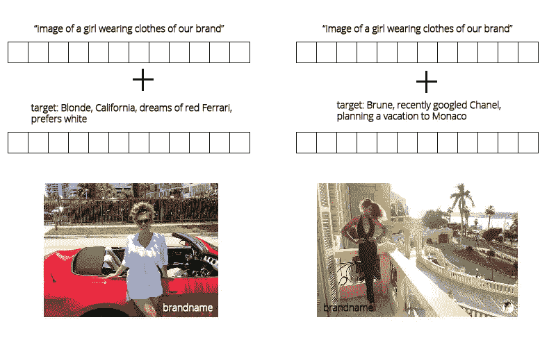

# 新的神经互联网即将到来

> 原文：<https://medium.com/hackernoon/the-new-neural-internet-is-coming-dda85b876adf>

## 从这里看起来很可怕

这一切是如何开始的/风景

## 生成性对抗网络进展

把典型的和被充分研究的神经网络(例如图像分类器)看作是神经网络技术的左半球。考虑到这一点，就很容易理解什么是生成性对抗性网络。这是一种右半球——据说是负责创造力的那一个。

生成对抗网络是神经网络技术学习创造力的第一步。典型的 GAN 是一种神经网络，其被训练成使用图像数据集和一些随机噪声作为种子来生成关于特定主题的图像。到目前为止，GANs 创建的图像质量低，分辨率有限。NVIDIA 的最新进展表明，生成高分辨率的真实感图像是触手可及的，他们在开放访问中发布了这项技术。

Examples of GAN images. Some are good, some are bad.

## 条件 GANs 和变分自动编码器

有太多不同复杂性、架构和奇怪缩写的 GANs 类型。我们在这里最感兴趣的是条件 GANs 和变分自动编码器。条件句不仅能够模仿“卧室”、“脸”、“狗”等宽泛类型的图像，还能深入更具体的类别。例如， [Text2Image 网络](https://github.com/emansim/text2image)能够将文本图像描述翻译成图像本身。

通过改变连接到“含义”向量的随机种子，我们能够产生无限数量的鸟类图像，匹配描述。

## 机会

让我们闭上眼睛看看 2 年后的世界。像 NVIDIA 这样的公司将把 GAN 技术推向行业就绪水平，就像他们在名人脸一代中所做的那样。这意味着，GAN 将能够基于文本(例如)描述按需、即时地生成任何图像。这将淘汰一些摄影和设计相关的行业。这是如何工作的。

同样，该网络能够通过改变随机种子来生成无限数量的图像。

## 个性化

可怕的是。这样的网络不仅可以接收到它需要生成的目标对象的描述，还可以接收到描述你——广告消费者——的向量。这种广告可以对你的个性、网页浏览历史、最近的交易和地理位置进行非常深入的描述，因此 GAN 将生成一次性的、独特的和完全适合你的广告。CTR 已经很高了。

通过测量你的反应，网络将会适应并制作越来越精确地针对你的广告，击中你的软肋。

## 泡沫趋势

因此，最终，我们将在互联网上随处看到完全个性化的内容。

每个人都会看到所有内容的完全定制版本，根据消费者的生活方式、观点和历史进行调整。我们都见证了最近美国大选后这种泡沫模式的觉醒，而且会变得更糟。GANs 将能够为你精确定位内容，而不受媒介的限制——从图像广告到机器生成的复杂观点、趋势和出版物。这将创造一个持续的反馈循环，根据你的互动进行改进。不同的甘之间将会有一场竞争。这是一场全自动的心理操控战争，以人类为战场。这一趋势背后的驱动力极其简单——利润。

这不是一个可怕的末日场景，这实际上正在发生。

## 这是好是坏？

我不知道。但是我们确实需要一些东西:关于这项技术不可避免的到来的广泛的公众讨论和阻止它的后备计划。所以，最好现在就开始思考——我们如何对抗这一过程，同时从中受益。

# 事情的技术方面

由于一些技术限制，我们还没有做到这一点。直到最近，GANs 生成的图像质量很差，很容易被识别为假的。NVIDIA 展示了生成 1024x1024 的极其真实的人脸实际上是可行的。为了推动事情向前发展，我们需要更快更大的 GPU，更多关于 GAN 的理论研究，更多围绕 GAN 训练的聪明黑客，更多带标签的数据集，等等。

请注意——我们不需要新的电源、量子处理器(但它们可以提供帮助)、通用 AI 来达到这一点或其他一些纯理论的新酷东西。我们所需要的是在几年之内就能得到，而且大公司可能已经有这种可用的资源。

此外，我们将需要更智能的神经网络。我非常期待 Hinton 等人的[胶囊方法的进展](https://arxiv.org/abs/1710.09829)，当然，我们将率先在[超分辨率技术](https://letsenhance.io)中实现这一点，这将极大地受益于 GAN 的进展。

让我知道你的想法。