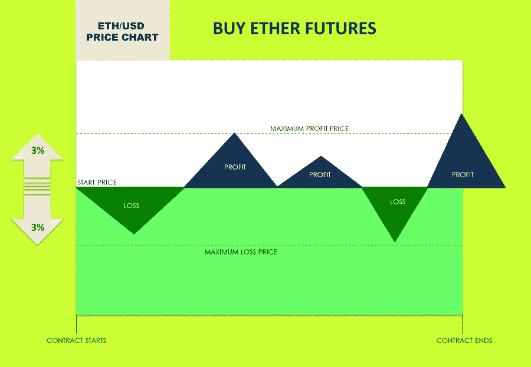
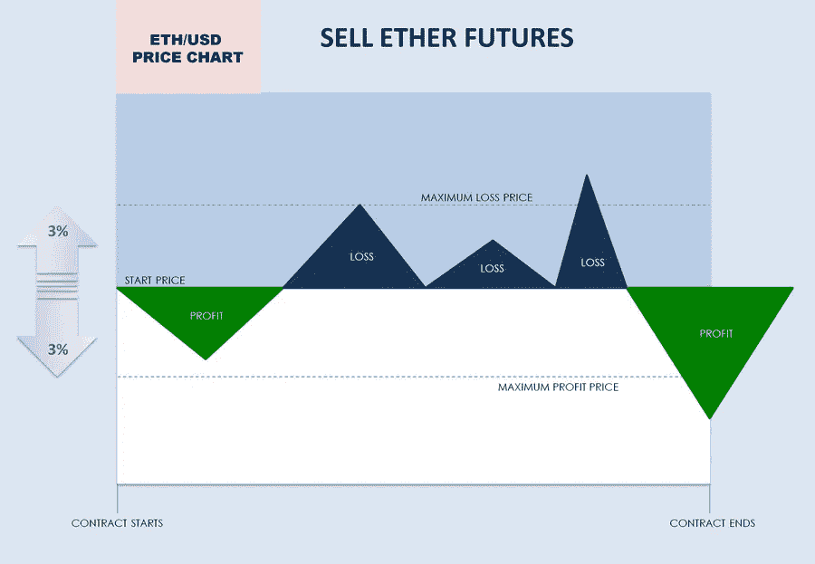
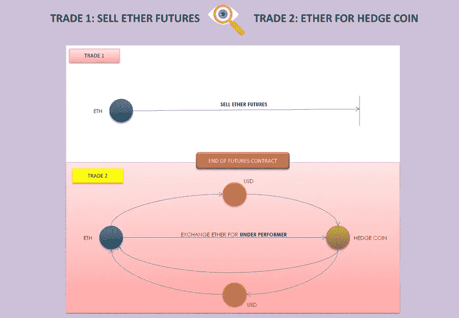
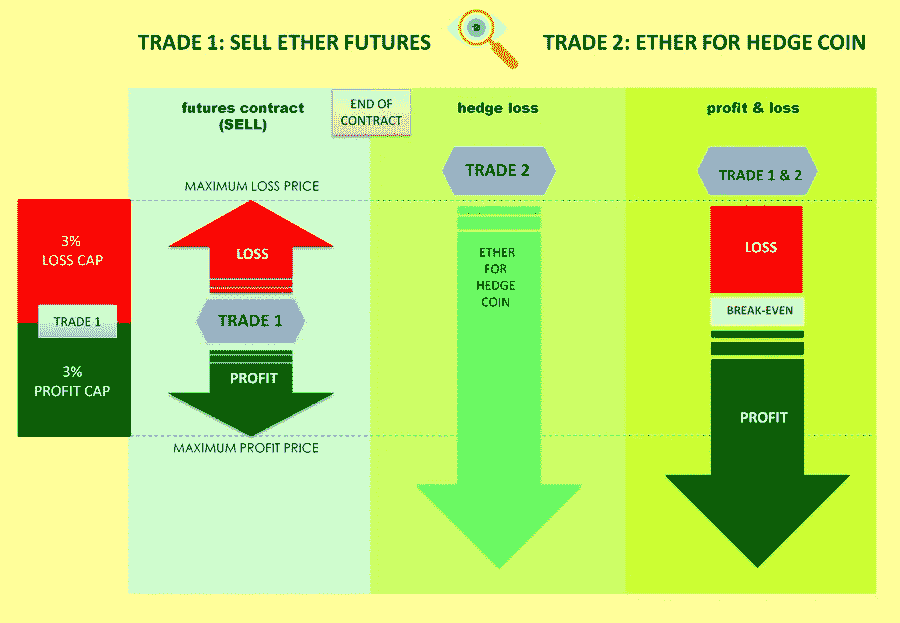
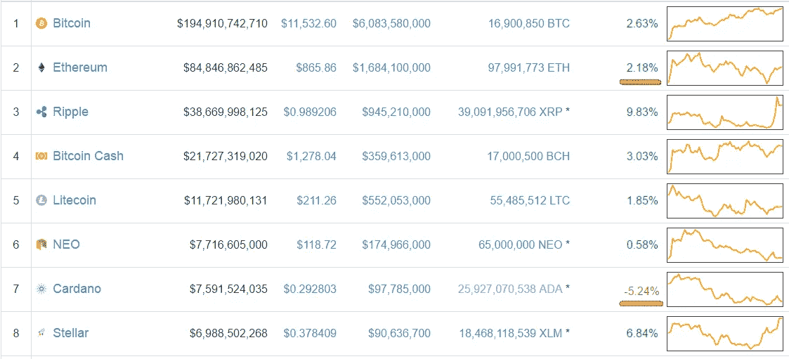
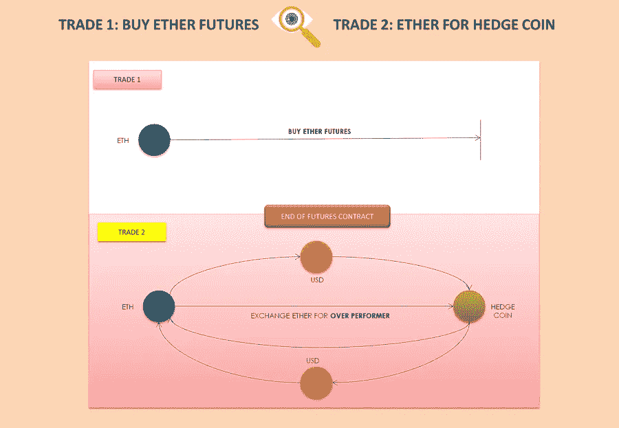
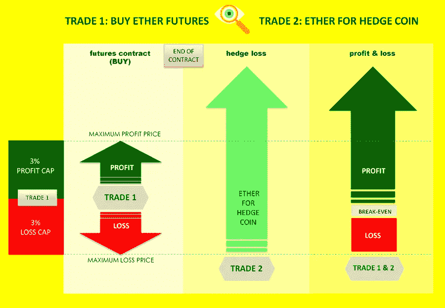
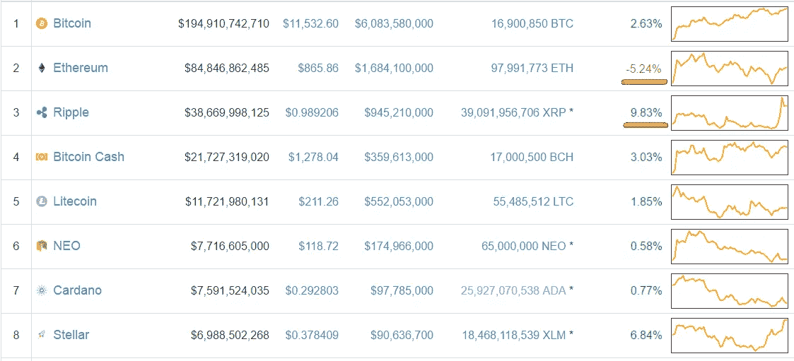
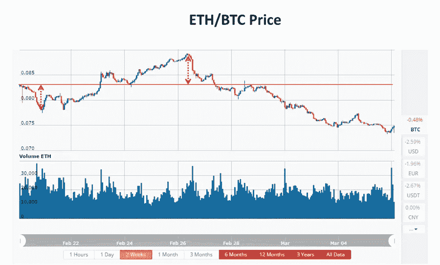

# 如何使用期货合约 Dapp 来提高你的交易成功率

> 原文：<https://medium.com/hackernoon/the-next-best-thing-to-the-holy-grail-d8cffc51abcb>

交易者总是在寻找圣杯——一个能让他们战胜市场并获得超额利润的系统。不幸的是，没有交易圣杯。然而，这篇文章的*动态投资组合交易*部分向你展示了为什么我们的期货交易 DApp 是仅次于圣杯的最好的东西。首先，为了让交易者遵循不太复杂的交易策略，我们将解释为什么期货 DApp 仍然是一个伟大的交易工具。

如果你只是想赌一种[加密货币](https://hackernoon.com/tagged/cryptocurrency)的未来价格，代币兑换商 DApp 期货提供了一个独特的好处:杠杆。

例如，TokenChanger DApp 公司提供 3，200%(最大)的交易资本杠杆。例如，如果你存入 1 以太作为交易资本，你得到 32 以太杠杆交易资本。

> 杠杆是一个可配置的数量，每个期货 dapp 将使用适合其目的的杠杆。

DApp 如何在不破坏合同的情况下提供如此高的杠杆？答案在于合同的结构，这将在下一节解释。

# 简单交易

以 ETH/USD 对为例，下图显示了我们的期货 DApp 的基本结构。

首先，有一个用以太坊块表示的合同开始和结束时间。其次，有一个最大盈利价格和一个最大亏损价格。这意味着无论合约结束时的最终 ETH/USD 价格如何，你的利润或损失都被限制在可能的最大金额内。在这种情况下，高于或低于合约开盘价 3%。

因为合约对盈亏设定了上限，它可以设定杠杆，而没有任何交易对手违约的可能性。假设价格有 3%的波动上限，杠杆设置为 3，200%，最大交易利润或损失约为已存交易资本的 78%。

剩下的就简单了。如果你认为 ETH/USD 价格会在合约结束时跌破开盘价，卖出 ether 期货。相反，如果你认为价格会上涨到合约开盘价以上，就买乙醚期货。

> 我们的 DApp 期货有一个重要的特点，那就是一旦合约开始，就不能再交易了。在合约结束时，DApp 使用开盘价和收盘价来计算你的盈亏。

# 动态投资组合交易

对于好奇和顽强的人来说，我们的期货 DApp 和动态投资组合交易系统提供了机会，让*在投机交易中获得高胜率*，同时在你误判市场方向时将损失降至最低。

动态投资组合交易系统做了一个主要的假设。你愿意持有乙醚或对冲硬币，尽管持有硬币的当前市场价格。

> 这里的主要思想是，在你错误判断价格运动方向的情况下，你不是在交易中亏损，而是持有对冲硬币，直到价格变得有利，以交易出亏损头寸。

**瑞士法郎对美元的价格正在下跌**

你已经呼吁 ETH/USD 的价格将在未来 7 天内下跌。在这种情况下，你可以使用我们的期货合约来出售乙醚期货(交易 1)。在合约结束时，如果你的预测是错误的，你执行交易 2，用交易 1 中匹配的乙醚数量交换你选择的对冲硬币，然后持有对冲硬币，直到你可以在盈亏平衡或盈利时交易出去。

> 请注意，Token Changer 目前不提供任何交易工具来执行交易 2。这最好在集中的交易所进行，如 OKEx、币安、Bitfinex 等。
> 
> 对冲硬币可以是你愿意持有一段时间的任何加密货币。选择对冲硬币是至关重要的，为什么会这样，将在稍后解释。

用乙醚交换对冲硬币有两条途径。第一种方法是直接用乙醚交换对冲硬币。第二种方法是将乙醚换成美元(或合适的法定货币)并用美元(合适的法定货币)购买对冲硬币。

只有当你在卖出期货合约期结束时在交易 1 中亏损，才应该执行交易 2。下图显示了为什么会这样。

如果价格像你预测的那样下跌(在合约结束时)，你将在交易 1 中获利，执行交易 2 就没有意义了。你只需结算期货合约，并获得你的利润。只有当你在期货合约结束时在交易 1 中亏损时，交易 2 才有必要。

> 从上图可以看出，当你在交易 1 上亏损时，乙醚在上涨。要执行交易 2，你需要选择一个相对于以太表现差的对冲硬币。从下图来看，cardano 下跌 5.24%(期货合约期内)，ether 上涨 2.19%。因此，相对于乙醚，卡尔达诺是一个很好的对冲硬币候选人。

**ETH/USD 价格上涨**

下面的交易流程图显示了在相反的情况下会发生什么——因此，当你认为 ETH/USD 价格将在期货合约期内或期末上涨时。

按照类似的步骤，你购买乙醚期货(交易 1)从价格上涨中获利。

在买入期货合约结束时，如果价格如你所料上涨，你将获利，如果价格下跌，你将亏损。然而，你还不需要接受损失。一旦期货合约结束，是时候通过执行交易 2 来对冲 3%的损失了。

> 要执行交易 2，你需要用乙醚交换一枚在期货合约期内表现超过乙醚的硬币。看下面的图表，在合约期内，ripple 上涨了 9.83%，ether 下跌了 5.24%，因此 ripple 是这种情况下的最佳对冲硬币。

在用乙醚(ETH)交换 ripple (XRP)后，监控 ETH/XRP 价格何时有机会在盈亏平衡或盈利时退出(将 ripple 交换回乙醚)交易 2。

**以太和对冲币**

交易 2 依靠 ETH/对冲硬币对的波动性来实现盈亏平衡或盈利退出。让我们假设一名交易员使用比特币作为对冲货币，下图显示了两周内的瑞士联邦理工学院/BTC 价格。

价格波动足够大，允许从任何方向至少盈亏平衡退出。

**Token Changer** 是有史以来第一个分布式金融应用(DApps)平台。我们在多个[区块链](https://hackernoon.com/tagged/blockchains)设计、建造和主持从简单到复杂的金融 dapps。通过网络浏览器界面，我们的 dapps 可以通过我们的网站被发现和使用。

**风险因素&缓解**

令牌交换期货 DApp 是一个实验工具，尚未得到广泛测试。使用这样的工具来执行动态投资组合交易*有明显的和不可预见的风险因素。显而易见的风险因素概述如下。*

T 交易员可能会错误地交换与期货 DApp(“合约”)匹配数量相比数量错误的乙醚和对冲硬币。

在 DApp 证券交易所，资本匹配指标(不是存款资本或杠杆资本)是您在执行交易 2 时应该兑换对冲硬币的有效数量。

T 交易员可能无法及时开始交易 2，导致交易 2 的开盘价与期货合约(交易 1)用来计算合约利润&损失的收盘价不一致。

有一个指示符倒数到合约的结束块，还有另一个指示符指定结束块。交易者应该关注临近结束区块的合约，并准备执行交易 2，如果必要的话。

T 乙醚和对冲币在“错误”方向上的价格运动可能是中长期趋势。这意味着交易者不能在中期或长期盈利或盈亏平衡的情况下退出交易 2。

使用不太受欢迎的硬币作为对冲硬币通常提供了更好的机会退出交易 2 获利，因为这些硬币的高波动性。然而，相对于乙醚，它们在价格快速升值或贬值方面存在更大的风险。

**有用的链接**

[DApp 乙醚/美元期货——在 Rinkeby Testnet 上直播](http://www.tokenchanger.io/p2p/futures/ethusd/ethusd7/ethusd7.html)

[林克比乙醚龙头](https://www.rinkeby.io/#faucet)

[期货 DApps 5 分钟手动](http://tokenchanger.wpengine.com/?knowledgebase=fut)

[期货 DApps 文件](http://tokenchanger.wpengine.com/?knowledgebase_category=fut)