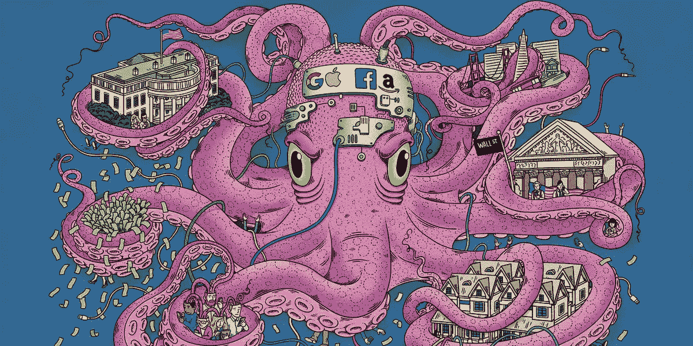
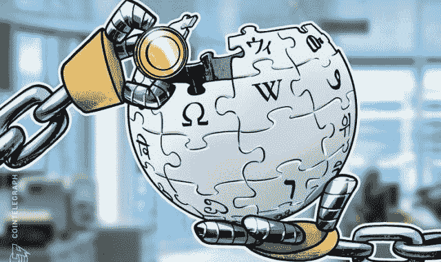
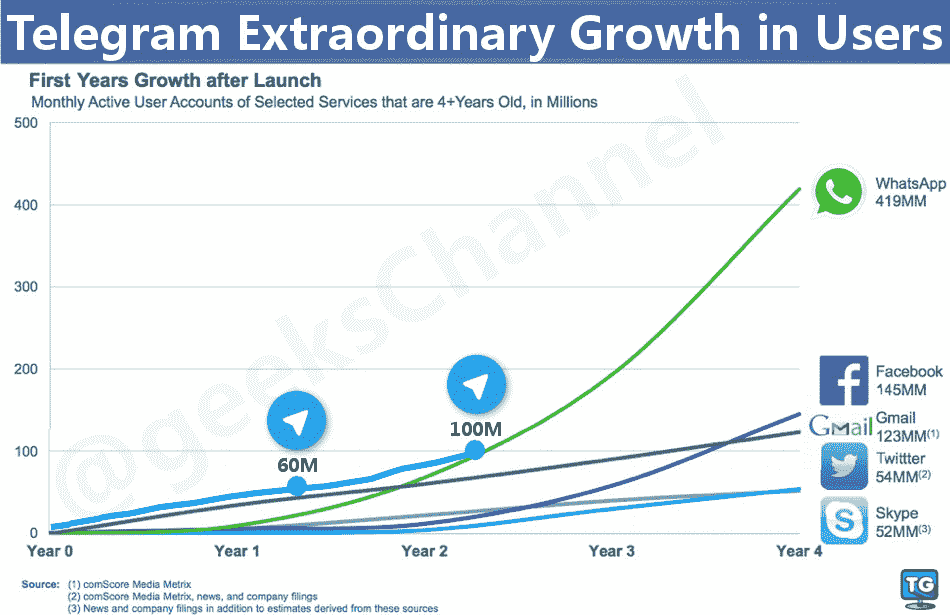
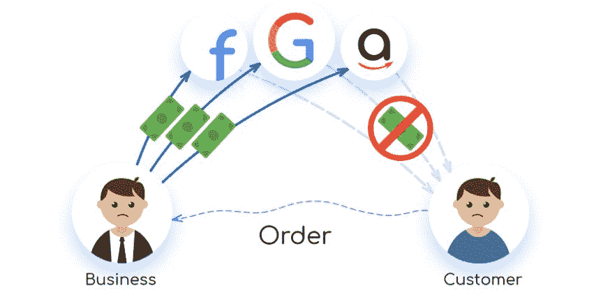
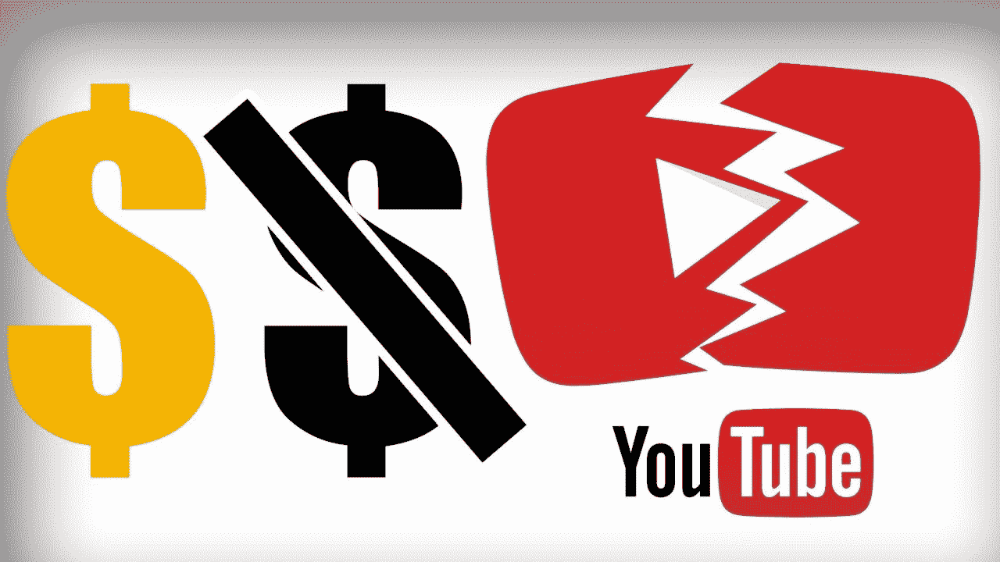
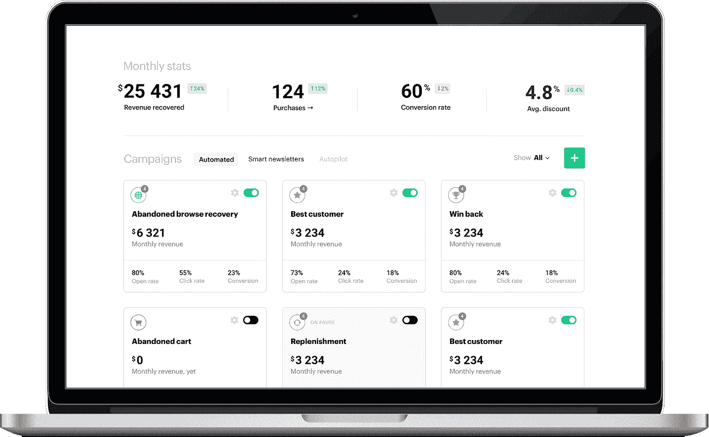

# 下一个谷歌、Youtube 和维基百科可以去中心化

> 原文：<https://medium.com/hackernoon/the-next-google-youtube-and-wikipedia-can-be-decentralized-bcb4051ee17f>

我们已经听到很多关于区块链解决方案可能成为下一个大事件的讨论。不只是一个大东西，而是替代我们目前拥有的所有大东西。下一个谷歌、脸书、亚马逊、苹果——它们都可能是分散的。

在不远的将来会发生吗？

也许不是。

因为这样的解决方案**已经存在**就排除这种可能性是愚蠢的。虽然大公司没有注意到，但初创公司创造了一系列分散的平台，这些平台都有可能解决大型数字垄断的问题。

# 事实上，维基百科已经面临挑战

几天前，去中心化的百科全书 Everipedia 上线了，这给维基百科带来了直接的竞争。因此，尽管维基的首席执行官“对 ico 毫无兴趣”，但这家初创公司选择了相反的策略，推出了 IQ tokens 来奖励为文章库做出贡献的用户。

Source: [https://cointelegraph.com/](https://cointelegraph.com/)

随着去中心化的实现，Everipedia 希望完全独立于广告或任何捐赠。ICO 可能会让 Everipedia 解决财务问题，并专注于平台的开发。

**这有什么关系？**

首先，这一次竞争对手得到了解读。让我们再次提醒一下，这家初创公司设法让维基百科的联合创始人拉里·桑格成为首席信息官。事情越来越严重了。

此外，这可能只是开始。谁知道明天哪个“下一件大事”会上线？尽管创业公司很可能不会在不久的将来赶上大公司，但这种情况可能会在 10-15 年内发生变化。也许更早。

# 不仅仅是维基百科

最奇怪的是，维基百科在这场斗争中并不孤单。无论你选择哪个领域，都有一个直接的区块链竞争对手在反对当前的利基领导者。让我们来看看主要的解决方案，看看它们可能会带来什么变化。

## **分散的社交媒体**

最近脸书的隐私丑闻再次提醒用户，传统的社交网络并不是休闲的最佳场所。在隐私紧张的浪潮中，分散的社交媒体出现了。他们中的一些人甚至开始获得牵引力。

说实话，分散交流的想法遭到了质疑。[在《连线》的文章](https://www.wired.com/story/decentralized-social-networks-sound-great-too-bad-theyll-never-work/)中，作者解释说，尽管分散的社交媒体永远不会奏效，但反对社交媒体的主要论点是:

> *现实是，大多数人不想运行自己的网络服务器或社交网络节点。他们希望通过更友好的平台参与网络，而这些平台将受到今天推动整合的同样力量的制约。*

诚然， ***人们还不习惯分散的数字网络*** 。然而，像 [Sapien](https://www.sapien.com/) 这样的创业公司仍然拥有他们的用户，而且在未来，这种情况很可能会有所改善。

> 即使我们在五年内不使用区块链社交网络，我们也可能在十年内使用它。我们不要排除这种可能性。

## **消息传递**

Telegram 在东欧的成功证明了 WhatsApp 并不安全。到目前为止，Telegram 是通信去中心化的最有效的实现方式之一，它肯定是有效的。

以下是证明 Telegram 影响力的几个数字:

你看到发生了什么吗？在第二年，Telegram 已经超过了 WhatsApp 在第二年显示的数字。这既是一个成功去中心化的伟大案例，也证明了如果区块链解决方案真的很棒，用户最终会使用它们。

## **分散搜索**

关于区块链是整个谷歌商业模式的直接竞争对手的说法并不新鲜。

*Shortly about the digital world. Pre-decentralization. Source:* [*http://bolbitcoin.blogspot.com/2017/07/bitclave-decentralized-search.html*](http://bolbitcoin.blogspot.com/2017/07/bitclave-decentralized-search.html)

不过，与其说“谷歌是去中心化的反面”这种抽象的东西，不如把重点放在这里的真实图景上，而不是一些未来的预测。

事实证明，去中心化的谷歌可能已经存在。很有前途的分散式搜索引擎 Presearch 已经在 ICO 预售中筹集了 16 00 万美元，看起来他们成为谷歌竞争对手的目标可能是合理的。

这样的搜索有潜力吗？是的。信不信由你，但是人们确实关心他们的隐私。谷歌在用户生活中的存在水平正在变得令人疲惫，越来越少的人愿意忍受它。

什么时候会发生？现在不会，也许五年后也不会。虽然十年后这可能会成为现实。

## **去中心化的 Youtube**

等等，谁需要去中心化的 Youtube？很多人都这样做，原因如下。作为一家被谷歌收购的公司，Youtube 分享了其“老大哥”的许多缺点，除此之外还有一些自己的缺点。

可以明显看到创作者已经对平台不满意了。如果有地方可去，他们中的许多人会喜欢去其他平台的可能性。另一方面，用户不会很好地点击 Youtube 广告，而且大多对此感到恼火。

类似 Youtube 的分散式解决方案，如 [DTube](https://d.tube/) ，通过承诺关键优势解决了这个问题:

*   没有集中审查。所有内容都将按用户排序。他们将根据反馈、评估和反应来决定什么属于平台，什么不属于平台。
*   对每个人都公平合理。分散平台将不得不寻找新的盈利解决方案，但他们承诺会透明地进行。每个人都将获得精确的货币化计算，公开展示。
*   免费广告。用户不喜欢他们的音乐或视觉体验被讨厌的广告打断。创作者可以在他们的视频中为产品做广告，对订阅者的反应负责。没有直接广告。

到目前为止，听起来不错。最棒的是，解决方案已经出来了。谁知道呢，也许他们中的一个真的会成为下一个 Youtube？

# **分散营销自动化**

像 Marketo、HubSpot 或众所周知的 MailChimp 这样的流行解决方案肯定有显著的优势，但它们都有一个共同的问题。这个问题当然是*集权*。

> 当企业主选择使用自动化软件时，他们也同意向第三方提供活动所需的所有敏感数据。

几年前，这还不是问题。然而现在，随着 [GDPR](/triggmine/triggmine-is-gpdr-сompliant-debcc2b524b) 的到位，公司开始更仔细地分析他们存储数据的位置和方式。他们中的许多人不准备仅仅通过同意一些隐私政策来将他们的客户信息传递给老大哥。

去中心化正好可以解决这个问题。事实上，这正是我们在 Triggmine 中所做的事情——一个分散的营销自动化平台，它将所有数据存储在客户的服务器上，而不会将其传递给第三方。将人工智能添加到组合中，我们创建了一个智能营销自动化工具，它可以提供战略洞察力，设置活动，并测量结果。

## 信任问题

我们已经提到，一个像样的产品有很好的信息支持，任何一种分散的公司都必须非常重视维护自己的声誉。看看我们在 [Triggmine](https://triggmine.io/) 用什么来证明我们在 [4XStake](https://stake.triggmine.io/) 商业模式中的合法性:

*   *购买低于票面价值 4 倍的 4XStake (300 000 TRG)的可能性*
*   *平台的扩张和有限的数量保证了对 TRG 股份的需求*
*   *40 个潜在合作伙伴(在签署 NDA 和合同阶段)和自己的工作产品*
*   *TRG 股份和 4XStake 的购买/出售的透明度由智能合同保证。*

去中心化的服务以高度的信任为前提，这就是为什么提供不仅仅是漂亮的图片，而是全面和透明的业务方法是至关重要的。

# **结论**

新的互联网，就像理查德·亨德里克斯在 HBO 的硅谷建立的那样，可能就要出现了。

它会让公司过时吗？也许不会，至少现在不会。但是 7 年、10 年、15 年后呢？一切皆有可能。

附言[关注我们的博客](/@triggmine)以获得更多关于像这样的分散化创新和区块链趋势的见解。