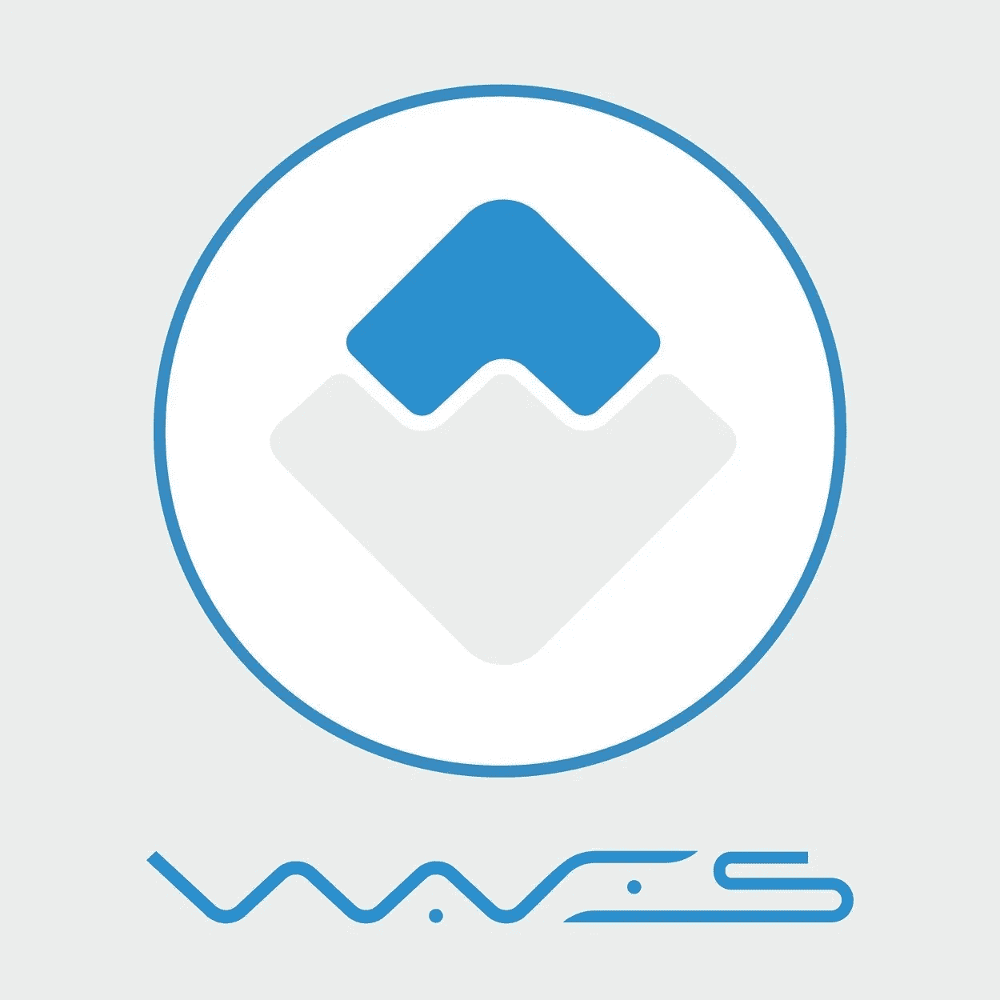

# 区块链的下一个层次:Waves 平台如何在密码世界掀起波澜

> 原文：<https://medium.com/hackernoon/the-next-level-of-blockchain-how-the-waves-platform-made-waves-in-the-cryptoworld-95d602ba9db3>

B**因其安全、快速、高效，已成为存储、交易、管理和发行数字资产的首选区块链平台。像[**behaviour exchange**](https://behaviour.exchange/)这样的加密初创公司用它来发布令牌，保证安全顺利的 ICO。**

# **波浪是如何工作的**

**虽然比特币和以太坊等加密货币可以在外部交易所交易，以太坊允许用户使用智能合约在平台上创建新的代币，但 Waves 在其核心软件和钱包中包含了这一功能。用户可以在对等的基础上创建、转移和交换区块链代币，用本地 WAVES 代币支付交易费用。**

**Waves 提高了块创建的有效带宽和速度，这对使用该平台的企业尤其重要，因为它允许**进行微交易**——没有传统区块链系统中常见的任何延迟。此外，它允许平台承受高负载，例如在众卖之后分发代币和空投奖励代币。Waves 分散式交易所(DEX)的交易处理速度也有所提高。**

# **传统区块链模型与波浪**

**财经记者罗杰·艾特肯在为《福布斯》撰写的一篇内容丰富的文章中写道，传统的区块链模型和 Waves 基于的 NG 模型之间存在差异。他解释说，在传统的区块链模式中，区块被发现的时间间隔大致相同，一旦矿商获得向网络提交交易的权利，最近的交易就会得到处理。因此，这从根本上限制了区块链的能力。然而，在 NG 模型中，下一个矿工是预先选定的。矿工创建一个“密钥块”，然后立即用包含事务的微块填充，这不需要进一步的工作证明。**

****

**在保持协议开放结构的同时，Waves 使交易能够在网络允许的情况下尽快得到确认。据称，Waves 的桩验证方法可以进一步提高速度，从而将容量提高一百倍甚至更多。**

**Waves 的首席执行官兼创始人亚历山大·伊凡诺夫在评论这一开发时说:“作为一个大规模应用的平台，我们应该能够支持高吞吐量的交易，同时保持强大的安全性，这一点至关重要。NG 为我们下一阶段的增长和我们能够支持的生态系统规模的逐步变化奠定了基础。”**

# **将 Wave 用于即将推出的 ICO**

**BehaviourExchange 将在 Waves 平台上推出其 BEX 代币，为代币贡献者提供两大好处:Waves 是最快的去中心化区块链平台，交易费用低。目前的 Waves 交易费为 0.001 WAVES，在撰写本文时为 0.01 美元。通过大量有用的小程序，如浏览器水龙头和网络水龙头，该平台将使[行为交换](https://behaviour.exchange)在代币销售后快速实现路线图目标。你可以在 [**行为交换白皮书**](https://behaviour.exchange/wp-content/uploads/2017/11/BEX_Whitepaper.pdf) 中找到更多信息。**