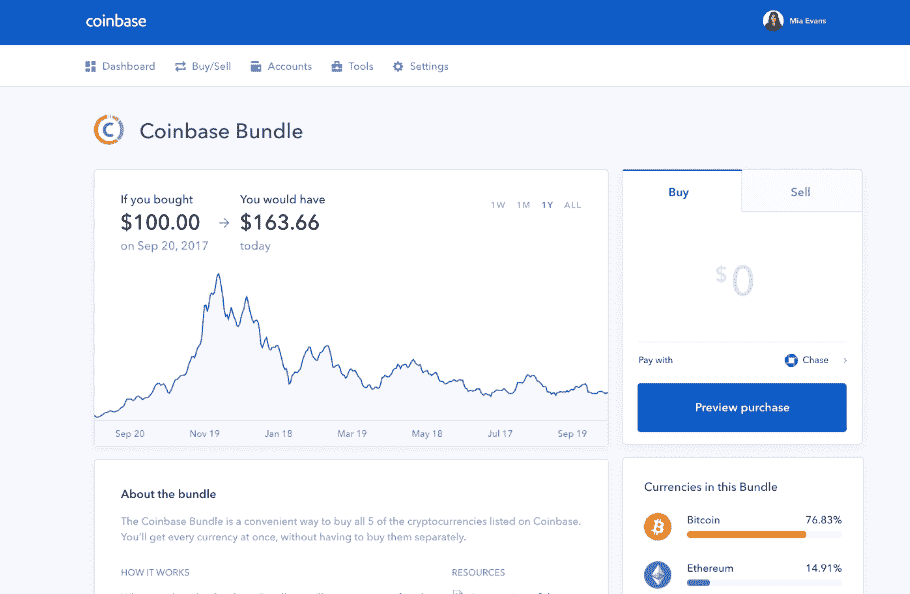
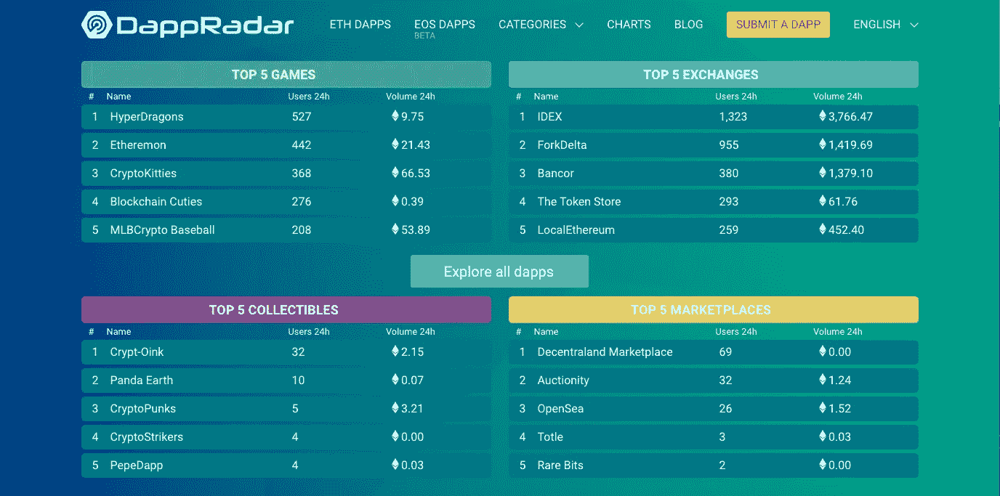

# 加密的下一阶段:价值来源

> 原文：<https://medium.com/hackernoon/the-next-stage-of-crypto-source-of-value-689dea43fb7d>

围绕比特币从数字货币向价值储存手段的转变，有很多讨论。密码市场由投机者和赚钱的利益集团主导，到目前为止，这一直是我们行业中许多人的主要驱动力。但是对于我们这些试图构建金融未来的人来说，重点必须从价值储存的思维模式转移到价值来源的 T2 思维模式。

密码行业的未来将依赖于两种项目:一种是专注于创建进入生态系统的简单入口，另一种是提供比现有产品更多价值的项目。人们不会仅仅因为某样东西使用了区块链就采用它。一定会更好。这个想法虽然宽泛，但却是加密生态系统发展的最大障碍。

# **诬陷往事**

迄今为止，加密生态系统大致经历了两个主要阶段。第一个始于基础协议——主要是比特币和以太坊。在这个“基础设施时代”(想想 2013 年之前)，我们作为一个社区专注于区块链理工的基本原则:可访问性、速度和可负担性。由此衍生出像比特币基地这样的项目，使得那些寻求参与成长中的区块链运动的人更容易接触到加密技术。有史以来第一次，世界上的任何人都可以用最实惠的方式向世界上的任何人汇款。这是一个巨大的进步，我们中的许多人很快团结起来支持它。

接下来是“应用时代”，从 2013 年持续到 2018 年年中。在这里，我们看到了以太坊的第一个大应用——初始硬币发行(ICO)。因此，我们看到像 dApp 生态系统这样的东西开始蓬勃发展。随着以太坊的发展，随着 ico 的流行度飙升，投机也在增长。当时，许多 ICO 项目的重点不是开发产品，而是发展大规模的在线追随者社区，作为营销人员的网络，所有这些都有助于传播他们最喜欢的项目。许多这样的公司因此筹集了数千万美元。

这些工具中的绝大多数都过于专业，普通消费者难以理解。你能用两句简短的话向街上的一个随机的人解释如何使用 hardwallet 吗？那个人为什么要关心你的协议解决方案的技术进步呢？

最近，@ cryptoshilnye 恰如其分地指出——密码领域的建设者需要更多地关注用户，否则这项技术毫无意义。

# **可用性&作为价值驱动因素的信息**

随着熊市的全面展开，提醒人们一项技术获得主流采用需要临界质量比以往任何时候都重要。一般人不会单纯因为某个东西用了区块链技术就采用它。对他们来说，它需要简单，需要好看，最重要的是——它需要有用。

比特币基地在我们的行业中扮演着重要的角色，不仅是市场领导者，也是美国首次加密投资者的首选交易所。它们是市场上第一个采用用户友好的登录流程的交易所，使用了消费者已经熟悉的视觉设计。这种简单性提供了反馈整个加密行业的价值。一旦人们购买了比特币或以太币，他们就可以继续交易替代币，使用 dApps，参与 ico，甚至获得加密资产支持的贷款。但是——它们需要首先融入生态系统。

Coinbase‘s ability to simplify their products through design is a huge driver of value.

提供卓越的消费者价值是有道理的。尽管费用很高，但比特币基地一直能够保持其作为美国最方便用户的交易所的地位。这是为什么呢？因为他们的平台看起来很好看，很好用，也很管用。

价值驱动者不一定是赚大钱的人。像 [CoinMarketCap](https://coinmarketcap.com/) 、 [Etherscan](https://etherscan.io/) 和 [DappRadar](https://dappradar.com/) 这样的项目紧跟行业脉搏，提供驱动生态系统生命力的重要信息。它们是密码世界的维基百科和谷歌搜索，为从交易员到教育者的每个人提供无价的价值。

[DappRadar](https://dappradar.com/) provides volume and user data on Ethereum and EOS dApps.

即使是像 [BlockFi](https://blockfi.com/) 这样的公司，一家加密到美元的贷款公司，也通过为加密投资者转换现有的传统金融产品来为消费者创造价值。当考虑到这为全世界的个人提供的价值时，以债务和信贷的形式增加加密生态系统中的可用流动性尤其重要。这意味着它们可以将低成本信贷期权和美元计价借款与新兴零售市场联系起来，而这在过去是从未有过的。这具有使加密资产本身更有价值的效果，并增加了长期的效用。

加密货币行业的未来是光明的，但大规模采用的路径尚不明朗。显而易见的是，创始人、开发者和营销人员需要开始考虑消费者中简单和熟悉的力量。对于生态系统的未来，充分利用区块链技术的唯一方式是将我们的优先事项从*价值储存*转变为*价值来源*思维。