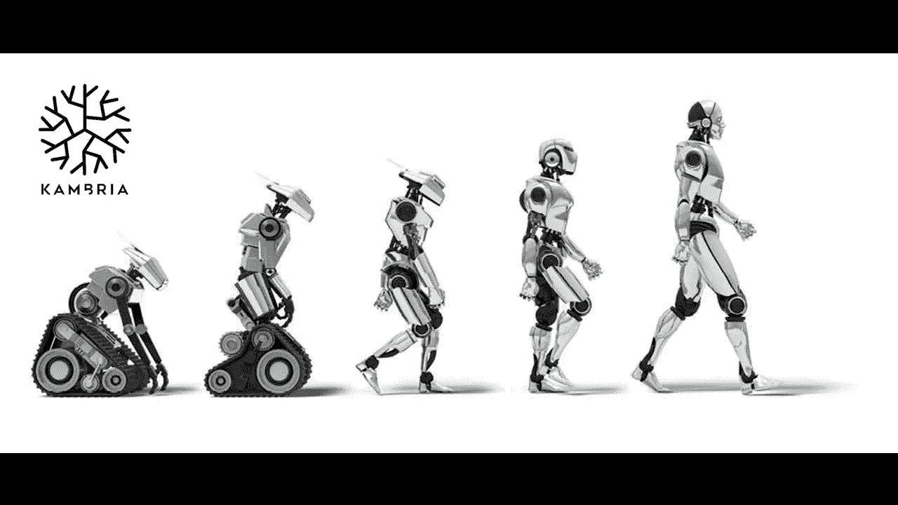
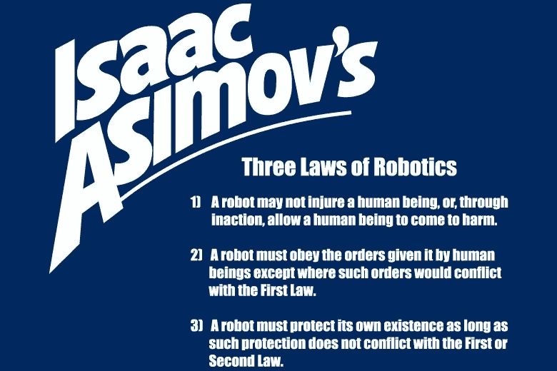
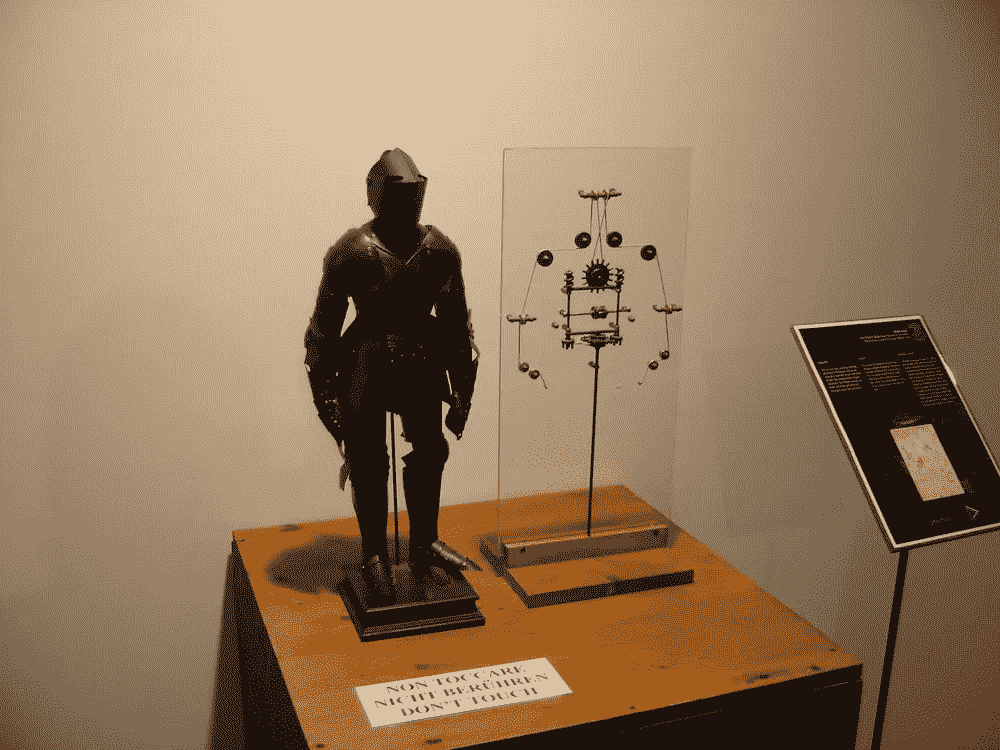
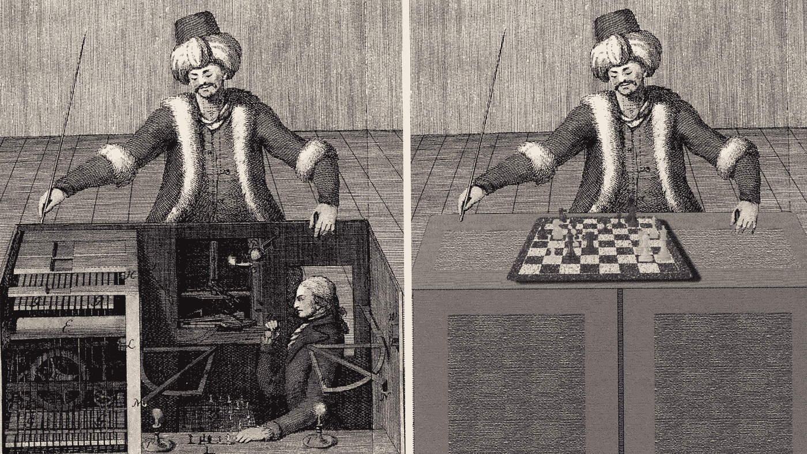
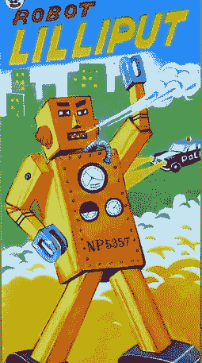
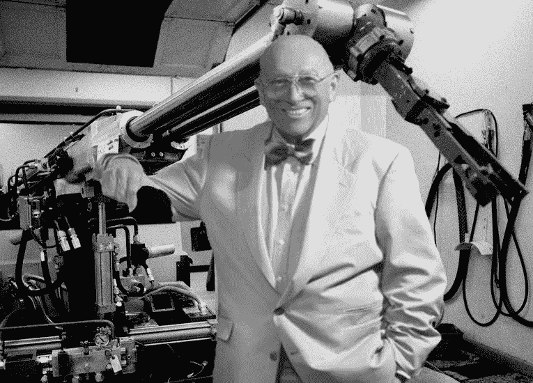
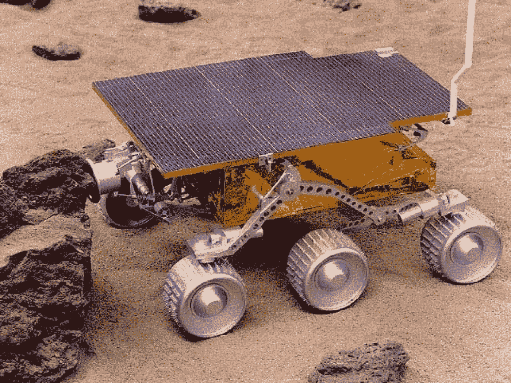
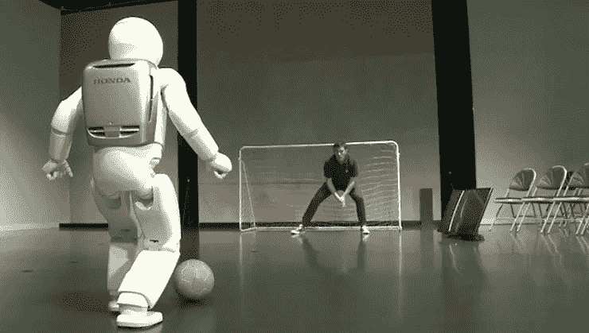
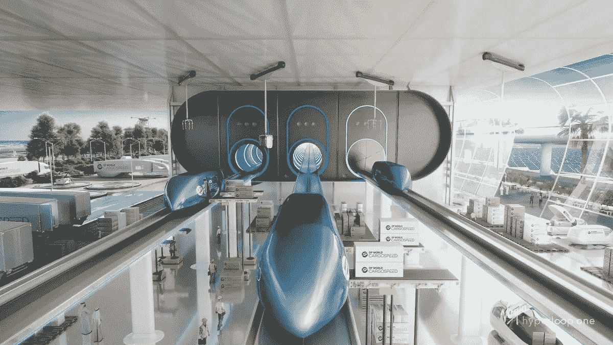
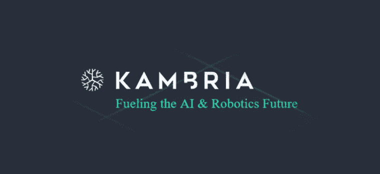

# 机器人和人工智能进化的下一步

> 原文：<https://medium.com/hackernoon/the-next-step-in-the-evolution-of-robotics-and-artificial-intelligence-97b249a0df88>

当想到机器人和人工智能(AI)时，我们大多数人都会想到《星球大战》传奇人物 R2D2 和 C3PO 的原型图像，或者我个人最喜欢的童年坏蛋终结者。虽然科幻文学和电影为机器人提供了展示其令人敬畏的潜力的舞台，但它们也经常描绘出一幅反乌托邦世界的画面，机器人成为有自我意识的存在，反抗并最终压制人类。如果很多人真的对机器人在未来接管世界感到焦虑，我不会感到惊讶。幸运的是，现在还不是这样，现在机器人被用来执行各种日常或复杂的任务。目前，机器人可用于执行各种任务，如:手术、陪伴老人、扩散炸弹和太空探索。因此，机器人可以拯救生命，并执行人类无法执行的过于复杂或危险的任务。在这篇文章中，我想带你进行一次冒险，看看机器人和人工智能的有趣历史。

# **如何定义术语机器人**

机器人有很多不同的定义；但也许最简单也是最准确的定义是:“*机器人是一种机器，尤其是可由计算机编程的，能够自动执行一系列复杂动作的机器。*

“机器人”一词最初是由捷克人[卡雷尔·恰佩克](https://en.wikipedia.org/wiki/Karel_%C4%8Capek)在戏剧 *R.U.R.* ( [罗森公司的通用机器人](https://en.wikipedia.org/wiki/Rossum%27s_Universal_Robots))中创造的，起源于 1920 年。 *R.U.R.* 是一部讽刺剧，讲述的是以执行所有令人不快的体力劳动为唯一目的而制造的机器人。这个词源自捷克语单词 *robota* ，意为奴役。1942 年，科幻小说作者[艾萨克·阿西莫夫](https://en.wikipedia.org/wiki/Isaac_Asimov)制定了[机器人三定律](https://en.wikipedia.org/wiki/Three_Laws_of_Robotics)，它们是:

# **第一次遭遇**

也许机器人技术的最早实例可以追溯到公元前 1500 年。在此期间，埃及人开发了所谓的水钟。水钟测量时间是因为水以恒定的速度流过水钟，并使用人体雕像来敲响钟点。在阿蒙霍特普一世墓中发现的最古老的水钟可以追溯到公元前 1500 年。

公元前 350 年，希腊数学家阿尔库塔斯发明了“鸽子”，这是一种可以通过蒸汽推进空中的机械鸟。另一个众所周知的自动化是达芬奇在 1495 年画的人形机器人。列奥纳多·达·芬奇画的是一个穿着盔甲的机械[骑士](https://en.wikipedia.org/wiki/Knight)，他可以坐起来，移动头部和下巴，挥动手臂。

Da Vinci’s mechanical knight

我个人最喜欢的机器人尝试是由沃尔夫冈·冯·肯佩兰制造的[机械土耳其人](https://en.wikipedia.org/wiki/The_Turk)，它基本上被设计成一个可以下一盘很强的象棋的机器人。在 18 世纪末和 19 世纪，这台机器在整个欧洲巡回演出，打败了许多挑战者，包括拿破仑·波拿巴和本杰明·富兰克林。最终，土耳其机器人被证明是一个骗局，一个真正的人类象棋大师藏在车厢里操作机器。

the Mechanical Turk Chess Engine

据说第一个人形机器人是由弗里德里希·考夫曼在 1810 年制造的，代表一个吹小号的士兵。考夫曼小号手用皮风箱充当肺和簧片来模仿小号的声音。在当时，这是相当壮观的。

**20 世纪的进步**

第一次世界大战期间部署了遥控武器。最值得注意的是尼古拉·特斯拉，他设计并制造了一艘可以通过无线电信号遥控的电动船。

1932 年，小人国被引入日本，被认为是第一个玩具机器人。小人国是一个 15 厘米高的发条玩具，可以四处走动。在日本，对机器人的热爱与日俱增，在 20 世纪 50 年代，机器人成为了著名的漫画人物。也许最具代表性的是铁臂阿童木。

由于 20 世纪 40 年代可编程计算机的进步，我们今天所知道的机器人开始成形。乔治·德沃尔将发明 [Unimate](https://www.robotics.org/joseph-engelberger/unimate.cfm) ，这被认为是第一个工业机器人，也是机器人进化过程中最重要的里程碑之一。Unimate 能够运输压铸件并将其焊接到汽车上，并通过 Joseph Engelberg(他后来获得了“机器人之父”的绰号)加入了通用汽车公司的装配线。

Joseph Engelberg, the father of robotics

20 世纪 70 年代和 80 年代的特点是新的进步，并产生了一些项目，如: **Shakey** ，这是第一个能够根据自己的动作进行推理的通用移动机器人。Shakey 能够执行任务，例如:从一个地方旅行到另一个地方，打开门和推动周围的障碍。**斯坦福手臂**将成为未来机器人手臂设计的标准，并最终催生了第一个用于外科手术的医疗机器人 **Puma350** 。Puma350 的任务是在脑活检过程中确定针的方向，但出于安全原因，它被中断了。

机器人历史上的另一个重要里程碑是火星漫游车的开发。火星漫游者是火星探路者任务(1997 年)的一部分，建造它是为了在火星表面执行半自动操作。配备了避障程序，火星漫游者能够规划和导航穿越地形的路线，以便研究星球的表面。

Mars rover Sojourner

同年 [IBM](https://en.wikipedia.org/wiki/IBM) 的[深蓝计算机](https://en.wikipedia.org/wiki/Deep_Blue_(chess_computer))成为第一台在锦标赛条件下击败国际象棋世界冠军(在这里是加里·卡斯帕罗夫)的计算机。值得注意的是，谷歌的 AlphaGo 在 2015 年击败了世界级围棋选手 Lee Sedol([alpha GO 对 Lee Sedol](https://en.wikipedia.org/wiki/AlphaGo_versus_Lee_Sedol) )，使用了神经网络和强化学习；而以前计算机只能打败业余围棋手。

# **2000 年至今**

在过去的二十年里，机器人和人工智能领域的技术有了很大的提高，出现了很多有趣的项目。太多了，无法一一列举，所以我选择了一小部分来代表当前的进展。

**，在[9·11](https://mashable.com/category/september-11/)袭击的余波中，倒塌的建筑太危险了，限制了人或狗的行动。小型打包机器人(由 iRobot 制造)用于确定建筑物的结构状况，并在废墟中寻找幸存者。**

**[**ASIMO 机器人**](http://world.honda.com/ASIMO/technology/2000/index.html) ，2000 年本田给我们带来了 ASIMO，它的设计目的是提高机器人的机动性，让它能够平稳地行走和爬楼梯。新版本的 ASIMO 甚至能够奔跑、转弯、在不平坦的表面上导航、绘制环境地图、避开障碍物、够到并抓住物体，甚至识别人脸。**

****

**ASIMO playing soccer**

**[**Roomba**](http://www.irobot.com/us/Company/About/Our_History.aspx) ，iRobot 制造的另一款机器人是 Roomba。Roomba 可以被认为是第一个广泛使用的家用机器人，在没有主人任何指示或帮助的情况下，骑在房子周围用吸尘器清扫地板。**

**[**机器人外科医生**](http://phys.org/news67222790.html)2006 年 5 月，一个集成了来自 10000 次真实手术的数据的机器人对一名 34 岁男子的心脏进行了一次无辅助、50 分钟的手术。**

****交通运输行业**，交通运输行业可以大大受益于技术进步，比如:城市空中机动、无人机和自动驾驶汽车；使交通更加安全，减少交通堵塞。我想强调的两个有前景的项目是: [Hyperloop One](https://hyperloop-one.com/) 和 [Pop.up NEXT](https://www.italdesign.it/project/popup/) 。Hyperloop 的目标是成为有史以来最快的陆地交通工具，预计最高时速为 1080 公里。**

****

**Design of the Hyperloop.one**

**接下来出现的是一种模块化车辆，既能进行地面运输，也能进行空中运输。车轮启动后，车辆的功能与汽车相同；但是当飞行模块被连接上时，飞行器也可以像直升机一样工作；点击[此处](https://youtu.be/L0hXsIrvdmw)观看视频。**

**[**索菲亚**](https://en.wikipedia.org/wiki/Sophia_(robot)) **，**是仿照女星[奥黛丽赫本](https://en.wikipedia.org/wiki/Audrey_Hepburn)设计的，特点是具有类似人类的外貌和行为，比以前的机器人实体更先进。Sophia 使用人工智能、视觉数据处理和面部识别来模仿人类的手势和面部表情，旨在随着时间的推移变得更加智能。索菲娅还能够进行简单的对话，回答各种问题。**2017 年 10 月 25 日，索菲亚被授予沙特阿拉伯公民身份，成为第一个拥有国籍的机器人。虽然这很酷；这也提出了一些问题，如这是否意味着索菲亚有资格投票或结婚，或者是否故意关闭索菲亚的系统可以被视为谋杀。退一步说，这是非常有趣的精神食粮。****

********

****Say hi to Sophia****

# ****坎布里亚，下一步进化？****

****虽然机器人和人工智能领域正在发展，但许多知识仍然孤立存在，导致类似的项目进行相同的研究和开发。机器人和人工智能行业的发展可以受益于开发者之间的更多合作。 [Kambria Network](https://kambria.io/) 旨在通过建立一个开放的创新平台来颠覆机器人和人工智能行业，该平台将加速行业的发展，实现更快、更便宜、更容易的技术开发和采用。****

## ****坎布里亚****

********

****坎布里亚提出了一个基于区块链的平台，激励贡献者在坎布里亚网络的本地 KAT 令牌的帮助下为平台加油。Kambria 是由机器人和人工智能制造公司 [OhmniLabs](https://ohmnilabs.com/) 发起的，该公司开发了网真机器人 Ohmni。通过使用 3d 打印技术和简化迭代设计，OhmniLabs 为全球客户提供了一种负担得起的远程呈现机器人。在 Ohmni 工作时，团队注意到他们浪费了宝贵的时间和资源，因为他们正在研究其他公司或大学研究实验室已经做过的事情。****

****这个问题导致他们开始坎布里亚。通过分享思想、想法、研究、设计并激励那些为 Kambria 平台做出贡献的人，该行业可以变得更加高效、发展更快并降低总体成本。****

## ******五大支柱******

****坎布里亚网络由以下[五大支柱](/swlh/kambria-creating-a-new-paradigm-by-launching-an-open-innovation-ai-and-robotics-platform-39cc0980dc25)组成:****

****-KDNA 代码库:该平台的基础是 Kambria 代码库或 KDNA。代码库包含建造机器人所需的所有信息、软件、固件、硬件和人工智能。****

****-制造联盟(KMA):代码库将得到制造联盟的支持，它允许人们在 KDNA 代码库的帮助下原型化和制造机器人。****

****-创新奖金市场:在创新市场中，制造商可以提供机器人零件来换取奖金，或者感兴趣的各方可以发起一项基于奖金令牌的众筹活动，开发者可以根据他们的需求制造机器人。****

****-法律保护:社区将共同保护违反证明(PoV)标准的创新平台。除了法律保护之外，还将出台一项公平使用政策，其中包括针对社区成员的条款和条件。免费搭车者将被以适当的方式处理。****

****-价值获取:该功能将使用 KAT 令牌为平台带来价值，从而可以保证寿命，并且项目不依赖于捐赠。各种价值点将被创造出来。例如，当机器人被制造时，在价值点发生之后，费用将被强制执行，并且收集的 KAT 令牌将被支付给制造商(最大部分)和进入社区保留地(小部分)。****

****看到机器人技术的发展将采取新的步骤将是有趣的，而且 Kambria 平台有可能通过促进研究人员、开发人员和制造商之间的合作来加快下一步的发展。****

******坎布里亚社交媒体**网站:[https://kambria.io/](https://kambria.io/)****

****白皮书:[https://bit.ly/2y7eckC](https://bit.ly/2y7eckC)****

****电报(英):[https://t.me/kambriaofficial](https://t.me/kambriaofficial)****

****推特:[https://twitter.com/KambriaNetwork](https://twitter.com/KambriaNetwork)****

****中:[https://medium.com/kambria-network](https://medium.com/kambria-network)****

********

*******免责声明*** *:本文不作为投资建议。这只是我个人对坎布里亚的看法。你应该总是做自己的研究#DYOR。坎布里亚激励我写这篇文章，并鼓励我表达自己的观点*。****

****如果您喜欢我的文章并希望了解区块链、加密货币和新闻，请订阅我的频道: [Medium](/@cultcrypto) 、 [Twitter](https://twitter.com/CryptoShowdown) 和 [Steemit](https://steemit.com/@cryptoshowdown) 。也可以看我在 [LinkedIn](https://www.linkedin.com/in/donjohanson/) 上的文章。****

****如果你对这篇文章有任何问题，请在下面的评论区评论。掌声也欢迎，谢谢！****

******密码摊牌******