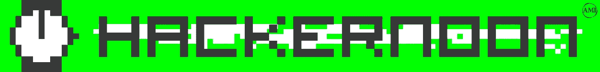

# 下一个 Web + Hacker Noon 合作伙伴

> 原文：<https://medium.com/hackernoon/the-next-web-hacker-noon-partnership-433f8d6fd5ab>

下一个网络——俗称 TNW——自 2006 年以来一直在分享、发明和推进技术发展。TNW 开始给技术世界带来洞察力和意义——时不时地，就像他们所说的 lulz。我已经读了好几年了。当我在创业领域的另一边时，我给他们讲故事。TNW 提供了深刻的见解，突破性的故事，并愿意报道[这家想用乌鸦清除城市烟头的初创公司](https://thenextweb.com/artificial-intelligence/2017/10/06/1082787/#.tnw_QymiMkil)(是的，这家鸟遇到了机器学习初创公司是这一合作关系的第一个重新发布的故事)。TNW +黑客正午的合作伙伴是:

## 每周一次，TNW 将重新发布一个热门的黑客中午故事，黑客中午将重新发布一个热门的 TNW 故事。

太刺激了！我们策划出版的 TNW 故事可以在 hackernoon.com/tnw****找到。****

**我推荐本周阅读的 12 个科技故事是这种合作关系的前 12 个再版故事。**

****

## **在下一个网站上重新发布的前 6 篇黑客午间故事:**

*   **[**谷歌眼镜和赛格威失败是因为他们忘记了人类**](https://thenextweb.com/syndication/2017/12/23/google-glass-segway-failed-forgot-humans/) 作者[大卫·瑞安·波尔加](https://medium.com/u/120eb8d22cf9?source=post_page-----433f8d6fd5ab--------------------------------)**
*   **[**下面是如何在 7 分钟内黑掉 40 个网站**](https://thenextweb.com/syndication/2017/12/25/heres-hack-40-websites-7-minutes/) 作者[圣乔治孔斯坦托普洛斯](https://medium.com/u/4c26a75f4164?source=post_page-----433f8d6fd5ab--------------------------------)**
*   **[**人工智能武器将改变战争——它们无法被阻止**](https://thenextweb.com/syndication/2018/01/03/ai-weapons-will-transform-war-cant-stopped/) 丹尼尔·杰弗里斯**
*   **[**您的银行可能正在对您使用网络钓鱼战术**](https://thenextweb.com/syndication/2017/12/25/bank-probably-using-phishing-tactics/) 作者[邓肯·瑞奇](https://medium.com/u/a6fcad104abf?source=post_page-----433f8d6fd5ab--------------------------------)**
*   **[**比特币需要准备来自银行和政府的攻击**](https://thenextweb.com/syndication/2017/12/26/bitcoin-needs-prepare-attack-banks-governments/) 作者[丹尼尔·杰弗里斯](https://medium.com/u/618a7c78c957?source=post_page-----433f8d6fd5ab--------------------------------)**
*   **[**为什么我不关心网络中立，或者我们国家的未来**](https://thenextweb.com/syndication/2017/12/13/dont-care-net-neutrality-countrys-future/) 作者[惠特尼·米尔斯](https://medium.com/u/d151cd4ba000?source=post_page-----433f8d6fd5ab--------------------------------)**

**《TNW》主编亚历杭德罗·陶贝尔说:“我们很高兴能与 Hacker Noon 交流我们的一些故事，因为越多的人阅读我们出版物上发布的所有酷而有趣的故事，就越好。”。“我相信媒体不是零和游戏，无论平台如何，读者都应该看到最好的东西——这种合作关系是为更多读者提供更多精彩故事的完美方式。”**

****

## **第 6 卷[下一篇网络故事刊登在黑客正午](http://hackernoon.com/tnw):**

*   **海盗湾的创始人说:“我们把所有的数据都集中到一个叫马克·扎克伯格的人那里。**
*   **[**谷歌的 AI 能做出比谷歌人更好的 AI 吗？**](https://hackernoon.com/can-googles-ai-make-better-ai-than-the-googlers-947bd1464248)**
*   **[**科技中更好的东西:男人当众撒尿时的智能广告**](https://hackernoon.com/the-finer-things-in-tech-smart-ads-while-men-pee-in-public-50d93183e894)**
*   **机器能训练乌鸦捡起你城市里的每一个烟头吗？**
*   **[**比特币挖矿真的比整个国家消耗的电力还多吗？**](https://hackernoon.com/does-bitcoin-mining-really-consume-more-electricities-than-entire-countries-fde32e152941)**
*   **[**维基百科联合创始人将百科放在区块链上**](https://hackernoon.com/wikipedia-cofounder-to-put-the-encyclopedia-on-the-blockchain-b56d21901039)**

**如果你想看更多的书，你是主宰。以下是黑客正午的十大故事[**11 月**](https://hackernoon.com/archive/2017/11/20)**[**12 月**](https://hackernoon.com/archive/2017/12) **和**[**1 月(至今)**](https://hackernoon.com/archive/2018/01) **。******

****这是基于我们最近与 Quora 的合作关系。对于我们的读者来说，这是将技术的最佳视角带到 Hacker Noon 的又一步。对于我们的特约作者来说，这是增加他们故事的触及面、共鸣和影响力的又一步。对我来说，与另一个我曾经只是另一个读者的网站合作是非常令人兴奋的。****

****如果你对相关的数字出版合作伙伴感兴趣，请发电子邮件至 Partners@AMiPublications.com。和往常一样，我们在 Stories@AMiPublications.com 通过电子邮件收听故事[。](mailto:Stories@AMiPublications.com)****

****直到下一次，不要把世界的现实想当然。****

****亲切的问候，****

****[大卫·斯穆克](http://www.davidsmooke.net/)，[@阿米](http://twitter.com/ami)****

****【附页】 [**读 hackernoon.com/tnw**](http://hackernoon.com/tnw)****