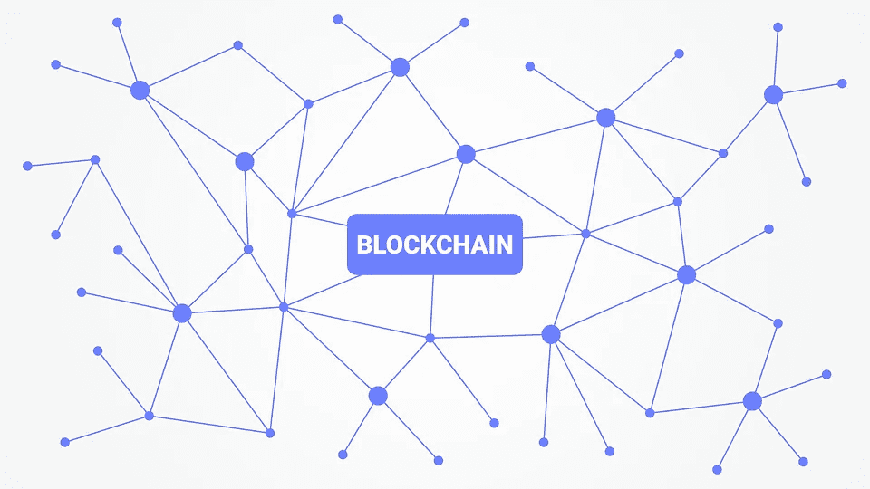

# 区块链的简单介绍

> 原文：<https://medium.com/hackernoon/the-no-frills-intro-to-blockchain-5a007917d6f2>

不久前，有一个非常新的东西叫做互联网。这是一个只有少数人理解的概念。这些少数人知道它的潜力和它可能如何运作，但所有其他人都不知道会发生什么。

快进到今天…人们不需要任何形式的技术教育就能理解互联网是什么或它的基本用途。在某种程度上，我以同样的眼光看待区块链。这是一个发展中的概念，目前难以理解，但有可能成为 21 世纪的突破性技术。

所以，我将尽力帮助你，一个普通的简或无名氏，理解这种新生的[技术](https://hackernoon.com/tagged/technology)是什么。

区块链是一个数据库。是啊…长话短说(Ikr！).但是什么是数据库呢？你可能会问……数据库由行和列组成，计算机在其中记录信息——有点像 excel 表格。自从有了计算机，我们就有了数据库。区块链的区别在于它是什么类型的数据库。

区块链是一个分布式、开放、不可变(不可编辑)的数据库。作为一个数据库，它的一些独特之处在于:

*   它是公开的(任何人都可以看到条目)，但不能编辑，
*   一个由独立人士组成的网络维护着它。虽然技术上没有人能控制它，
*   这是一本账本。值得注意的是，价值并不储存在区块链上。以比特币为例。比特币本身并不储存在区块链上！交易记录存储在区块链上。比特币会在你的钱包里。

# **我们为什么需要区块链？**

让我们来看一个场景……所以你在脸书的数据“坐落”在脸书的数据中心。当您尝试登录您的帐户时，会发出一个请求。然后脸书把它端给你。通过签署服务条款，你就同意他们会保护你的数据安全。防止任何人非法获取这些信息。假设这一切都是有意义的，所有正常的因素都是可以实现的。事实是，这种观念可能很快就会失去影响力…

目前，我们信任一个中央政党。我们相信脸书和谷歌会保护我们的数据安全。如果我们纳税，我们相信政府会制定适当的法律。我们相信中央银行发行货币并决定货币政策。最后，我们相信银行会保护我们的钱的安全。

这些系统存在风险。中央党拥有过大的权力，有时垄断了记录/数据库。对银行来说，这意味着巨大的安全风险和中央集权的实际垄断定价权。这就是汇款、信用卡和银行手续费如此昂贵的原因。

回到过去，我们一直拥有中央集权。国王控制着土地的财富，并向他们纳税。事实上，只要地球存在，我们就会有某种形式的中央集权。然而，近年来对政府和企业信任度的下降表明，在这些机构之上建立一个更透明的层面并不是一个坏主意。区块链可以帮助实现这一目标..

## **首先，分发…**

区块链是以没有任何一方处于控制中的方式构建的。没有一台服务器负责，因为它以点对点的方式分布在整个网络中。因此，与其说共识和数据完整性掌握在一方手中，不如说我们让它分布在受一组规则约束的所有各方之间。

## 第二，它有矿工！

你可能听说过他们(这些矿工)。他们只有一项工作…验证通过网络的交易，确保有效性并添加到数据库中。区块链通过奖励他们铸造的代币(比特币、以太坊等)来感谢他们。

## 正在验证什么？

当一个人发送比特币时，区块链会将该交易与其他几笔交易集中到一个区块中。在将该区块添加到区块链之前，需要确认该交易。这整个过程就是矿工所做的。

矿工不会免费完成这项任务，因此奖励形式为一个比特币单位。那么，我们如何确定一种公平的方法来选择完成这项任务并获得报酬的矿工呢？你可能会想。矿工们在互相竞争，并被分配了一项任务。

这个任务是一个叫做工作证明的算法。矿工需要计算机解决的是数学。如果某个矿工的电脑先解决了它，那个矿工就创建一个新的区块。然后向整个网络宣布他/她的解决方案，并依次获得新创建的比特币单位作为奖励。每个人都赢了。

除了比特币之类的用例，我们还可以在社会的其他场景中采用区块链技术，在这些场景中，价值、激励和交换是一致的。

*“关心的第一步是理解区块链只是幕后代码。仅此而已…你不需要成为知道如何为它编码的人，但是你需要知道它可以影响的系统变化的类型。你确实需要知道它会扰乱哪些行业。如果你想让未来的系统为你服务，就把你自己包括在区块链吧”。— QZ*

作为一项新技术，还有很多东西需要学习，所以，接受 QZ 的建议，把你自己也包括在区块链吧:)

## 名词（noun 的缩写）B

*比特币是* ***不是*** *区块链。比特币利用了区块链技术/协议。值不存储在区块链上。以比特币为例，你拥有的比特币不是储存在区块链上，而是在你的钱包里。区块链上的是交易记录。因此，它常被称为分类账。*

感谢[黑兹尔·阿潘迪](https://twitter.com/apondihazel)阅读了这篇文章的草稿

我在我的每周时事通讯中写关于风险投资和金融科技的文章。你可以在这里报名