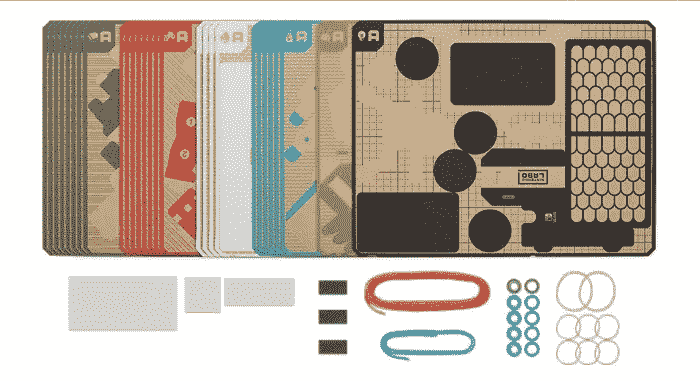
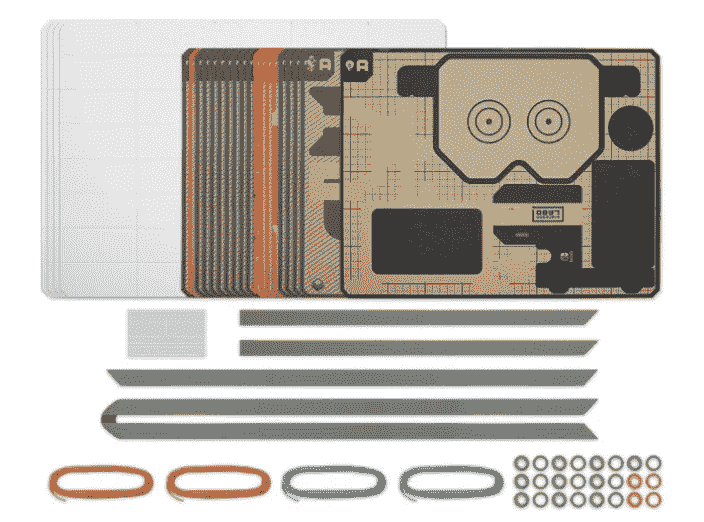

# 任天堂 Labo 的明显性

> 原文：<https://medium.com/hackernoon/the-obviousness-of-nintendo-labo-657335d82569>

该死，任天堂又来了。

这就像如果他们开始试图建立一个克隆的[谷歌 Cardboard](https://vr.google.com/cardboard/) ，其中开关取代了电话，但后来他们没有制造虚拟现实耳机，而是制造了*字面上任何不是耳机的东西*。

*   一根钓鱼竿？*是的。*
*   一辆摩托车？*好吧！*
*   一架钢琴怎么样？*当然！*
*   好吧，但是遥控玩具机器人汽车肯定不是一个选项。*有何不可？*

我最喜欢的一个关于 Wii 的故事是这样的:[任天堂](https://hackernoon.com/tagged/nintendo)观察到他们的传统游戏控制台经常被一个孩子连接到客厅的电视上。这个家庭是由一位家长管理的，他不喜欢电子系统和各种杂乱的电缆在一个整洁的客厅里突然造成的混乱，所以他们会把游戏控制台放在一个不显眼的地方(比如电视下面)，把游戏控制器和相关的电缆藏在抽屉或其他看不见的地方。这是我妈妈做的。

与此同时，电视遥控器就放在咖啡桌上。所以任天堂就纳闷了:为什么电视遥控器可以出，而控制器却不行？

因此，Wii 遥控器就存在了:由于其人体工程学和多功能性，在许多方面都是一个奇妙的设计，但在我看来，尤其是考虑到它作为电视遥控器的形状似乎与该公司对其产品使用情况的观察直接相关。他们想知道，也许通过让它看起来像电视遥控器，不看电视的父母可能会喜欢上我们的设备？

今天任天堂宣布了 Labo，这是一种“新的游戏方式”, 任天堂 Switch 针对的是孩子和“内心是孩子的人”。你可以看看网站或者[看看公告预告片](https://www.youtube.com/watch?v=P3Bd3HUMkyU)了解一下是什么。我就说说为什么我觉得它很棒。

## 虽然看起来很奇怪，但这可能是任天堂的 VR 游戏

多年来，宫本茂一直表示任天堂正在“关注”虚拟现实，但他们不会承诺，直到他们解决了虚拟现实是一种孤独体验的问题。

好吧，你猜怎么着，为了把 VR 带出孤独的单人空间，你需要把它放到现实世界中。Labo 是混合现实产品；只要是虚拟的，它就发生在开关屏幕上。其余的发生在现实世界中。因为它发生在现实世界中，它也可能发生在其他人身上。整合是其中很重要的一部分。也在玩它。

我一直觉得任天堂是“解决”虚拟现实(仍在衰退)的有力竞争者，但我不会想到这种方法，可以说，这不是虚拟现实。也许这是一个教训。

## 任天堂进入创客玩具领域

多年来，许多公司都试图制造吸引人的、容易接近的[制造商](https://hackernoon.com/tagged/maker)玩具(也称为“DIY 套件”)，但迄今为止，没有一个真正流行起来。我哪里知道？说一个吧，就是这样。如果你还没有沉浸在创客文化中，你可能做不到。

我一直觉得，不管他们做得多么简单(无论是用纸板还是把它们装扮成真正的玩具)，当他们要求你开始在你的 Raspberry Pi 上写 Python 代码时，一切都崩溃了。在物理空间中从事这些事情之后，编程并不是正确的下一步。事实上，并不是每个人都想学习编码，这也是很多工具包的目的。需要有一个中间步骤…

…一个拥有快速成熟的开发者生态系统的软件平台——任天堂 Switch——是最完美的一步。

任天堂正在与在这个领域购物的人交谈:Labo 的 SKU 被称为“综艺套件”和“机器人套件”，使用与任天堂通常产品完全不同的定价和发布方法。例如，他们没有出售一款价值 60 美元的带有纸板剪影插件的“定制机器人开关”视频游戏，而是反其道而行之:[购买一套包含一堆不同制造商玩具的套件](https://labo.nintendo.com/kits/robot-kit/)，并获得一款可以让你将它们变成现实的游戏。

所有关于这方面的营销都是针对那些想为他们的孩子买些制造商产品的人。(或者是想让酷东西动起来的孩子。)从直觉上看，它很有吸引力，因为它是第一个解决软件用户体验问题的 maker toys 平台，可以大规模出货，并且具有其他公司难以匹敌的质量标准。

不仅如此，Labo 还表明，任天堂敏锐地跟踪儿童玩具的趋势，并对其采取行动。如果你认为这种转变意味着他们又回到了游戏机战争中，那就再想想吧——任天堂是一家娱乐和玩具公司。

## 任天堂配件生态系统明显的下一步

从 Wii 遥控器的众多插件(许多都有争议的成功)，到 Wii 遥控器的多功能性*是 Wii U 的配件*，到用 amiibo 创建一个数字游戏增强平台，任天堂比任何其他游戏平台持有者都更多地尝试了延长其系统多样性和寿命的方法。

这是有意义的，他们会寻求一种新的策略，允许他们试验更多不同种类的控制机制，其中一些可能会成为主要的新玩法，而其他的将会被废弃不用。

任天堂将从这样一个生态系统中获益，并且显然应该尽他们所能使尝试许多不同的方法变得容易，而不会因为失败而付出太多的代价。纸板很便宜。每个套件都包括一系列选项。几个月内，他们就会知道这些实验有多成功。

## 经验丰富的技术回报的横向思维

任天堂的硬件哲学，由 Game Boy 的创始人 Gunpei Yokoi 在 80 年代创立，被翻译为“[用成熟的技术进行横向思考](https://en.wikipedia.org/wiki/Gunpei_Yokoi#Lateral_Thinking_with_Withered_Technology)”。这一理念多年来一直存在，让许多粉丝感到沮丧的是，任天堂发运的游戏控制台使用的是现成的组件。

在某种程度上，Switch 避免了大多数人在这个问题上对它的批评:便携而强大的功能使它获得了大多数任天堂平台没有获得的尊重。但 Labo 是典型的横向思维和经验丰富的技术。创客市场已经存在了十多年。它成熟了；没什么动静。组件很便宜，商品化是生态系统的主要特征。市场参与者之间的价格战很常见。这是一个进入并以新的方式应用该技术的绝佳时间和地点。

## 任天堂对父母的担忧很敏感

任天堂 Switch 已经推出了[独有的家长控制功能](https://www.nintendo.com/switch/family-fun/parental-controls/)，要求家长参与孩子的游戏，而不仅仅是在远处设置时间限制。他们甚至会提出这个角度，这表明了一定程度的自我意识，任天堂可以说，“嘿，我们听到你了，我们会采取行动，但我们也知道这个话题很多，所以我们建议你如何处理事情。”

所以毫不奇怪，他们也知道父母对他们产品的一个重要批评是让孩子粘在屏幕上。让孩子们在现实世界里玩怎么样？Wii 是朝着这个方向迈出的重要一步，但 Labo 更进一步。或许，通过让游戏控制台看起来像一个制造商的玩具，一些不会的人会拿起它玩吗？

任天堂是一家娱乐公司。他们生产玩具和其他东西(他们甚至称这些套件为“玩具骗局”)，正如经典的[任天堂流派创新战略](http://www.lostgarden.com/2005/09/nintendos-genre-innovation-strategy.html) (2005)中所描述的，他们有一个手工制作的、经过时间考验的进入新市场的方法。这是任天堂的最佳状态:冒险，敢于想象一种新的游戏方式，但实际上只是非常狡猾地进入一个充满机会的市场，在这个市场上，还没有人找到正确的前进方向。

换句话说，我们正在看着任天堂涉入一个新的[蓝海](https://www.blueoceanstrategy.com/teaching-materials/nintendo-wii/)。已经是时候了。

那么任天堂下一个要颠覆的市场是什么呢？寻找一个最近的技术创新，它已经存在了一段时间，但是还没有主要的参与者出现。寻找不断下降的成本，持续的低压力，不断增加的兴趣，以及缺少的一块是一个伟大的软件用户体验。很有可能任天堂正在寻找同一个地方。