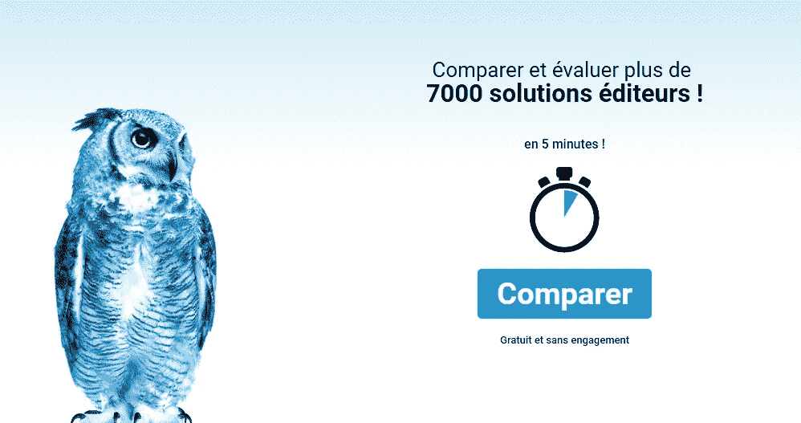

# 无处不在的人工智能和法国制造的智能 IT 顾问

> 原文：<https://medium.com/hackernoon/the-omnipresence-of-ai-and-an-intelligent-it-consultant-made-in-france-93074320b64d>

## 意识到人工智能可以在多大程度上取代人类劳动，可能是极其可怕的。然而，人工智能同时也是一种魅力。

令人印象深刻的技术进步和财富水平是当今现代经济的特征。虽然在人类历史的早期，技术进步的速度相对较慢，但今天公司的成功在很大程度上取决于上市时间和技术水平。因此，竞争力的关键因素是快速反应和成功预测新旧技术发展的能力。

[The Competitiveness Challenge](https://www.imd.org/research-knowledge/articles/the-competitiveness-challenge/)

对 2018 年技术趋势的展望显示，创新似乎是由数据、云、智能和算法驱动的。因此，人工智能(AI)正迅速从理论走向现实。人类智能过程的模拟，可以定义为人工智能，已经成为一个无所不在的时髦词，并且毫无疑问地塑造着技术进步的方向。因此，智能系统改变了产品，吸引了客户，优化了运营，增强了员工的能力。

**智能助手的不可或缺性**

[Siri, Alexa, Cortana and the unstoppable rise of the digital assistant](https://www.afr.com/technology/apps/business/siri-alexa-cortana-and-the-unstoppable-rise-of-the-digital-assistant-20160925-grnxvj)

人工智能无处不在，遍及各个领域。埃森哲的一项研究发现，到 2035 年，人工智能将能够使许多发达经济体的国内生产总值增长翻一番。这些发现肯定会对每一个面向未来的决策者产生压力。意识到人工智能可以在多大程度上取代人类劳动，可能是极其可怕的。然而，人工智能同时也是一种魅力。[《福布斯》撰稿人 Bernard Marr 在他的一篇文章中指出](https://www.forbes.com/sites/bernardmarr/2018/05/18/how-artificial-intelligence-is-making-chatbots-better-for-businesses/#7ec7c36e4e72)“组织显然越来越接受将聊天机器人和智能助理集成到他们的流程中的想法，并相信这将导致效率和客户满意度的提高。”智能助理在自己的圈子里也变得重要起来。Alexa、谷歌助手和 Siri 等已经成为我们日常生活不可或缺的一部分，我们越是使用它们，它们就越是不可或缺。

**celge . fr——法国制造的“智能 IT 顾问”**

尽管人工智能似乎在过去几年里变得更加重要，但它已经存在了很长时间。随着时间的推移，变化的可能是定义。事实上，来自 Business Insider 的 [Mai-Hanh Nguyen 注意到，“一些最好的人工智能聊天机器人是出于对更好的服务和更有效的管理的需求而创造的。”优化时间、成本、服务、质量等等似乎是人类的天性。因此，人工智能总是以某种方式存在。在未来，智能助理可能会帮助做出正确的管理决策，甚至为特定的商业问题提出策略，例如选择或替换商业软件。在这种背景下，法国 IT 公司](https://www.businessinsider.com/best-ai-chatbots-online-robot-chat-2017-10) [LEADEO GROUPE](https://www.leadeo.fr) 的创始人兼首席执行官 Christophe Hirth 和 Laurent Ehrhart 意识到选择正确的商业软件时决策过程背后的复杂性。市场上充斥着诱人且相当昂贵的工具。正确的选择意味着对业务的关注、对需求的分析以及耗时的研究。一旦找到合适的软件解决方案，应用程序必须根据具体要求进行定制。对于企业来说，从研究决策到将解决方案集成到日常业务中的整个过程可能需要数月甚至数年的时间。因此，法国企业家提出了将人工智能与 IT 咨询相结合的想法。“智能顾问” [CELGE.fr](https://www.celge.fr) 就这样诞生了。后者以一只名为 *Hibou* 的蓝色猫头鹰为吉祥物。

[https://www.celge.fr/](https://www.celge.fr/)

无论是用于库存管理、会计或生产的 ERP 系统、人力资源软件、面向客户的 CRM、用于控制或文件管理系统的商业智能，CELGE.fr 都使软件选择变得简单且耗时更少。CELGE.fr 类似于商业管理软件的比较器，依赖于所有市场参与者的全面彻底的数据库。寻找商业软件的客户会与那些拥有完全符合其标准和需求的解决方案的公司取得联系。该系统集成了市场上最广泛的数据库，能够在几秒钟内处理大量信息。据其创始人称，CELGE.fr 使其用户能够获得关于可用软件类型、其提供商和各自经销商的相关信息。鉴于市场不断发展的事实，这位智能 IT 顾问背后的公司通过建立合作伙伴关系，添加更多的软件公司和经销商来扩大其数据库。今天，该公司引以为豪的是，它拥有一个详细的数据库，软件市场上有 7000 多家公司(出版商、服务提供商、系统集成商和制造商)。CELGE.fr 被纳入法语世界之外的商业软件选择范围只是时间问题。