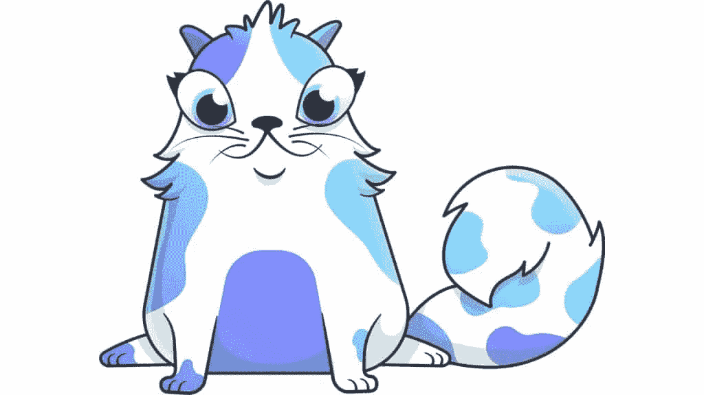
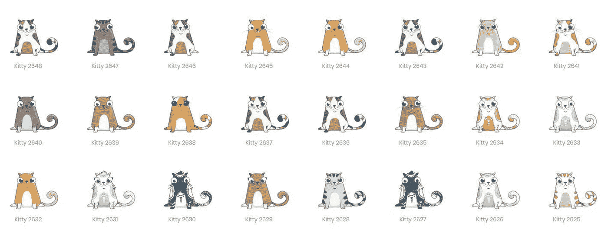

# 区块链上数字收藏品的 ERC 721 标准缺少的一件事

> 原文：<https://medium.com/hackernoon/the-one-thing-missing-from-erc-721-standard-for-digital-collectibles-on-the-blockchain-9ee26e4a918c>

ERC-721 标准随着 Crypto Kitties 的兴起而变得突出，Crypto Kitties 是第一个真正达到规模的区块链游戏之一。加密小猫变得如此受欢迎，以至于它减慢了以太坊网络的速度，被收集的数字收藏品(“小猫”)售价高达 100，000 美元(是的，用*真实的，法定的*货币！)

数字收藏游戏有着悠久的历史，并且已经适应了每一种新的技术趋势。从非数字世界(交易卡和魔术:收集卡)开始，收集机制是一个在视频游戏世界中久经考验的*真实、可靠的*游戏机制。例如，一些最赚钱的手机游戏有收集数字角色的想法(《T4》中的鱼、《塔普鱼》中的鱼、《口袋妖怪 Go》中的口袋妖怪)。

Crypto Kitties 表明区块链也不例外。事实上，所有权可以在一个去中心化的区块链被追踪的想法使得它特别适合收藏品——一件特定收藏品的稀有性是毫无疑问的；(理论上)谁拥有什么没有集中控制；某一特定物品的近期价值是毫无疑问的。

在这之后，ERC 721 标准被定义为使数字收藏品游戏变得容易。这里列出了在 [Etherscan](https://etherscan.io/tokens-nft) 上的实现，以及交易量。



Crypto Kitties is the best known ERC 721 Non Fungible Token

作为一名视频游戏设计师，当这个标准被首次定义时，我看了一下它，看看它在一个分散的数字收藏品世界中可能如何使用。它大致基于 ERC-20 标准，该标准已被许多令牌/ico 使用。

## ERC20 快速概述—可替换令牌

ERC-20 标准使得在智能合约中实现一定数量的可替换令牌变得容易。例如，币安硬币(BNB)或奥米塞戈(OMG)。其思想是，作为令牌正式归属的 smartcontract 必须实现许多方法，这些方法允许存储令牌，允许任何人看到特定地址拥有多少令牌，并允许将令牌从一个地址转移到另一个地址。

ERC20 代币就像钱一样——当它们以电子方式存储在银行账户中时，一美元与另一美元非常相似——这就是为什么它们被称为可替代代币的原因。

这个规范创造了一个非常大的市场，因为代币是用以太支付的。十大 ERC20 代币的市值数以亿计，甚至在我写这篇文章时数十亿计。

## ***介绍 ERC 721 标准***

我不知道将 ERC721 标准基于 ERC20 标准是否是一个好主意，但这是我们选择的道路，因此它们非常相似。

基本的区别在于，每个 ERC721 令牌都是不可替换的，因此每个令牌都是唯一的，并且有一个所有者，他可以将令牌出售给其他所有者。令牌 id 用于标识特定令牌，这也是它们被称为数字资产的原因。

然而，通过将 ERC721 对象构建为不可替换的令牌，而不是数字可收集对象，该标准在很大程度上是关于跟踪和转移所有权的。以下方法是 ERC 721 标准的一部分(这个特殊的列表取自 [coincentral](https://coincentral.com/future-of-erc-721-and-unique-assets/) ):

**balanceOf()** 统计分配给所有者的所有不可替换令牌(NFT)

寻找 NFT 的主人

**safetransforfrom()**将 NFT 的所有权从一个地址转移到另一个地址，如果参数有问题，抛出异常

**transferFrom()** 转让 NFT 的所有权

**approve()** 设置或重新确认 NFT 的批准地址

**setApprovalForAll()** 启用或禁用对第三方(“操作员”)管理所有消息发送者资产的批准

**getApproved()** 返回此 NFT 的批准地址，如果没有地址，则返回零地址

**isApprovedForAll()** 如果操作员是所有者批准的操作员，则返回 true，否则返回 false

**supportsInterface()** 如果契约实现了有效的 interfaceID，则返回 true，否则返回 false

## 数字收藏品缺少什么

虽然该接口支持每个数字“资产”具有只能由一个人拥有的身份，但该标准中缺少许多细节，使其真正适用于数字收藏品，如加密工具包或其他视频游戏资产。

游戏中收藏品的概念，尤其是数字收藏品，与被收集物品的视觉表现有很大关系！这个想法完全被排除在标准之外。事实上，你不能想象一个视频游戏类型的收藏品没有代表对象的图像！在游戏和收藏品的世界里，两者是密不可分的。

在定义的 ERC721 标准中，没有将图像与 id 相关联的标准方法，这意味着就区块链而言，每个数字资产(或不可替代的令牌)只是一个数字！

当然，在区块链上存储信息是昂贵的，这就是为什么图像通常不存储在链上，而是存储在链外的中央服务器上。随着时间的推移，像 IPFS (Filecoin)和其他协议将使这成为可能。



The images for Crypto Kitties are not stored on the blockchain, but on a centralized server

Crypto kitties 通过将另一个 id 与一个 id 相关联来解决这个问题，称为其基因。这个代码然后被用来调用中央服务器，中央服务器然后返回特定小猫的图像。

虽然这是一个非常标准的解决方案，但我们现在又回到了每个游戏收藏品都放在一个有围墙的花园里的想法，这有点违背了为收藏品建立一个去中心化标准的目的。(这里有一个很好的概述: [*你的 CryptoKitty 不是永远的——为什么 Dapps 没有你想象的那么分散*](/loom-network/your-crypto-kitty-isnt-forever-why-dapps-aren-t-as-decentralized-as-you-think-871d6acfea) )

理论上，你可以建立一个去中心化的交易所来允许收藏品的交易——每个所有者将列出他们的收藏品，ERC721 标准允许这样做(与 EtherDelta 允许 ERC20 令牌交易的方式相同)。不过，从数字收藏品的角度来看，还缺少一样东西——也是最重要的东西——收藏品是什么样子的！

关于如何构建自己的 ERC721 令牌，有许多实现和教程。(这里有一个很好的教程——[在 20 分钟内构建自己的 Crypto Kitties 克隆](https://maksimivanov.com/posts/gradient-coin-tutorial/))。

Open Zeppelin 已经推出了一个完整的实现，增加了一些不属于原始接口的方法。

*   *tokensOf( _owner )* —返回特定 _owner 的令牌 ID 列表
*   *approved for(_ token Id)*—返回获得给定令牌 ID 所有权的批准地址

这些类型的扩展是有用的，即使它们还不是官方标准的一部分，它给了我一个简单的想法，可以将 NFTs 转换成真正的数字收藏品。

## ***数字资产扩展，使 NFT 成为数字收藏品***

我将提出一个简单的扩展，使所有的 ERC721 合同与数字收藏世界互操作。

虽然在区块链上存储图像将是一项更复杂的工作，但这种“临时”方法将允许交易平台和其他网站以标准的方式参考和交互所有的 ERC721 数字收藏品:

*image of(_ _ tokenId)*–返回一个 URL，该 URL 返回特定令牌的图像；如果此令牌 Id 没有“官方”图像，则返回空白

这个想法是，这个新方法 imageOf 将简单地返回一个 URL，它是每个收藏品的数字图像的“官方”保管者，因此只有合同的所有者可以设置或更改这个 URL。该 URL 可以是类似 cryptokitties 服务器的服务器，也可以是对链上分散存储的引用。

这种格式可以修改或扩展，但是它为每个不可替换的令牌提供了一个“正式”的映像。URL 可以返回网络浏览器支持的任何类型的图像——JPEG、png 等。,

需要进行更多的讨论来定义各种类型的 URL 和返回的内容类型——但这种简单、可选的方法的加入将大大推动去中心化数字收藏品的发展，而不是每个 ERC721 合同都以自己的方式这样做！

你最终会看到一个健康的交易经济，它不是由数字代币的创造者控制，而是由以太坊区块链的智能合约控制。毕竟，这就是区块链的全部意义！

***更新:ERC721 元数据可选标准完成本***

事实证明，自从我第一次看到它，有一个可选的元数据集，ERC 721 智能合同可以实现这一点，通过间接的水平。

并非所有契约都实现了这一点(例如，Crypto Kitties 没有，但其他一些实现了)，下面的三个元数据函数旨在帮助提供数字资产的互操作性:

```
/// [@title](http://twitter.com/title) ERC-721 Non-Fungible Token Standard, optional metadata extension
/// [@dev](http://twitter.com/dev) See [https://github.com/ethereum/EIPs/blob/master/EIPS/eip-721.md](https://github.com/ethereum/EIPs/blob/master/EIPS/eip-721.md)
///  Note: the ERC-165 identifier for this interface is 0x5b5e139f.
interface ERC721Metadata /* is ERC721 */ {
    /// [@notice](http://twitter.com/notice) A descriptive name for a collection of NFTs in this contract
    function name() external view returns (string _name);/// [@notice](http://twitter.com/notice) An abbreviated name for NFTs in this contract
    function symbol() external view returns (string _symbol);/// [@notice](http://twitter.com/notice) A distinct Uniform Resource Identifier (URI) for a given asset.
    /// [@dev](http://twitter.com/dev) Throws if `_tokenId` is not a valid NFT. URIs are defined in RFC
    ///  3986\. The URI may point to a JSON file that conforms to the "ERC721
    ///  Metadata JSON Schema".
    function tokenURI(uint256 _tokenId) external view returns (string);
}
```

如果实现了 tokenURI 元数据方法，就意味着能够实现这一点。然而，响应可能实际上是在 JSON 文件中，而不是在图像本身中，这需要额外的解析级别，但是 JSON 中的“image”元素提供了这样的功能:

```
{
    "title": "Asset Metadata",
    "type": "object",
    "properties": {
        "name": {
            "type": "string",
            "description": "Identifies the asset to which this NFT represents",
        },
        "description": {
            "type": "string",
            "description": "Describes the asset to which this NFT represents",
        },
        "image": {
            "type": "string",
            "description": "A URI pointing to a resource with mime type image/* representing the asset to which this NFT represents. Consider making any images at a width between 320 and 1080 pixels and aspect ratio between 1.91:1 and 4:5 inclusive.",
        }
    }
}
```

在查看上面提供的 Etherscan 链接中的前 5 名(按交易量)时，似乎只有其中两个实施了此方法:

*   加密工具包—未实现
*   lucid Sight——token URL 已实现，但如果您从最近的交易中选择一个令牌 id，则几乎会返回空白，所以没有真正实现。
*   没有提供 ABI 契约，所以看起来他们没有实现这个。
*   gods-Unchained——该方法被实现，它返回一个 URL，如下所示:【https://api.godsunchained.com/card/61000，其中 61000 是 tokenid。这似乎很有希望，但是访问这个 URL 几乎会为每个最近的 tokenId 返回一个错误！
*   HodlEarthToken——没有提供契约 ABI，所以看起来他们不希望人们调用该方法来查看 URI 是否存在！

因此，实施 ERC721 的前 5 名智能合同(截至 2018 年 9 月)似乎不容易访问图像(除了 Gods-Unchained，但当您尝试访问它时会产生错误)。让一个单独的服务器提供 JSON 是一种间接的方式，这可能会使事情变得更加复杂。

随着越来越多的 ERC 721 合同实现更多的元数据，图像在哪里的问题对于去中心化应用和市场的性质变得很重要。随着不可替代的数字收藏品市场的发展，我们将开始看到有多少人使用 IPFS 或其他分布式系统而不是集中式服务器，这可能会决定数字收藏品到底有多“便携”！