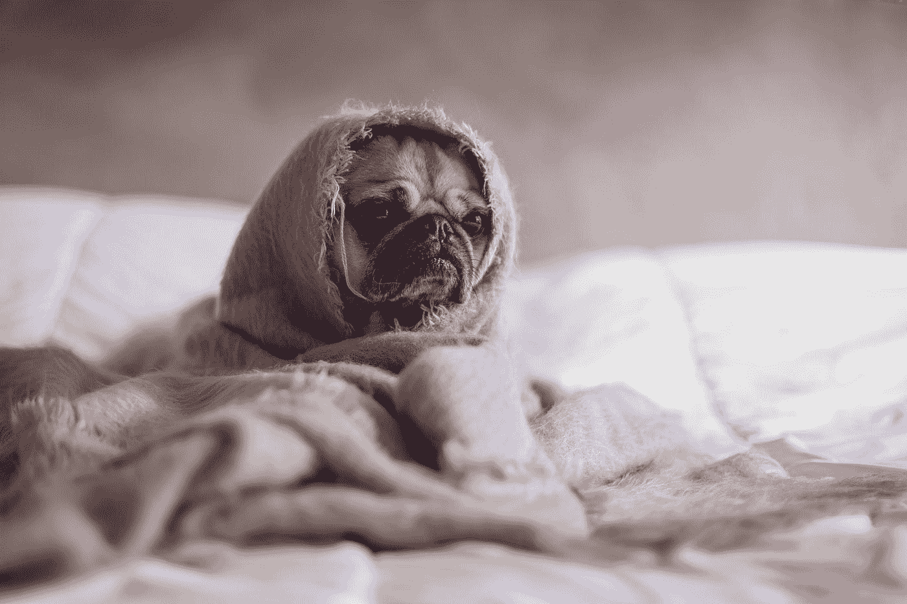

# 一个你从未听说过的增加能量的小贴士

> 原文：<https://medium.com/hackernoon/the-one-tip-to-increase-energy-you-have-definitely-never-heard-before-b6b35aa2ae4>

## 简单，愚蠢，卓越

“A pug wrapped in a blanket on a bed” by [Matthew Henry](https://unsplash.com/@matthewhenry?utm_source=medium&utm_medium=referral) on [Unsplash](https://unsplash.com?utm_source=medium&utm_medium=referral)

你有没有发现自己凝视着深渊，脑子里没有一个想法？

你的眼睛开始慢慢闭上，5 分钟后你跳回动作中重复同样的过程。

也许你正在上课。

*也许你正坐在办公桌前。*

*也许你正坐在理发店或美甲店的椅子上。*

无论你在哪里，你都知道现在不是你眼睛完全闭上的时候！

# 你是做什么的？

我厌倦了总是看同样的东西。

我厌倦了给出和接受同样的建议。

我厌倦了学不到任何新东西。

***你不是吗？***

我想给你提供一些独特的东西。

*有些不同。*

好玩的东西。

很棒的东西。

对于这个常见的问题，目前有什么快速、直接的解决方法？

这里是夏天，夏天带来了纽约市最怪异的事物，我喜欢它。

有人光着上身走来走去，有人光着屁股走来走去，有人光着屁股走来走去，有人光着屁股走来走去！

这里又热又潮湿，人们竭尽全力保持凉爽。有一天，我看到一个家伙在我认为是一滩汗的地方从他的背上取下背包，拿出一个喷雾瓶，就像他要在理发前弄湿他的头发一样，然后朝自己的脸上喷水！

太搞笑了。但后来我开始思考。

当我打瞌睡时，不管是在学校、办公室还是在家里，当我想提高我的能量水平时，我总是去洗手间往我脸上泼水，或者我试着用水瓶里的冷水或其他东西揉揉眼睛。但是如果我可以在任何时间任何地点做这件事呢？

# ***喷它不说它！***

这里有 4 个步骤可以让你立刻恢复精力，我保证以前没人告诉过你:

1.投资< $5 in a spray bottle

2\. Fill it up with cold water

3\. Carry it around in your bag

4\. When you get those droopy eyes, give yourself a big spray right in the face!

Sure, you may get a few funny looks, and you’ll be a little wet for a few seconds, but it certainly beats the embarrassment of falling asleep someplace you’re not supposed to, and it is definitely better than spending the rest of the day groggy and annoyed!

So, remember, the next time you are tired,

***喷一下不说了！***

# **想要更多独特的推荐？**

成为“变得更舒适”社区的一员，通过加入[此处](http://getting-comfy.com/)并接受:

亚马逊畅销书的两个免费章节，*变得舒适:你每天快乐的早晨指南*

保持舒适的 15 个提醒

关于尽可能创造最舒适和最好的[生活的每周文章(口头和书面)](https://hackernoon.com/tagged/life)

每天最大化精力、生产力和快乐的一个简单舒适的早晨惯例！