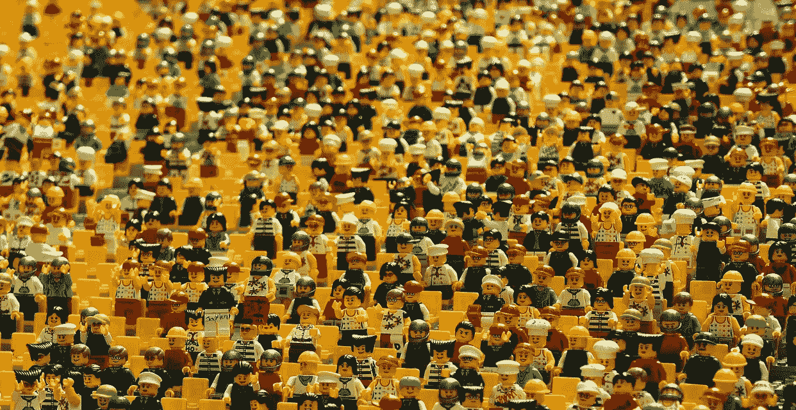
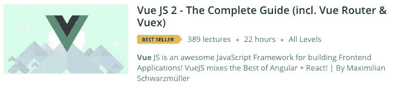
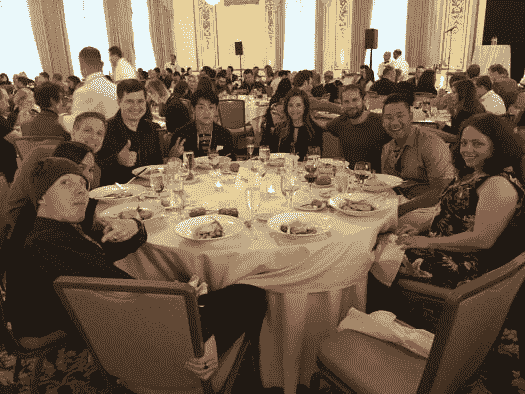
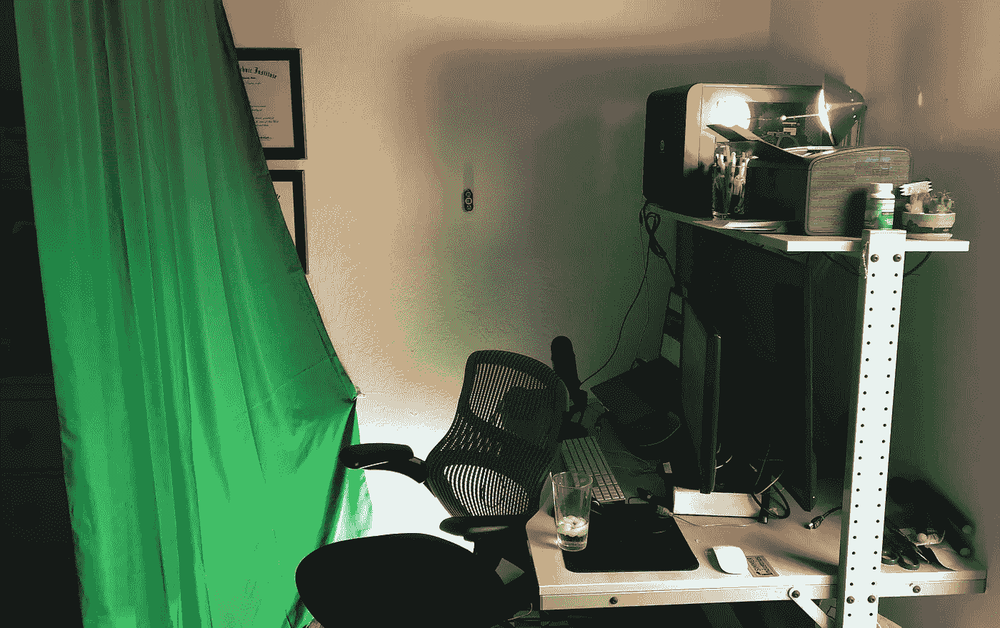
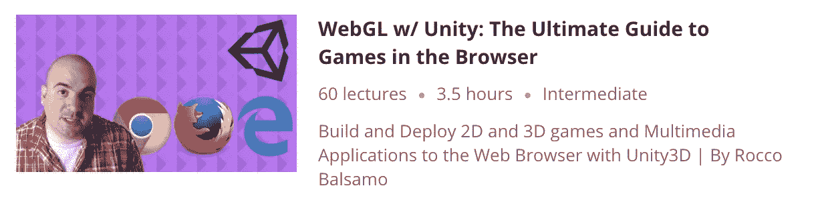

# 在线技术教学热潮:我在 Udemy 的一年

> 原文：<https://medium.com/hackernoon/the-online-tech-teaching-hustle-my-year-with-udemy-c5a0d0264dfe>

在过去的一年里，我帮助很多人学习，甚至在这个过程中赚了一些钱。也发生了一些意想不到的事情。

这是我作为 Udemy 教练 17 个多月的故事。

我从 2017 年初开始——利用晚上和周末的时间录制一堂关于谷歌 Chrome 开发者工具的技术课。这是一个我非常了解的主题，在购买了一些关于这个主题的畅销书后，我知道我可以制作一个更加详细的课程。

所以我在设备上花了几百美元(一个漂亮的麦克风和一些视频编辑软件)，还决定进行一次推广，以帮助获得早期评论。我会为前五十篇书面评论向[使命钻头](https://www.missionbit.com/)捐赠 10 美元。([阅读全文](https://hackernoon.com/the-online-tech-teaching-hustle-w-udemy-bdad05e49d02) y)

我能够很好地向我的朋友和家人推销这个课程，最终，人们开始购买！我还制作了第二个免费的入门课程，并回答了 StackOverflow 和 Quora 上的一些问题，以帮助建立一个销售漏斗。

我在我的付费课程上赢得了畅销书的标签，最初的几个月很棒，在我做全职工作的时候，我每月净得 600-700 美元的收入。在那之后，销售额稳定在 200-300 美元的水平上(我今天还能赚到)。

阅读下面的故事，了解更多关于我如何在 Udemy 中攀升排名的信息:

 [## 力争上游:在线技术教学热潮

### 自从我在 Udemy 上推出我的在线课程已经一个月了，它超出了我的预期！以下是我如何到达…

hackernoon.com](https://hackernoon.com/the-online-tech-teaching-hustle-race-to-the-top-search-result-b8c7ef0d448b) 

我很高兴地说，在这个单一的过程中，我已经赚了近 6000 美元！根据我投入的时间，这个金额仍然比我的工程咨询费少一点，但是工作很充实，我从以下工作中得到乐趣:

*   帮助人们学习。
*   生产足够好的东西让人们愿意购买。
*   做一些我自己的事情，而不仅仅是用时间来换取金钱。

# 灵感

靠自己赚钱激励我努力摆脱“按小时计酬”的生活方式。所以那年晚些时候，我决定辞掉工作，尝试一下我真正的激情。我会将我对网页编程和游戏编程的热爱结合起来，发布一个名为[smelle . io](https://simmer.io)的网站，帮助游戏开发者在网页浏览器中无缝分享游戏。

就增长而言，这个项目进展得相当不错(超过 2000 名开发人员注册了该网站，大约 2000 个游戏和演示被共享)，但我仍在寻找使该网站获得财务成功的银弹。我会随时通知你。

# 附加福利

在网上教授课程是一个巨大的简历助推器，当我寻找演讲机会推广 smelle 时，这是我帽子上的一大羽毛。例如，我能够在谷歌的 HTML5 活动和 Unity Unite(视频游戏开发者大会)上发言，部分原因是因为我是一名在线讲师。

另一个好处是，我可以参加 Udemy 现场讲师会议。我见到了我最喜欢的在线导师马克西米利安·施瓦茨米勒。这家伙绝对是球场创造的[发电站](https://www.academind.com/)，拥有一些我见过的最好的科技球场制作价值。

Max’s [VueJS course](http://bit.ly/maxvuejs) helped me w/ the skills needed to launch SIMMER.io!

麦克斯本人相当谦逊。我向他提到我的课程远没有他的好，他告诉我看*他的*第一堂课。他提醒我，这是一个反复的过程，随着时间和练习，你会变得更好。

我参加过很多科技会议，但我绝对喜欢参加 Udemy Live，因为我周围都是具有企业家精神的人。我参加过的大多数“极客”会议都缺乏这种能量。在 Udemy Live 上，我见到了一些我最喜欢的科技书籍的作者，甚至和一个正在推销关于[去非洲摄影游猎](https://www.udemy.com/going-on-an-african-photo-safari/landing-page/#instructor-1)课程的家伙共进晚餐。

I’m somewhere in the background of this photo (photo credit: [10 Things I Learned About Online Courses and Publishing from Udemy LIVE](https://musingsandmarvels.com/2016/06/30/10-things-i-learned-about-online-courses-and-publishing-from-udemy-live-2016/))

# 回去工作

2017 年 12 月左右，我确实开始有点慌了。我的游戏网站还没有获得资金，也没有真正的收入来源，所以我发挥了我的 LinkedIn 技能来获得一些合同工作。我在一家名为 Brandly 的印刷初创公司工作了大约一个月，然后在前雇主 gli ffy 公司签了一份为期七个月的合同。

总的来说，咨询行业相当有利可图。我确实怀念稳定的薪水，但是总的工作时间却减少了。

# 第二个付费课程

当我的合同快到期时，我必须决定下一步做什么。我可以建立一个课程来获得一些半被动的收入，或者将我的所有精力集中在 smelle . io 上。

我决定采取折中的方式——我将开设一门课程，专门介绍如何用 Unity 游戏引擎为网络构建和部署游戏。这将达到三个目的:

1.  我的游戏网站上有 2000 多名开发者，他们正是这个课程的目标市场。我现在可以向那些人推销这个球场了。
2.  在课程中，我提到我的游戏网站是[众多]游戏部署平台之一。这将提供一些品牌知名度，并可能导致更多的注册。
3.  我可以将一些课程内容重新编排成几篇博客文章、较短的基于主题的 youtube 视频，或者可以下载的电子书。更多的内容=更多的搜索引擎优化=对煨和我的课程更好的认识！

# 提高生产价值

虽然我支持我的第一门课程的内容，作为 Chrome 开发者工具的一些最佳指导，但一些产品价值肯定需要一些工作。光线很差，音频质量参差不齐，很多视频显示我看起来不修边幅；-).

为了这一轮，我购买了一些更好的照明设备，一个绿色屏幕，[和一把剃刀]，并参加了一个关于 [Screenflow](http://bit.ly/screenflowcourse) 的课程来提高我的视频编辑技能。我还决定在整个课程中成为一个镜头前的发言人。相信我——在镜头前现场编码真的很难，但是经过一些练习和编辑的挫折，我相信我已经创造了一些东西，将会带来更高的学生参与度。

the makeshift recording studio (my 1 year old son’s crib gets the other half of the room)

制作这个课程超出了我的时间预算**。我曾希望我能在两个完整的工作周内完成它，但是，唉，成品花了五个星期或更多。这个课程比开发工具课程更难制作，因为我需要从头到尾创建项目，而不是简单地通过一个已知工具的 UI。**

我只能希望，随着我开始建设更多的课程，那些喜欢我的教学风格的学生将有更多的机会得到交叉提升。

# 插头

我的关于 [WebGL 与 Unity](https://www.udemy.com/webgl-with-unity-the-ultimate-guide-to-games-in-the-browser/?couponCode=TENBUCKS) 的新课程今天上线了，我的媒体读者可以[在这里](https://www.udemy.com/webgl-with-unity-the-ultimate-guide-to-games-in-the-browser/?couponCode=TENBUCKS)以 92%的折扣(只需十美元！).在里面，你可以了解如何为浏览器构建尖端游戏。我可能会在 10 月 2 日左右抽出这张优惠券，所以今天就去买吧！

如果你是一个对 WebGL 和 Unity 感兴趣的 web 开发人员，或者是一个希望将游戏部署到 web 上的游戏开发人员，那么现在是学习本课程的好时机。

# 最后

一些早期进入游戏的球场创造者正在赚一些相当惊人的钱——达到 7 位数。市场上有些赢家通吃的元素(例如，顶级 React 课程将在很长一段时间内继续成为顶级 React 课程)。

我可以肯定地看到，课程市场已经有些饱和，但我希望，通过创建一个有点小众主题的课程，我的教学将与众不同。

就我个人而言，我将采取谨慎的方式来建立课程——我想在我是专家的主题中建立课程，但我也需要考虑大局，并坚持投资我的网站，为[游戏开发者](https://simmer.io)服务。

*如果你喜欢这篇文章，请鼓掌或关注我！这给了我继续写作的巨大动力！*

…通过 Unity 终极指南，享受[web GL 92%的优惠](https://www.udemy.com/webgl-with-unity-the-ultimate-guide-to-games-in-the-browser/?couponCode=TENBUCKS)