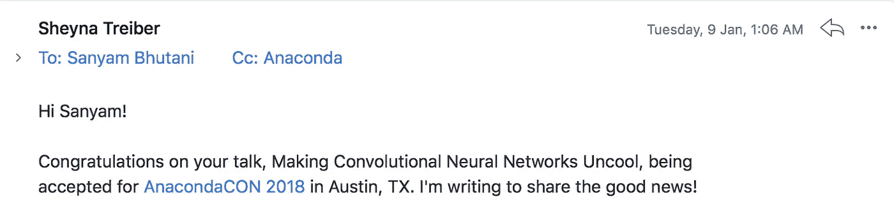
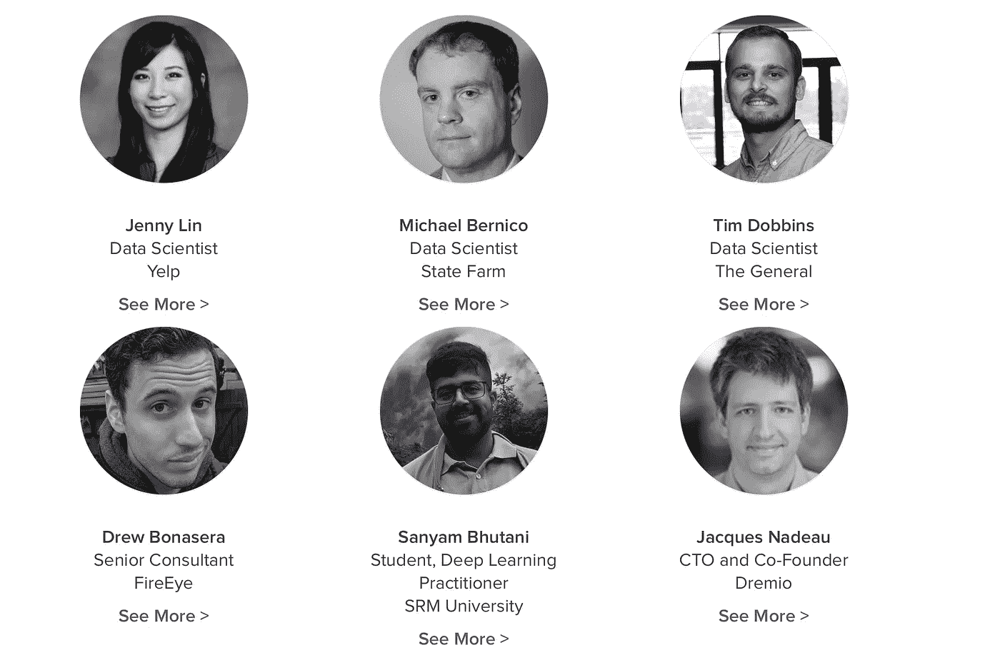

# 唯一被邀请出席 Anaconda 会议的印度大学生:我的深度学习之旅

> 原文：<https://medium.com/hackernoon/the-only-undergrad-and-indian-to-be-invited-to-present-at-anaconda-conference-my-deep-learning-d4bde583ffa4>

我很荣幸也很激动能被邀请出席 2018 年的 Anaconda 大会。

如果你在的演讲者名单中搜索我的名字，你会在角落里找到我的简历。

我真的很荣幸成为唯一一名大学生和印度人，与 Anaconda Inc .、 [Wes McKinney](https://twitter.com/wesmckinn) 的领导人以及几乎所有来自前沿世界的领先数据科学家一起出席会议，我渴望在那里工作。

在这篇文章中，我想分享我的故事:我是如何开始成为一名 noob 程序员，并开始发掘我对深度学习的热情。

我是如何挣扎、失败、磕磕绊绊、含咖啡因地熬夜编码，并开始我的深度学习之旅的。

> 声明:我甚至不是一个专业的程序员，也不是一个伟大的深度学习实践者，我想把我的故事分享给任何像我一样渴望成为 DL 研究者但害怕开始的人。

# 梦想

我参加了一个本科生 CS 项目，目标是成为一名优秀的程序员。

就是这样。没有最终目标——我不确定什么是 UI/UX，什么是网络开发，什么是应用开发者的本质。

TL；DR:我是 noob 新生，想成为一名“程序员”。

我非常认真地学习了高中的 C，Java 课程——每一次评估都得了 a，我开始阅读 CLRS(算法导论:麻省理工出版社)。我以为我有了一个很好的开始。

**我错了。**

# **旅程**

在印度的工科课程下，大一科目针对的是一般工科科目:物理 101，土木 101，电气 101，cs 101。

因此，为了成为一名更好的程序员，我开始加入我大学里的每一个技术俱乐部，寻找关于“CS 202”的知识，因为我很自豪在高中期间完成了 CS 101。

我一意孤行，报名参加了我能找到的每一个工作坊。

我注册了一堆 Coursera[mooc](https://hackernoon.com/tagged/moocs)。

我想探索每一个吸引我的领域:

*   在我第一次实习的时候，我建立了一些基本的网站
*   报名参加 [Android](https://hackernoon.com/tagged/android) 应用开发培训
*   大学一年级时，我在 IIT 马德拉斯公司做过两次为期 6 个月的嵌入式系统项目实习生。
*   作为计算机视觉工程师加入 AUV(自主水下航行器):为系统开发计算机视觉堆栈。
*   从吴恩达著名的 ML 课程开始。
*   做过一些数据科学实习。
*   在 IIT R 被选为 2017 年夏天的机器[学习](https://hackernoon.com/tagged/learning)实习生。
*   2017 年冬天在 IIT-R 做深度[学习](https://hackernoon.com/tagged/learning)项目实习生。

到 2016 年，我确定我的兴趣在深度学习、计算机视觉和机器人领域。

# 斗争

我很幸运来自我的国家的一所顶尖大学，那时我已经开始了我的“人工智能努力”:大学文化集中在网络和超棒的应用程序开发上。

老实说，这并不吸引我。我是唯一一个从下午 5 点到早上 9 点钻研 MATLAB 方程的人。(提醒你 TF 那段时间刚出)。

我的导师和朋友一直反对我，他们警告我，人工智能(是的，一般领域)本身是一个相当先进的话题，是我在攻读硕士或博士学位时应该担心的事情。

不用说，考虑到我是个叛逆者，我仍然继续我的旅程。此外，在那段时间里，除了 coursera 论坛之外，在线社区几乎不存在，吴恩达经常会亲自回答一些问题——我很幸运地从那里获得了最好的指导。遗憾的是，我的本科课程没有提供任何 ML/DL 课程，所以这是唯一的选择。

我的朋友几乎总是提醒我，我正在选择一个高级领域，我可能不会得到一份好工作。

> 接受。感激。预先的

我的学习目标一直是好奇心驱使的。当然，我想赚钱，从我以后做的任何事情中谋生。但我的主要动机是真正享受它。

> 我希望我的工作不只是朝九晚五的工作。对我来说也是下午 5 点到 9 点。

# 小路

一开始，我申请了几家初创公司和大公司的实习机会，让我能够从事这些“高级”课题。我会在每封求职信中解释为什么我作为一名本科生，想要申请一份要求我成为麻省理工学生的实习职位。

我开始认真地在 Linkedin 上建立关系网，并冷冰冰地发电子邮件寻求建议。

到 2016 年，我开始接触 Tensorflow 和 Python & Co 开源库。

幸运的是，我被 ONGC 的暑期实习项目录取了。我被分配了一个关于“计算机视觉里程计”的项目。我的工作给我的导游留下了深刻的印象。

我西装外套上带着这些徽章，大步走上前去敲开 IIT 大学的大门。经过一系列严格的面试，我进入了暑期实习项目，并在印度政府的一个项目中从事地理数据分析工作。

我的工作让我重新访问了 IIT-R，这次是作为一名深度学习实习生:再次在政府部门用数据预测地震活动。印度项目。

> 随着我关于深度学习的想法成型，我想把人工智能的产品带给印度大众。对 Agritech 来说，帮助改善整体生活方式，而不仅仅是做一份 6 位数的工作。当我还是大学生的时候，我就已经在实现我的梦想了。

# 在线资源

当 MOOCs 出现时，我一直在学习，它们真的很有帮助。我的大学支持我的实习努力，给我延长假期，让我每次工作 2-3 个月。

后来，我决定报名参加 Udacity 的深度学习纳米学位，这真的很有帮助，不仅帮助我学习基础知识，还帮助我从事一些非常酷的深度学习项目。

我还参加了 Fast AI 国际奖学金，这让我更接近前沿和牛逼的深度学习实践。这是迄今为止我一生中最好的学习经历。

今天，我报名参加了[自动驾驶和飞行汽车纳米学位](https://hackernoon.com/a-self-driving-and-flying-new-year-3-30d5ecd375e8),梦想着将这些技术带到印度的农场，以一种负担得起的方式进一步提高产量。

# 回馈社会

在我的国际奖学金期间，我决定认真地写博客，我开始分享教程和基本的解释，由于 Fast AI 社区的推动，这些都得到了很好的回应。

2017 年底，我作为人工智能极客领袖跳上了培育人工智能，人工智能周六船，在那里我通过指导学生来帮助全球社区。

> 要伟大，但要感恩

我一直相信回报的哲学。

怀着同样的动机，我在 27 个实验室里开始了[，在那里我会发布深度学习、计算机视觉、自动驾驶和飞行技术的教程，以帮助任何想了解这些的人，这是一个很好的起点。](http://medium.com/init27-labs)

我也很荣幸成为导师之舟的一员，在这里我希望能指导那些想了解更多人工智能的新手。

# 里程碑

被邀请出席会议是我学习道路上最大的成就。我很荣幸在全球会议上得到认可，并成为我梦想领域的领导者。

我在这里分享我的故事，让那些被梦吓到的人在这里找到动力。

> 这是给信徒的，我们中的一个人做的。

我的梦想是在这个领域获得硕士学位，这样我就可以了解概念背后真正的数学。

我的目标是今年先提交一些好的 kaggle，然后在我的生活中进行研究。我想继续在算法中生活和呼吸，在我的电脑屏幕前度过我的一生。

> 我一生都在为这一刻努力，而我才刚刚开始。我向你保证，现在我已经公开分享了我的故事，我会继续努力。

[*如果你喜欢我的故事，想聊天，你可以在 twitter 上找到我，这里是*](http://twitter.com/bhutanisanyam1)

[*如果你对深度学习、计算机视觉以及自主和飞行技术的每周阅读清单感兴趣，你可以在这里订阅我的时事通讯*](http://tinyletter.com/sanyambhutani/)