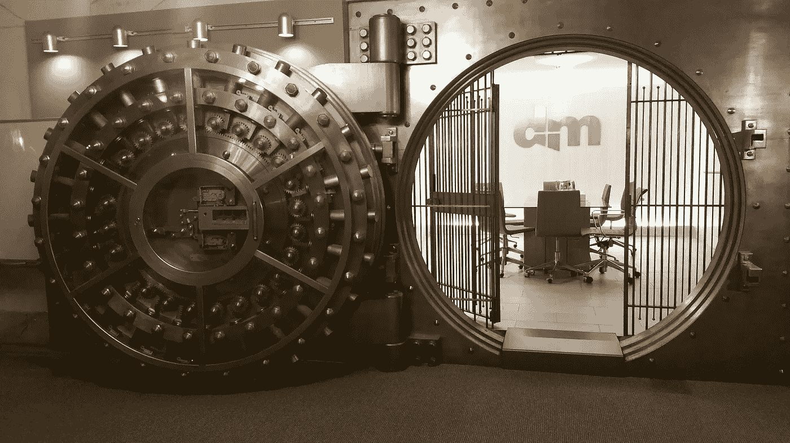
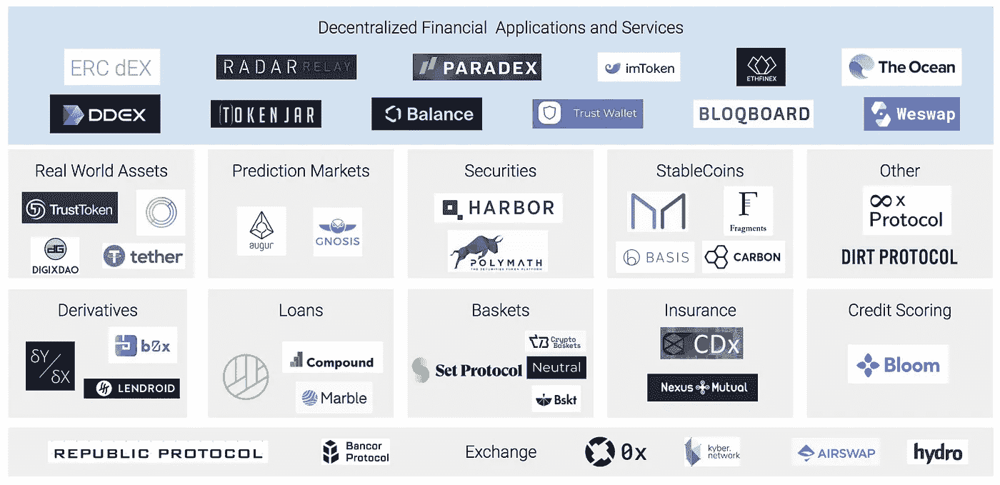

# 开放金融系列第 1 部分:MakerDAO

> 原文：<https://medium.com/hackernoon/the-open-finance-series-part-1-makerdao-9be14ef1066c>

**跟我来**[**@ flat outcrypto**](http://twitter.com/flatoutcrypto)**。我所有的文章(还有一些我无法在媒体上发表的)都可以在**[**【flatoutcrypto.com**](http://flatoutcrypto.com)**上找到。**

分散我们许多金融机构(或者更确切地说，它们服务的目的)一直是许多区块链项目的目标。[比特币](https://hackernoon.com/tagged/bitcoin)诞生时是一个“点对点电子现金系统”，支付是(与存款/储蓄)最常用的银行工具之一。

最近几个月已经见证了“[开放金融”](https://twitter.com/spencernoon/status/1035193639998124032)想法的扩散，这是另一种旨在解释或赋予协议价值的叙事。这个术语已经赢得了许多 T21 的鄙视，但很明显，有许多项目旨在促进和分散金融系统和机构的要素。在接下来的几个月里，我将考察一下构成这个“开放金融”的一些项目。

A nice overview of the many Open Finance services in development; [Felix Feng](https://twitter.com/felix2feng)

名单上的第一个是 MakerDAO(以下简称 Maker)，这个项目是我在本月的《21 世纪经济报道》中写的“本月 DApp”。该细分市场的想法是着眼于可运营和开放的 DApps，试图鼓励人们尝试这些新生的服务。顺便说一句，我鼓励你读一下这本杂志，因为里面有许多才华横溢、有趣的作者。这份出版物也很冷静，没有污染这个领域的许多弊病，这就是为什么我热衷于为它做贡献，我将每月写五篇文章，集中在“学习”部分。

现在，让我们来看看制造者…

**什么事？**

按照密码标准，Maker 绝对是一位资深政治家。该项目于 2015 年宣布，我已经关注了很长一段时间。如果有人让我举一个 DApp 的例子，那它肯定是制造者，但奇怪的是，我从未拥有或交易过它。我也一直想写一篇关于它的文章，至少有两年了，但由于这样或那样的原因，一直没有时间写。

然而，这个系列提供了最终这样做的完美理由，因为 Maker 涵盖了对任何金融系统都至关重要的两个要素——稳定的货币和方便的借贷。

众所周知，它是一个很难理解的复杂项目，但我认为它有一个最简单的愿景，一旦理解，它的系统的组成部分和设计就会变得清晰。

制造商公开宣称的目标是促进分散化的稳定货币。

为什么是稳定币？

因为它使用户不必担心当前加密资产遭受的极端价格波动，这将鼓励他们使用加密进行交易。对于那些不熟悉的人来说，稳定币，顾名思义，就是保持或接近一个固定值。这些通常(但不总是)与另一种货币挂钩(如与 1 美元挂钩的 Tether)或其他资产(如黄金)。

*为什么要放权？*

因为它应该允许收取较低的利率(无需担心银行管理费)，提供透明度(由于所有交易对区块链的所有人都是可见的)，并意味着它对所有人开放——无需担心 KYC、贷款被拒、遵守繁重的要求、资产扣押或任何其他无数的银行问题。当然，消除对中介的需求也就消除了*信任*任何中介的需求

它试图解决什么问题？

除了上述问题，Maker 还试图解决与 stablecoin 实现竞争的问题。其中最主要的是与上面的分散化观点有着千丝万缕的联系。最著名和最广泛使用的稳定币是 Tether，它被认为是进出加密的有用工具，或者是根据你听谁的来推动市场的机制。

系绳最终依赖于银行。要购买系绳，投资者必须从源头购买系绳，源头“印刷”新系绳并投入流通。这些系绳然后被交换成比特币或其他加密资产。

这里有两个明显的问题:

1.  我们必须相信 Tether 背后的公司，每生产一个 Tether (USDT)就能获得 1 美元。相反，如果该公司只是印刷 USDT，并把它们换成 BTC，那么就没有资产支持 Tether，因此它是建立在纸牌屋的基础上，最终将看到 USDT 崩溃为零
2.  作为一家公司，Tether 必须依赖外部银行关系。这意味着他们面临着银行合作伙伴拒绝为他们服务的风险，就像以前发生过的那样。这意味着他们无法提供不受约束的服务，并确保他们有义务遵守 KYC 和反洗钱法规

虽然 stablecoin 吸引了大部分注意力，但无信任的借贷机制也令人兴奋，应该会为用户和实体等开辟新的机会。

它是如何工作的？

Maker 包含两个元素:

*   戴:戴是稳定币的实现。1 戴= 1 美元。
*   MKR:鉴于戴是打算由人们创造和使用的，MKR 是更典型的加密资产。MKR 的持有者在系统运行中有一定的发言权。由于制造商的工作方式，正如我们将很快看到的那样，戴的成功应该与价格的上涨相关联。因此，如果你希望从 Maker 未来的成功中获得经济利益，你应该买入 MKR。然而，你不必买就买戴——这两者是相关的，但在功能上是分开的。

收购、使用和剥离戴的过程大致如下:

1.  用户通过向出票人地址发送交易，创建所谓的债务抵押头寸(CDP)。
2.  然后，他们选择存款的数量。这为 CDP 提供了资金。这也具有将 Eth 转换成第一包装 Eth (WETH)的效果，这基本上将 ETH 转变成 ERC20(例如，像在以太坊网络上运行的所有其他令牌一样)。然后，该 wet 被转换为集合 ETH (PETH ),以便与支撑生成的 Dai 的其余抵押品合并。
3.  用户设置他们的贷款价值(LTV)率(有一个最低限度的用户可以采取多少杠杆)。以 50%的 LTV 利率存入 10 ETH 将意味着如果 ETH 值 300 美元，用户可以借 1500 Dai(10 ETH * 300 = 3000 美元，50% LTV = 1500 美元= 1,500 Dai)。
4.  用户收到 Dai 作为质押担保品的回报。你不必一下子收回所有可用的戴——你可以一段时间后再收回，或者干脆不收回。
5.  当用户想要偿还贷款并取回他们的 ETH 时，他们支付必要数量的 Dai。如果他们借了 100 戴，他们将偿还这 100 戴，然后支付利息。这种利息支付燃烧了等量的 MKR，使 MKR 成为一种通货紧缩的资产(因此，如果其他条件不变的话，Dai 用量的增加应该会导致价格上涨)
6.  ETH 的价格在整个过程中通过使用 oracles(从外部来源获取价格数据并将其传递给制造商系统)来设定。
7.  用户取回他们的原始抵押品

整个过程非常完美，如果你不相信的话，值得一试。值得注意的是，这只是您使用 Maker 收购 Dai 的简单方式，您也可以像在交易所购买任何其他加密资产一样购买它。

抵押很重要，因为它旨在确保无论发生什么情况，Maker 的持有量都足以维持已经产生的 Dai 数量。例如，如果用户可以以 300 美元的价格存入 1 个 ETH，并收回 300 个 Dai，那么如果 ETH 的价格在第二天下跌到 200 美元，那么系统实际上将处于水下，拖欠贷款将符合用户的利益(因为他们可以以 300 美元的价格出售 300 个 Dai，然后回购 1.5 个 ETH)。

如果抵押抵押品的价格下降，那么用户将面临要么抵押更多抵押品(以确保他们的 CDP 不会破产)，要么看到足够多的 ETH 被清算，以使他们的 CDP 回到必要的借款水平。这是自动发生的，并且只清算足够使用户回到要求的水平，而不是取走全部金额。

MKR 持有者受到激励，以防止整个用户的高风险借贷行为。如果更广泛的用户基础因其抵押品而陷入困境(例如，如果所有加密资产突然大幅下降)，那么将产生额外的成比例的 MKR，以确保再次有足够的抵押品支持。同样，在其他条件相同的情况下，MKR 的价值会因为供给的增加而下降。

这是反对制造商长期生存能力的常见论点之一——如果有一个意想不到的大范围事件导致所有加密资产(甚至所有全球资产)在一夜之间急剧下降，那么制造商可能会进入一个无法恢复的死亡螺旋。资产价值下降，需要清算。清算将(如果制造商变得足够大)意味着价值将进一步下降，这将需要进一步清算，等等。如果所有其他资产下降，那么 MKR 也可能下降，这意味着越来越多的 MKR 需要作为抵押品。

除了前面提到的治理和 MKR 代来弥补损失之外，该系统还使用目标价格和目标利率来将 Dai 保持在 1 美元或接近 1 美元。这是由做市商系统自动完成的，本质上是激励增加或减少供应，以相互增加或减少供应，使价格回到 1 美元。

因此，并确保 Dai 的 1 美元总是由至少 1 美元的抵押品支持，Dai 的价值应该(在经历适当的压力测试和不可预测的事件之前，在此阶段决不能确定)保持在 1 美元附近，即使它永远不会正好是 1 美元。

如果最糟糕的情况真的发生，戴的价值不可挽回地与联系汇率制度决裂，或者该体系遭遇严重失败而无法恢复，那么持有者就可以启动所谓的“全球结算”。这实际上关闭了系统，并将所有宣传资料分发给用户。这个项目可能会夭折，但资金至少会得到保护(在一定程度上)。

还有别的吗？

任何有效的加密产品的一个大问题是采用。为了鼓励更广泛的使用，Maker 最近稍微修改了它的奖励结构，并继续在以太坊领域广泛合作。

这些前述的修正看到制造商[宣布改变](/makerdao/dai-reward-rate-earn-a-reward-from-holding-dai-10a07f52f3cf)以鼓励对戴的需求，戴持有人得到以前分配给 MKR 持有人的奖励的一部分。这个想法是，通过这样做，它将导致戴一代，因此通过，这将最终丰富 MKR 持有者。

路线图的一个重要目标是转向多抵押品 Dai。这意味着用户可以抵押各种不同的资产，包括 [DigixDGX](/@Digix/partnership-announcement-makerdao-and-digix-dgx-gold-tokens-to-play-a-crucial-role-in-the-dai-8ed4c05b622c) 和 [OmiseGo](/makerdao/makerdao-and-omisego-announcing-dai-and-omg-collaborations-23600a080046) ，而不仅仅是 ETH。随着 testnet 部署在 9 月 17 日的到来，这将很快推出。

该团队还致力于使阿呆成为许多分散式交易所的特色，如 [AirSwap](https://blog.airswap.io/airswap-and-makerdao-d4c3676aaf7a) 、Bancor、Radar Relay 和 Kyber Network。同样，这是一个明显的契合。我们不能在分散的交易所交易美元，但许多人更喜欢交易美元替代品，而不是 ETH。菲亚特的这种扩张也反映在最近的一项声明中，戴将成为一家汇款公司 Wyre 的交易对手，该公司为菲亚特提供进出坡道的便利。

这些合作伙伴关系得到了其他以太坊项目的许多其他企业的补充，包括 bZx、CargoX、STK、Request。网络和 Lendroid。有更多的项目可能会从可信的稳定社区中受益。

**结论**

我选择从 Maker 开始这个系列，不仅仅是因为它的长期性质，还因为它满足了一个明确的需求。它专注于几个问题，团队在专注于解决这些棘手问题所需的元素方面做得很好。在我自己使用过之后，我发现它是最引人注目的项目之一，有着清晰的用例。

对于任何在试图获得贷款时不得不与银行打交道的人来说，无需通过多重测试、证明收入和提供身份证明，就能创建和取出贷款，这是一种非常神奇的体验。

例如，世界上许多人(当然不仅限于贫穷国家)过着月复一月的生活。他们常常不得不求助于发薪日贷款，并被迫使用贪婪且往往缺乏监管的公司。Maker 立即解决了大部分问题。像 Maker 这样的系统允许即时低息借款，而不是抵押手表或珠宝并支付高额费用，或者以更高的费用获得无担保贷款。入口匝道/出口匝道仍然存在问题，因此人们可以利用借来的资金进行日常购物，但这是一个开始。

我选择从 Maker 开始的另一个原因是，它解决的问题之一是 crypto 广泛采用所面临的最明显的问题之一(忽略了价值储存的争论)。对于稳定的货币，尤其是对于它们能否在不可预测的市场环境下保持盯住汇率的做法，T2 有很多合理的怀疑。时间会证明这一点；在面临严峻的挑战之前，应该保持谨慎。这是一个复杂而难以解决的挑战。

然而*如果*它能生产出一种久经考验的稳定硬币，那么，鉴于它既作为一个成熟项目又相对缺乏竞争的地位，Maker 可能会成为开放金融乃至整个以太坊生态系统的核心支柱。Maker 令人兴奋的一面是一枚稳定币会带来什么新的用途和产品，因为稳定币是一个中心支柱，许多其他团队可以在此基础上建立。

**如果你喜欢我的文章，请关注我**[**@ flatoucrypto**](http://twitter.com/flatoutcrypto)**。**