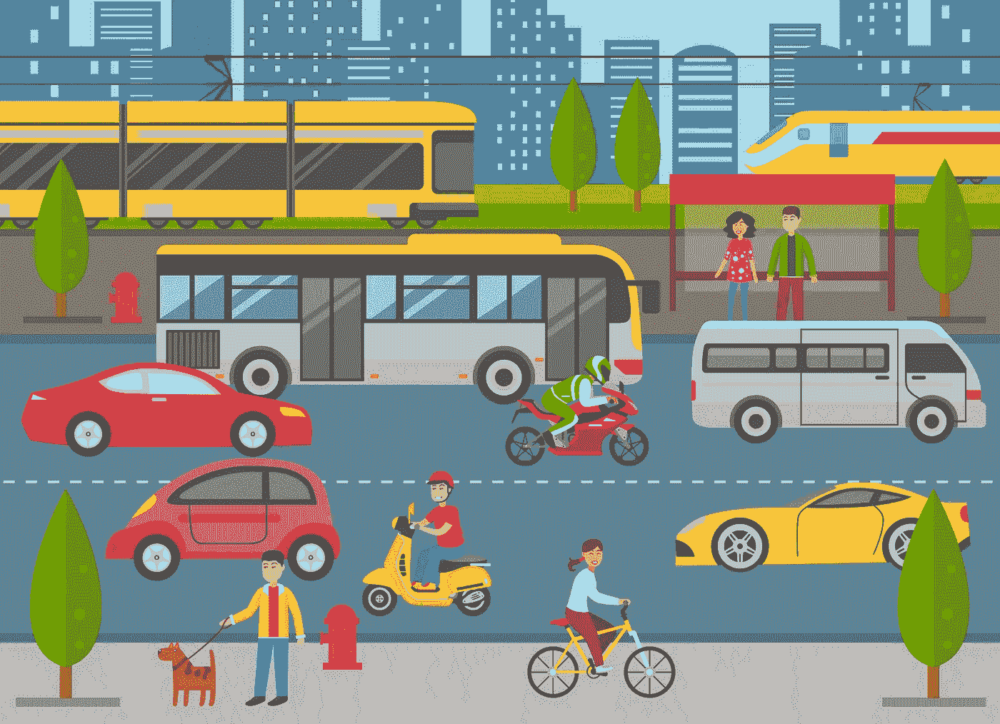
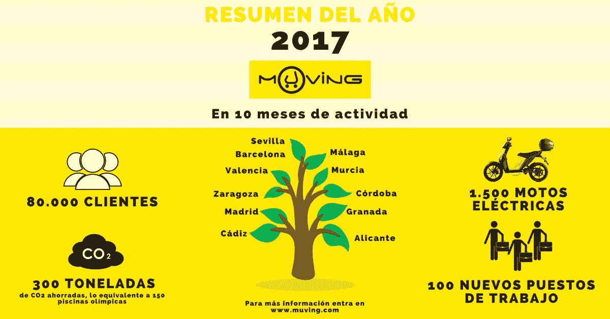
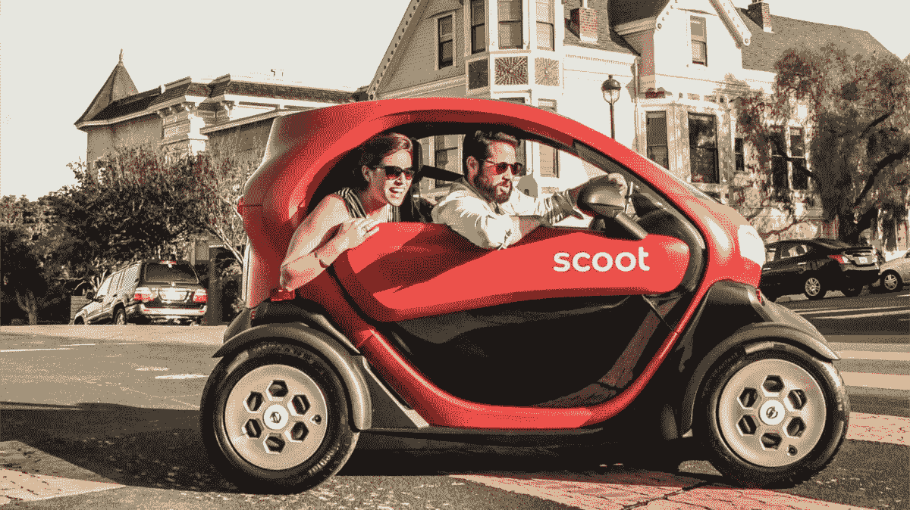

# 其他电动滑板车和超越

> 原文：<https://medium.com/hackernoon/the-other-electric-scooters-and-beyond-c05c4aa09cb4>

## 关键是多式联运——我们城市中的移动性可以受益于电动铲车和电动助力车。

“滑板车在消费者中很受欢迎，”Spin 的联合创始人兼总裁 Euwyn Poon 说，Spin 是一家滑板车共享初创公司，在美国 18 个城市运营，拥有超过 30，000 辆车。

Spin 并不孤单。来自 [LimeBike](https://medium.com/u/881e39a1e63a?source=post_page-----c05c4aa09cb4--------------------------------) 、Bird、[Skip](https://medium.com/u/51ddad1cc327?source=post_page-----c05c4aa09cb4--------------------------------)——当然还有 Spin——的电动滑板车在美国确实变得非常受欢迎，尽管在许可和与城市的合作方面并非没有问题。就在我们说话的时候，他们也在进入欧洲市场，Lime 和 Bird 已经在法国巴黎，并且都在探索新的市场——Lime 盯上了意大利的都灵，Bird 盯上了以色列的特拉维夫。在巴黎，Lime 在推出一个多月后刚刚庆祝了第一批 10 万次骑行。

Lime 和 Bird 也吸引了大量风险投资，它们都很快成为独角兽。

但另一种类型的踏板车，电动助力车，也在一些市场获得了更多的关注，甚至在助力车并不普遍的美国。

Scoot 公司的火红色电动骑行滑板车在旧金山非常受欢迎——电动脚踏滑板车已经被该市暂时叫停。Scoot 声称他们的滑板车已经行驶了近 500 万英里，并且还在继续行驶。除了 Scoot，Muving 还在美国从亚特兰大开始推出，并计划在迈阿密开业，而 Scoobi 现在在匹兹堡运营，其商业模式与 Muving 和 Scoot 非常相似，甚至使用与 Scoot 相同的 GenZe 2.0 踏板车。

Muving stats for 2017, as posted on their LinkedIn page.

总部位于西班牙的 Muving 公司展示了欧洲的无码头电动助力车市场如何比美国更成熟，以及它将如何在美国城市发展。事实上，Muving 已经在西班牙的 12 个城市开展业务，包括巴塞罗那和马德里。另一家西班牙公司 eCooltra 管理着一支超过 3000 辆电动助力车的车队，分布在五个城市:西班牙的巴塞罗那和马德里、葡萄牙的里斯本以及意大利的罗马和米兰。

在我的祖国意大利，标志性的 Vespa 的故乡，MiMoto 已经在米兰开展业务，并宣布将于 9 月在都灵发布，Lime 选择在都灵发布 Lime-S 电动滑板车。

市场发展迅速。它也在快速发展。

例如，Scoot 正在其电动摩托车和电动自行车车队中引入一种电动脚踏式滑板车。

Scoot 的创始人兼首席执行官 Michael Keating 在 [Medium](https://medium.com/u/504c7870fdb6?source=post_page-----c05c4aa09cb4--------------------------------) 的一篇文章中写道:“像 Scoot 这样的共享电动汽车正在改变世界各地的城市。”。“它们正变得更清洁、更安静、更实惠、更方便、更有趣，而且，如果管理和监管得当，它们也会变得更安全。共享电动汽车通过降低驾驶的必要性来实现这一切，而不是通过将人行道变成道路。旧金山采取的规则是合理的。能在其中发挥作用的公司也将在让这座城市和许多其他城市成为更好的居住地方面发挥作用。”

酷航还在欧洲扩张，继巴塞罗那之后，它正在关注几个市场，在比利时、丹麦、法国、德国、希腊、意大利和英国有职位空缺。它还采用了多模式战略，除了电动助力车和踏板车，它还着眼于电动四轮车，以创造他们定义的“21 世纪地铁系统”

Lime 的车队已经包括自行车、电动助力自行车和电动滑板车，它正试图实现同样的目标。

Tweets via [Have A Go](https://medium.com/u/23741ee96a9e?source=post_page-----c05c4aa09cb4--------------------------------)

这家初创公司正在开发一种新型车辆，内部称为“运输舱”。根据彭博的说法，这个概念还处于早期阶段，设计仍在不断变化:“Lime 的计划是建造一个封闭的电动汽车，可以容纳一两个人，类似于智能汽车或豪华高尔夫球车。确切地说，这辆车不是汽车。甚至不清楚它是三个轮子还是四个轮子。但 Lime 的联合创始人兼董事长、布拉德·鲍说，它可以在正常的街道交通中行驶，最高时速可达 40 英里

Tweet via [Emily Castor Warren](https://medium.com/u/930645560d7f?source=post_page-----c05c4aa09cb4--------------------------------).

多模态一直在为 Lime 工作，其[年报告](https://www.limebike.com/hubfs/Lime_Official_One_Year_Report.pdf)“拉开了快速增长的无码头电动滑板车和自行车租赁世界的帷幕”， [John Wachunas@Spinlister](https://medium.com/u/dc0322401533?source=post_page-----c05c4aa09cb4--------------------------------) 在 Lime 的博客上写道。“通过使用从骑手调查和 Lime 平台收集的匿名数据，我们从多个角度审视了我们的指数级骑行增长，包括平均行程距离、首选车辆使用、成本、社会经济地位、交通连通性、行程目的、目的地等。”

Lime 宣布，自 2017 年 6 月在北卡罗来纳州格林斯博罗首次推出以来，它已经超过了 600 万次。

“然而，在旅行本身的背后，是来自数百万智能移动用户的统计数据和故事，揭示了更丰富的故事，”博客帖子写道。“例如，您是否知道超过四分之一的 Lime 乘客报告在他们的最后一次旅行中使用 Lime 连接公共交通？或者一半以上的乘客来自年收入低于 7.5 万美元的家庭？”

 [## 欧洲移动和智能城市的未来

### 意大利都灵正在试验自动驾驶汽车和电动滑板车，而英国伦敦正寻求成为…

hackernoon.com](https://hackernoon.com/the-future-of-mobility-and-smart-cities-in-europe-715424b65f92) 

我们城市的移动性的未来将是令人兴奋的！

我完全同意[马丁·欧玛利](https://medium.com/u/82c9620fb85c?source=post_page-----c05c4aa09cb4--------------------------------)的说法，他是马里兰州前州长，也是交通倡议者:“这不仅仅是解决我们城市的交通问题。它是为人们寻找新的出行方式——比建造一条新的高速公路更可持续、更健康、使用更少资源的方式。我们应该愿意与任何为我们提供私家车替代方案的人合作。谈到移动性，我们需要一种全方位的方法让人们走出汽车。”

欧玛利强调的是，公司、地方和城市管理部门共同努力、合作改善和提高城市交通的重要性。这是推动行业向前发展的真正挑战，也是在一个需要真正颠覆的行业中产生真正影响的真正挑战。

“为了创造一个生态系统，确保这些新模式和现有公共交通之间的良性循环取得成功，政府需要发挥主导作用，”gabe klein 在 [Forbes](https://medium.com/u/3126f7dd42c1?source=post_page-----c05c4aa09cb4--------------------------------) 杂志上写道。“市政府应该站在最前沿，以合作、共同创造的方式塑造这些系统的推出。到目前为止，可以理解的是，城市采用的速度很慢——在试点、学习和重新校准的过程中，它们都在尝试。”