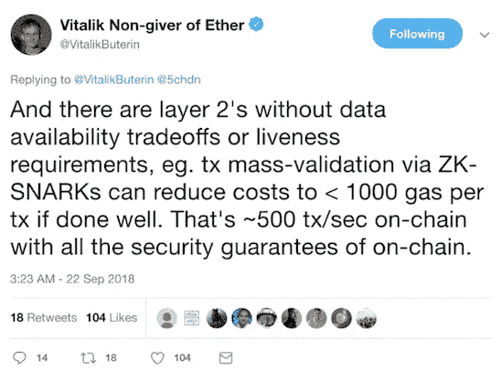

# 鹦鹉和毒蛇:以太坊可扩展性的故事

> 原文：<https://medium.com/hackernoon/the-parrot-and-the-viper-a-tale-of-ethereum-scalability-3fd3fb41d288>

## 或者什么是 zkSnarks，为什么它们很重要

Illustrations by [Lea Filipo](https://www.instagram.com/lea.filipo/).

以太坊的联合创始人维塔利克·布特林[最近称赞了](https://ethresear.ch/t/on-chain-scaling-to-potentially-500-tx-sec-through-mass-tx-validation/3477)一项技术的优点，这项技术可以帮助“极大地”扩展以太坊

以太坊大师和[密码学](https://hackernoon.com/tagged/cryptography)巫师们在讨论什么？

它被称为 zkSnarks(发音为 zee-kay Snarks)，本质上是一种可以验证计算*而*不必执行计算*或*知道执行了什么的技术。这可能有点令人困惑，甚至显得神秘，技术上不可行。为了清楚起见，这里有一个小故事来说明 zkSnarks 的基本原理。

# 双重麻烦

> 我们的故事从一只鹦鹉和一条毒蛇开始，它们有着亲密而又顽皮的关系。这两个朋友正在丛林中潜行，寻找热带美食。

出发后不久，他们发现一棵树上结着两个芒果。经检查，毒蛇兴奋地说芒果是(奇迹般地)一样的！鹦鹉不同意，坚持认为确实有区别。

这场争论有一个很好的理由:蛇是色盲，而鹦鹉有极好的视力。因此，与蝰蛇不同，鹦鹉能分辨出两个芒果颜色的细微差别。鹦鹉提出了一个游戏来证明她是正确的，但希望不要透露这两个芒果有什么不同。毒蛇勉强同意，游戏开始。

每一轮，毒蛇都把两个芒果藏起来不让鹦鹉看到，并选择一个芒果露出来。然后，鹦鹉会判断露出的芒果是否和前一轮中的一样。多轮过后，鹦鹉自诩满分；她每一轮都猜对了。

Illustrations by [Lea Filipo](https://www.instagram.com/lea.filipo/).

随着每一轮的继续，这两种水果越来越有可能不同。不然鹦鹉怎么能每次都猜对呢？面对鹦鹉的成功，毒蛇别无选择，只能承认两个芒果确实不同。你可以把鹦鹉想象成证明者，把毒蛇想象成验证者。

这个被公认为奇怪的故事说明了 *zk* Snarks 的‘零知识’或 *zk* 属性。在上面的互动中，鹦鹉说服毒蛇某个陈述是真的(两个芒果是不同的)*而没有*透露*为什么*是真的(因为它们是不同的颜色)。这种框架应该与我们在文章开头给出的定义很相似。

> 以这个故事的核心概念为基础，加入一点密码学，把它扔进区块链的世界，你会得到一个粗略但可口的 zkSnarks 的近似值。

**现在我们已经了解了 zkSnarks *如何工作*，让我们看看它们能*做什么*。**

# 冒险一试

在我们讨论 zkSnarks 如何帮助“大量”扩展以太坊之前，还有另一个用例值得一提:隐私。像 [Zcash](https://z.cash/) 这样的加密项目使用它们来维护公开验证的分类账，同时屏蔽参与者身份并保持交易数据匿名。

它是如何工作的？回想一下鹦鹉的游戏。但是，除了恶作剧和芒果，想想代币和转让。简而言之，有人可以证明代币的所有权，并将其发送给其他人*，而*不会泄露代币的价值*或*接收者的身份。同样，这种框架应该与我们在文章开头给出的定义很相似。

## 可量测性

隐私无疑是很酷的。但是开发人员很快意识到 zkSnarks 也可以缓解以太坊的可伸缩性问题。ZkSnarks 可以用来生成小而整洁的计算证明——即使正在讨论的计算是在链外执行的，也就是说，不受以太网的限制。

简单地验证这些证明之一的过程比必须在以太网上执行计算更便宜和更快。因此， **zkSnark 证明可以在*链外*生成，然后在*链上*验证。**这个过程基本上把繁重的计算任务卸载到链外的计算资源上，从而释放了更加有限的链上资源。

换句话说，这个过程实质上减少了每次计算所需的链上资源的数量。如果每次计算消耗更少的资源，以太坊网络可以处理更多的资源。最终结果？更大的可扩展性。

至关重要的是，zkSnarks 维护了链上计算的[安全保证](https://twitter.com/vitalikbuterin/status/1043445576044560389?lang=en)。也就是说，您仍然可以证明您以不可信的方式运行了您的程序或执行了某个智能合约。

Vitalik Buterin preaching the gospel of zkSnarks.

正如 Buterin 在这条推文中提到的，zkSnark 被认为是“第二层”解决方案，这意味着它可以在不改变区块链本身的情况下实现。但是，与其他“第二层”解决方案不同，如[等离子](https://plasma.io/)或[雷电](https://raiden.network/)，zkSnarks 不需要将数据保存在链外。(出于好奇，一个“第一层”解决方案，像[分片](https://github.com/ethereum/wiki/wiki/Sharding-FAQs)，直接改变了基础层区块链的功能。)

# 前方的路

zkSnarks 不是银弹。它不会在一夜之间克服以太坊的可扩展性限制。而且它仍然面临许多技术障碍。虽然聪明的解决方案已经在工作中(例如[这个](https://eprint.iacr.org/2018/691.pdf))，但 zkSnarks 的真正承诺是耐心等待现实世界的部署和实施。

尽管这种技术还处于萌芽状态，但它代表了一条通向更具功能的以太坊网络的充满希望的道路。Vitalik Buterin 估计 **zkSnarks 可以将以太坊网络的吞吐量从每秒 15 笔交易提高到 500 笔交易**——提高了 30 多倍。虽然这肯定是一个夸张的说法，但布特林并不是众所周知的双曲线型。如果他是对的，谴责以太坊无法处理 CryptoKitty 交易的头条新闻可能(如上帝所愿)成为过去。

## 其他资源

[*看看*](https://github.com/gnosis/dex-zksnarks)*Gnosis 开发者在用 zkSnarks 做什么。*

[*这里有一个教程*](https://blog.gnosis.pm/getting-started-with-zksnarks-zokrates-61e4f8e66bcc) *是关于部署来自 Gnosis 的开发者 Felix 的 zkSnarks 的。*

[*跟随*](https://twitter.com/gnosispm?lang=en) *的灵知上推特。*

[*在 Twitter 上关注*](https://twitter.com/EricHeydorn?lang=en) *我。*

非常感谢劳伦·邓莫尔、丽·菲利波维茨、迷离情骇·贝尼和凯·克鲁特勒。