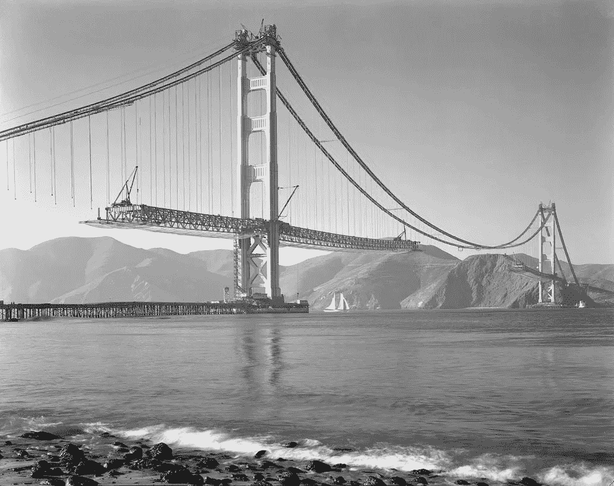

# 过去是序幕

> 原文：<https://medium.com/hackernoon/the-past-is-prologue-15cd3bb2b928>

San Francisco Ferry Building from Market Street (circa 1898)

> “我们都被大海吞没了，虽然有些人又被抛了回来，但那是命运的安排，我们要表演一幕幕
> 过去的**是序幕，未来的**是你我的
> 。”
> 
> —《暴风雨》,威廉·莎士比亚

随着 2017 年即将结束，反思过去 12 个月的变化是合适的。但是时间的流逝是连续的，如果把时间累积到几年甚至几十年，变化会更加明显。

旧金山于 1776 年作为西班牙殖民地建立，同年美国宣布脱离英国独立。作为美墨战争的让步，加利福尼亚(和旧金山)于 1848 年成为美国的一部分。加利福尼亚淘金热(1848-1849)给旧金山带来了经济的腾飞，因为勤劳的人们涌入该地区寻找他们的财富。到 19 世纪末，旧金山是西海岸人口最多的城市。

旧金山渡轮大楼于 1898 年开业，作为这座新兴城市的交通枢纽。渡轮大楼很快成为世界上最繁忙的交通枢纽之一，仅次于伦敦的查林十字车站。它已经见证了自己的历史；这座精心建造的建筑经受住了 1906 年 7.8 级地震(摧毁了 80%的城市)和 1989 年 6.9 级地震的考验。

轮渡大楼的显著特征是其 245 英尺(75 米)高的钟楼。它仍然保存着 1898 年制造的原始时钟——世界上最大的发条机械钟。钟面提醒人们时间的流逝和旧金山的发展。

在旧金山，轮渡大楼是每个除夕庆祝活动的焦点。午夜钟声敲响的时候，古老的大钟迎来了新年，同时沐浴在欢庆的焰火中。

> “他踩着水，
> 他把仇恨抛在一边，胸前
> 最汹涌的波浪遇见他；他勇敢的头在他保持的有争议的波浪之上。"

直到 20 世纪 30 年代海湾大桥和金门大桥建成之前，渡船是横跨旧金山湾的唯一交通方式。

金门大桥横跨 1 英里(1.6 公里)的海峡，连接太平洋和旧金山湾。吊桥于 1937 年 5 月完工并开放；过去的一年是它成立 80 周年。

Hanging the Roadway from the Golden Gate Bridge (1937)

由于汹涌的潮汐和频繁的强风，专家们怀疑是否能在海峡上建一座桥。

1933 年 1 月开始施工，大桥提前完工，且低于预算。

在它开放的时候，它是世界上最长和最高的吊桥。它仍然是美国最高的桥梁

海湾大桥和金门大桥同时建造。1933 年 7 月开工，1936 年 11 月竣工。海湾大桥西部通道连接旧金山和芳草地岛；它的东部通道将耶尔巴布埃纳岛与奥克兰市连接起来。

1989 年，洛马普列塔地震导致海湾大桥东段坍塌。该路段包括一座双平衡悬臂桥、五座桁架桥和两座桁架堤道。1989 年地震后，更换海湾大桥东道口是不可避免的。

Self-Anchored Suspension Span of the Bay Bridge (2015)

海湾大桥新东段的建设始于 2002 年，于 2013 年完工。新的东段包括一座独塔自锚式悬跨。

它对地震威胁的抵御能力要强得多。

海湾大桥两侧有东西向车道，是世界上跨度最大的桥梁。

> “我会把一切都交付的；答应你平静的海面，吉祥的风，快速航行，让你的皇家舰队远远赶上 T2

机动车辆在 20 世纪 30 年代已经很普遍，旧金山的两座桥是为了运载车辆——主要是汽车——而建造的。几乎每个人都把汽车与亨利·福特联系在一起。

Henry Ford with his Quadricycle (1896)

但是福特对汽车工业最大的贡献不是他的第一辆车(四轮车)或 t 型车。

相反，是福特在制造方面的创新使得汽车被广泛采用。

T 型车的移动装配线于 1913 年 10 月开始运行，使得每辆车的生产只需 93 分钟——比油漆干的时间还快！

自从第一条汽车移动装配线出现以来，100 多年过去了。每年，超过 50 个国家生产 1 亿辆汽车。1950 年，美国生产了 80%的机动车辆，但今天这个比例只有 12%左右。2016 年，中国生产了 2800 万辆汽车，是美国的四倍。

在过去的一个世纪里，尽管电动汽车是最早的汽车之一，但汽车的主要推进方式一直是内燃机。1900 年，美国 28%的汽车是电动的。但是由于蓄电池的限制和廉价石油的供应，电动汽车的普及程度下降了。

Elon Musk and the Tesla Model S (2011)

近几十年来，人们对电动汽车的兴趣有所恢复，这主要是由于燃烧化石燃料带来的环境问题。

处于电动汽车复兴最前沿的是特斯拉首席执行官埃隆·马斯克。

每辆特斯拉汽车都包含数千个小型锂离子电池来储存电力。这种方法使得特斯拉汽车的电池更便宜、更轻。

特斯拉 Model S 是 2015 年和 2016 年全球最畅销的插电式电动汽车。2017 年 9 月，特斯拉全球汽车销量超过 25 万辆。

加州是美国最大的插电式汽车区域市场。2010 年 12 月至 2015 年 3 月期间，在美国销售的所有插电式电动汽车中，超过 46%是在加州销售的。经过 100 年的技术进步，电动汽车将在全球范围内广泛采用。

> 不要飞翔，不要游泳，不要跳入火中，不要在卷曲的云上飞翔

汽车(以及随之而来的基础设施)的发展使人们能够在地面上进行长途旅行。随着飞机的发明，这个世界变得更加触手可及。

人类渴望飞行已经有两千多年了。最早的飞行是公元前几百年，在中国以载人风筝的形式出现。15 世纪中期，达芬奇研究了鸟类飞行，设计了一架悬挂式滑翔机，有固定的翅膀和控制面(虽然它不会飞)。滑翔机的实验为重于空气的飞行器奠定了基础。

First flight of the [Wright Flyer](https://en.wikipedia.org/wiki/Wright_Flyer) I (December 1903)

奥维尔和威尔伯·赖特在 1900 年开始实验滑翔机。他们定义并发展了三轴飞行控制:滚转、俯仰和偏航。

1903 年，兄弟俩建造了莱特飞行器 I，一架动力滑翔机。奥维尔于 1903 年 12 月 17 日成功实现了首次动力飞行:120 英尺(37 米)，速度为每小时 6.8 英里(10.9 公里/小时)。

在过去的一个世纪里，发动机技术和空气动力学的进步造就了一个全新的产业:现代商业飞行。

Boeing 787 Dreamliner before takeoff from SFO (September 2016)

根据世界银行的数据，[2016 年飞机运送了 36.9 亿乘客](https://data.worldbank.org/indicator/IS.AIR.PSGR)——比 1970 年增加了十倍。

2016 年，乘客数量排名前三的国家是:美国(8.23 亿)、中国(4.88 亿)和英国(1.48 亿)。

目前有五大民用飞机制造商:空中客车(欧洲)、波音(美国)、庞巴迪(加拿大)、巴西航空工业公司(巴西)、联合飞机公司(俄罗斯)。但是飞机制造商的前景正在发生变化:

*   2017 年 10 月:空客[宣布与庞巴迪](http://www.airbus.com/newsroom/press-releases/en/2017/10/airbus-bombardier-cseries-agreement.html)合作
*   2017 年 12 月:surface 报道称，波音[想要收购](http://fortune.com/2017/12/21/boeing-embraer-takeover-talks/)巴西航空工业公司

技术进步催生新产业。随着这些新兴产业的扩张，企业开始为不断增长的潜在市场提供服务。随着时间的推移，最好的竞争对手获得市场主导地位，行业整合。2017 年飞机制造业就是这样。

> "云盖塔，华丽的宫殿，庄严的庙宇，伟大的地球本身."

随着新技术和产业的兴起，旧金山的自然景观也发生了变化:它确实在上升。

几十年来，旧金山的天际线一直被标志性的泛美金字塔所定义。这座建筑被委托作为人寿保险和投资公司的同名控股公司的总部。1969 年开始建设，1972 年完工。

Construction of the Transamerica Pyramid (1969)

泛美金字塔高达 853 英尺(260 米)。1972 年竣工时，它是世界上第八高的建筑。自 1972 年建成以来，它一直是旧金山最高的建筑。

Salesforce Tower rising between two SF landmarks (2017)

但截至 2017 年，泛美金字塔是该市第二高的建筑。随着新的 Salesforce Tower 在旧金山景观中确立自己的地位，这是一次换岗。

My tour of Salesforce Tower under construction (September 2016)

Salesforce Tower(原名 Transbay Tower)超过了泛美金字塔，成为旧金山最高的摩天大楼。它的屋顶高度为 970 英尺(296 米)，总高度为 1070 英尺(326 米)

Salesforce Tower 的崛起预示着该市科技产业的主导地位。根据来自房地产公司 CRBE 的一份[研究报告](https://www.cbre.us/research-and-reports/Tech-30-2017)，旧金山有超过 79，000 个高科技工作岗位。附近的一座大楼——也在建设中——将容纳数千名[脸书](https://hackernoon.com/tagged/facebook)员工。

其他总部位于旧金山的科技公司包括:Airbnb、Affirm、Anaplan、AppDirect、比特币基地、Credit Karma、Docker、DocuSign、Dropbox、Eero、Eventbrite、Fastly、Fitbit、Flexport、Github、Instacart、Intercom、LendingHome、LendUp、Lyft、Medium、Mulesoft、Niantic、Nextdoor、Okta、Opendoor、Optimizely、Patreon、Pinterest、Postmates、Reddit、Ripple、Slack、Splunk、StitchFix、Square、Stripe、图钉、Twitter

几乎有数百家其他科技创业公司的总部设在这座城市。

这是旧金山的演变，与它的过去一致:那些寻找机会的人的目的地。但是这次淘金热是数字化的。

> “现在我会相信有独角兽”
> 
> —《暴风雨》,威廉·莎士比亚