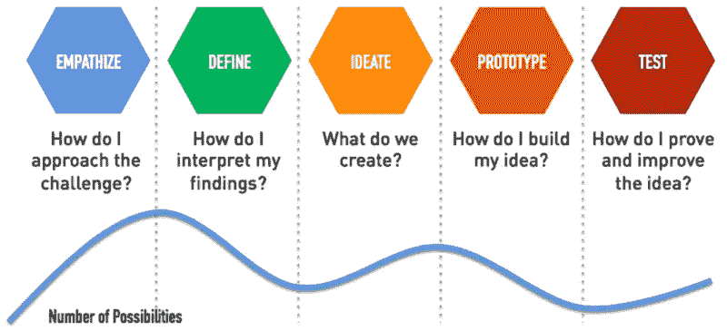

# 设计思维的过去、现在和未来

> 原文：<https://medium.com/hackernoon/the-past-present-and-the-future-of-design-thinking-2a07d02193c7>

Inspiration: [Intercom](http://The past, present and the future of Design Thinking)

今天，我们将重点转移到设计思维上。在我们的上一篇博客中，我们讨论了[设计解决方案](https://hackernoon.com/design-solutions-is-the-only-solution-left-that-can-save-your-startup-5f6701e561a8?source=user_profile---------2------------------)。我们宣称和设计的解决方案与我们同在，永垂不朽。

> 但今天的产品驱动型组织需要一个“啊哈”时刻来意识到这一点，并让它为自己服务。

这种预感被称为**设计思维。**

今天，我们将深入探讨那些已经接受了被称为设计思维的冒险的企业和产品。

# **前奏:**

互联网上有很多关于设计思维的内容，我们没有什么新的东西可以添加。

对于初学者和新手，我们将分享最著名的设计思维框架，看起来像-

让我们看看谁能最大限度地利用这一概念，并[打造伟大的产品](https://www.dreamtoipo.com/case-study/abhyaasa.html)。

# **谷歌搜索引擎:设计思维和持续迭代的案例研究**

> **谷歌搜索引擎界面的演变**

谷歌不断更新他们的搜索引擎和其他产品，以引起用户的共鸣。

当然，不像雅虎

他们是第一个破解代码的人——用户**会去搜索引擎搜索**而不是点击广告。

谷歌决定并设计展示唯一的重要元素。

今天的谷歌 Chrome 显示了谷歌对设计思维的重视程度。

他们最近的 Chrome 改造被称为**“拆箱 Chrome”**，Chrome 已经摆脱了他们典型的盒子。

如果你想知道他们的设计思维过程是如何进行的，为什么要这样做，那就去看看 https://medium.com/@san_toki/unboxing-chrome-f6af7b8161a2 吧

谷歌不是唯一重视设计的聪明公司。

# 苹果公司以他们设计驱动的产品而闻名

iphone 树立了标杆。但是它并不是唯一重申设计思维好处的产品。

苹果耳塞的演变就是一个很好的例子。

> 今天，大多数产品和企业都将设计思维放在产品战略的核心，不仅仅是为了打造更好的产品，甚至是为了对抗最糟糕的噩梦。

# 见见脸书。

脸书最近因传播虚假新闻和错误信息而面临巨大挑战和批评。

这是一项艰巨的任务，他们几乎没做什么决定，更不用说专注于设计思维了。

他们的措施是

> 我们**让人们更容易报道他们认为是假消息的故事**
> 
> 我们与独立的事实核查组织合作，审查可能是虚假的文章
> 
> 我们减少了被事实审查员质疑的文章的分发
> 
> 我们推出了**功能集**，在事实审查员对一篇文章提出质疑时提醒人们，并让人们知道他们是否分享了或将要分享虚假新闻。

脸书团队采用的功能和新立场是由设计团队指导的**，从提出一个名为“红旗”的功能到“在分享之前通知人们有争议的帖子”。**

很少能看到他们设计的东西-

# **如今，设计思维驱动着脸书。**

在一次采访中，脸书产品工程师 Debasish Paul 强调了设计师在脸书是多么受重视。

以下是采访摘录-

> ***坦纳:*** *怎么会这样？*
> 
> ***Deb:*** *在脸书，就不一样了，设计是决策的前沿，设计师为战略出谋划策。我们是整个团队的核心部分。*

更多[此处](/facebook-design/an-interview-with-facebook-product-designer-debashish-paul-4371adfa4725)

脸书主张社会交流，他们认为设计思维是建立一个平台来连接更多人的方式。

> 如果说脸书致力于保护社交沟通，那么对讲机则正在设计思维的驱动下变革商务沟通。

Intercom 知道客户的价值和他们带来的创新，以及他们通过“应用内消息系统”和助手提供的支持。

他们也越来越多地深入了解和教育什么是真正的“设计思维”。

为了清除混乱，对讲机提出了设计原则。

**应用内消息的设计原则。这里读**

****

****Bot 设计原则。在这里阅读****

********

****不仅是新时代的创业公司，像 IBM 这样的商业巨头也开始接受设计思维，以帮助企业适应设计思维，并推动商业规模化。****

# ****这是 IBM 设计思想的承诺-****

# ****“大规模解决当今问题的新方法。****

> ****我们没有发明设计思维，但我们确实根据现代企业的独特需求对其进行了调整。看看它能为你和你的团队做些什么。"****

****他们设计了一个设计框架来驱动设计思维，他们称之为“**为现代企业重新设想的设计思维。”******

****这是重新设想的设计思维的样子-****

********

******IBM** 设计思维雄心勃勃，正在以现代数字企业**的速度和规模**帮助企业解决用户的问题。****

****速度和规模是 IBM 设计思维的两个重要关键因素，以及对用户问题感同身受并以设计解决方案解决它们的基本要素。****

> ****这与谷歌的设计冲刺相匹配。****
> 
> ****设计冲刺是一个五阶段框架，通过快速原型和用户测试来帮助回答关键的业务问题。****

********

****该流程有助于激发创新，鼓励以用户为中心的思维，让每个设计团队成员都有一个共同的愿景，并让您更快地推出产品。****

****[**更此处**](https://designsprintkit.withgoogle.com/)****

****如今，设计思维是每个产品驱动型创业公司事实上需要解决的挑战。****

> ****那些成功运用它的人是-****

# ****松弛的****

****他们的设计方针简单、直观、有效，就像他们的产品一样-****

********

> ****[了解你的受众](https://api.slack.com/best-practices/understand-your-audience)****
> 
> ****[概述您的用例](https://api.slack.com/best-practices/outline-use-cases)****
> 
> ****[消息指南](https://api.slack.com/best-practices/message-guidelines)****
> 
> ****[故事板每个交互看起来如何](https://api.slack.com/best-practices/storyboarding)****
> 
> ****[汗流浃背的小事](https://api.slack.com/best-practices/the-small-stuff)****
> 
> ****[声音和语气:清晰地交流](https://api.slack.com/best-practices/voice-and-tone)****
> 
> ****[创造良好的入职体验](https://api.slack.com/best-practices/onboarding)****
> 
> ****[在懈怠中做一个好公民](https://api.slack.com/best-practices/citizenship)****
> 
> ****[简单的该做和不该做的事](https://api.slack.com/best-practices/dos-and-donts)****

# ****阿萨纳****

********

****Asana 也觉得需要设计思维来使他们的产品更好。他们领先一步，开发了一个设计系统，使他们的产品更好。****

> ****他们称之为设计工作的未来。****

******设计系统里有什么？******

****我们深入研究他们的博客，以更好地理解他们的过程，他们的方法包括-****

> ****从做不可扩展的事情开始****
> 
> ****不要把你的指导方针武器化****
> 
> ****让我们全部重新设计吧****
> 
> ****为您的设计系统获得跨职能支持****
> 
> ****超越风格指南****
> 
> ****有人监督系统，但确保每个人都有所贡献****

****其中最重要的是-****

> *****“设计系统是赋权的工具，而不是控制设计的武器。”*****

****因此，我们发现设计师如何提出一个设计系统来塑造他们的设计思维。****

# ****看看 Dropbox。****

****一个正在写作的创业公司，坚持不懈地分享他们如何设计和为什么要设计。****

****如果我们仔细观察他们的产品(我们使用 Dropbox，所以我们可以担保)，我们可以看到他们的设计思想是如何很好地塑造他们的产品的。****

********

****除了常规的设计思维周期，他们还在为他们的设计师精心打造一个强大的设计品牌，以下是其中的一瞥-****

# ****Dropbox 设计品牌****

> *****当我们开始思考我们团队的故事时，我们开始探索 Dropbox 设计的品牌。不是 Dropbox 的品牌，而是 Dropbox 的设计品牌。*****

****看到设计思维在今天的商业世界中是一种规范，这是非常令人惊讶和高兴的。****

****我们可以继续，继续设计思维驱动的产品，以及他们的设计师如何提出他们自己的模板和他们版本的设计思维[来完成事情](https://www.dreamtoipo.com/case-study/femwell.html)。****

****这还不是全部。****

# ******设计思维的未来******

****今天，设计师们知道他们要做什么重要的工作，他们坚定而谨慎，不仅仅是为了制造更好的产品，也是为了塑造更美好的未来。****

****我们将给你留下 Basecamp 设计师乔纳斯·唐尼最近博客的摘录。****

> ****如果你是一名设计师，问问你自己这个问题。****

> ****你的工作是有益还是有害？你可能乐观地欺骗自己，相信它总是*有帮助的，因为你是一个好人，设计是一项看似高尚的努力，而且你有良好的意图。*****
> 
> ****但是让我们坦诚一分钟。****
> 
> ******如果你正在设计** [**有粘性的功能**](https://www.inc.com/walter-chen/how-to-use-fomo-to-make-your-app-insanely-sticky.html) **旨在最大化人们使用你的产品的时间**而不是在他们的生活中做其他事情，这有帮助吗？****
> 
> ******如果你试图拼命地** [**夸大你平台上的人数**](https://theintercept.com/2017/11/06/how-twitter-secretly-benefits-from-bots-and-fake-accounts/) 这样你就可以向你的股东报告公司的增长，这有帮助吗？****
> 
> ******如果你的商业模式是依靠** [**使用黑暗模式**](https://medium.muz.li/malachidigest-3cad286bba02) **或者欺骗性营销**来骗用户点击广告，那有帮助吗？****
> 
> ****如果你试图用自动化技术取代有意义的人类文化，这有帮助吗？****
> 
> ******如果你的企业** [**收集并出售关于人的个人资料**](https://www.nytimes.com/2017/11/09/business/equifax-data-breach.html?_r=0) ，那有帮助吗？****
> 
> ******如果你的公司正在不择手段地争取******，这有帮助吗？********
> 
> ******如果你做了那些事…******
> 
> ******你到底是不是设计师？******
> 
> ******或者你是一个被美化的小贩——一个在开放式办公室里有着花哨头衔的自高自大的宣传艺术家？******
> 
> ******无论我们选择承认与否，设计师都有权力和责任阻止我们的产品变得不必要的侵犯性、上瘾性、不诚实或有害。我们可以继续假装这是别人的工作，其实不是。这是我们的工作。******
> 
> ******我们是保护人们隐私、安全和理智的第一道防线。在很多很多情况下，我们现在都没有做到这一点。******

> ******今天，在围绕产品习惯的狂热之前，设计思维不再局限于制造更好的产品。为了更好的未来，它也在表明立场。******

## ******你怎么看待设计思维？你的[产品](https://www.dreamtoipo.com)是由设计思维方法驱动的吗？我们很想知道你的意见。与我们分享。******