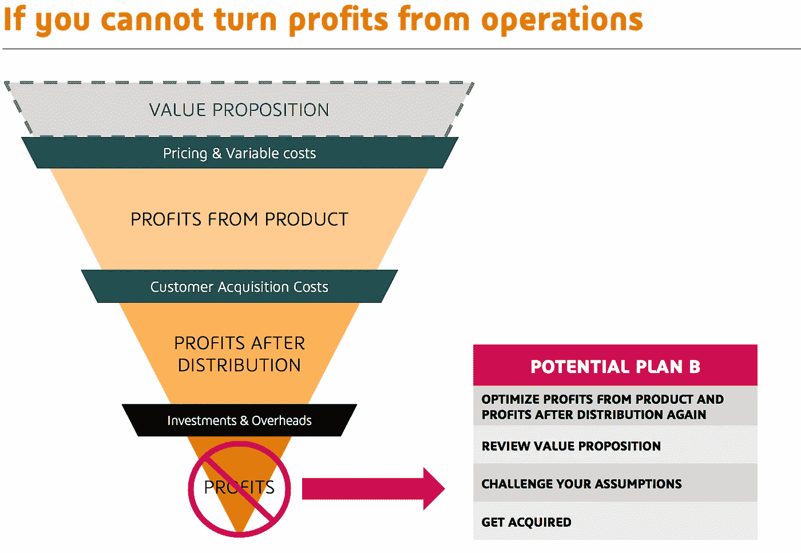

# 通往利润的道路

> 原文：<https://medium.com/hackernoon/the-path-to-profits-50826d53d947>

## 有很多赚钱的产品，但很少有赚钱的公司

*免责声明:这篇文章相当长。我以幻灯片的形式做了一个总结。你可以在这里* [*下载卡牌*](https://goo.gl/mSwvg7) *。*

我看到很多企业家。事实上，这是我这些天来与企业家交谈的工作。令人惊讶的是，他们都有一个共同点。

**他们都有赚钱的产品。**

企业家是伟大的产品人。他们擅长制造令人惊叹的产品和提供颠覆性的客户体验。因此，他们倾向于专注于第一阶段的盈利:创造一个有利可图的产品。他们通常的意思是:*销售价格——商品销售成本。*

但是一个有利可图的产品并不能造就一个有利可图的公司。

把一个产品变成一个[公司](https://pitchdeckpick.com/)需要[分销](https://hackernoon.com/tagged/distribution)和运营资源。因此，我与有才华的企业家一起工作，帮助他们了解他们在盈利之旅中所处的位置。

*利润之路是一个简单的框架，首席执行官和企业家可以用它来快速确定他们公司的财务成熟阶段，以及他们应该考虑的将他们的产品变成盈利公司的杠杆和选项。*

**

# *1.产品利润*

## *1.1.定义*

*首先，你要了解每次你提出价值主张时，你能获得多少利润。换句话说，你卖出的每件产品，你赚了多少利润(不包括销售费用)？*

*以单位为基础进行推理是至关重要的。你要确保**识别和隔离交付产品所需的可变成本**。*

**

## *1.2.产品利润的构成*

*以下是最常见的可变成本类别:*

*   ***人力资本:维护和支持、账户设置、账户管理……**例如，如果你的每笔销售，客户经理都要花半天时间配置客户账户，这半天时间应该计入你的可变成本。另一方面，CEO 的薪酬并不是产品的可变成本。*
*   ***基础设施(存储、托管、计算……)**。别忘了按单位计算。*
*   ***外部服务(API、产品的子组件……)***
*   ***销货成本(COGS)***
*   ***运费和物流费用***

## *1.3.从产品中获取或优化利润的杠杆*

**

> ***挑战您的定价***

> **价格是你付出的，价值是你得到的* ——沃伦·巴菲特*

***定价是提高盈利能力的最强有力的杠杆，因为它决定了收入，即你的利润和亏损的最高数字。***

*很有可能你的定价非常随意，或者，充其量，你过于依赖直觉或竞争对手/替代产品的基准。*

*如果你想(也应该)在定价方面下功夫，我推荐阅读[这篇很棒的文章](https://blog.boost.atelier.bnpparibas/pricing-set-up-for-start-ups-3948ba6de86d)，他精彩地指出了定价策略的注意事项，并给出了通过定价优化捕获价值的可行方法。*

> ***可变成本工作***

*   *你能自动化某些任务吗？在做可重复的任务时，计算机通常比人便宜*
*   ***您能否改进入职流程或/和用户界面**以降低与客户管理相关的成本？*
*   ***你能简化这项工作吗？例如，你能把一项任务分成更小的简单任务吗？通过降低任务的复杂性，将部分工作外包给不太合格的工人会变得更容易，从而降低成本***
*   *你能和你的供应商谈判更好的条件吗？*
*   *你能通过关注对你的价值主张至关重要的关键特性来降低产品的复杂性吗？确保您摆脱了每一个增加复杂性从而推高成本的非核心功能*

> ***预期阈值***

*在一些罕见的情况下，企业家维持无利可图的产品。以下是可以证明这种情况的理由:*

*   ***预计可变成本的构成会减少**(例如:虚拟现实公司预计硬件会大幅减少)*
*   ***对未来流程自动化的预期**。在人力成本的情况下，从构建手工交付的产品开始，以验证您的价值主张。这在经济上没有意义，但如果价值主张吸引目标客户，您将能够自动完成任务，并将其成本降至几乎为零*
*   *对批量折扣的预期:当销售增加时，你的产品将变得有利可图*

*对这种预期要非常小心。原因有三:*

*1.你在推迟对产品盈利能力问题的实证回答*

*2.你不应该低估获得大销量的成本，也不应该高估你的市场规模*

*3.你不应该低估将手工完成的任务自动化所需的投资*

## *1.4.如果你不能从产品中获利*

*拥有非盈利产品的初创公司价值不大，除非它们(I)拥有目标客户迫切需要的关键价值主张，以及(ii)难以复制，因为它们拥有知识产权、技术诀窍和秘方…*

*如果你不在那个位置，那么你的选择将是被你所在领域的一家更大的公司收购或“聘用”。*

*否则，如果你手头还有现金，就试着旋转一下，或者如果你手头没钱，就停下来做点别的事情！*

**

# *2.分配后利润*

## *2.1.定义*

> **销售不佳——而非产品——是失败的头号原因。* —彼得·泰尔*

*分销后获得利润意味着在你的产品利润减去你的客户获取成本后，你仍然是盈利的。*

*你的客户获取成本或 CAC 是**你必须花费的销售和营销费用来获得新客户**。*

**

*实事求是地说，**，**通常很难有一个精确而有意义的 CAC，因为它会随着你(I)发现和打开新的获取渠道(ii)提高每个渠道的销售效率而不断发展。*

*尽管如此，你不想错过的是你的 CAC 的数量级。*

*让我解释一下。*

## *2.2.分配后利润的构成*

*根据你的目标客户(财富 500 强、中小企业、消费者……)和你的价位(低于 10€，超过 10 万€ /年……)，**你可以大致了解你的** [**销售复杂性**](http://www.forentrepreneurs.com/sales-complexity/) **。***

**

*   ***低销售复杂性**意味着无接触销售，即没有销售人员。客户获取是通过营销渠道完成的*
*   ***中等销售复杂性**意味着销售人员通过电话进行销售，他们不需要亲自拜访客户，也不需要在达成交易前进行多次交谈*
*   ***高销售复杂性**意味着销售人员在现场拜访客户，通常销售周期很长*
*   ***渠道分配**不在这里讨论，因为初创公司很少使用它*

*显然，**越复杂的销售越贵。***

*对我们来说幸运的是，[企业家和风投](http://dskok.wpengine.netdna-cdn.com/wp-content/uploads/2010/04/image13.png)已经写下了他们在 CAC 主题上的经历，并帮助我们根据销售复杂性对 CAC 有一个大致的了解。*

**

*Do not take for granted these order of magnitude as they will vary from each industry. Also, they may be estimates for the EU and US markets but could differ other countries.*

## *2.3.分配后优化利润的杠杆*

*首先，有一种情况，分销后没有利润是可以的:当你寻找[你的前 10 个客户](https://stripe.com/atlas/guides/starting-sales?locale=fr)。在这种情况下，你仍在试图验证你的价值主张，你将不得不用[不可扩展且无利可图的销售模式](http://paulgraham.com/ds.html)手动获得这些首批客户。*

***当您的价值主张得到验证，并已销售给 10 多个客户时，您就在寻找可重复且有利可图的销售模式。***

*如果你处于这种微妙的情况下，你的 CAC 大于你的产品利润(或生命周期价值/ LTV)，这里有几个选择供你选择。*

**

> ***确定新的销售渠道。***

*你确定你用来寻找新客户或线索的渠道足够有效吗？*

*[Gabriel Weinberg](/@yegg) 已经确定了 [**19 种营销渠道来寻找销售线索和客户**](/@yegg/the-19-channels-you-can-use-to-get-traction-93c762d19339) 。用同一作者的[牛眼框架](/@yegg/the-bullseye-framework-for-getting-traction-ef49d05bfd7e)来评价它们。*

> ***优化现有销售&营销渠道，很多。***

*一些营销工具，尤其是付费搜索和付费社交媒体，越来越复杂。营销团队通常不是每个渠道的专家，可能会优化购买策略，导致昂贵的每次点击成本或类似指标。*

*毫不犹豫地为每个渠道聘请专业顾问或代理。和他们一起建立账户并向他们学习。让他们教你如何处理一个特定的渠道，然后你才能将专业知识内化。*

> ***组建你的销售团队***

*对于中等复杂程度和高复杂程度的销售模式，您将拥有销售人员。销售人员很贵。销售团队越有经验，价格就越贵。*

*销售人员通常负责整个销售过程，从识别销售线索到追踪销售线索；这充其量是次优的。*

*将你的整个销售过程分成几个部分。 [**围绕子部分**](http://amzn.to/2hORGGt) **构建你的销售团队，让最贵的销售人员参与到流程中更复杂的部分。与缺乏经验的销售人员合作，处理更简单的子部分(识别销售线索、陌生电话、发电子邮件……)。***

> ***降低销售复杂性***

*如果你已经尝试了以上所有方法，并且仍然在寻找一个有利可图的分销模式，你应该考虑降低你的销售复杂性。*

***也许你的销售模式与你的目标市场或价格点不一致。***

*也许你不需要现场销售人员，你可以用内部销售代表来代替他们，他们会得到合格的销售线索。也许你根本不需要销售人员，应该有一个付费的收购策略？*

*请看这张图，它总结了增加/降低销售复杂性的各种因素:*

**

*Source: [http://www.forentrepreneurs.com/startup-killer/](http://www.forentrepreneurs.com/startup-killer/)*

> ***检查您的定价***

*再一次，[尝试检查您的定价](https://blog.boost.atelier.bnpparibas/pricing-set-up-for-start-ups-3948ba6de86d)。定价必须考虑分销成本。分销是价格的主要组成部分。*

## *2.4.如果分配后不能扭亏为盈*

> ***挑战您的价值主张&目标细分市场***

*尝试回顾您的价值主张:*

*   *你的产品需要更多的功能和更多的价值吗？*
*   *相反，你需要缩减你的功能和简化你的产品吗？*

*通过玩弄价值光标，您将能够考虑其他可能更符合您当前销售模式的目标细分市场。*

> ***被你所在行业的大公司收购***

*如果你觉得你已经尝试了你力所能及的一切，仍然无法建立一个盈利的分销模式，你可以尝试被收购。*

*寻找已经向相同市场销售产品的公司，因为他们对你产品的边际消费倾向接近于零。*

*你的产品是你的潜在收购者的一种方式:( I)增加每个客户的平均购物篮，这通常会大大增加利润;( ii)通过用新的服务/产品补充现有产品，增加客户保留率。*

**

# *3.经营利润*

## *3.1.定义*

*最终，在扣除可变成本和分销后，你从每笔销售中获得的利润将不得不支付投资和管理费用。*

*在这个阶段，你将不再以单位为基础进行推理。你希望弥补你的固定成本。*

**

## *3.2.经营利润的构成*

> ***开销***

*   *管理团队和所有不直接参与生产、营销和销售的员工的薪酬(人力资源团队、财务团队……)*
*   *办公室和办公室管理费用*
*   *不涉及生产、营销和销售的外部服务，如会计师、律师、顾问等*

> ***投资摊销(投资除以其寿命)***

*   *硬件投资*
*   *信息技术投资*
*   *品牌投资*

## *3.3.转变和优化运营利润*

**

> ***增加销量***

*在一定的销售量下，你的摊销和管理费用不会随着销售量的增加而增加。因此，**更多的销售意味着更接近覆盖他们和收支平衡。***

*但是固定成本永远不会是固定的。请记住，摊销和间接费用在阈值内起作用。也许服务 1 到 1，000 名客户的这些成本是固定的。也许下一千个顾客会翻倍。*

> ***杀死成本***

*   *门槛也可以对你有利。看看是否可以通过增加产量来重新计算可变成本(见 1.3)。*
*   *尝试重新协商你的固定成本(办公室、外部服务等)*

> ***提高每位客户的平均贡献。***

*由于您为现有客户提供额外服务和产品的边际分销成本接近于零，**您可以通过交叉销售和追加销售给同一客户来显著提高单位客户的贡献。***

> *再次挑战你的定价。*

*获取价值是一个永无止境的过程。*

## *3.4.如果你不能从经营中获利*

> ***再次在所有图层上工作***

*因为你处于盈利能力的最深层，每一个增加上层(定价、可变成本、CAC)的行动都会对收支平衡产生影响。*

> ***挑战你的假设***

*   *你需要多少销量才能达到收支平衡？*
*   *它代表了你的目标市场的一小部分吗？*
*   *你是否高估了自己的市场规模，或者换句话说，你的价值主张是否只吸引了目标市场的一部分？*
*   *以你目前的分销模式，你能达到你的目标市场份额吗？*

> ***被收购***

*即使您无法实现运营利润，您也可能通过验证价值主张和分销渠道在您的市场上创造了巨大的价值。*

**

# *[> > > >此处下载幻灯片< < < <](https://goo.gl/mSwvg7)*

****利润之路*** 绝不是接近你的数字和 KPI 的唯一方式。如果你想对这个框架有所贡献，或者对它有任何疑问，请随时联系我们。你可以在 linkedin 这里和我联系:【https://www.linkedin.com/in/matthieulavergne/ *