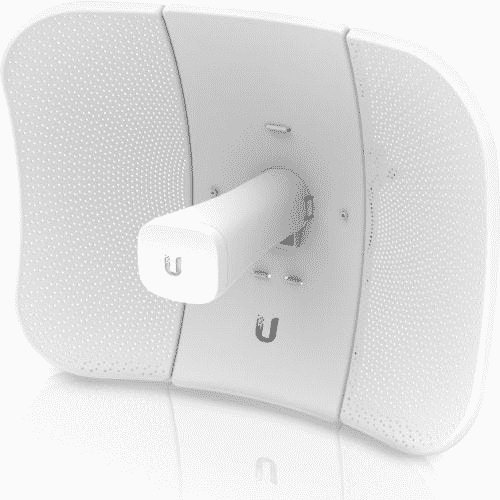

# 没人谈论的拯救网络中立的途径

> 原文：<https://medium.com/hackernoon/the-path-to-saving-net-neutrality-that-nobody-is-talking-about-d4f3b3d01b8c>

争取网络中立是没有希望的。

三个月前，尽管 83%的美国公众支持网络中立，但 FCC 投票赞成废除 2015 年的规定，该规定禁止互联网服务提供商为盈利而欺骗他们的客户。《国会审查法案》仍然可以在技术上阻止 FCC 的规定获得通过——他们迄今为止取得的成就令人印象深刻——但在成为现实之前，它仍然必须经过特朗普总统的办公桌。尽管网络中立被认为是一个两党问题，但特朗普总统同意扼杀 Ajit Pai 梦想的可能性几乎为零，三分之二的国会投票推翻他不可避免的否决也是如此。

比方说，不知何故，三分之二的国会投票赞成国会审议法案。Ajit Pai 当然不会就此罢休。从人们那里偷钱，然后放进贪婪的大公司的口袋里，这就是他迄今为止的整个职业生涯。即使国会审查法案以某种方式获得成功，这也只是一个暂时的解决方案；放在伤口上的小绷带。

假设它不是。国会审查法案成功了，Ajit Pai 放弃了，世界变得更好了，因为网络中立永远地存在了。这仍然不能改变这样一个事实:1 . 29 亿美国人只能从这些大公司那里购买互联网接入服务，这些大公司明显无视网络中立法规，为了赚更多的钱，他们会尽一切可能不遵守这些法规。如果购买互联网的公司和个人主动绕开并竭力破坏网络中立，这是真正的网络中立吗？更重要的是，如果[这 1.29 亿美国人中的一半只能购买最大速度为 25Mbps](https://arstechnica.com/information-technology/2017/06/50-million-us-homes-have-only-one-25mbps-internet-provider-or-none-at-all/) 的互联网，这是一个真正的自由市场吗？

争取网络中立是没有希望的。听起来很凄凉，但却是事实。

但是有办法解决。有一种方法不仅可以使网络中立成为永久的事情，而不必担心 FCC，而且还可以结束互联网垄断，为全美国的每个人提供高速互联网。

我说的是**去中心化的上网**。

在这篇文章中，我将讨论什么是去中心化的互联网接入，它将如何使美国和世界受益，以及你如何成为这场新革命的一部分。

# 什么是去中心化上网？

如果我们想解决 ISP 在美国这么多地方垄断互联网的问题，我们需要从检查 ISP 到底如何向消费者提供互联网以及为什么消费者自己开办一个 ISP 如此困难开始。事实证明，互联网服务提供商有两大优势:他们在全国范围内连接到互联网主干网，他们有 T2 基础设施，也就是连接到消费者的地下铜线或光纤。但是谁说互联网服务提供商必须拥有互联网主干网的连接和向消费者提供互联网的基础设施呢？相反，如果我们可以负责为彼此提供互联网接入，会怎么样？如果有一种方法可以让消费者直接从互联网批发商[那里购买互联网，然后将带宽卖给他们社区的其他成员，无论是整个城市还是仅仅是一个街区或公寓大楼，会怎么样？这就是我所说的“分散式互联网接入”的含义。我们能做的是将互联网服务提供商完全排除在外。](https://www.thebalance.com/what-is-a-wholesaler-2948311)

将 ISP 排除在等式之外立即解决了两个非常重要的问题。首先，因为社区成员相互出售互联网，所以竞争的空间更大了。如果你不喜欢一个人出售互联网的价格，或者你对你得到的服务不满意，你可以选择从你的邻居或地区购买互联网。或者，你可以选择在基础设施上投资几百美元，然后以更好的价格将互联网卖给其他人。这通过小规模资本主义给互联网游戏带来了真正的竞争，因为每个人都拥有基础设施，没有人会受垄断所有互联网基础设施的任何一家大型公司的摆布。其次，拥有基础设施的社区成员意味着工程网络中立。由于分散式互联网接入提供了真正的竞争，如果任何一个人屏蔽或限制内容，他们的客户可以简单地从其他人那里购买互联网。

这就是将独立销售员排除在等式之外的力量所在。当我们作为一个团体一起采取行动，为自己提供 ISP 认为我们无法从其他地方获得的基础设施时，我们立即就拥有了巨大的优势。正因为如此，我们不仅可以恢复真正的网络中立和真正的竞争，我们还可以让人们以更低的价格购买更高的网速。这一点真正的亮点是在农村地区。人口较少的地区经常被 ISP 忽视，因为根本没有足够的金钱激励来派遣工程师在这些地区铺设高速互联网线路。但是如果那些人能给自己提供互联网，他们就不用担心自己的社区有多少人了。他们可以像这个国家的其他地方一样获得高速互联网。

# 它是如何工作的？

在这一点上，这一切听起来像一个童话。对任何人来说，向其他人提供互联网怎么会这么容易呢？而这为什么没有在很久以前发生呢？

首先，这个*以前在西班牙发生过*。2004 年，一个名为 [Guifi](https://guifi.net/en) 的项目启动，目的是让消费者相互提供互联网。如今，他们在加泰罗尼亚和西班牙东部拥有超过 32，500 个工作节点。任何人都可以成为网络上的一个节点，向邻居出售互联网，尤其是在农村。Guifi 很重要，因为它证明了一个没有 ISP 的世界是可能的。

然而，在大洋彼岸，这类事情并没有真正浮出水面。美国的互联网现在是，而且一直是，由少数几个主要的互联网服务提供商控制，在大城市地区有少数例外。

在一个理想的资本主义经济中，如果你对某个特定企业提供的服务不满意，你可以直接把你的钱带到其他地方，或者开始你自己的竞争业务。这对于小型的、本地的夫妻店经营来说很好，但是对于复杂得多的服务，比如互联网，这就被抛到了九霄云外。理想情况下，你*可以*开办自己的竞争网络服务提供商，永不封锁、永不遏制、永不欺骗客户，但这说起来容易做起来难。本地互联网服务提供商通常不会扩张到足以在全国范围内与康卡斯特或威瑞森竞争的程度，这是有原因的:他们根本没有钱在全国范围内建设基础设施和互联网主干网。康卡斯特和威瑞森花了 20 年的大部分时间来建设他们现在拥有的庞大网络。在这一点上，任何试图与他们竞争的 ISP 都几乎不可能成功，因为他们可能无法筹集足够的资金来达到康卡斯特和威瑞森长期以来建立的服务水平。

开办一家本地 ISP 要容易得多，但它仍然需要广泛的互联网知识，还需要你自己创业。这需要是你的全职工作。一些人，主要是在纽约或旧金山等地区，已经接受了这一挑战，并开始了自己的竞争本地互联网服务提供商，但美国大多数人肯定不会这样做，特别是在更多的农村地区。

幸运的是，在新的网络中立规则之后，去中心化革命似乎终于来到了美国。我在这个领域见过的两个最具创新性的创业公司是安德列娜和 T2。虽然他们都在努力实现同样的事情，但我将把重点放在 Althea 上，因为他们在自己的网站上更加透明。

Althea 的目标是让任何人都能轻松地向他们社区中的任何人提供互联网。从本质上说，他们让任何人都可以轻松地开办自己的 ISP，而不必辞掉他们的全职工作，也不必了解所有事情实际上是如何运作的。最终目标是能够投资几百美元购买必要的硬件，并向他们的邻居广播互联网。

木槿花网络由 4 种不同类型的节点组成:
**用户节点** : 向邻居支付互联网接入费用的节点
**中间节点**:通过转发互联网流量赚钱的节点，也就是那些想要向邻居出售互联网的节点
**网关节点**:从批发商处购买互联网或以其他方式获得廉价带宽的节点
**出口节点**:以某种形式连接到互联网主干网的节点

A cool diagram from [Althea’s website](https://altheamesh.com/how-it-works) that explains how an Althea network works

如果你想在家里向其他人出售带宽并赚钱，你所要做的就是投资一些必要的硬件，向你周围的人广播互联网，无论是定向 WiFi 天线，专用无线电塔，还是地下的实际以太网线路。Althea 对你使用的硬件是不可知的，只要它能达到向付费用户发送数据包的最终目标。他们的固件运行在你的路由器上，使用区块链应用平台[以太坊](https://www.ethereum.org/)上的[智能合约](https://blockgeeks.com/guides/smart-contracts/)自动跟踪支付。它还会自动连接到最便宜的互联网接入源，使用的是经过修改的[网状路由](https://en.wikipedia.org/wiki/Mesh_networking)协议 [Babel](https://en.wikipedia.org/wiki/Babel_(protocol)) 。支付完全通过以太坊的平台进行，使用他们自己的加密货币以太。

Ubiquiti LiteBeam, an example of the kind of hardware you can use to send Internet to your neighbors

区块链在这里被使用的事实是一个非常好的迹象，因为它展示了区块链技术的真正潜力，远远超过比特币这样的加密货币。在 Althea 网络中使用区块链可以确保通过网络发送的每个数据包都经过加密验证。智能合同还可以实现支付自动化，并处理可能出现的任何法律问题。这是非常重要的，因为跟踪付款和处理法律问题是通常需要人们把开办自己的 ISP 作为他们的全职工作的两件事，因此他们很难开办一个。使用区块链自动完成这些任务的能力首先允许社区成员能够相互买卖互联网。

还有很多，我强烈推荐你去看看 [Althea 的白皮书](https://altheamesh.com/documents/whitepaper.pdf)或者[他们的网站](https://altheamesh.com/how-it-works)如果你想了解更多关于网络到底是如何运作的。

# 你怎么能成为其中的一部分？

随着 Althea 等初创公司最近的崛起，互联网去中心化比以往任何时候都容易。如果你觉得在你的区域部署网络是一个你想接受的挑战，你所要做的就是在 hello@altheamesh.com 发一封电子邮件给他们。他们将指导您如何建立他们的网络，您可以在您所在的城市建立网络。一旦你这样做了，对你社区中任何想卖互联网的人来说都很容易，对你社区中任何想买互联网的人来说也很容易。我可以是你的 ISP，你可以是我的。

然而，此时此刻，Andrena 和 Althea 都处于部署的早期 alpha 阶段。Andrena 目前正在新泽西州的特伦顿部署“私人测试版”。Althea 在世界各地有一些活跃的测试部署，但是到目前为止，只有一个工作的测试网络。他们的软件还处于早期 alpha 阶段，在这一点上，中间节点还不能真正赚钱。阿尔泰亚正在领导这场革命，但在它完成之前还有很长的路要走。

你能做的最好的事情是帮助发展像 Althea 这样的企业，他们正在努力发展他们在美国和世界各地的测试网络。无论是在你所在的城市建立一个测试部署，还是如果你是一名开发者，为他们的软件做贡献，分散式互联网接入目前需要的是开发。这场革命正处于起步阶段；它需要被建造。

在不久的将来，当 Althea 完全开发完成后，您将能够在您的城市部署自己的完整网络。然后你将能够通过自动以太网支付赚到真正的钱，并且一劳永逸地恢复互联网自由。

# 这是一场革命

当 3 个未经选举的官员可以成功地推翻 83%的美国公众的意愿时，很明显我们的民主出了问题。随着联邦通信委员会的决定，许多人转向政治家创造立法和援引国会审查法案，以拯救网络中立。许多州甚至开始通过自己的立法来恢复网络中立。虽然这个国家的公民如此关心互联网的未来是件好事，但让政治家来为我们解决这个问题是幼稚的，不会有任何成就。虽然网络中立应该是一个两党问题，但共和党政客大多投票反对网络中立，民主党政客大多投票支持网络中立。这种情况正在发生的事实证明了我们已经知道的事情:政治只不过是一场表演。绝对没有美国政治家真正关心网络中立。他们只是投他们认为他们的政党想要的票，因为他们想在那些给他们最多钱的人中保持受欢迎。网络中立对民主党来说似乎是一个重要的问题，但网络中立对他们来说根本不是问题，直到他们注意到美国公民的愤怒并决定兑现。因为他们不在乎，民主党立法者正在推动立法，这些立法并没有真正在更大范围内解决问题。例如，通过全州范围的法规是朝着正确方向迈出的一步，但让所有 50 个州都通过自己的网络中立法规几乎是不可能的，特别是因为政治家们正在按党派界限投票。更不用说，一旦政客们发现一个问题可以让他们更受欢迎，赚更多的钱，他们就会立即放弃网络中立，让它再次容易受到 Ajit Pai 和 FCC 的攻击。

当我们不能相信共和党，我们不能相信民主党，我们不能相信联邦通信委员会——当我们不能相信我们的政府——去恢复几乎每一个他们应该代表的人所乞求的东西，我们需要做什么？我们需要把它掌握在自己手中。这就是互联网去中心化如此重要的原因。我们，人民，不仅可以控制网络中立，我们还可以为每个人提供廉价的高速互联网，包括农村地区的人们，并在我们这样做的时候消除互联网的垄断。

那么，你怎么能参加这场革命呢？你可以在你所在的城市部署一个 Althea(或者，如果你离开新泽西州特伦顿附近的话，还有 Andrena)网络，并鼓励你周围城市的每个人都这样做。传播这件事。美国人民已经证明，当事情需要做的时候，事情就会被做好。这就是为什么美国人民一直在努力拯救网络中立性，也是为什么美国人民会一直努力拯救网络中立性。但是，不要把这些能量导向一个由腐败和破碎的系统导致的无望的事业，忘记那些不关心他们的选民的政客，而是把这些能量导向一场运动的一部分，这场运动使 ISP 垄断屈服，同时恢复我们都需要的自由和开放的互联网。

如果美国能让相当数量的人像木槿花一样运行一个分散的网络，其他国家无疑会效仿，包括不如美国发达的国家。我们不仅可以在美国国内发起一场革命，我们还可以在全世界范围内发起一场互联网革命。

在可预见的未来，每个人都控制着互联网，而不是腐败的政客和贪婪的公司。我希望你，无论你是偶然发现这篇文章，还是强烈关心维护网络中立的活动家，都能帮助建立它。

如果你喜欢这个故事，或者它以任何方式激起了你的兴趣，给它一些掌声吧！帮助将这个故事传播给其他人，他们将帮助建立一个分散的未来。