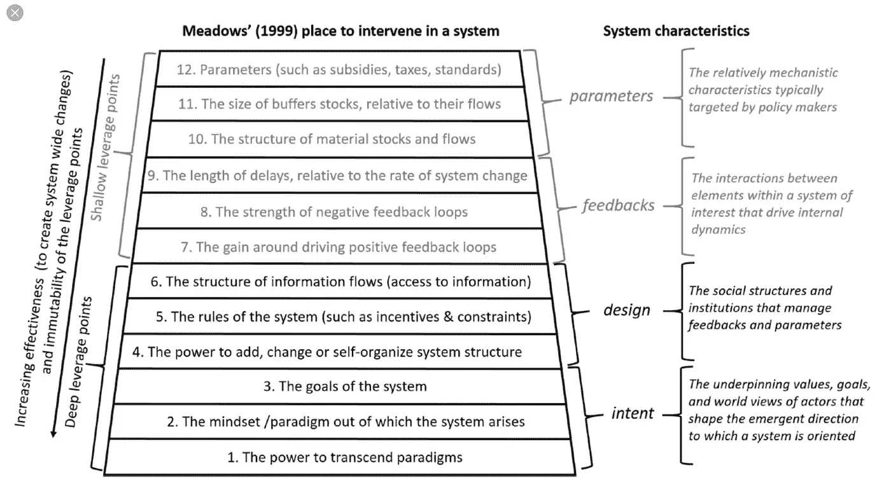

# 患者变更代理

> 原文：<https://medium.com/hackernoon/the-patient-change-agent-fd8548f04777>

## 不要成为问题的一部分(并且在你领先的时候退出)

乐观的变革推动者相信总会有前进的道路:一个需要解决的沟通问题，一个需要解决的唾手可得的果实，以及更多建立心理安全的机会。但这也让人们(包括我)陷入困境。

最近，我和一位产品经理朋友聊天。在描述她所在组织的一个令人困扰的问题时，她说:

> 真正让我感动的是,(这个问题)是完全可以解决的。每个人似乎都看到了，但我们似乎就是解决不了。这太令人沮丧了。我热爱公司的使命和我的同事，这让我很痛苦，但我可能会因为一些我们完全可以解决的事情而离开。

这引起了共鸣。我经历过希望、奉献和挫折的混合。但是…

*   人们不喜欢听到根深蒂固的问题是“完全可以解决的”(我们都不喜欢——不只是那些“其他”人)。
*   “每个人”都可能“看到它”——甚至使用相同的词语——但对这个问题的看法可能非常不同。
*   对你来说，修复是“常识”，但对外人来说可能是违反直觉的。
*   根据定义，一个根深蒂固的问题是*而不是*“完全可以解决的”(不改变环境、参与者、意图等)。)理论上，这可能是可以解决的。在上下文中，它不是。
*   对“只是说出来”的容忍度有很大的不同，还有关于谁应该参与以及说出来是如何发生的信念。

“永恒的乐观主义”，看到“低垂的果实”，以及“只是进入一个房间，然后把它弄清楚”的渴望，很容易被解释为浮夸、权力欲强、不灵活、没有耐心和麻木不仁。人们很容易无意识地流露出挫败感和优越感，即使你“只是想帮忙”，然后陷入一个不断增加挫败感的循环，因为事情保持不变。起初这种挫败感可能不是真实的，但它*变得*真实了。

这是我特别感兴趣的最后一部分。

# 成功了吗？

当我们在产品开发中进行小规模实验时，我们会寻找干预确实有效的证据。我希望我能对这些年来我为改变所做的各种努力(以及那些和我一起工作的人)说同样的话。出于某种原因，我们很难看到不祥之兆——也许是因为我们变得深深地依赖于改善我们的工作环境，强烈地相信解决问题和唾手可得的结果，或者从我们的一些(但不是全部)队友那里得到*足够多的*肯定。从某种意义上来说,*和*变得个人化了。它发展成你(或我们)对他们的局面，这是一个问题。

我最近与一位高管交谈，他之前一直批评团队成员悲观、敌对和阻挠。

> 我注意到我开始变得像他们(团队成员)一样，这让我很害怕。我可以看到自己陷入被怀疑和被贬低的感觉。我发现自己变成了一个我不喜欢的愤怒的人，在鼓励改变方面变得越来越没有效率。

沉重！所以…不管对不对，当我们尝试的东西不起作用时…嗯，它不起作用。

人们很容易将这一点框定为固定思维与增长思维([最近受到抨击](https://www.thecut.com/2017/01/mindset-theory-a-popular-idea-in-education-may-be-trouble.html))、变革阻力/风险厌恶、办公室政治、权力欲极强的经理、X 理论与 Y 理论、病态思维与官僚思维、生成思维(韦斯特伦)以及老话“他们就是不明白！”框起来。**现实依然是:你所尝试的并不奏效。不管你的意图有多好，你有多无私(或认为你有多无私)，你对持续改进有多热情，和/或你努力做到多包容或多赋权…这都没用。**

# 坚定的尝试

那么，你能做什么？你如何在倡导的同时避免精疲力尽、失去几个月/几年以及工作关系受损？你怎么能给它一个“坚实的尝试”，如果事情有所改善就留下来，如果事情没有改善就优雅地离开呢？

让我们回到运行实验的想法(或者像[戴夫·斯诺登](https://medium.com/u/b29cb8a5ba65?source=post_page-----fd8548f04777--------------------------------)喜欢称之为[安全失败探针](http://cognitive-edge.com/methods/safe-to-fail-probes/))。这里的部分挑战是，在加入一家公司之前，通常不容易察觉这些问题。我们在招聘(和被聘用)的时候都会给人留下最好的印象。但是“调查”可以在你加入公司之前就开始了，比如跟踪、前雇员的谈话和面试官的提问。你是否认同公司的运作方式？你已经瞄准当前的疣了吗？你的角色是一个有抱负的角色——一个被期望但不一定被支持的角色——还是一个过去曾经成功的角色？你的未来经理会分享你对倡导、持续改进和透明度的看法吗？这些问题需要自我意识，所以我建议写一些日志，检查我们的[设计你的生活](https://www.amazon.com/Designing-Your-Life-Well-Lived-Joyful/dp/1101875321)，也许回顾一下过去耗尽你精力的情况和循环。

至少，问问别人:

> 你能描述一下房间里的一头大象吗？我会很快遇到它，会认为它是完全可以修复的，但会是错误的。为什么现状很难改变？

如果加入，是时候盘点了。你会立即发现根深蒂固的问题。可以肯定地说，所有的组织都有这种能力(尽管有些组织似乎慢性问题更少，处理急性问题更快更有效)。一个好的规则是，如果你发现某些东西毫无疑问是有毒的或令人不舒服的……就离开。有些事情永远不会变好。如果它们被允许存在/持续，这是一个很大的警告信号。你甚至不需要在简历中提到这份工作(如果你害怕被认为是跳槽者的话)。

# 闭嘴三个月

假设没有有毒的大象，只有你的普通“低挂果实”(我们知道它很少是低挂的)。你的下一步是闭嘴三个月。没有回复邮件，没有“你试过了吗…”，而不是“哦，这很容易解决”。握紧你的牌。每天花 5-10 分钟观察并写日记。

考虑以下问题:

1.  是什么力量导致了这个问题？
2.  谁从现状中受益？谁将从解决这个问题中受益？
3.  为什么 org 不能解决这个问题？
4.  有人的工作包括解决这个问题吗？是什么阻止了他们？他们在努力吗？有人的工作之所以存在，是因为这个不固定吗？
5.  这是 bug 还是特性？有我看不到的好处吗？
6.  这里的变化实际上是如何发生的？
7.  有什么“管用”的吗？在解决这个问题方面有什么动力吗？
8.  谁对寻求改进有兴趣？
9.  如果问题持续存在，会有人失业吗？为什么？
10.  现状如何满足人们的需求？有没有一些共同的未来愿景也能满足人们的需求？

写日记帮助你保持客观，也给你一个出口(而不是发那封会让 T2 完全改变主意的*可怕的*电子邮件，因为它是完全理性的)。

# 进行实验

所以你耐心地等了三个月。在这一点上，呆满一年大概是明智的。现在是时候开始运行一些安全失败的实验/探测了。**在这一点上，我们正在寻找一个迹象，任何迹象，表明这些问题不是不可解决的。**做你的实验:

1.  安全失败…你可以按下倒带键(事实上，期待他们会失败)。别忘了为你保管好这些东西！引用戴夫·斯诺登(Dave Snowden)的话，“安全失败调查的重点不是确保成功或避免失败，而是允许无用的想法以小规模、可控和可容忍的方式失败。”
2.  “尊重当前的流程、角色、职责和头衔”(参见[看板方法](http://www.djaa.com/principles-kanban-method-0))。
3.  有限。一次只尝试一两件事。
4.  可观察且有时间限制。你会比较快地得到数据。
5.  涉及邀请，而不是强加。
6.  寻找杠杆点(我强烈推荐 Donella Meadows 的[杠杆点:介入一个系统的地方](http://donellameadows.org/archives/leverage-points-places-to-intervene-in-a-system/))。阅读后解开行话。

我还建议使用像[爆米花](https://www.slideshare.net/mobile/cperrone/popcornflow-continuous-evolution-through-ultrarapid-experimentation)这样的工具来记录你的实验。最重要的是，这里的关键是让它们不会倒闭。任何时候你都不应该把你的工作/事业/幸福/理智/人际关系/热情置于危险之中。从来没有。不值得。

# 放大和衰减

这部分相当简单。放大有用的东西。抑制那些不重要的东西。然而，困难的是知道什么是真正的“工作”。这是我过去误入歧途的地方。当某样东西真正“工作”时，你会知道:

*   人们会邀请你参加会议来谈论它，并了解更多
*   组织的其他部分将采用它
*   你会有志愿者帮助你发展这个想法
*   有人会试图将此归功于自己(这是一个好现象)
*   人们会伸出手来感谢你
*   它将有机地、病毒式地增长

你会感觉到动力和兴奋。这是显而易见的。没有动力……那么它就不起作用了。

> 嗯。那很有趣…

…不是动力。

# 清查存货

所以你在做实验，看着日历滴答作响……第四个月，第五个月，第六个月。我建议进行一次自我评估，或许找一个朋友作为责任伙伴。对于自我评估，请考虑以下陈述:

*   我正在这个角色中学习和成长
*   我看到了在解决影响我的主要问题方面取得进展的具体迹象
*   我会留在这里，即使另一家公司给我加薪 10%，并保证换工作会影响我的职业生涯
*   我在这里感受到了自主、掌控和目标感
*   我觉得被支持了
*   我觉得在这里可以做我自己，忠于我所珍视的东西

强烈不同意|不同意|未决定|同意|强烈同意

**设定一个具体的去留目标……如果你的“分数”在很长一段时间内(比如三个月)仍未确定(或更低),考虑在你满十二个月的时候离开。**利用你的责任伙伴保持脚踏实地。我这么说是充分意识到换工作的能力是一种奢侈。至少这应该是一个开始积极面试的信号，看看还有什么可能潜伏在那里。

通过有条理地做决定，你就不太可能陷入愤怒、沮丧等模式。我认识一些在工作岗位上呆了多年的人……总是希望事情会有转机。这不值得。

# 冲洗并重复——总结

十二个月的时候你还没有完成。坚持下去。重复我上面写的:

> 你如何在倡导的同时避免精疲力尽、失去几个月/几年以及工作关系受损？你怎么能给它一个“坚实的尝试”，如果事情有所改善就留下来，如果事情没有改善就优雅地离开呢？

这里的整个想法是永远不要离开苦，永远不要让自己成为自己最大的敌人。大多数人都不想“接受失败”。但是自我照顾的一部分是知道你已经尽了最大努力，承认你面临的问题的复杂性(即使是“低挂的水果”)，并且当机会对你不利，并且你在这个问题上缺乏自主权/代理权时继续前进。

你需要推动这一进程。大多数经理不会。

我曾经有一个经理，他和我分享了宁静祷文:

> 上帝赐予我宁静
> 
> 接受我不能改变的事情；
> 
> 有勇气去改变我能改变的事情；
> 
> 和智慧去分辨两者的不同。

它在几个层面上激怒了我，因为它传达了一种永恒的水平——一种“接受它”的态度，这不是我的风格。我的版本有点不同:

> 运行安全的失败实验(这意味着尊重今天的环境和限制)
> 
> 邀请不强加。秀不说。
> 
> 放大好的方面。抑制坏的。建立在成功的基础上。
> 
> 照顾好自己，尊重自己的需求(和他人的需求)
> 
> 在你成为问题的一部分之前，趁早退出

就这样……写下了时间盒。我错过了什么？想法？