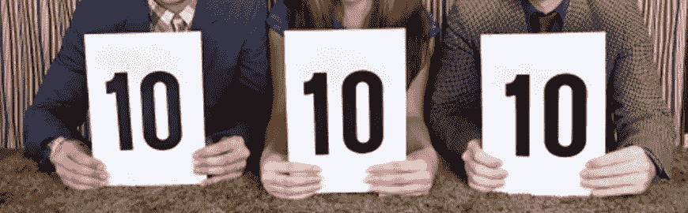

# 完美游戏

> 原文：<https://medium.com/hackernoon/the-perfection-game-61d0f3a2250e>

从炙手可热的初创公司到像谷歌和脸书这样的行业巨头，软件公司都认识到软件过程管理在取得成功的过程中起着至关重要的作用。术语“[敏捷](https://hackernoon.com/tagged/agile)”和“ [Scrum](https://hackernoon.com/tagged/scrum) ”在这个领域已经变得如此普遍，以至于“Scrum”中的**经验已经成为 LinkedIn、 [StackOverflow](https://stackoverflow.com/jobs) 等等几乎所有招聘信息中的固定条目。**

我不会花时间解释 Scrum 是什么，或者 Scrum 仪式是什么。但是我只想说 Scrum 并不仅仅是进行“Scrum 仪式”正如[亚特兰蒂斯团队所说](https://www.atlassian.com/agile/ceremonies)，

> 有些人认为敏捷仪式神奇地让团队变得敏捷。他们错了！！

他们还指出，

> 团队的敏捷性建立在[坚实的工程实践](https://www.atlassian.com/agile/developer)之上，这是一种应对变化的战术和战略方法，以及伟大的团队协作。敏捷仪式只是促进了团队之间的交流。

因此，我的团队发现了其他几个帮助我们在日常工作中更好地运用敏捷的实践。事实上，这些实践帮助我们从标准的 Scrum 实践中获得最大的收益。完美游戏是我的团队采用的众多迷你仪式之一。

# 如何玩完美游戏

在 Sprint 回顾会期间玩游戏是有意义的。sprint 的 scrum 主管将要求其他成员从 1 到 10 的**范围内给 sprint 打分。每个人在提供评级后，将对给定的分数进行推理。**

下面显示的是演示上述过程的示例对话。

> Scrum Master: 现在，我们将进入完美游戏。我们会给亚历克斯第一次机会。
> 
> 亚历克斯:我会给最后冲刺的 10 分中的 8 分。我真正喜欢上一次 sprint 的是，所有的 scrum 仪式都按照计划准时进行。然而，我认为我们本可以做两件事来使 sprint 变得完美。
> 
> Scrum Master: 你能描述一下这两件事吗？
> 
> 首先，我认为如果我们按照降序来考虑吉拉门票的优先级，我们可以在积压订单梳理会议上节省时间。
> 
> 第二，我认为我们可以将 UI 设计任务分配给所有开发人员，这样我们就可以在设计 UI 时发挥每个人的创造力

# 如何不玩完美游戏！

在上面的例子中需要注意的是“Alex”在减 2 分的同时并没有抱怨什么。例如，一个成员不应该说这样的话，

> *“由于我们未能按计划发送生产放行单，我被扣 3 分”*

这里的想法是，**我们不应该因为我们所犯的错误而降低分数，而是，如果有事情可以避免这些错误的话**。在上面的例子中，如果产品发布由于基础设施问题而失败，那么语句可以修改如下:

> “关于产品发布问题，我认为我们可以在 sprint 的一开始就提出基础架构需求，这样他们就可以在计划的发布日期之前准备好”

同样，我们不应该为团队做的计划外的好事增加分数。

例如，即使团队做了一些事情挽救了一个可能的安全漏洞，也不应该增加分数，说“**问题出现在冲刺阶段，团队为此付出了巨大的努力”*。这样的事情超出了完美游戏的范围。**为什么？** **那是因为，***

> *完美游戏的预期结果不是侮辱、责备或表扬团队成员，而是确定团队在未来可以做些什么来避免错误并表现得更好。*

# *最后的想法*

*我刚刚描述了我的团队如何采用完美游戏**来提高冲刺速度**。然而，同样的原则可以应用于评估任何其他事件，如产品发布、功能交付，甚至是单个的 bug 修复任务。*

*然而，玩完美游戏并没有严格的规则。你可以修改仪式以适应你的环境。就像所有其他的 Scrum 工具一样，这应该以一种提高团队绩效的方式使用，而不是作为阻碍绩效的开销。*

*最终，这完全取决于团队的能力和预期的团队速度。你不需要花很多时间谈论你打算如何改进，也不需要花很少的时间去做实际的工作。*

*好了，伙计们，现在是你们把事情变得完美的时候了！！别忘了为这个故事鼓掌支持我。*