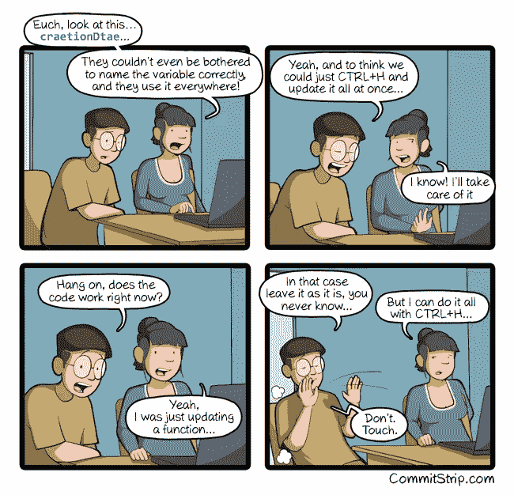

# 重构错别字的危险

> 原文：<https://medium.com/hackernoon/the-perils-of-refactoring-b1c94bd7287c>

/via [http://www.commitstrip.com/en/2018/11/26/if-its-not-broken/](http://www.commitstrip.com/en/2018/11/26/if-its-not-broken/)

有趣的漫画，但整个“*不要重构* `craetionDtae`”的事情有点牵强，对不对你可能会不假思索地修改那个错别字，对不对？

嗯，也许不是。
毕竟，这实际上可能是向用户公开的东西(它在 API 中。耶)，所以你需要重构这个*和*文档，但是没关系，你能做到，对吗？

嗯，也许不是。
因为，现在你看，你注意到你有*两组*错别字，`craetionDtae`和`craetionDate`，这意味着重构意味着你需要更新代码*和文档*中的*这两个*，所以现在需要改变的是 ***4*** 的东西，但是没关系，你已经有了，你能做到，对吗？

嗯，也许不是。
因为，现在你真的看了，你意识到`craetionDate`也是作为`craetionDates`而存在的(因为，你*已经*对数组进行了复数化，不是吗？)和`craetionDateForUser`(因为你忘了`craetionDate`已经存在了)，现在内容已经呈指数级增长，你真的不确定重构会不会与其他名称发生冲突，现在这一切都太多了。

这就是你没有继续重构它的真正原因，对吗？

嗯，也许不是。
现实中，大概就那一个`craetionDtae`错别字，别的都没有。但是，*你不知道！*正因为如此，你可能不会实际做任何事情，而`craetionDate`将永远存在于你的代码中。
( *)而且，几年后，当你离开很久以后，没有人会重构它，因为他们也不知道，并假设你可能有这样做的理由……*)

*(* [*这篇文章也出现在我的博客上*](https://dieswaytoofast.blogspot.com/2018/11/the-perils-of-refactoring-typos.html) *)*