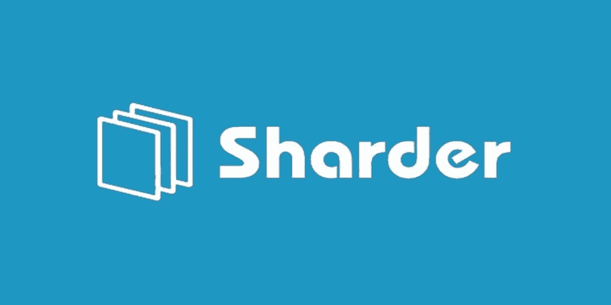
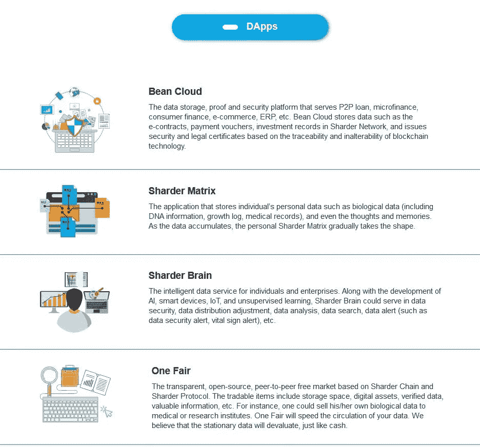
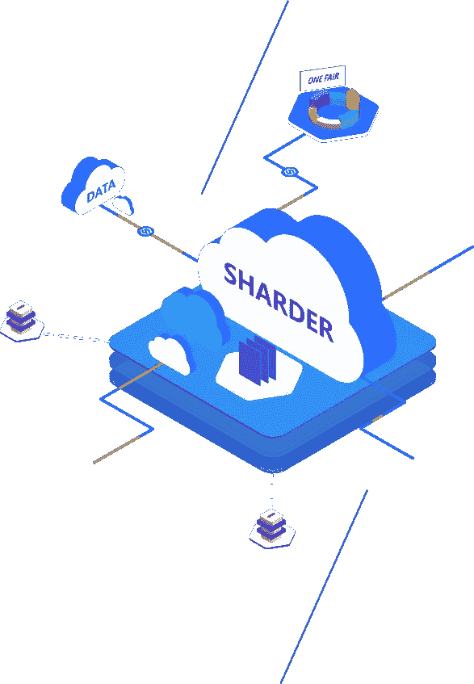
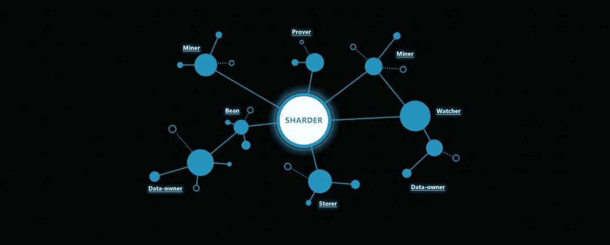

# 进步的永恒:《沙尔德协议》在“2018 年大熊市”期间的崛起

> 原文：<https://medium.com/hackernoon/the-perpetuation-of-progress-the-sharder-protocols-rise-during-the-great-bear-market-of-2018-92449c241e2f>

**The Sharder Protocol Is The First Multi-Chain Distributed Storage Solution That Can Be Deployed On All Public Blockchains!**

**什么是 Sharder 协议:简介**

Sharder 协议是一项创新技术，旨在彻底改变我们社会存储数据的方式。此时此刻，消费者在利用集中式存储解决方案存储数据时面临着各种问题！这类问题包括数据泄露和侵犯隐私！例如，美国三大征信机构之一的 Equifax 在 2017 年 9 月被黑客入侵，暴露了 1.45 亿美国人的个人信息。Sharder 实现离线加密，反过来保持数据安全。Sharder 还同时对数据进行分片，以防止我们在利用集中式存储解决方案时面临的这个主要问题。Sharder-UTXO 和 Sharder-PAIR 技术倡议保证了在未经数据所有者许可的情况下无法访问数据，从而确保任何人都无法篡改他人、公司、政府或组织的数据。集中式存储解决方案带来的另一个主要问题是极高的成本！集中式数据中心通过金钱收益来获得激励，因此，大公司向用户收取大量资金来将他们的数据存储在他们的网络上。不幸的是，最终用户面对的是数据的集中巨兽，他们对这些大公司通常没有议价能力。Sharder 协议通过其民主解决方案改变了这一点；Sharder 生态系统是一个透明、开源、点对点的自由市场，价格由用户和 Sharder 生态系统内自由市场的整体需求决定。共享经济排除了垄断实体对这种民主自由市场经济范式的干预，反过来以尽可能低的价格为用户提供高质量的存储服务。我们在利用集中式存储解决方案时面临的另一个困境是存储利用率低；换句话说，闲置的存储空间。尽管大数据公司在集中式数据中心上投入了大量资金，但全球仍有大量存储容量未得到利用；这完全是一种资源浪费。与 Airbnb 和优步类似，Sharder 的共享经济和激励机制鼓励用户将他们的闲置存储空间带到市场上，并因他们对网络的贡献而获得奖励。此外，Sharder 还发布了 Sharder Hub 和 Sharder Box，允许用户为 Sharder 网络贡献计算能力和存储容量，从而获得多重奖励。激励是人类劳动的母体，而这作为激励的副产品延续了文明的整体进步:Sharder 协议理解这种人性的法则。这种激励的理想是 Sharder 关于共享经济的经济范式将获得全面成功的主要原因！

**Bean Cloud, Sharder Matrix, Sharder Brain and One Fair Are The First D’apps To Be Deployed Within The Sharder Ecosystem!**

Sharder 协议是一个跨链分布式存储解决方案，为现有的所有公共区块链实现数据分片技术。单词“Sharder”来自单词“shard ”,该单词在计算机科学中广泛用于定义数据库和区块链分片。Sharder 客户端不仅可以部署在所有公共区块链上，还可以部署在存储网络、个人节点等上。Sharder 协议同时培育了它自己的生态系统，拥有在它的生态圈内免费创建 d 'apps 的独特能力；Sharder 生态系统内部已经创建了四个 d 'apps。Bean Cloud、One Fair、Sharder Brain 和 Sharder Matrix 是首批部署在 Sharder 协议上的 d 'apps！第一个部署 Sharder 协议的区块链是 Sharder ChainSharder Chain 作为公共链和第一个部署 Sharder 协议的区块链，提供区块链技术的数据存储以及离线加密、自动复制、分片、智能路由、归档等功能！大型数据文件也离线存储，以确保安全性，同时防止在 Sharder 网络中运行的节点占用太多存储资源。Sharder 协议还实现了 BaaS(区块链即服务),可以使用 Sharder 令牌(Sharder 协议的本地令牌)购买它！鲨鱼令牌将成为整个生态系统的锚定令牌。例如，当使用 Sharder Hub(Sharder 的微节点挖掘器)时，在 Sharder 网络上验证 Hub 的个人将以 Sharder Token 支付；当个人在网络上运行分片器盒时，也将利用分片器令牌作为奖励机制。Sharder Box 是一个一体化的硬件，个人可以通过在网络上扮演多种角色(矿工、存储和观察者)获得 Sharder Token。存储者为数据存储提供磁盘容量，并在这样做的过程中获得回报。存储者也要接受数据所有者或观察者的检查，并提供存储证明。挖掘者是在 Sharder 网络上挖掘交易(块)并获得 Sharder Token 奖励的个人！观察器听起来就像一个节点，它观察网络以防止任何恶意活动在平台上发生。观察器根据安全策略检查安全状态，并修复现有的或潜在的漏洞。观察者将持续在线，以确保数据安全和整个网络的整体平衡。它们对于整个网络的快速收敛至关重要，并且是数据索引的完美选择。Sharder 团队在过去的一个月里取得了重大进展，我们有责任将这些进展分享给我们的整个社区以及那些不熟悉 Sharder 协议的人！

**曝光与司法合法性:发展的永久化:一个全球网络的构建**

**The Sharder Protocol Has Garnered Major Attention In Recent Weeks From Social Media Outlets And Chinese Judiciaries**

10 月份是 Sharder 在各方面取得重大成功的一个月:Sharder Mainnet 的测试正在进行中，中国的司法合法性现已得到巩固，最近几周，由于 Twitter 上的重要社交媒体帐户讨论并宣传他们对 Sharder 协议的热情，Sharder 获得了大量曝光！10 月中旬，Sharder 的 20 个测试中心被发送到世界各地的各种社区成员，开始测试 Sharder Mainnet。每一个发送出去的 Sharder 测试集线器都成功地连接到了 Sharder 网络，这是我们迈向 mainnet 版本的一个重大成就。Sharder 网络跨越了国际边界，现在是一个遍布全球的网络；我们社区中来自世界各地不同国家和地理区域的 20 名成员已经成功连接到 Sharder 网络。十月对 Sharder 来说是历史性的一个月；我们已经跨越了全球边界，Sharder 网络的测试取得了圆满成功。第二批 Sharder 测试中心计划在未来几天交付给另外 20 名测试人员！与我们网络的连接是永久性的，另外 20 名测试人员将在 11 月底连接到 Sharder 网络。Sharder Protocol 将如期在 2018 年底推出其完整的全球 mainnet！进步的概念和永久化是必要的，因为它维持和增强投资者的信心，同时，进步证明特定的团队是雄心勃勃的，有动力的，并体现了对项目成功的全部热情和信念；Sharder 团队体现了所有这些理念！10 月份对于 Sharder 来说也是一个历史性的月份，因为它的第一个应用程序之一:Bean Cloud！

Bean Cloud 是 Sharder 生态系统中的四个应用之一。Bean Cloud 是一个安全平台，为点对点贷款、数据存储实施、小额金融、消费金融和电子商务实体提供服务。Bean Cloud 在 Sharder 网络中存储电子合同和投资记录等数据。豆云网向使用豆云网平台的实体发放经过公证的电子合同，引发司法合法性讨论！超过 230 个用户现在正在使用 Bean Cloud，超过 7000 份经认证的数据现在通过 Bean Cloud d'app 成功存储；就在我们说话的时候，更多的公司正在加入。豆云已经正式获得杭州互联网法院的认可和司法认可，将作为证据存储平台接入法院的司法节点之一。豆云与杭州互联网法院之间的一个通道将正式为豆云开放。截至 2018 年 8 月，杭州互联网法院已处理案件超万件；试想一下，如果今年早些时候部署了 Bean Cloud。本质上，Bean Cloud 将有机会成为许多此类案件的司法组成部分。Sharder 团队目前正在与 14 家重庆在线金融公司就 Bean Cloud 的部署进行积极谈判！最后，一个专利局对 Sharder 产生了兴趣，并正在与 Sharder 讨论将其整合到生态系统中。该专利局将很可能在整个网络中扮演焦点观察者的角色，以帮助观察网络的状态，同时，将确保数据安全性以及网络的整体平衡和稳定性。

**The Sharder Exposure:创新和社交媒体**

10 月份对 Sharder 来说是一个值得关注的历史性月份，特别是由于知名 Twitter 加密货币投资者积累和延续的风险敞口。CryptoGat，一个专门从事加密货币投资、研究、分析和教程创建的著名 Twitter 页面，现在将成为我们的四十名 Sharder-Hub 测试员之一！https://twitter.com/CryptoGat/status/1055925492321267712CryptoGat 一旦收到 Sharder Hub 的 a 就会开始讨论了！CryptoGat 在他的 Twitter 账户上有超过 70，000 名粉丝，这是 Sharder 一直在接受的巨大曝光的催化剂，将这一消息与 Sharder Hub 测试和司法合法性相结合，Sharder 正在从沉睡中醒来。拥有超过 34000 名粉丝的另一个著名的推特账号 Crypto ฿rahma 也发布了一条关于 Sharder 的推特。[https://Twitter . com/Crypto _ Brahma/status/1054386969776549892](https://twitter.com/Crypto_Brahma/status/1054386969776549892)Sharder 协议还获得了他们参与的创新竞赛的优秀奖，因为他们演示了 Bean Cloud！由于 Sharder 协议，本次比赛中各项目之间的合作意向也得到了培养！其中一个项目是位于俄国的区块链投资公司 GT Blockchain Investments。GT Blockchain Investments 将与 Sharder 合作，推广该协议及其革命性技术！黎明正在升起，阳光照耀着沙尔德协议！

**Sharder Will Be The Go To Distributed Storage Solution Of The 21st Century!**

结论:分裂国家的延续和发展

**The Sharder Ecosystem Will Prosper Like An Undisturbed Forest!**

很明显，在 Sharder 的短暂历史中，我们的协议不知疲倦地工作，并因此获得了巨大的曝光率、司法合法性、对我们网络的成功测试、290 名使用 Bean Cloud 的用户、14 家金融公司的讨论会谈、将在 Qtum 上部署的讨论会谈以及 Twitter 帐户上的各种其他曝光渠道，现在证明 Sharder 协议是分布式数据存储解决方案的一场革命。Sharder 是同类产品中的第一款，将能够部署在区块链的所有公共场所，这是一种促进包容性的理想技术！命运掌握在我们自己手中，而孕育了《沙尔德议定书》的命运之手将使它能够兴旺发达几十年，也许几个世纪！#鲨鱼之国

*有兴趣了解加密货币和区块链技术吗？报名参加我在 Udemy 上的课程吧！*[*https://www . udemy . com/cryptocurrency-investment-a-初学者-指南/学习/v4/*](https://www.udemy.com/cryptocurrency-investment-a-beginners-guide/learn/v4/)

*免责声明:加密货币投资需要大量的风险，不要投资超过你能承受的损失！我不是金融顾问，也不对你的任何交易负责。我是 Sharder Token 的投资者，本文中的信息代表我自己的想法和观点。在投资任何东西之前，你都必须做好自己的研究，这是义不容辞的。*