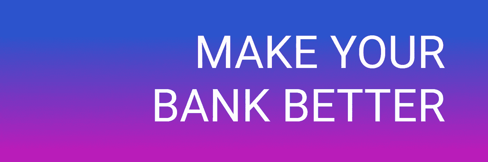

# 改变我生活的电话

> 原文：<https://medium.com/hackernoon/the-phone-call-that-changed-my-life-3c365b5add73>

那是去年万圣节的前两天。我和爸爸、哥哥、阿姨在奶奶家看电视，这时电话响了，爸爸接了电话:

> D:你好
> D:嗯嗯
> D:是的
> D:多少钱？你一定是在开玩笑吧？

**摔下电话**

> 妈妈，来这里！你每月为天空电视台支付 140 英镑？我为同样的服务支付 40 英镑，但是我也因此得到了我的手机和网络

银行业破产了。我们的数据毫无用处，利息低于通货膨胀率，我们不能利用成为拥有数百万用户的银行的一部分来获得更好的价值。

# [我们改一下](https://www.Nexves.com)

[Nexves](https://medium.com/u/75e6c5c8d1fb?source=post_page-----3c365b5add73--------------------------------) 让 ***您的*** 银行更好。我们的技术建立在任何现有的活期账户之上，以提供更大的回报，使您的数据智能化以节省资金，并让您影响您的财富。无论您的银行是谁，我们的平台都是开放的，供您使用并从中受益。

## 你不必换银行

您下载我们的应用程序，创建一个帐户，链接您现有的银行帐户，并立即获得所有这些好处。没有大惊小怪或争论，只是你一直把更多的钱放在你的口袋里。

我们通过金融科技将 AirBnB 等公司展示的共享经济的好处应用于消费者银行业务。到 2023 年，仅英国就将有 3700 万人拥有移动银行账户。成为第一批受益者之一！

**Beta 测试即将开始——我们只剩下 300 个名额了**

# 不要错过

继续扔钱？💸

**或**

🚀🏦让你的银行变得更好🙌👇

# [www.Nexves.com](https://www.Nexves.com)

