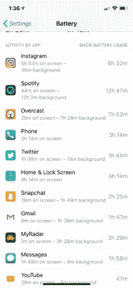

# 电话使用的真相📱

> 原文：<https://medium.com/hackernoon/the-phonechallenge-603bc6d16ba2>

## 嘿互联网，我有一个挑战给你。是你。

(如果你想在这里看到这款手表的视频版本:[https://youtu.be/h38g3ref8A8](https://youtu.be/h38g3ref8A8))

打开你的 iPhone 或 Android，进入你的设置，检查你的电池，检查你的使用情况。

当你这么做的时候。这将是惊人的。我向你保证，你花在关心他人上的时间比你想象的要多得多。人们花太多时间只是…看别人的东西。只是欣赏莎莉在做什么，或者迈克在做什么。这是一个问题！

如果你一周花 4、5、6 个小时盲目地消费内容，你就错过了你可以生产的东西！你自己呢？你呢？这就是我的观点。花 1 个小时远离 app，把它作为礼物回馈给自己，做点什么吧！写一首诗。做个视频。运动！

对我来说，这就是写作的意义。我意识到我消费了太多的内容。我从来没有生产过任何东西。我是制作 YouTube 视频长大的..我有一个很大的阶段，我想成为一名 DJ，所以我用 ableton live 制作了[家庭音乐](https://soundcloud.com/parkerrex)。如果你注意到自己每天晚上都在花大量的时间浏览 feed，或者只是在看最后一条推文……那么花一分钟时间强迫自己做点什么。

My Instagram usage is outrageous.

使用#PhoneChallenge 截图加入派对。看看是什么夺走了我们的时间是很有趣的。

如果你已经做到这一步，感谢你花时间阅读，我希望你参加#电话挑战赛

打个招呼——我们会成为朋友~

insta gram:【http://www.instagram.com/parxrex
推特:[https://twitter.com/parkerrex](https://twitter.com/parkerrex)
Snapchat:[https://www.snapchat.com/add/prex14](https://www.snapchat.com/add/prex14)