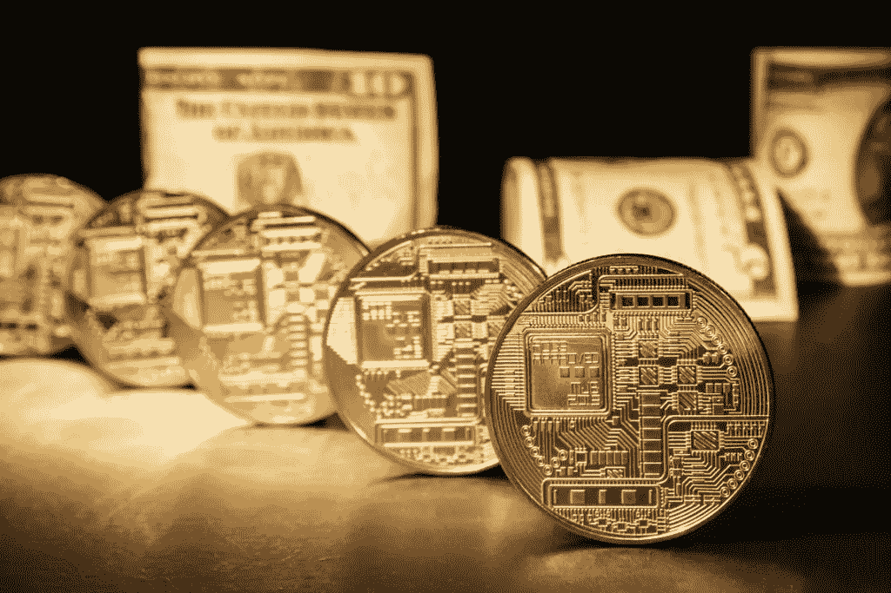

# 区块链技术的巅峰:去中心化的人

> 原文：<https://medium.com/hackernoon/the-pinnacle-of-blockchain-technology-the-decentralized-man-1fcfba4d7d88>

## 区块链能解决我们面临的一些最紧迫的挑战吗？

当我们继续向 21 世纪跋涉时，有一件事变得很明显:进步是无情的。没有创新能力的个人、实体和整个行业很快被那些正在改变许多行业面貌的个人、实体和整个行业取代。

自从比特币在 2009 年出现以来，区块链已经点亮了世界各地的头条新闻——部分原因是它在过去十年中的惊人增长，但也是因为该技术似乎即将带来革命的大量用例。

如今，几乎每个行业都在尝试将区块链融入其工作流程——从农业、时尚、物流，以及所有世界十大公司都在探索其潜力。

> 没有，因为网络本身有一项技术比区块链技术更有希望带来更广泛、更根本的革命。—总账

创新者、投资者、商人和技术专家都在寻找下一个区块链大突破，以及以区块链为核心的数千个雄心勃勃的想法——在这个时候，公众对技术的认知开始获得动力。

与该技术的未来相关的大量猜测导致了围绕区块链和加密货币的持续炒作和断断续续的媒体狂热。然而，仍然不确定的是，如果区块链真的成为一切的基础，这条路会把我们引向何方。

# 一切，但令牌化

最近，约翰·迈克菲与交易所初创公司 [Ethershift](https://medium.com/u/408ba01817cc?source=post_page-----1fcfba4d7d88--------------------------------) 和区块链艺术投资平台 [Maecenas](https://medium.com/u/d59e5f9d3c0e?source=post_page-----1fcfba4d7d88--------------------------------) 合作，通过将毕加索的一件原作分割成固定数量的 ERC20 代币来进行代币化——每一个代币将代表该作品的部分所有权。

对许多市场来说，令牌化可能代表着效率的下一次飞跃。例如，目前投资股票通常需要被称为股票经纪人的中间人的参与。然而，通过令牌化股权，投资者可以购买一家公司的数字股票，同时保留对其股票的完全控制权。

最近的首次公开募股(ICO)热潮已经拉开了序幕，数百家初创企业通过出售(主要是)公用事业代币来筹集资金，这些代币代表了平台的一些内部功能。

最近，一波新项目更进了一步，允许使用加密货币购买可收藏的数字资产，作为初始资产发行的一部分(IAO)。加密之战是这种新型加密人群销售的首创之一，允许投资者购买不可替代的 ERC-1155 代币，代表具有特殊功能的游戏角色。

> *通过令牌化，投资变得更便宜、更快捷、更安全，而且全天候可用。这为以前由于地理或金融限制而无法投资的人打开了真实世界的资产和加密货币的世界，并为传统和基本过时的投资方法提供了替代选择。— Jakob Drzazga，资产证券化公司*[*brick block . io*](https://medium.com/u/3ca89d13aaff?source=post_page-----1fcfba4d7d88--------------------------------)*联合创始人。*

其他更大胆的区块链初创企业已经开始尝试安全代币，向合格投资者提供许可证券以换取投资。例如，Aspen Reit 推出了首批证券代币产品之一，允许投资者购买合法的 Aspen Coins，这是房地产投资信托的一部分，持有人有权获得其股票的股息。

像 [Polymath](https://medium.com/u/bdf13a23d3e9?source=post_page-----1fcfba4d7d88--------------------------------) 和 [Securitize.io](https://medium.com/u/4181e01aabf0?source=post_page-----1fcfba4d7d88--------------------------------) 这样的平台已经开始解决将传统证券转移到区块链的困难，并希望为蓬勃发展的行业设定标准做法。根据博学者的说法，有一个“华尔街未曾触及的财富宝库，现在可以进入了。”

在 2018 年，我们已经看到不仅仅是艺术品和房地产的逐渐符号化，而是几乎所有的东西——至少，这是马特勒姆希望实现的。 [Mattereum](https://www.mattereum.com/) 是一个大胆的项目，旨在改变我们管理财产、物品和信息合法权利的方式，方法是允许这些权利在所有者之间进行令牌化和交换，并引入“自动托管人”的概念，允许资产权利根据智能合同中定义的条款自动转移。

甚至[国家货币](https://beincrypto.com/malta-cryptocurrency-is-inevitably-the-future-of-money/)也有可能被数字化，其前身已经普遍使用——即 [stablecoins](https://beincrypto.com/how-stable-are-stablecoins-really/) 如 [Circle](https://beincrypto.com/coinbase-circle-stablecoin/) 、TrueUSD 和 Tether。这些硬币的价值与传统的金融工具挂钩——在这种情况下，是美元——本质上是法定货币的代理。随着时间的推移，这一等式的代理部分很可能会消失，因为各国货币的真正数字表示将被发布，并导致真正的政府支持的加密货币。

**未来，即使是专利、版权和品牌等无形资产也可以记录在区块链上，并被标记化**——让全球各地的投资者以前所未有的方式分享资产所有权。加密货币最终可能成为一种全新的资产类别。

# 将我们团结在一起的货币

大多数人可能都想到了为什么我们不使用单一的全球货币，尤其是在访问外国的时候。这似乎是一个对所有人都有利的明显目标，尽管原因大相径庭。

我们想象着这样一个未来，单一的世界货币给发展中国家带来稳定和确定性，而经济发达国家将打破自由贸易的壁垒，同时看到外国投资和旅游业的增长。

在这个未来，外汇交易将完全不存在，因为各国之间的世界货币的价值差异可能会很小，以至于无法获利。如果没有它，外汇储备将被取消。

实现单一世界货币不会一帆风顺。很少有国家会满足于放弃决定其如何监管和分配本国货币的独立货币政策。此外，在我们和一个政府支持的世界货币之间，存在着巨大的政治和经济结构差异。

> 几乎所有独立的国家都选择通过拥有一种自己特有的货币来维护自己的国籍，这给它们自己和它们的邻国都带来了不便。—约翰·斯图尔特·穆勒(政治经济学原理)

过去已经提出了各种各样的法定世界货币，例如比利时经济学家伯纳德·利塔尔设计的货币“T2”。Lietaer 提出，每个土地单位的价值将与一篮子通常交易的商品挂钩，如黄金、石油、棉花和小麦。尽管泰拉并没有被设计成单一世界货币，但它被设计成在国际上有效，这是今天许多法定货币仍然没有实现的。

**几位知名人士预测，随着时间的推移，世界将团结在一个单一的金融体系下，比特币或其他一些基于区块链的货币将承担起这一任务。推特的首席执行官杰克·多西最近说:**

> *世界最终将有单一货币，互联网将有单一货币。我个人相信会是比特币。*

另一方面，加密货币有潜力满足世界货币所要求的许多标准:有可控的供应，无通胀，以及近乎即时的转移。正因为如此，加密货币目前是最有可能被用作全球货币的候选货币。

与法定货币不同，加密货币通常没有国界，允许在任何国家访问和使用。**与其他加密货币一样，比特币可以在不同国家之间转移价值，而无需支付通常与 SEPA 或 Swift 转账相关的高额转账费用**。

遭受长期通货膨胀的国家已经表现出对加密货币的兴趣，委内瑞拉最近发行了其[石油](https://beincrypto.com/you-cant-trade-your-petro-ptr-if-bought-after-dec-31-2018/)加密货币，而[马绍尔群岛](https://beincrypto.com/marshall-islands-president-survives-51-attack-from-senators/)计划在不久的将来推出自己的国家加密货币。

然而，随着加密货币的出现，政治意愿不再是障碍。相反，人们可以自由选择他们支持和使用的货币。正因为如此，比特币或某种未来的加密货币可能不需要政府支持，就能应对为几乎所有人提供公平获取金融服务和资源的挑战。

# 科学之墙将被推倒

现在，绝大多数科学信息都是通过一个集中的出版商传播的，例如无数科学期刊中的一个，如*《自然》*、*《新物理杂志》*和*《PLOS 一号》*。这一体系虽然在前互联网时代是有效的，在那个时代，集权成为传播知识的最有效途径，但现在已经过时了。

不幸的是，在科学界获得归属和声誉的唯一方法之一是在高知名度的期刊上发表论文——其中许多期刊只会发表已经取得成就的团队的作品。更糟糕的是，获得机构资助或政府拨款通常取决于在知名期刊上发表高影响力的研究，这是只有知名团体才能夸耀的事情。

除此之外，发表一篇高影响力文章的过程非常漫长，通常需要几个月，甚至一年才能发表。根据《自然》*杂志的编辑流程，在出版之前有多达八道关卡要通过——其中几道可能需要几个月才能完成。*

出版过程中最长的延迟之一是同行评审过程，在这一过程中，工作领域的几名专家会仔细检查提交的文章，以确保它符合他们杂志的质量标准——帮助出版商确定需要改进或澄清的领域(导致一个反向和强制过程，直到文章获得批准)。

肯德尔·鲍威尔最近的一项研究描绘了一幅令人担忧的画面:

> 根据 Himmelstein 的分析，在《自然》*杂志上，平均评审时间在过去十年中从 85 天增长到 150 天多一点，而在《公共科学图书馆·综合》杂志上，大约在同一时期，平均评审时间从 37 天增长到 125 天。*

在这些出版物中，影响因子(衡量其重要性的指标)最高的出版物往往会遭受最长的延迟，平均出版时间为 150 天。**这一过程大大增加了知识传播所需的时间，减缓了创新的步伐，因此也减缓了科学进程的速度。**

然而，最近几个团队已经开始探索利用区块链技术来改善科学知识的传播和归属。总部位于波士顿的 [ARTiFACTS](https://medium.com/u/34de8d4daff7?source=post_page-----1fcfba4d7d88--------------------------------) ，一个科学合作和归因平台，就是这样一种尝试——向分散的科学知识库迈出了第一步。

人工制品允许研究人员分发知识——无论是完整的还是不完整的——并获得其归属——帮助同事科学家访问数据集并避免重复劳动。它还允许其用户“实时记录永久、有效和不可变的记录链”，同时帮助解决学术研究中再现性差的问题。

[DEIP](https://medium.com/u/8d30e4f9e338?source=post_page-----1fcfba4d7d88--------------------------------) ，另一方面，是一个分散的研究平台，正在开发一种新的经济模式来激励科学研究。该平台最近进入了公开测试，允许学术团队注册他们的项目，并通过基于令牌的专业知识系统获得资金，该系统可以看到研究在收到科学界的积极评论后获得 DEIP 令牌。

**科学知识的分散化将成为人类历史上最大的进步之一。**随着时间的推移，科学产业将能够作为一个分散但有凝聚力的单位前进——避免威胁科学宗旨的竞争心态:通过共同理解促进人类进步。

# 智能将被分散

今天，讨论最多的两项潜在颠覆性技术是区块链和人工智能。简单的人工智能最近在现代社会中变得流行，并为各种你可能甚至不认识的体验提供动力，包括移动个人助理、社交媒体匹配引擎、音乐发现应用程序，甚至定向广告平台。

然而，这些类型的人工智能在范围上是有限的，只能在过程中使用有限类型的数据来执行选定的几个功能。此外，他们不是大多数人认为的真正的(普通的)人工智能。人工智能的普遍概念实际上被称为人工通用智能，或 A.I 一种能够完成非特定任务的机器，类似于人的能力。

AGI 的出现，甚至是被称为狭义人工智能的更有限变体的出现，可能会在它们应用的几乎任何领域产生巨大的进步——在各种潜在领域中的应用，如计算机视觉、自然语言理解和数据处理。

在过去，构建人工智能的尝试主要是集中的努力，通常涉及政府组织和学术团体。到目前为止，由于许多挑战，包括计算能力不足，缺乏经验丰富的开发人员，以及缺乏标准化的开发实践，即使是狭义的人工智能也仍有待开发。

最近，几个小组已经开始探索如何利用区块链技术来解决开发人工智能的一些基本挑战。奇点网是区块链人工智能领域的先行者之一。SingularityNet 于 2017 年底推出 ICO，成为有史以来销售最快的 ICO 之一——仅在 60 秒内就售出了 3600 万美元的 AGI 代币。

SingularityNet 的建立是为了通过允许每个人，而不仅仅是政府和企业，使用人工智能服务来实现人工智能的民主化——实现对我们将开发的潜在最重要工具的民主化。SingularityNet 平台允许独立开发者向分散的知识库提交人工智能代码，并因其使用而获得报酬，同时将人工智能开发者与商业客户联系起来，以获得定制人工智能解决方案的佣金。

> *我相信这个人工智能会成为我们的伙伴。如果我们误用它，它将是一个风险。如果我们正确使用它，它可以成为我们的伙伴。—软银首席执行官孙正义。*

奇点网并不是唯一在区块链人工智能领域采取行动的公司。 [DeepBrain Chain](https://medium.com/u/379a9e7edef2?source=post_page-----1fcfba4d7d88--------------------------------) 希望通过使用区块链将未使用的计算能力分配给需要的人，从而大幅降低准入门槛。

通常情况下，机器学习算法必须得到极大的计算能力的支持，才能实现可观的学习速度。然而，获得必要的硬件通常是一项昂贵的工作，一台入门级机器的成本接近 40 万美元，如英伟达的 DGX-2 深度学习超级计算机。DBC 认为，通过分散人工智能的计算能力，它可以降低高达 70%的成本——让所有人都更容易获得它。

这个概念不仅仅适用于人工智能，因为我们自己的智能也同样能够分布在区块链上。使用智能合同技术，人类可以将任务分配给大量的人，这可能让数百万个人贡献知识，并允许以前无法实现的协作水平——无论是并行还是异步。这正是区块链供电的市场 [Mentat](https://medium.com/u/3b6bd141452c?source=post_page-----1fcfba4d7d88--------------------------------) 希望实现的目标。

看到这条道路，不难想象未来的任务，无论多么复杂，都可以被分割并自动分配给合适的大脑来解决——无论是人类还是机器。假以时日，这一体系应该会产生一些公司做梦也想不到的创造力和效率。

随着我们进入接下来的几十年，随着更多公司将越来越多的收入用于研发，同时利用分布式智能平台在竞争日益激烈的市场中保持领先，创新的步伐只会加快。

# 主权个人

目前，政府是一种中央集权的事务，由人数相对较少的个人组成，他们集体拥有治理一个州或国家的权力。**今天，许多政府达成集体共识的主要方式是举行一次被称为全民公决的公众投票——允许内阁评估公众对一项提案或问题的意见。**2017 年，绝大多数国家可以被视为民主国家，全球 167 个国家中近 70%是民主国家，而剩下的 30%由威权政府领导。

尽管在许多国家广泛使用，但现代投票系统令人痛苦地不方便，并被广泛批评为容易受到操纵——全球大部分大选被怀疑受到操纵，破坏了系统的完整性，并有可能使整个过程无效。

区块链技术的主要应用之一是分散治理，这一系统允许以前保留给公司董事会成员、国家元首和议会的高层决策分布到整个社会。这更好地反映了大多数人的意愿，同时也给了那些以前没有权力的人权力——最终导致国家拥有适合其公民的法规，而不是相反。

> 政府最终将别无选择，只能把他们所服务的地区的人民更像顾客一样对待，而不是像有组织的罪犯对待敲诈勒索的受害者那样容易。—詹姆斯·戴尔·戴维森，主权个人:掌握向信息时代的过渡。

今年早些时候，被广泛视为瑞士“加密谷”的富裕城镇楚格，在最近的一次试验中，率先尝试了一个总部位于区块链的投票平台，让居民在试验中使用智能手机投票——投票过程中记录了他们的位置、身份和投票信息。人们希望，随着时间的推移，区块链的投票系统可以取代典型的直接记录电子投票。

当与区块链允许人们成为自己的银行，通过区块链的身份平台控制自己的国家身份，并为那些仍然掌权的人提供问责的能力相结合时，这项技术似乎正朝着自我赋权的方向发展。

随着时间的推移，通过区块链技术，很可能**民族身份将逐渐消失，取而代之的是区块链**，允许个人持有一种认可的身份，这种身份在任何地方都有效，并不直接归因于任何民族国家。反过来，这将导致一个更加全球化的世界，同时消除边界，并有可能产生可信的分散式无边界虚拟国家(DBVNs)。

> *我们每个人都是一个国家，独立，没有任何弱点。主权，质量效应。*

**你认为** [**区块链科技**](https://beincrypto.com/bye-bye-blockchain/) **会领先到哪里？正如我们所知，区块链还有其他突破性的应用会彻底颠覆 live 吗？请在下面的评论中告诉我们你的想法！**

*图片由 Shutterstock 和 Adobe Stock 提供。*