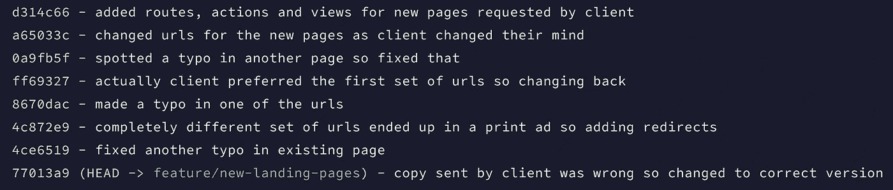
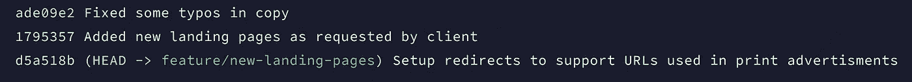
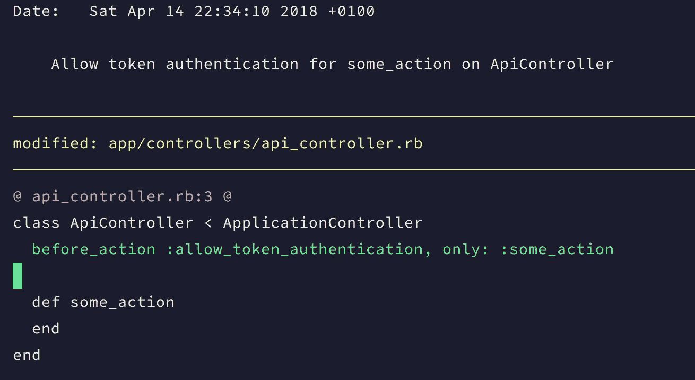
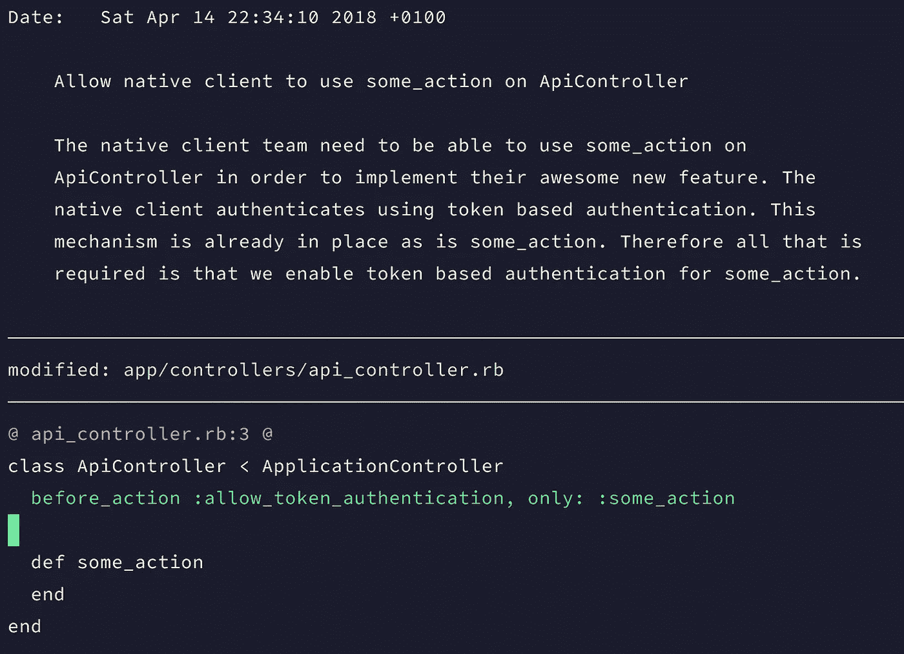

# 拉请求的诗意

> 原文：<https://medium.com/hackernoon/the-poetry-of-pull-requests-c081fbcd0d0>

在[如何为了利润和乐趣安全地重定基础](/@adphillips/how-to-rebase-safely-for-profit-and-pleasure-3e7b4c365682)中，我研究了各种[技术](https://hackernoon.com/tagged/techniques)来帮助解决你在重定一组变更的基础时可能遇到的一些困难。至关重要的是，我没有谈论的是为什么你可能想首先改变一组变更的基础，或者一个好的最终结果可能是什么样的。

# 首先，为什么

开发人员经常谈论“进入状态”。当然，有些复杂的问题需要你进入正确的思维模式，并建立一个良好的问题心智模型，以便能够有效地解决它们。这种心态与编写好的提交消息所需的心态非常不同，出于我们将在后面讨论的原因，这种心态应该侧重于叙述，而不是技术。

同时，等到我们完成了一项工作的全部，这样我们就可以摘掉争论代码的帽子，戴上提交消息的帽子，这也是有问题的。我们可能会陷入令人不快的境地，我们的工作树上散落着更新、创建和删除的文件，很难挑出我们为获得最终结果而采取的步骤。有时，这甚至是不可能的，因为一个文件已经经历了多次迭代的更改才能得到最终结果。我们以一个大规模的提交结束，可能包含几个较小的任务，因为现在我们已经完成了，很难把所有的事情都分开。这对任何不得不审查你的代码的人来说都是糟糕的，对你来说也是糟糕的，当你在 2 年时间里遇到一个 [git](https://hackernoon.com/tagged/git) 指责的时候，你不得不再次破译这些混乱来理解你为什么要做这些改变。

Can you quickly review my code for me?… Photo by [Simson Petrol](https://unsplash.com/photos/-3wygakaeQc?utm_source=unsplash&utm_medium=referral&utm_content=creditCopyText) on [Unsplash](https://unsplash.com/search/photos/poetry?utm_source=unsplash&utm_medium=referral&utm_content=creditCopyText)

解决这两个问题的方法是小规模提交、快速提交和经常提交。这意味着每次提交时总会有少量的更改。如果您正在进行测试，一个好的起点是每个新的测试以及每次提交中相关的代码更改。快速提交意味着我们不会因为担心提交消息的细节而浪费时间和失去动力。我们获得了足够的信息，这样我们就可以在以后识别提交，如果有一些我们认为可能会忘记的重要细节，我们可能会稍微回忆一下。实际上，这意味着通常使用`git commit -m "..."`语法来添加提交。这迫使你简短。我通常用一个特殊的字符(`—` 是我通常的选择)作为我以这种方式添加的提交的前缀，以便我可以在以后识别它们。经常犯错误是犯小错误的自然结果。它应该成为你正常红绿 TDD 循环的一部分。

然后，一旦问题得到解决，并且您知道达到解决方案所需的步骤，您就处于一个更好的位置来将这些重新组织成一组连贯的提交。从这个意义上说，这就像重构或性能优化。如果您尝试从一开始就这样做，很有可能您重构了错误的东西，或者添加了复杂性优化代码，结果证明这并不是一个瓶颈。只有当工作完成后，你才能找到改进的最佳方法。类似地，准备一组提交—只有当您知道所有需要的变更时，您才能确定将它们组织成一致的提交的最佳方式。

在合并提交之前，还有其他的原因让你想改变提交的基础。当你从事一项工作时，很多事情都可能发生，尤其是工作本身可能会改变。也许这种事情可能看起来很熟悉…

这里有一堆不同的工作在进行，有很多冗余的信息。将所有这些都保留在应用程序的提交日志中对任何人都没有好处。真正需要保留的是

提交日志包含正确粒度的信息非常重要。您希望为不同的任务维护不同的提交。同时，当您试图追踪问题的根源时，不必要的提交只会碍事。

最终，重定提交和重写变更是关于效率的。这样做的目的是去除任何干扰和干扰，同时确保理解一系列变化所需的所有信息都是清晰和容易获得的。

# 现在什么

那么好的提交消息和拉请求是什么样子的呢？首先要认识到的是，像代码一样，提交消息只写一次，要多次读取。因此，为了确定什么是好的承诺信息，你需要考虑你写给谁看。你需要考虑 3 个关键受众。

## 你们

第一个人是你自己。重定基础和提交编写过程中最有用的部分之一是将您所做的更改分类到您所采取的不同步骤和任务中。这里是你把你的代码从优秀变得优秀的地方。您理解为什么提交中的每个单独的更改都是必要的吗？它实现了什么？你的改变符合逻辑吗？现在它工作了，你能以更好的方式做同样的事情吗？你做了故事要求的所有事情了吗？你错过了什么边缘案例吗？你是不是跳过了这里或那里的考试？等等等等

你应该能够将你的工作分成清晰连贯的部分，然后描述你试图实现的目标以及你为什么选择你所做的解决方案应该是容易的。

如果您的提交包括以“也更改了…”这样的内容开头的行，这就意味着您在同一个提交中捆绑了多个更改

## 你的团队

你为之写作的下一批人是你的团队。假设您的所有代码都要接受代码审查——这是应该的——您越容易让您的团队理解您提议的更改，对每个人都越好。带有解释性消息的一致的集中提交意味着人们可以快速有效地审查您的代码，而不会陷入试图弄清楚发生了什么或为什么需要特定的更改的困境。这意味着你会得到更好的反馈，你的团队成员会更愿意回顾你的改变，因为他们会觉得这是对他们时间的一种建设性和有效的利用。

您的提交消息应该始终关注变更的叙述，而不是技术细节。任何审查代码的人都可以从差异中看到技术上的变化。如果你写的东西像“改变了文件 Y 中的类 X 来调用方法 z ”,你是在浪费每个人的时间，因为 diff 以一种更精确和更有效的方式表达了这一点。有趣的是，你为什么要做那个特别的改变。有没有什么背景会让你选择这个解决方案，而不是表面上看起来更明显的东西？

你的提交应该引导你的 PR 的读者通过你所做的改变。如果这是一组复杂的变更，它们应该被分解成单独的步骤，以便于遵循，即使这意味着相同的代码在整个 PR 中被多次修改。通读 PR 上的提交消息集应该足以解释变更的“内容”和“原因”。最后的“如何”应该通过阅读代码本身来解释。

## 你会在 2 年、5 年或 10 年后

你写作的最终受众是你未来的自己。想象一下，你正在深入 git 考古学，试图弄清楚一些代码是如何到达一个特定的状态，然后这个提交出现了。为了理解为什么这些变化会以这种方式发生，你想知道什么？

请记住，你可能认为现在显而易见的大部分内容到那时可能就不明显了。此刻消耗你生命的项目将会成为遥远的记忆，你刚刚与利益相关者一起坐了 3 个小时讨论不同可能性的痛苦会议将会被遗忘，你所要解释的这一系列变化就是提交顶部的那段话。

在这一点上，你更愿意看到哪一个？

A completely useless commit message

A commit message that might actually be of some use to some one

为了有效地为所有这些不同的受众编写代码，你需要能够从容不迫地将注意力集中在这一点上，将其作为编写代码本身的一项独立任务。这是一种非常不同的技能，应该用心练习，因为对于开发人员来说，这是一种与编写代码同样重要的技能。至少坏代码以后可以修复。这就是为什么试图在保持代码编写心态的同时做到这一点是徒劳和低效的。

最后要注意的是，在编写提交消息和拉请求消息时，还需要考虑其他一些事情。

## 提交是存储库的一部分，拉请求不是

如果您想要引用以前的更改，那么链接到一个拉请求会很有诱惑力。然而，拉请求不是 git 的一个特性，它们是特定于您当时使用的特定 git 托管提供者的。如果您更改提供商，所有这些链接到 PRs 现在都变得无用。也许有一天，一个新的超级棒的 git 托管提供商出现在你想尝试的场景中。最好不要考虑丢失所有的拉请求信息是一个很大的缺点，或者你的提交日志现在将包含许多断开的链接。

这有两层含义。首先，您应该在提交消息中链接到提交，而不是拉请求。通过 SHA 引用它们，让 Github，Bitbucket 或者你正在使用的任何工具把它们转换成链接。那么不管你用什么工具，它们都会一直工作。第二，所有重要的信息都应该在提交消息中，而不是在公关消息中。根据您的提供者处理合并的方式，您可能仍然会在合并提交中得到 PR 消息，但是拥有相关提交的重要细节仍然更好，即使这意味着在提交之间重复一些信息。这意味着，如果提交确实在几年后作为 git 责备的一部分出现，那么这个人看到信息的机会就会大大增加。

## 拉取请求应该讲述一个故事

拉式请求应该有一个清晰的目标，可以写成叙述。在许多方面，它呼应了写一个好的敏捷故事的指导方针。它应该有明确的动机和受益者。它应该从商业的角度来写，并且尽可能的非技术性。有点像书背面出现的总结。那么提交就是故事中的章节，提交消息也应该如此。每一步都是实现拉取请求中设定的总体目标的一步。最后，差异提供了每章所需的单独代码更改。

正如在提交消息中重复 diff 中包含的所有信息是多余的一样，在拉请求消息中重复提交消息中的信息也是多余的。pull request 消息应该针对代码审查者，因为这是它的主要受众(很可能是唯一的受众)。它应该是简短的和非技术性的。不要在拉请求消息上花太多时间，因为它是所有消息中最短暂的，为提交消息节省精力。

这里的例外是当拉请求由单个提交组成时。在这种情况下，PR 消息应该只是 commit 消息，这是大多数提供者默认的做法。

因此，在了解了使用 git rebase 来准备 pull 请求的一些动机和一些例子之后，下一个问题是如何将其付诸实施。要获得这方面的帮助，请查看[如何为了利润和乐趣而安全地进行再抵押](/@adphillips/how-to-rebase-safely-for-profit-and-pleasure-3e7b4c365682)。