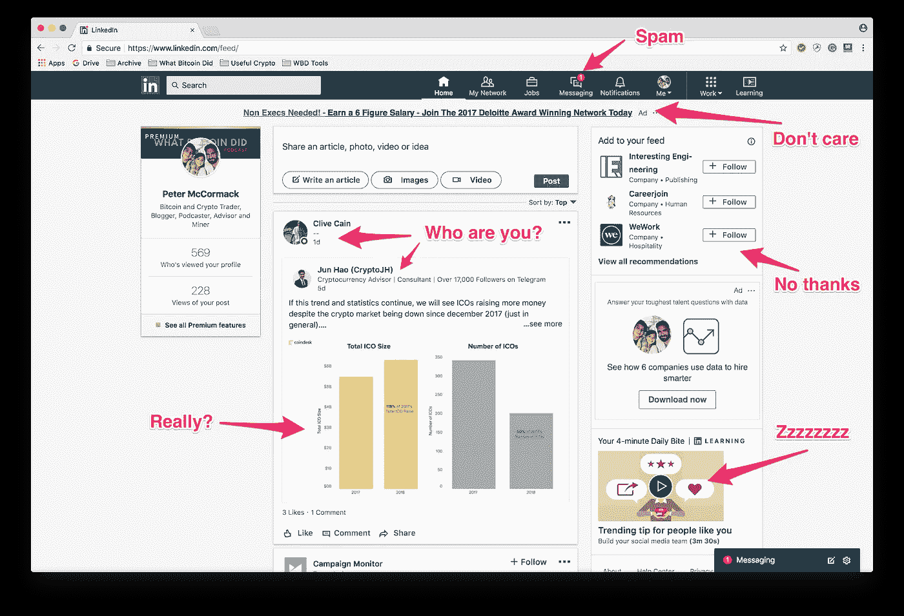
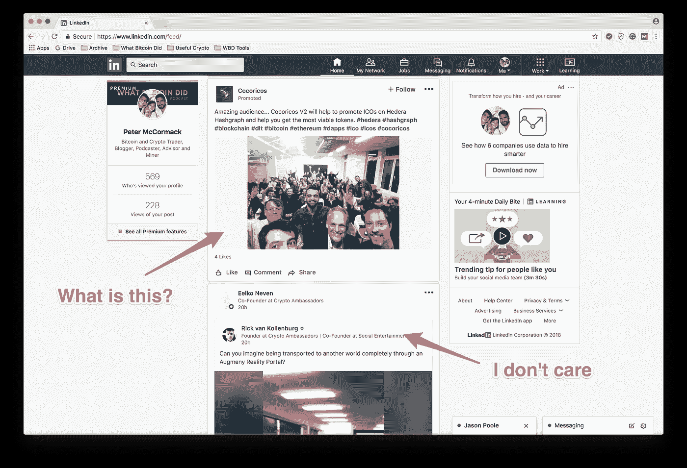

# LinkedIn 的无意义世界

> 原文：<https://medium.com/hackernoon/the-pointless-world-of-linkedin-8f9e22d49353>

***全透明:*** *我是*[*SpringRole*](https://springrole.com/)*的投资人，一个去中心化的职业网络，LinkedIn 的竞争对手。这篇文章是关于我为什么投资这个平台。*

# LinkedIn:垃圾邮件和陌生人的世界

**Email Ping:** <随机不认识的人>想和你联系。耶，又一个我不认识的人想和我联系。另一个人想问我是否对他们的蹩脚 ICO 感兴趣，或者我是否知道有人会在柜台上购买大量比特币。

这就是我在 LinkedIn 上所做的一切，登录，接受请求，阅读垃圾邮件，然后屏蔽用户。你看，检查谁查看了我的个人资料的新鲜感已经消失了，我对新闻订阅唯一真正感兴趣的是推送我的内容，抱歉，但我不关心你的。

事实上，LinkedIn 已经变得几乎毫无意义，是一个自私的社交网络。

有趣的是，Twitter 现在是一个比 LinkedIn 更好的职业网络:

*   我的内容会被更多感兴趣的人看到
*   我发现比我感兴趣的内容更多
*   我和我关心的人真正接触，交谈，甚至成为朋友

Twitter 的另一个好处是，我喜欢迷因和引人入胜的辩论(其中夹杂着奇怪的戏剧性争论)，这意味着我想回到它身边。LinkedIn，对不起，我不在乎某个我不认识的人有了新工作，也不在乎那个老同事的 PowerPoint 演示文稿列出了优化你网站的 10 种方法。

除了使用 InMail 预约面试，LinkedIn 几乎毫无意义。

# **LinkedIn:迷茫的社交网络！**

LinkedIn 似乎正在经历一场严重的生存危机:

*   是专业人脉的平台吗？
*   它是一个像脸书和推特一样的社交网络平台吗？
*   还是一家以广告为主要盈利模式的媒体公司？

谁知道呢？他们似乎已经采取和屠宰其他社交网络的功能，试图使他们为商业社区服务。但是他们没有。

这个平台是想为企业服务，还是为职场人士服务？LinkedIn 的实际目的是什么？

**要回答这个问题，让我们来看看当今网络面临的几个问题。**

我不会在 UI 设计上浪费太多时间，尽管 LinkedIn，请注意谷歌和脸书在设计上的投资，这很重要！你看起来像是用了 10 年前的免费 Wordpress 皮肤。

或许 LinkedIn 最大的问题是新闻订阅，显然是受到了其他社交网络<cough>脸书</cough>的启发，他们把它变成了每个人在 LinkedIn 上体验的核心功能。这是显而易见的为什么？重复访问和网页浏览量，为那些讨厌的广告。

但要让新闻订阅发挥作用，它还必须有吸引人的内容，让我们忍受自私的废话，这是脸书现在正在努力解决的问题:如果你想要你的婴儿照片，那么你也必须看到一些新闻和广告。免费平台的代价是我们必须让沙山路上的少数人变得富有。

LinkedIn newsfeed 的问题是，它只有自助式的商业内容，只有铁杆 LinkedIn 用户才会受到影响，因为他们非常关心社交网络。同样的人，每周早上 5 点起床，去当地高尔夫俱乐部参加商业网络会议，吃一个蹩脚的炒鸡蛋。

我与谁联系的问题加剧了新闻订阅源的问题，因为我的 2500 个联系人包括:

*   少数几个朋友
*   稍微多一点的我曾经一起工作过的人，他们不再关心我了
*   我已经接受了几个人的请求，但他们一点也不认识或不关心我

虽然 LinkedIn 标榜自己是一个专业网络，但它也经常被描述为具有明显缺乏的“社交”功能。虽然用户可以创建和共享内容，但花时间这样做的人往往是那些对此有既得利益的人，例如营销人员和公关专业人员。不幸的是，大多数成员说得很少，假设他们甚至活跃在平台上。因此，LinkedIn 是社会化的，但是是以一种非常反社会化的方式。

因此，我的新闻源只是一堆内容，我不关心来自我不认识或不关心的人。

还有一些广告，lol！我可以想象他们的表现有多差。

Linkedin 还没能解决的另一个问题是真实性。用户提供的任何信息以及他们提出的任何主张都是可疑的。没有适当的验证过程来确保用户配置文件是真实可信的。

最简单的伪装之一就是获得支持。这样做的问题是，Linkedin 把任何东西都算作技能，只要注册用户添加了它。更糟糕的是，他们网络中的任何人都可以为他们声称拥有的技能背书。

那么，背书是评估关系的有用方法吗？或者它们是人们相互讨好的一种虚假方式？我有我不认识的人，鉴定他们不知道我有的技能。

我们再 lol 一次好吗？

然后是评论，实际上是“嘿，给我一个惊人的评论，告诉每个人我有多了不起，我也会为你做同样的事情，伙计。”因此，我的 LinkedIn 个人资料现在说，我对数字化的一切都非常惊讶，我是数字营销的爱因斯坦，没有任何瑕疵。除了我，我在客户管理方面很糟糕，开会经常迟到，而且非常没有条理。为了反驳这一点，我认为我很擅长策略，可以不废话。我的客户相信我的判断，但不相信我的交付，这就是为什么我总是雇用其他人来做这一点。

那不是更有用吗？对，Pete 擅长策略，酷，我们需要一个策略，但是他开会会迟到，而且不会管理客户，好的，我们会确保他给我们指派一个合适的客户主管。

而这就是问题的根源。LinkedIn 必须让每个人都开心，才能让他们留在这个平台上。因此，每个人都必须看起来很棒。这就像 Yelp 对每家餐馆只有 5 条评论一样。

如果它是诚实的，不是对每个人都更有用吗:
“对不起，但小约翰尼是废物，我们不得不让他走，他总是上班迟到，懒惰，整天在 YouTube 上度过。”

雇主会知道小约翰尼是在浪费时间，小约翰尼会明白他必须振作起来。然后你猜怎么着，如果小约翰尼不振作起来，生活会很快向他走来，但如果他做到了，LinkedIn 会显示他取得了多么出色的进步，他会从错误中吸取教训。

# LinkedIn:得赚点钱

很长一段时间以来，LinkedIn 的主要收入来源是公司订阅模式，即公司向 LinkedIn 支付费用，以获取专业人士的资料，并与他们联系以进行潜在的招聘。随着生态系统的增长，LinkedIn 面临着来自脸书和谷歌的激烈竞争，后者通过广告赚钱要快得多。LinkedIn 最终屈服于压力，引入了广告。这就导致了 LinkedIn 整个目的的淡化。

我以前写过为什么[在线广告不起作用](https://www.linkedin.com/pulse/online-advertising-does-work-peter-mccormack)，你可以在 LinkedIn 上阅读，rofl！

隐私是当今的另一个主要问题。该平台提供了一系列隐私选项，但糟糕的设计使得浏览设置变得复杂。在一个我不关心的平台上，发现哪些设置可以限制欺诈账户访问用户信息是一项艰巨的任务。

最重要的是，LinkedIn 上的工作生态系统完全是有缺陷的。当用户声称的技能可能有问题时，映射到工作生态系统的技能就失去了所有的意义。它最终成为一种赚钱模式，公司发布职位，用户搜索这些职位。为了使这一过程有效进行，用户和公司都必须向 Linkedin 支付订阅费。

**解决方法:<提示>我投资的地方</提示>**

现在，在你责备我说，当然，我推荐这个解决方案是因为我已经投资了它。让我们把鸡和蛋按正确的顺序放好。我投资 SpringRole 是因为他们解决了一个问题。

现代技术为我们提供了克服 LinkedIn 固有缺陷的机会。例如，区块链可以帮助为这样的平台带来问责制。用户声称可以验证和证明的任何信息都写在区块链上，在那里是不可变的(这意味着它不能被更改)。用户可以控制他们所有的数据，并决定与他们喜欢的人分享。所有的用户技能都可以得到完全的验证，因此，这个平台成为了一个真正的平台——就业生态系统也就顺理成章了。

在加密领域，以正确的方式使用令牌可以为平台带来责任。例如，SpringRole 正致力于使用令牌并建立一个基于信任的专业网络，在这个网络中，每个用户都要对自己的主张负责。在该平台上，每个用户都将因其执行的任务而获得奖励。这样，当一个人不得不花费真实的代币来证明或验证一个声明时，这些声明最终将变得更加真实。

正如我们今天所知，区块链及其应用将改变许多行业。或许是时候让互联网世界走向一个更加真实可信的生态系统了。

我要把我的钱用在我多嘴的地方！