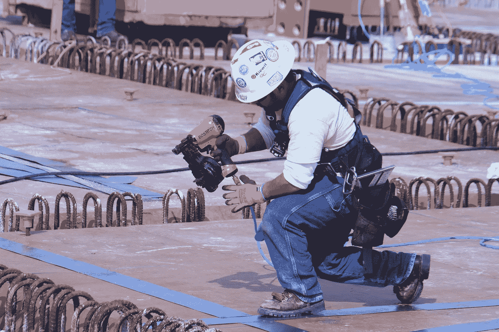

# 更好工具的力量

> 原文：<https://medium.com/hackernoon/the-power-of-better-tools-e7ae672986b1>

## 工资和生产率停滞有一个解决方案。只是不要称之为自动化

[*图片由华盛顿交通部*T3 提供](https://www.flickr.com/photos/wsdot/6977412325/in/photolist-bCz4Av-69i5ki-jNUZcA-cL5g1-ikwKN6-7bA77o-4hnRdf-8sKdd-9p5sbM-7PS9Y7-7PNWgr-6aAAVH-gnmvvk-71rak9-5x6JLU-aAQENG-6aELmf-6aELk3-J4Yf7Y-byxECe-CwyhD-6aF1Us-gn2JL8-a2cFdi-71BS2p-8MCzZv-6aELhS-7PNWsM-6aARve-5eBT2y-5XTnFT-i51Bot-bggUEH-8367Qf-6aAAW4-6aELum-XFSqU8-d6DmK-5TEwBQ-gnmaRH-6ZUhv-cDu8gN-7iRyyN-p1XW9k-e2Hm2M-gnm84D-bBcmW2-gWHUhW-7iRyoJ-8NkvT1)

我不知道世界上的其他人在使用“电动工具”这个词时是怎么想的，但对我来说，这是发自内心的，字面上的。我使用它们并看着它们改变我家庭工作的经历贯穿了我制作木偶的时间。这些强大的[工具](https://hackernoon.com/tagged/tools)不是昂贵框架的小插件，它们是巨大的资本投资，可以极大地改变你的工作。

我从小和爸爸一起盖房子。他给我的最糟糕的任务是在高中时试图为一个壁橱画一套卢浮宫的门；我不得不每隔 90 秒就把门翻转一次，以接住从板条上漏下来的水滴。经过三天的痛苦，我父亲心软了，租了一台[喷漆器](https://www.thisoldhouse.com/ideas/paint-sprayers)，用它我们当天就完成了工作，而且质量更高。

大约在同一时间，我爸爸会租一个[气动钉枪](https://home.howstuffworks.com/nail-gun2.htm)来做大框架的工作。几年后，当我大学毕业时，这个重要的工具从借来的变成了自己的，并带着它到处旅行。最初只用于大型工程，现在大多数承包商都有多个射钉枪来覆盖框架、装饰和所有其他用例，并且需要为其提供动力的空气压缩机与电力一样重要。

这可能不明显，但这两个都是自动化的例子。你用一台机器取代了一个非常手工的过程——涂油漆，或者把东西钉在一起。如果这是一个工厂，现在你会称那些机器为机器人，但是因为这是一个建筑工地，我们称它们为工具。

这些工具非常昂贵。即使我们完成油漆工作的速度有多快，我预计租用喷雾器的成本也比手工完成工作的成本高，因为他付给我的工资很少。(这确实忽略了听我抱怨的软成本，这可能很高。)即使在今天，喷漆器和射钉枪也常常是租来的，而不是购买的，因为好的喷漆器和射钉枪要花很多钱，而且并不是一直都需要。

毫不奇怪，从我作为一名木匠的经历来看，关于工具和生产率的讨论比作为一名系统管理员更容易理解。关于什么是或者不是一个软件动力工具有足够的争论空间，但是当它花费超过一周的工资时，它走到哪里都拖着一条亮橙色的线，当你站在梯子顶端时，它会把你的手钉在墙上？这是一个电动工具。

有一个关于机器人和自动化对像我父亲这样的人(以及我的两个兄弟，他们跟随他的脚步)的影响的常见故事:它偷走了他们的工作，毁了他们的生活。

真是胡说八道。

如果你认为你的工作是将金属钉打入木头，那么射钉枪就是致命的威胁。但如果这是你的附加值，你最大的危险从来不是自动化。我爸从来不出卖自己快速加入原料在一起的能力；他卖掉了房子，他卖掉了享受你的房子和家庭的机会。这些新的电动工具对此有何影响？

他们太棒了。粉刷和钉钉子是卑微、低价值工作的典型例子，然而我们却在上面花了大部分时间。我们向客户提供的所有差异化都被打包到一个狭窄的工作片段中，因为实施需要花费大量的时间和金钱。随着我们能够使用更强大的工具，琐碎的工作减少了，我们的大部分时间可以花在设计工作、客户互动和调整客户的家庭上。

有趣的是，我父亲的下一步职业生涯甚至更加尖锐地指向工具带来的体验。他在田纳西州的一家州立医院找到了一份工作，为严重残疾的病人制作定制家具。突然间，他开始使用工业缝纫机做室内装潢，并与医疗专业人士合作，为每位患者设计多张床，让他们更快乐、更舒适(还能避免褥疮，从而为每位患者节省数十万美元)。鉴于这类工作的预算分配少得可怜，通过自动化和工具节省的每一美元都直接给他的病人带来了健康和快乐。

难怪我看到了电动工具的价值，我更清楚它们能带来的好处，而不是失去低价值的体力工作。

我在制作木偶的时候也有类似的经历。我会遇到高管和销售人员(我不知道为什么总是他们)，他们会说，“哦，自动化？太好了，你可以解雇系统管理员了！”不。除了我直接向我的用户销售产品的明显事实之外，他们永远不会相信解雇他们同事的承诺，这并不是我们有价值的原因。

Puppet 让人们在降低成本但保持当前服务质量，或者保持成本不变但提供更好的服务之间做出选择。“等等，让事情变得更好是一种选择？这我可不知道！”大多数公司都知道他们的 IT 糟透了，但他们只知道如何衡量和管理成本，所以他们就这么做了。一旦你相信让事情变得更好的力量，电动工具对使用者和购买者来说都是很好的投资。

通过让人们将更多的时间花在他们喜欢的工作上，花在让他们与众不同的工作上，我们也为他们的客户和选民提供了更高质量的体验。"花更少的时间救火和做琐碎的工作，花更多的时间发布优秀的软件."如果你的核心技能是点击按钮或响应中断，Puppet 可能会对你构成威胁，但我们的用户知道他们真正的价值在哪里。我们帮助他们在那里花更多的时间，在无聊、低价值的东西上花更少的时间。系统管理员讨厌这项工作，客户讨厌需要这项工作，而高管们讨厌为此付费。很好，搞定，别担心。

然而，当你环顾软件市场，电动工具已经过时了。有[大数据](https://www.google.com/)公司为[不存在的普通用户](https://www.thestar.com/news/insight/2016/01/16/when-us-air-force-discovered-the-flaw-of-averages.html)，[极简主义者](https://trello.com/) [公司](https://slack.com/)为几乎所有人构建解决方案[，还有昔日的电动工具](https://lukekanies.com/great-design-is-ruining-software/)[公司](https://www.adobe.com/) [仍在](https://www.autodesk.com/)徘徊。只是没有那么多现代软件公司构建大型、笨重、昂贵的工具，如果你不小心的话，这些工具可能会割掉你的手。

这也是生产率停滞不前的部分原因。世界并没有改变太多——生产率的一些最大提高来自于为你的工人在工具上的大量资本投资——但是我们如何花钱已经改变了。人们[对 5000 美元的电脑](https://techcrunch.com/video/video-editing-on-the-imac-pro/)望而却步，而[的 Mac IIci 仅硬件成本就超过了今天的 13000 美元](https://www.imore.com/macs-then-and-now-comparing-30-years-bang-your-buck)，然而它却是桌面出版领域的强者。更不用说移动应用商店是如何降低人们在软件上的支出的。

是的，Adobe 的软件很贵，但就是这个价格，因为它提供了如此多的价值。如果没有，没有人会买。每一个大型市场都应该幸运地拥有图形设计师所拥有的强大工具。这听起来很疯狂，但是我们苦于没有足够昂贵的软件。公司没有尽可能开发最强大的软件，也没有找到看到其价值的客户，而是尽可能开发最简单的软件，并试图让每个人都使用它。

行业内有亮点，像 [Airtable](https://airtable.com/) 和[超人](https://superhuman.com/)。我希望它们有助于将动力转移回自动化繁琐的工作，并使人们专注于人类擅长的事情。

更强大的工具改善了你的生活，但它们也让你更快乐，即使你买不到它们。只要你能拿出现金，他们就会引诱你，许诺给你丰厚的回报。它们可能只是有点吓人，警告你买它们是不够的。你必须掌握它们。

1.  我们的一个朋友在没有手机的时代独自工作时做到了这一点。 [↩](#ffn1)
2.  是的，我可能过于简单地说明了一个观点。 [↩](#ffn2)

*最初发表于* [*由卢克·卡尼斯*](http://lukekanies.com/the-power-of-better-tools/) *撰写。*