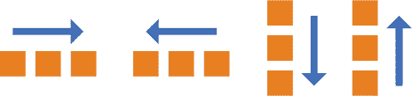
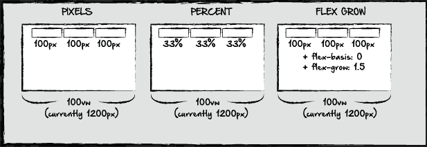
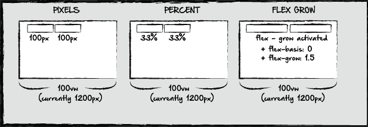
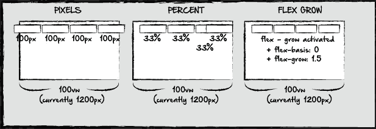
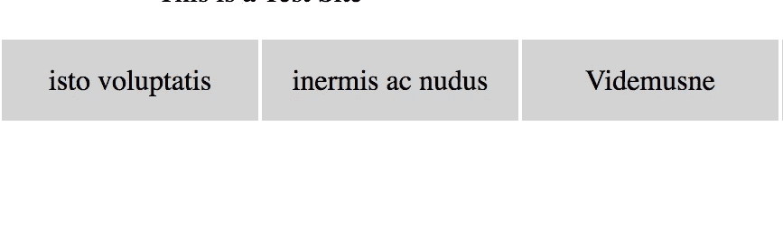
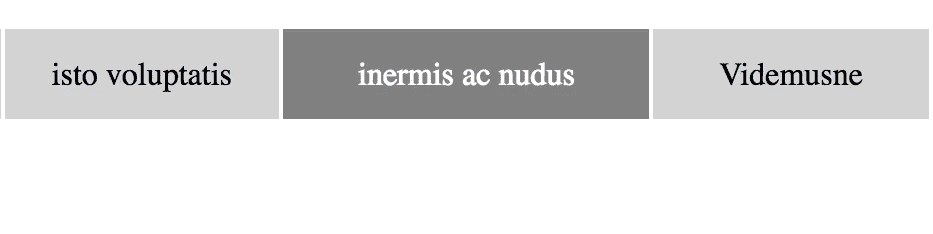
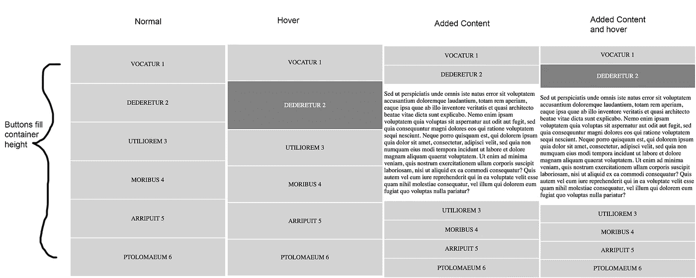

# 灵活增长的力量

> 原文：<https://medium.com/hackernoon/the-power-of-flex-grow-d8ea61ccf16e>

让我们面对现实吧，设计一个网站有时很有挑战性，尤其是当一些内容可能是动态的时候。有时，我们可能需要根据用户输入或其他条件来添加或删除内容。让我们以下列情况为例:

这里，我们有相同的窗口，我们希望按钮在页面的一部分均匀分布。它可以是一个导航栏，或者其他内容块。通常，一种简单的方法是定义每个按钮的像素宽度，如第一个示例所示。如果我们知道我们希望页面的宽度，我们可以简单地测量出我们希望每个按钮的像素。

第二个选项，如例 2，是百分比。如果我们有 3 个按钮，我们希望扩展屏幕的宽度，如果我们的窗口设置为 100vw，我们可以将每个按钮设置为大约 33%来实现这一点。如果将容器或窗口设置为像素，这也是可行的。

第三种选择是增加弹性基础和弹性增长。如果我们的维度设置为 100px，或者不管是什么情况，我们都可以添加一个 flex 基础。伸缩基准类似于最小宽度。它基本上是说，100 像素是我们内容的基本宽度。但是有了 flexbox，这个宽度会根据添加或删除的额外内容而改变。伸缩基准和伸缩增长取决于按钮容器中可用的负空间。如果有三个宽度为 100 像素的按钮，伸缩基准为 0，那么我们可以将伸缩增长设置为 1.5。这仅仅意味着，如果三个按钮中的任何一个被移除，剩下的两个按钮将调整它们的宽度以适应额外的空间，但是使用 100 像素作为它们调整后的宽度的基础。让我们看看，如果我们添加或删除内容，这些内容会发生什么变化。

这里，我们去掉了每个例子中的一个按钮。由像素或百分比定义的元素将保持不变。根据我们的对齐设置，内容可能会向屏幕中间移动，当然，如果元素所在的容器是由视口宽度定义的，则百分比定义的元素可能会改变，但是两个示例的一致性并不总是很好。

在第三个示例中，当我们删除一个元素时，其他两个元素将根据 1.5 flex grow 进行调整。如果我们的 flex grow 设置为 0，那么元素的行为将与第一个示例中的元素完全一样，宽度将保持为 100px。我们还可以单独改变每个组件的伸缩性。如果我们的第一个元素是 1.2 flex grow，第二个元素是 1.7 flex grow，那么当第三个元素被删除时，第二个元素将比第一个元素大，因为它将占用屏幕上更多的剩余空间。让我们看看如果添加一个元素会发生什么:

在第一个例子中，在屏幕上增加一个元素意味着现有的元素将从视窗或容器中消失。百分比会更加棘手。由于每个元素仍然希望占据屏幕的一部分，因此它们要么重叠，要么像第一个示例一样做出反应，这取决于我们设置的任何 z 索引值。无论哪种情况，结果都不尽如人意。在我们的第三个例子中，额外的元素不会产生问题，因为剩余的元素会随着额外的元素进行调整。

这里需要注意的是，虽然这看起来很棒，但是想象一下如果我们增加 5 个额外的元素。在这种情况下，我们要么需要一个行换行特性来创建一个新行，要么想出一个替代的解决方案，因为 2px 宽的按钮可能不是最美观的。

为了说明其中的一些例子，下面是我创建的一个测试页面:

[http://taboo-carpenter.surge.sh/](http://taboo-carpenter.surge.sh/)

在顶部的导航菜单中，flex grow 函数不是在元素本身上激活的，而是它的伪类，或者 CSS 中的悬停状态。每个元素都有一个最小宽度，容器被设置为具有行换行特性的 flex，这样，如果窗口缩小，它就会换行。

同样的效果也可以用 css transform: scale 属性来实现。然而，这里最大的不同是，在 mouseover 事件中，活动按钮的大小增加了，但是所有其他按钮的大小同时减小了，所以占用的空间总量是相同的。

在右边的菜单按钮中，在列格式中，该容器被设置为与左边的内容占据相同的宽度，每个按钮占据的空间刚好足以填充该内容。在这里，您可以看到 flex grow 特性在添加或删除内容时是如何工作的。在其悬停状态，flex grow 功能被激活，使该元素比同一列中的其他元素大。

单击时，内容会添加到元素下方。新元素具有比所有其他元素大得多的弯曲增长，大约为 2.5。新内容仍然在同一个容器中，因此所有附加内容都可以缩放以适合容器，但是新内容占用了大部分空间。

当单击另一个元素时，内容将从第一个元素中移除，新内容将添加到单击的按钮中。这两个元素还具有 flex wrap 特性，允许它们通常作为行元素存在，但如果窗口太小，则翻转到列视图。

总之，flexbox 是一个非常棒的特性，它在网页布局上提供了无与伦比的灵活性。如果你有任何反馈，请告诉我。谢谢！