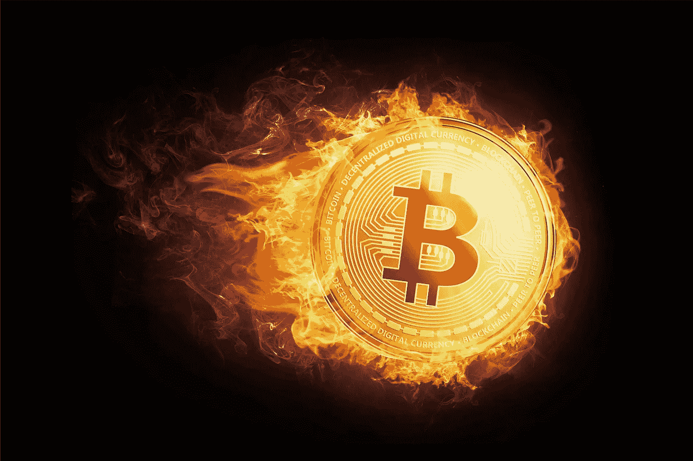

# HODL 的力量:终极指南

> 原文：<https://medium.com/hackernoon/the-power-of-hodl-a-ultimate-guide-13591bcbf0b7>

Picture:CoinSutra

如果你最近刚刚涉足加密货币领域，那么你很可能听说过“HODL”这个词。这个术语是由加密货币用户在 2013 年创造的，此后成为加密投资者行话中的主要内容。然而，尽管它已经存在了大约 5 年，仍然有很多感兴趣的人不知道这项技术有多强大。值得庆幸的是，eToro 的 HODL 旅游指南可以帮到你。我们总结了您需要知道的一切:

Picture: hackernoon.com/bitcoins-final-boss-22e2a52f9c7d

**‘HODL’到底是什么意思？**

我们将从 HODL 实际含义的简单定义开始我们的指南；最初是一个错别字，这个词本质上是指“持有”加密货币的行为。如果你 *hodl* 那么你相信你的硬币在某个时候会有利可图，无论是今天还是未来，因此，你持有加密货币，而不是出售它，因为它在未来会有预测价值。这在处理加密货币(尤其是比特币)时变得特别流行，但往往会在不同的竞争货币之间使用。

HODL 这个词在 2013 年首次亮相，当时一个加密相关论坛的成员写道，尽管当时市场正在下跌，但他仍然持有加密货币。然而，用户拼错了 *holding* 而改成了*hodding*，这个词很快成为一个流行的新词。它甚至演变成了一个反义词——“坚持住，亲爱的生活”。

**我为什么要 HODL？**

对于那些只是想参与投资，但不一定有热情或时间充分参与快节奏市场的人来说，hodling 可能是一个很好的尝试方式。这对那些对投资不是特别有信心，或者技术分析能力有限的人来说也是有益的。

或者，如果你真的相信和有信心，如果你耐心等待，你的投资选择会带来长期的成功，这也是值得的。然而，这并不一定是最好的理由。如果你给自己设定限制和目标，这可能会被证明是有益的，但如果硬币崩盘，这也会让你面临损失金钱的风险。对于比特币来说，这尤其普遍。

2017 年 12 月，比特币的汇率和整体价格上涨，达到每枚 20，000 美元的惊人价格，并因此打破了记录。这引发了比特币狂热分子对未来价格的无数预测。不幸的是，到目前为止，比特币的预期未来和强烈希望被证明是不正确的，因为价格在接下来的一个月里大幅下跌了一半，导致投资者不仅损失了数千美元，还彻底重新考虑了他们对加密货币的整体态度。

**比特币的熊市**

该行业的看跌者，或者那些相信比特币(和其他加密货币)未来有限的人，更常见的是那些会快速交易以获利的人——如果他们真的参与的话。毕竟，比特币目前的价格受到诸多因素的影响，关于这种加密货币的许多事情都是未知的。

更重要的是，由于震惊行业的丑闻和黑客攻击的数量，比特币已经失去了作为犯罪活动场所的声誉，这仍然是一种普遍的想法。经济学家和监管机构对全球平台的批评压力并没有帮助比特币获得良好的声誉，由此引起了无数政府的关注，并开始引入禁令和监管。

甚至关于比特币的正面消息也强调了怀疑态度；以比特币的[交易费价格下跌事件为例。理论上这是一个好消息，然而由于监管者和经济学家的不信任，围绕它并没有太多的正面消息。由于这个原因，霍德林看起来像一个傻瓜的游戏。尽管它有潜力，但如果出现问题，它也有损失全部投资的风险，这不是一些投资者愿意承担的风险。](https://www.independent.co.uk/life-style/gadgets-and-tech/news/bitcoin-transaction-fees-times-currency-cryptocurrency-a8374261.html)

**比特币牛市案**

然而，由于对比特币的未来持更积极的态度，该行业的“多头”更有可能持有异议。事实上，整个案件是基于耐心，价格将再次上升到令人难以置信的高度——毕竟，如果它可以做到这一点，为什么不能再次？

事实上，普遍的观点似乎是，未来价格只会继续上涨。硬币的限量供应意味着它会越来越值钱。虽然它仍然是一个小众的主题，但人们的兴趣正在增长，因此，它不仅会受到关注，而且会被广泛采用。出于这个原因，这些“牛市”投资者可能会持有硬币，以便更好地为未来做准备。

**霍德林备选方案**

虽然已经证明长期持有确实有回报，并提供最好的回报，即使是像比特币这样目前被认为相当不稳定的货币。很多人没有给霍德林一个机会，但其他很多人已经看到 HODL 是一个有价值的方法，一直都是，然而，有一些替代方案，你可以考虑一个有利可图的交易。

对于那些不感兴趣的人来说，也有类似的可能性，要么会受到不赞同的欢迎，要么会感到兴奋，这就是 BUIDL 和 SPEDN。

对于一个有价值且可用的区块链，需要在它的基础上构建一些东西。最近的数据显示，区块链社区在支付方面有所欠缺，这清楚地表明 BUIDL 将是有益的。

那么，SPEDN 是什么意思呢？为了让比特币对我们有益，我们实际上需要用它来买东西。因此，这表明在现实世界中，我们需要能够使用加密货币的方法，因此它们变得有用。

正如你所看到的，HODL 有很多你最初可能没有预料到的力量。因此，在你决定它是否适合你之前，以及在你开始研究它之前，花点时间研究加密货币这个术语。