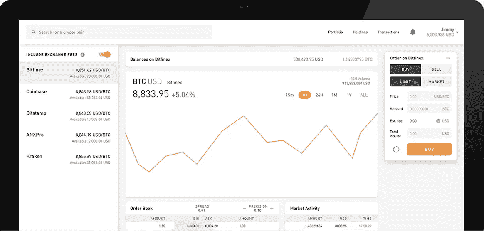

# 密码世界中的 UX

> 原文：<https://medium.com/hackernoon/the-power-of-speaking-to-your-users-817c208eac39>

我们在构建一体化加密资产交易平台时学到了什么

如果我能给一个带着新产品进入市场(任何市场)的人一个建议，那就是首先去和你的目标受众交谈(假设你已经锁定了一个群体)。你可能认为 SWOT，杵或其他框架会让你领先，但你错了。

为了向你展示我的意思，我想我会分享我们的[学习](https://hackernoon.com/tagged/learnings)，从我们的时间[研究](https://hackernoon.com/tagged/researching)为我们的新加密资产交易平台[“CryptoFabrik”](http://www.cryptofabrik.com)。如果你是第一次听说我们，我们是一家总部位于香港的金融科技初创公司，名为 FinFabrik，我们已经建立资本市场软件近两年了。我们公司由前银行家、顾问和开发人员组成。如果你来自这些“旧”的世界，很可能你没有花太多时间担心用户体验设计。我们所有人都需要时间来消除偏见，但当我们做到时，哇，我们的眼睛睁开了。因此，作为一个起点，我想说的是，如果你在把你的产品推向市场之前必须做一些基本的练习，它们应该是调查和采访。现在我来解释一下原因。

**我们了解到并试图解决的 3 个关键问题**

browsermedia.agency

从 2015 年到 2017 年，比特币钱包的数量从大约 300 万个增加到 2500 万个左右(目前并不是所有的都是活跃的)。那是相当大的一跳。每个人和他们的狗都在投资这个市场。尽管有这些惊人的数字，我们面临的一个挑战是找到定期投资甚至跟踪其投资组合的个人。我们遇到的大多数人都是在得到密友或家人的推荐后进行一次性购买，然后继续持有这种单一货币(尽管情况很好)。在大多数情况下，这种货币是比特币。因此，很难从已经进行过一次性购买的用户那里获得可操作的见解。

我们最终确实遇到了许多用户，他们不仅被加密漏洞咬到了，而且还被它迷住了。当我们开始问正确的问题时，我们获得了一些很好的信息和见解。我们发现了一些看起来非常简单的问题，但是到目前为止还没有人尝试去解决它们。

**缺乏自动化投资组合跟踪**

平均而言，加密投资者表示，他们在至少 3 个不同的交易所拥有账户。此外，每当一枚硬币在一个新的交易所上市，他们都必须开立一个新账户，以便在另一个场所进行交易..跟踪不同交易所的价格、持有量及其可用余额是加密投资者的一个主要痛点。我们采访的大多数用户都使用电子表格来跟踪他们的投资和业绩。

所以我们的第一个解决方案很简单。我们创建了一个集中的交易屏幕，投资者可以在那里交易并跟踪他们所有的外汇余额。这个集成屏幕允许用户实时发现、比较和分析他们现有交易所账户之间的价格差异并订购图书。通过创建一个集中的持股页面，我们消除了用户从每个交易所获取数据、运行多个电子表格和手动计算的需要。

**浪费在无休止的 KYC 上寻找流动性的时间**

58%的用户表示，他们最大的痛点之一是在多个不同的交易所开户。这不应该是一个惊喜。人们并不特别喜欢经历多次 KYC，因为这是一个繁琐的活动，占用了真正研究和交易的时间。

为了帮助解决这个问题，我们开发了一个名为“CryptoFabrik 保证执行”的功能。CryptoFabrik 团队将每天与新交易所进行验证，而不是让我们的用户花费时间在繁琐的开户流程上。这将允许用户通过一个交易场所从多个交易所获得流动性。此外，我们的平台部署了一个智能路由算法，该算法将在我们现有的交易所列表中以最佳价格执行交易，因此用户不再需要担心价格来源。

**在交易所之间转移密码很困难**

近 60%的用户表示，在不同的交易所账户之间转移加密货币妨碍了他们的交易活动。交易所之间转账延迟导致的等待时间通常会导致错失良机。

虽然这不是最容易解决的问题，但我们的产品团队正在努力解决。其要点是允许 CryptoFabrik 用户从一个集中的位置在他们不同的 exchange 钱包之间转移余额。我们将在后面揭示更多的这种能力。

**下一步是什么？**

这些只是几个例子，说明简单地问正确的问题可以让您在构建产品路线图时有一个良好的开端。在我们听完所有这些抱怨后，我们发现了一个明显的市场机会。我们勇往直前，做了一些疯狂的事情——我们只是建造了它。就是这样。没有 ICO，没有白皮书，没有路演。只是一群喜欢完成任务的疯子。我们在最近举行的 [FIX 大会](https://fix-events.com/HongKong/index.html)和 [HKTDC 企业家日](http://m.hktdc.com/fair/eday-en/HKTDC-Entrepreneur-Day.html)上展示了该产品，并获得了巨大的反响！

我们决定从“超级简单”的东西开始，如果你想知道为什么，那么我们可以从解决最基本的痛点开始，并从那里向前推进。这仅仅标志着我们旅程的开始。接下来，我们将着手为企业解决问题。通过进一步的研究，我们将发现投资组合经理、对冲基金甚至加密经纪人等机构投资者面临的具体问题。在接下来的几周里，我们将分享更多我们的发现，以及我们对这些问题的建议解决方案。

[敬请期待！！](http://www.cryptofabrik.com)

[关于我](https://www.linkedin.com/in/tanuj-bathla1990/)

我是 FinFabrik 的产品经理，如果您对我们的研究有任何问题，想谈谈用户体验、加密货币或抱怨《最后的绝地武士》,请联系我们。