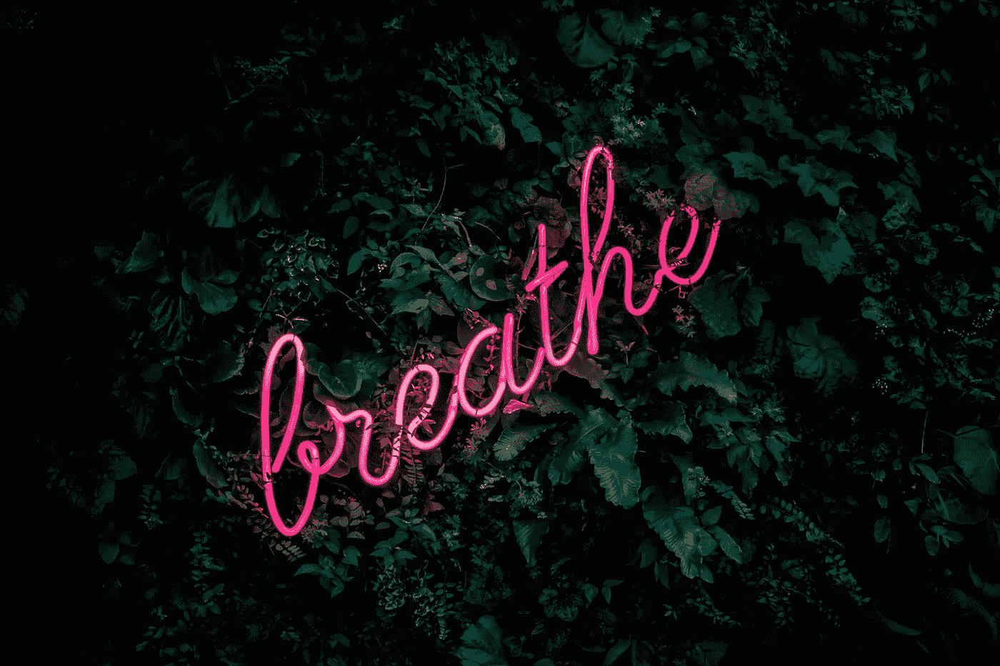
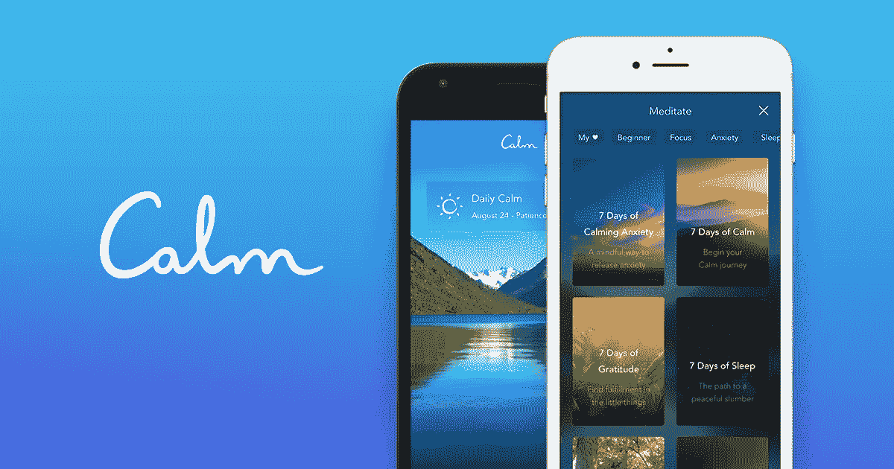
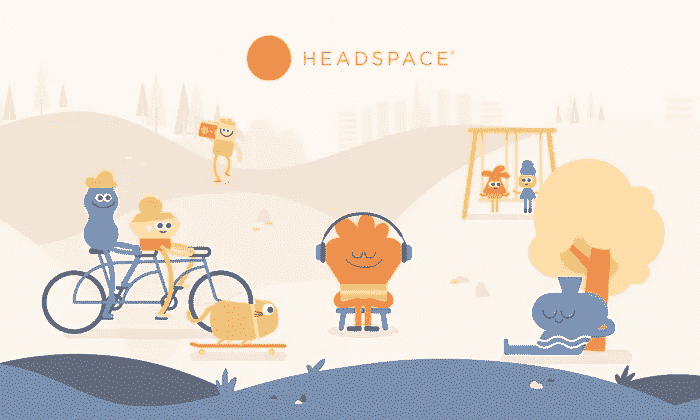
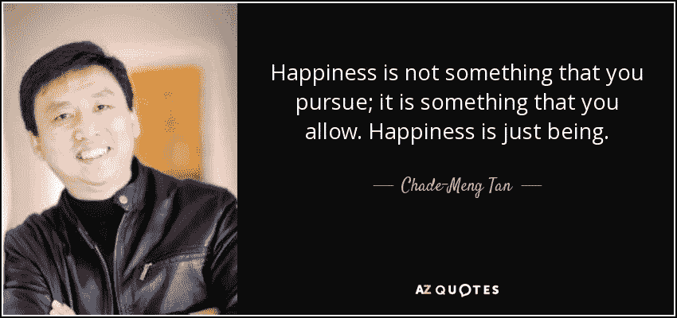

# 深呼吸的力量

> 原文：<https://medium.com/hackernoon/the-power-of-taking-deep-breaths-519382a290b>

Photo by [Fabian Møller](https://unsplash.com/photos/gI7zgb80QWY)

自从我在 2015 年开始听蒂姆·菲利斯的播客以来，我就知道他是冥想的大布道者。对于那些不知道的人来说，蒂姆是《T2》4 小时工作制和其他 4 本书的畅销书作家。

蒂姆谈到他每天如何冥想 20 分钟。此外，**在他的播客中采访的 90%的顶级表演者在他们的日常生活中都有某种形式的冥想。**

所以自从我发现了这一点，我下载了一个帮助我开始冥想的应用程序— [**平静应用程序**](https://www.calm.com/) **。这是一款有简短冥想指南的应用，你可以免费试用 7 个指南。**

# 我对平静应用的体验

我在大学一年级的一两个星期里几乎每天早上都使用这个应用程序。在使用应用的那段时间里，我确实感觉压力更小了，也更放松了。

每个指南大约 3 分钟长。指导者带你通过练习清理你的头脑，用你的鼻子吸气，用你的嘴深呼吸，并专注于你的呼吸。

但是在读完这 7 本指南后，由于订阅对一个学生来说相当昂贵(5 美元/月)，我停止了这种做法。

但是当然，冥想就像是对大脑和精神健康的锻炼。如果你停止这样做，你将会失去它的积极作用。

所以在大学三年级的时候，当事情又开始变得有压力，我感到注意力不集中和焦虑的时候，我决定下载蒂姆·费里斯推荐的一款不同的 app——[**the head space app**](https://www.headspace.com/)**。**

# 我对顶空的体验

Headspace app 在我看来比 Calm app 好很多。设计得更好，他们免费给你 10 个冥想指南。

他们也给你一个机会去尝试他们的多个冥想包的第一个指南。他们有帮助你入睡、人际关系和焦虑的包。

他们每天都有这种免费的冥想指导。我不确定你能听多少是有限制的，但是我已经听了很多了。

Headspace 应用程序和 Calm 应用程序一样，是帮助你在早上或晚上放松并深呼吸的好方法。我不得不说，冥想真的有一些平静和强大的东西。

通过冥想，你可以更多地接触你的身体、你的情绪和你的想法。你意识到只要深呼吸，你就可以平静你的想法和情绪。

即使没有 Headspace 应用程序，我现在也在这么做。我定期深呼吸。事实上，我要说这些天我每天至少做一次深呼吸。

# 深呼吸的力量

A quote from Chade-Meng Tan

我从谷歌先驱、获奖工程师、畅销书作家查德孟谭那里学到了每天做一次正念呼吸的做法。他出现在蒂姆·菲利斯的书《泰坦的工具》中。

孟是谷歌的第 107 号员工，他领导为员工开设了一门基于正念的情商课程，名为“搜索你自己”。

在《泰坦的工具》一书中，孟提出了三条保持冥想练习的建议，这样你就可以有规律地、无意识地进行冥想练习。孟的第三条建议是迄今为止对我最有用的:**每天做一次正念呼吸。**

> “我可能是世界上最懒的正念教练，因为我告诉我的学生，他们需要做的就是每天做一次正念呼吸。只有一个。用心吸气和呼气，你一天的承诺就完成了。其他的都是加分项。”—查德-孟坦

看完这个，我经常练习，现在做的还蛮有规律的。现在，每当我感到特别紧张或不安时，我就会这样做。我只是尽可能地用鼻子吸气，然后从嘴里呼出。通常，我会让自己做不止一件事，这会放大效果。

当然，进行顶空引导冥想仍然有更好的效果，但我现在只在我感到比平时明显更有压力的时候使用顶空。对我来说，深呼吸，不管是 1 次还是 5 次，都要容易得多，而且通常足以让我减轻压力，更加开心。

# 你还在等什么？试试看。

所以来吧，尝试一下，即使是现在。深呼吸，集中注意力。尽可能多的吸气，然后从嘴里全部呼出。

一定要听听空气在鼻子里面奔腾，充满肺部的声音和感觉，听着它慢慢从嘴里飘出来。正念呼吸是指你处于当下，倾听自己呼吸的行为。

在一次艰苦的测试之后，或者在做论文之前、之中或之后，甚至是在健身房里，锻炼之后休息一下。深呼吸对我来说非常有力量。

这可能不会对每个人都有帮助，完整的冥想指南可能对其他人更有帮助。但是对大多数人来说，每天一次正念呼吸就足够了。

所以试试吧，试着把它融入你的日常生活。告诉我进展如何，以及是否对你有所帮助。:)

# 连接更深

如果你喜欢这篇文章，请点击那个按钮或者在下面留下你的回复！每一次鼓掌都让我的作品接触到更多的人:)

Brian Tan 是一名来自菲律宾的 20 岁的作家、UI/UX 设计师和前端 web 开发人员。他还是 [*HangTime*](http://hangtimeapp.com) *的联合创始人——这是一款帮助学生创建并相互分享课程表的网络应用。在*[*brian@hangtimeapp.com*](mailto:brian@hangtimeapp.com)*与他取得联系。*