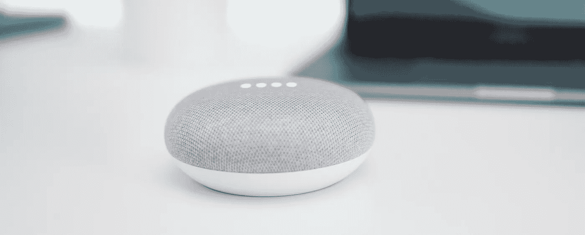

# 支持语音的技术的力量

> 原文：<https://medium.com/hackernoon/the-power-of-voice-enabled-technology-9267b0f9a6b9>

## 你能想象到的最个性化的界面，是你看不到的。

Photo by [Kevin Bhagat](https://unsplash.com/photos/9TF54VdG0ws?utm_source=unsplash&utm_medium=referral&utm_content=creditCopyText) on [Unsplash](https://unsplash.com/search/photos/voice?utm_source=unsplash&utm_medium=referral&utm_content=creditCopyText)

有没有看过一部根据你喜欢的书(尤其是童年时最喜欢的)改编的电影，却很失望？感觉不是你想象的那样？当你读这本书时，你想象的世界对你来说是个人的，它是你想要的任何东西。对其他人来说，它看起来不同，但这没关系，它可能是可以想象的许多事情。当它被放入视觉形式时，它就变得不那么重要了——它变成了唯一的东西。

如果技术能更像书而不是电影会怎样。对不同的人有不同的东西——就像你能想象的那样广泛、丰富和多样。这就是语音界面给技术带来的东西——一些新的东西，一些别人想象中的整洁的东西。

对于一个网站来说，要提供很多很多的选择，它必须有很多的东西。也许你想把它们藏起来，让我把它们找出来。也许你可以创建一个大菜单——我可能想要的所有东西，但不是我*会*会*实际*使用的所有东西。

人们说，语音界面缺乏视觉效果给他们带来了一个发现问题——你看不到你的选择是什么。我们换个角度考虑一下。让我们称之为不分心。他们不需要我的注意，让我从最初与他们互动的目的上分心。语音界面等我和它们交互(至少现在是这样)。他们不会不耐烦，开始提建议，或者打广告，或者让我注册。

他们坐在那里，看不见，等待服务。我的声音在我家做的事情和你的声音在你家做的事情是不同的。不是因为我们可以访问不同的命令(虽然我们可能会)，而是因为我对这些命令的思考和想象与你不同。他们在我家周围跟着我。它们不涉及我的工作。上床睡觉时，我脑海中会浮现出楼下熄灯、温度调节、床头灯上温暖的就寝灯光颜色的画面。一个简单的言语行为就能改变世界，让它发生。

每一次不同的互动都是个性化和情境化的。在那些时刻，没有别的东西存在。每时每刻，我想象中的界面可能看起来非常不同——播放音乐的命令，而不是控制我的恒温器。关键是两者互不干扰。我没有一个充斥着不同事物的 GUI，也不需要在多个屏幕之间导航来找到我想要的东西。“屏幕”上的选项永远不会太多或太少。如果我想象灯是“开着或关着”的，那么这就是我的存在。如果我更喜欢能够将它们设置为“日落黄 33.7%亮度”，那么在我的脑海中我有一系列的选项。所有的命令都在那里，但是我的注意力只在我需要的时候才需要。

语音界面确实需要更好地帮助你找到新的功能。但是只有在你请求帮助的时候。我厌倦了网站试图让我买一些不必要的东西，比如“僧侣手工制作的姜饼”，而我却在做一些完全不相关的事情。我不在乎“像我一样的人”是否买了它们。虽然我们可能不像自己想的那样独一无二，但我们并不都是一样的。让*我*求建议，指点。让*我*决定我认为我需要什么。让我保持我的经历整洁、干净，只是想要我想要的——而不是别人认为我应该想要的。

对你来说最个性化的界面是你想象中的界面，而语音界面正是你所能得到的。这不是营销人员想要的世界，但却是人类需要的世界。

如果您觉得这篇文章有用或有趣，请👏下面还是分享给别人吧。你也可以在这里关注我，或者在 Twitter[*@ virtual gill*](https://twitter.com/virtualgill)*。*