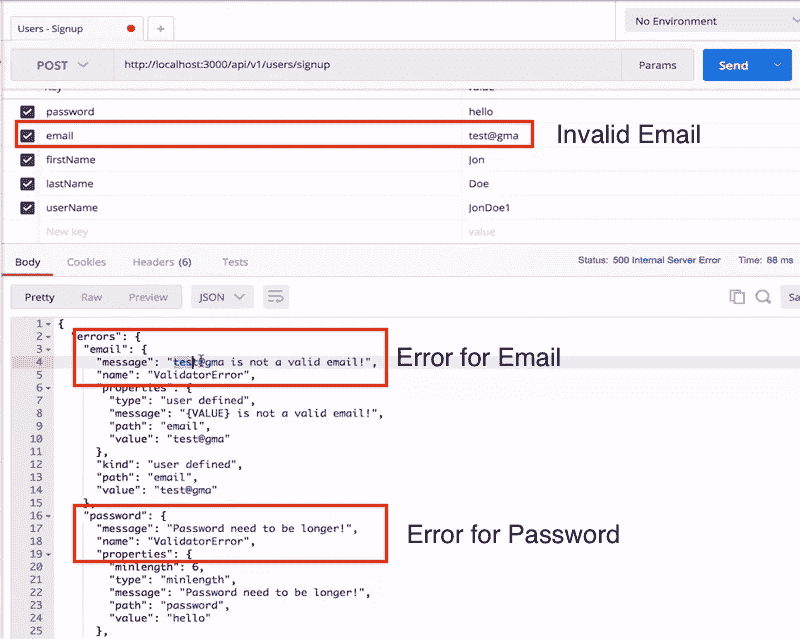
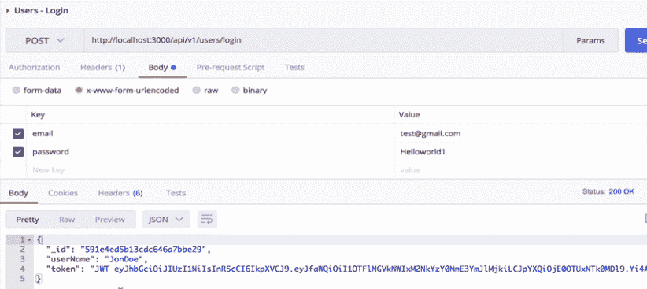

# 在 Nodejs 和 MongoDB 中构建 REST API 的实用指南包括 Passport 和 JWT

> 原文：<https://medium.com/hackernoon/the-practical-guide-for-building-rest-api-in-nodejs-and-mongodb-include-passport-and-jwt-476720b70da0>


include Passport and JWT

在这一课中，我们将用 [NodeJS](https://nodejs.org/en/) 和 [MongoDB](https://www.mongodb.com/) 数据库开始我们的 REST APIs 之旅。如果你以前没有 Nodejs 和 MongoDB 的经验

参加这个有助于你快速起步的课程

[](https://click.linksynergy.com/link?id=qt/jYwyHv8A&offerid=358574.922484&type=2&murl=https%3A%2F%2Fwww.udemy.com%2Fthe-complete-nodejs-developer-course-2%2F) [## 完整的 Node.js 开发人员课程(第二版)

### 你以前学过 Node 吗？你开了一门新课程，老师让你安装一堆库…

click.linksynergy.com](https://click.linksynergy.com/link?id=qt/jYwyHv8A&offerid=358574.922484&type=2&murl=https%3A%2F%2Fwww.udemy.com%2Fthe-complete-nodejs-developer-course-2%2F) [](https://click.linksynergy.com/link?id=qt/jYwyHv8A&offerid=358574.1000574&type=2&murl=https%3A%2F%2Fwww.udemy.com%2Fthe-complete-developers-guide-to-mongodb%2F) [## MongoDB | Udemy 开发人员完全指南

### 用测试驱动的方法掌握 MongoDB 和 Mongoose 设计

click.linksynergy.com](https://click.linksynergy.com/link?id=qt/jYwyHv8A&offerid=358574.1000574&type=2&murl=https%3A%2F%2Fwww.udemy.com%2Fthe-complete-developers-guide-to-mongodb%2F) 

## 为什么是这个教程？

当我开始学习编程时，我在寻找解决问题的方法，并且找到了。但问题是我不知道为什么有些东西在工作的时候会工作，为什么会不工作。我不得不复制别人的源代码，并在不知道为什么的情况下使用它。

本教程将帮助你浏览所有你可以使用的样板代码，并理解其中的每一部分。

## 我们会做什么？

我们将制作一个非常类似于 REST 标准的中型网站。我们还将使用以下功能:

*   本地认证+ JWT
*   用户可以创建帖子
*   用户可以删除和更新自己的帖子
*   用户可以关注另一个用户的帖子
*   用户收到他所关注的用户发布的帖子的通知
*   用户可以喜欢帖子
*   用户可以看到他喜欢的所有职位的列表

听起来很有趣，对吧？让我们看看我们将使用什么来制作这个精彩的应用程序。

## 应用的技术堆栈

我们将使用 Javascript，ES6 + ES7，我们将使用 babel 和 Webpack v2 编译我们的源代码。你应该熟悉 JS 承诺和异步工作。

对于数据库，我们将使用 MongoDB。

[**Github 中的所有代码在这里**](https://github.com/krissnawat/nodejs-restapi)

## 设置工具

从本系列的第 1 部分开始，我们将使用以下工具设置我们的环境:

*   编辑器配置
*   表达
*   埃斯林特
*   巴比伦式的城市
*   网络包 2

一旦我们完成这篇文章，我们将有一个简单的快速服务器启动和运行。我们开始吧！

只需为您的项目创建一个新目录。我把它叫做*’*`*makenodejsrestapi*`*’*。我将使用`[yarn](https://yarnpkg.com/)`包来安装我的工具。在目录中，我们首先创建一个名为'的新文件。gitignore '并添加以下内容:

`node_modules/`

现在，我们将通过运行以下命令来初始化我们的项目:

```
yarn init
```

你会被问到各种各样的问题，我只是按下回车键，让`yarn`取默认值。一旦该命令完成其工作，您将在项目目录中看到一个名为`*package.json*`的新文件，其内容如下:

```
{ 
 “name”: “makenodejsrestapi”, 
 “version”: “1.0.0”, 
 “main”: “index.js”, 
 “license”: “MIT” 
}
```

这个文件只包含我们项目的元数据。接下来，我们将开始在我们的项目中添加 express。接下来运行以下命令:

```
yarn add express
```

如果这个包裹最初没有被发现，*纱*会花一些时间来找到它，但它肯定会。一旦命令运行完毕，我们的 *package.json* 将会更新如下内容:


接下来，我们在项目中创建一个名为 src 的新目录，并在其中创建一个名为 index.js 的新文件。放入以下内容:

```
import express from 'express';
 const app = express();
 const PORT = process.env.PORT || 3000;
 app.listen(PORT, err => {
     if (err) {
         throw err;
     } else {
         console.log(Server running on port: $ {
             PORT
         }-- - Running on $ {
             process.env.NODE_ENV
         }-- - Make something great!)
     }
 });
```

请注意，如果没有在环境变量中设置端口，我们将使用端口 3000。现在，我们将在 package.json 文件中添加一个“脚本”,这样我们就可以在运行我们的 using babel 时使用 dev profile。以下是修改后的文件:


现在，用这个命令安装 cross-env with yarn:

```
yarn add cross-env
```

这是更新后的 package.json 文件:

```
{
     "name": "makenodejsrestapi",
     "version": "1.0.0",
     "main": "index.js",
     "license": "MIT",
     "scripts": {
         "dev": "NODE_ENV=development node src/index.js"
     },
     "dependencies": {
         "cross-env": "^5.1.3",
         "express": "^4.16.2"
     }
 }
```

现在我们可以用这个命令添加 babel 依赖项:

```
yarn add -D babel-preset-env babel-plugin-transform-object-rest-spread
```

运行该命令后，您可以创建一个名为。你可以在其中提供应用程序的环境和插件信息。这是我们接下来要做的:

```
{
     "presets": [
         ["env", {
             "targets": {
                 "node": "current"
             }
         }]
     ],
     "plugins": [
         ["transform-object-rest-spread", {
             "useBuiltIns": true
         }]
     ]
 }
```

transform-object-rest-spread 插件用于为对象析构赋值转换 rest 属性。现在，我们也将使用 webpack 2:

```
yarn add -D webpack babel-core babel-loader webpack-node-externals
```

最后，我们将配置 webpack，并在上面添加了它的依赖项:

```
const nodeExternals = require('webpack-node-externals');
 const path = require('path');
 module.exports = {
     target: 'node',
     externals: [nodeExternals()],
     entry: {
         'index': './src/index.js'
     },
     output: {
         path: path.join(__dirname, 'dist'),
         filename: '[name].bundle.js',
         libraryTarget: 'commonjs2',
     },
     module: {
         rules: [{
             test: /\.js$/,
             exclude: /node_modules/,
             use: 'babel-loader'
         }]
     }
 }
```

现在，我们也运行我们的 package.json 脚本:

```
"scripts": { "dev:build": "webpack -w", "dev": "cross-env NODE_ENV=development node dist/index.bundle.js" }
```

最后，我们可以运行我们的应用程序:

用图形来看，下面是我们运行构建时的输出:


注意，我们在上面运行了两个命令:

*   第一个命令只是构建了应用程序并准备了 babel build
*   第二个命令实际运行请求，您可以在控制台中看到输出

现在，我们将最终安装 ES Lint:

```
yarn add -D eslint eslint-config-equimper
```

现在，创建一个名为'的新文件。“eslintrc”并增加以下内容:

```
{ “extends” : “equimper” }
```

一旦这样做了，如果您没有遵循正确的 ES 标准，您将开始收到警告。当您需要为您的项目遵循严格的约定时，这个工具非常有用。

## Udemy 的一些有趣的节点 API

[](https://click.linksynergy.com/link?id=qt/jYwyHv8A&offerid=358574.1628502&type=2&murl=https%3A%2F%2Fwww.udemy.com%2Fajax-api-exercise%2F) [## AJAX API 练习加密货币数据应用程序

### 学习 AJAX 以及如何从节点服务器发出请求。连接到 web APIs 检索数据并将 JSON 数据输出到 HTML 中

click.linksynergy.com](https://click.linksynergy.com/link?id=qt/jYwyHv8A&offerid=358574.1628502&type=2&murl=https%3A%2F%2Fwww.udemy.com%2Fajax-api-exercise%2F) 

# 接下来我们将添加什么？

在本节中，我们将设置该应用程序后端所需的更多工具:

*   添加猫鼬，身体解析器，摩根，压缩，头盔
*   安装配置文件夹
*   设置常数

## 添加猫鼬

要将 mongoose 和其他提到的模块添加到您的应用程序中，请运行以下命令:

纱线添加猫鼬身体解析压缩头盔&&纱线添加-D 摩根

需要注意的是，我们指定模块的顺序，它们的下载顺序也是一样的。

为了确保我们在同一轨道上，下面是我的 package.json 文件的样子:


现在，我们将使用以下命令再次编译我们的项目:

纱线开发

只要确保项目仍在运行。现在，在 src 文件夹中创建一个新的 config 文件夹，并创建一个名为 constants.js 的文件，其内容如下:

```
const devConfig = {};
const testConfig = {};
const prodConfig = {};
const defaultConfig = {PORT: process.env.PORT || 3000,
};function envConfig(env) {
     switch (env) {
         case 'development':
             return devConfig;
         case 'test':
             return testConfig;
         default:
             return prodConfig;
     }
 }

 //Take defaultConfig and make it a single object 
 //So, we have concatenated two objects into one 
 export default { ...defaultConfig,
     ...envConfig(process.env.NODE_ENV),
 };
```

现在，回到 index.js 文件，我们将为这个常量文件添加依赖项，并将对 PORT 的引用更改为使用这个文件，如下所示:

```
import express from 'express';
import constants from './config/constants';
const app = express();
app.listen(constants.PORT, err => {
    if (err) {
        throw err;
    } else {
        console.log(`Server running on port: ${constants.PORT} --- Running on ${process.env.NODE_ENV} --- Make something great.!`)
    }
});
```

现在，在 config 文件夹中创建一个名为 database.js 的新文件，内容如下:

```
import mongoose from 'mongoose';
 import constants from './constants';

 //Removes the warning with promises 
 mongoose.Promise = global.Promise;

 //Connect the db with the url provided 
 try {
     mongoose.connect(constants.MONGO_URL)
 } catch (err) {
     mongoose.createConnection(constants.MONGO_URL)
 }
 mongoose.connection.once('open', () => console.log('MongoDB Running')).on('error', e => {
     throw e;
 })
```

我们还在 constants.js 文件中将 mongoose 连接的配置修改为:

```
const devConfig = { MONGO_URL: 'mongodb://localhost/makeanodejsapi-dev', }; 
 const testConfig = { MONGO_URL: 'mongodb://localhost/makeanodejsapi-test', }; 
 const prodConfig = { MONGO_URL: 'mongodb://localhost/makeanodejsapi-prod', };
```

这将确保当我们用不同的概要文件和环境运行我们的应用程序时，所使用的数据库是不同的。您可以继续运行该应用程序。

当您在所述端口上运行数据库时，您可以成功地开始使用您的应用程序。

# 设计中间件

现在，我们将开始制作应用程序的中间件。

在 config 文件夹中，新建一个文件，命名为 middleware.js，内容如下:

```
import morgan from 'morgan';
 import bodyParser from 'body-parser';
 import compression from 'compression';
 import helmet from 'helmet';
 import {
     isPrimitive
 } from 'util';
 const isDev = process.env.NODE_ENV === 'development';
 const isProd = process.env.NODE_ENV === 'production';
 export default app => {
     if (isProd) {
         app.use(compression());
         app.use(helmet());
     }
     app.use(bodyParser.json());
     app.use(bodyParser.urlencoded({
         extended: true
     }));
     if (isDev) {
         app.use(morgan('dev'));
     }
 };
```

要使用这个配置，还需要将导入添加到索引文件，如下所示:

```
import express from 'express';
 import constants from './config/constants';
 import './config/database';
 import middlewareConfig from './config/middleware';
 const app = express(); //passing the app instance to middlewareConfig 

 middlewareConfig(app);
 app.listen(constants.PORT, err => {
     if (err) {
         throw err;
     } else {
         console.log(`Server running on port: ${constants.PORT} --- Running on ${process.env.NODE_ENV} --- Make something great.!`)
     }
 });
```

现在，运行您的应用程序，它应该在端口 3000 上服务一个 GET 请求！


## Udemy 的一些有趣的节点 API

[](https://click.linksynergy.com/link?id=qt/jYwyHv8A&offerid=358574.399220&type=2&murl=https%3A%2F%2Fwww.udemy.com%2Fphoto-webapp-instagramapi%2F) [## 使用 Node.js 中的 Instagram API 构建照片 web 应用程序

### 使用 Instagram API 构建照片应用程序！

click.linksynergy.com](https://click.linksynergy.com/link?id=qt/jYwyHv8A&offerid=358574.399220&type=2&murl=https%3A%2F%2Fwww.udemy.com%2Fphoto-webapp-instagramapi%2F) 

# 注册用户

在本节中，我们将使用上节课中的 MongoDB 设置，并在此基础上构建一个应用程序，允许用户在我们的应用程序中注册。不要错过，我们最新的 package.json 文件如下所示:


在这一节中，我们将进一步开发允许用户在我们的应用程序上注册的功能。我们还将制作用户模型，以便数据可以保存在数据库中。

完成本节后，您将至少拥有以下文件结构:


只需跟随这一课如何变成这样！

# 定义模型

我们将从制作用户模型开始。为此，在 src > modules > users 中创建一个新文件，并将其命名为 user.model.js，内容如下:

```
import mongoose, {
     Schema
 } from 'mongoose';
 import validator from 'validator';
 import {
     passwordReg
 } from './user.validations';
 const UserSchema = new Schema({
     email: {
         type: String,
         unique: true,
         required: [true, 'Email is required!'],
         trim: true,
         validate: {
             validator(email) {
                 return validator.isEmail(email);
             },
             message: '{VALUE} is not a valid email!',
         },
     },
     firstName: {
         type: String,
         required: [true, 'FirstName is required!'],
         trim: true,
     },
     lastName: {
         type: String,
         required: [true, 'LastName is required!'],
         trim: true,
     },
     userName: {
         type: String,
         required: [true, 'UserName is required!'],
         trim: true,
         unique: true,
     },
     password: {
         type: String,
         required: [true, 'Password is required!'],
         trim: true,
         minlength: [6, 'Password need to be longer!'],
         validate: {
             validator(password) {
                 return passwordReg.test(password);
             },
             message: '{VALUE} is not a valid password!',
         },
     },
 });
 export default mongoose.model('User', UserSchema);
```

我们刚刚用各种属性定义了用户模型的模式，例如:

*   为用户定义的属性
*   还提供了关于它们类型的属性、它们的唯一性以及应该如何验证这些数据的元信息
*   请注意，我们也提供了一个验证函数。当我们将数据插入 Mongo 集合时，这使得事情变得非常容易

## 定义控制器

现在，我们将通过在控制器定义中使用用户模型来使用它。在 src > modules > users 中创建一个新文件，将其命名为 user.controllers.js，内容如下:

```
import User from './user.model';
 export async function signUp(req, res) {
     try {
         const user = await User.create(req.body);
         return res.status(201).json(user);
     } catch (e) {
         return res.status(500).json(e);
     }
 }
```

我们刚刚定义了一个带有请求和响应对象作为参数的注册函数，并使用我们刚刚在上面定义的用户模型创建了它。

我们还返回了相应的响应及其代码，以便在交易成功时通知用户。

## 定义应用程序路线

我们将为我们的应用程序定义路由，其中我们可以指定用户必须访问的映射，以查看我们制作的应用程序。在 src > modules > users 中创建一个新文件，将其命名为 user.routes.js，内容如下:

```
import {
     Router
 } from 'express';
 import * as userController from './user.controllers';
 const routes = new Router();
 routes.post('/signup', userController.signUp);
 export default routes;
```

请注意，这在上不起作用。我们必须在模块文件夹中定义模块 index.js，内容如下:

```
import userRoutes from './users/user.routes';
 export default app => {
     app.use('/api/v1/users', userRoutes);
 };
```

现在我们可以运行我们的应用程序，这将是我们应用程序的第一个版本。我们现在需要对我们的根 index.js 文件进行最后的修改:


以下是更新的内容:

```
/* eslint-disable no-console */
 import express from 'express';
 import constants from './config/constants';
 import './config/database';
 import middlewaresConfig from './config/middlewares';
 import apiRoutes from './modules';
 const app = express();
 middlewaresConfig(app);
 app.get('/', (req, res) => {
     res.send('Hello world!');
 });
 apiRoutes(app);
 app.listen(constants.PORT, err => {
     if (err) {
         throw err;
     } else {
         console.log(` Server running on port: ${constants.PORT} --- Running on ${process.env.NODE_ENV} --- Make something great `);
     }
 });
```

现在，当我们运行应用程序时，我们仍然可以看到我们的应用程序正在运行:


# 使用 MongoDB 和 Postman

我们现在将使用两个必要的工具:

1.  Robomongo:在这里下载。这是一个非常棒的工具，可以可视化 Mongo 数据并使用它进行查询。也是免费的！这适用于所有操作系统平台。
2.  邮递员:在这里下载[。它是一个点击 API 并获得响应的工具。它有很好的可视化功能，你也可以保存请求格式，这样可以节省你很多时间。还是那句话，免费！这适用于所有操作系统平台。](https://www.getpostman.com/)

当您打开 Robomongo 并连接到您的本地 MongoDB 实例时，您可以看到已经为我们呈现的 DB:


我们已经准备好了一个由我们的应用程序制作的系列，它看起来像:


这将是空的，因为我们现在还没有创建任何数据。我们很快就会这样做！

# 尝试用户注册

让我们现在打开邮差。我们将使用此 URL 访问一个 API:

[http://本地主机:3000/api/v1/users/signup](http://localhost:3000/api/v1/users/signup)

在 postman 中，它看起来像这样:


在使用这个 API 之前，我们将尝试一个 Hello World 版本。看看这个 API 中发生了什么:


现在，回到注册 API。在成功命中之前，我们将尝试提供无效值，并查看我们面临的错误。如果电子邮件无效，结果如下:



现在，我们也将尝试使用正确的数据。我们试试吧！


嗯，故事还没有结束。我们还可以看到数据现在被插入到 MongoDB 数据库中:


太棒了。

## Udemy 的一些有趣的节点 API

[](https://click.linksynergy.com/link?id=qt/jYwyHv8A&offerid=358574.1692166&type=2&murl=https%3A%2F%2Fwww.udemy.com%2Fbuilding-an-api-with-node%2F) [## 使用 Express 和 MongoDB 构建 ESM ready Node.js APIs

### 用 Node 学习 API 设计。Js、Express 和 MongoDB 应用程序使用最新的 ECMAScript 模块用于 Node。射流研究…

click.linksynergy.com](https://click.linksynergy.com/link?id=qt/jYwyHv8A&offerid=358574.1692166&type=2&murl=https%3A%2F%2Fwww.udemy.com%2Fbuilding-an-api-with-node%2F) 

# 添加更多验证

尽管我们已经在用户模型中添加了一些验证，但是如果我们还想保存在另一个文件中呢！为此，在`src > modules > users` 处创建一个新文件，并将其命名为 user.validations.js，内容如下:

```
import Joi from 'joi';
 export const passwordReg = /(?=.*\d)(?=.*[a-z])(?=.*[A-Z]).{6,}/;
 export default {
     signup: {
         email: Joi.string().email().required(),
         password: Joi.string().regex(passwordReg).required(),
         firstName: Joi.string().required(),
         lastName: Joi.string().required(),
         userName: Joi.string().required(),
     },
 };
```

接下来，也在路由器文件中添加这种验证:

```
import {
       Router
   } from 'express';
   import validate   from 'express-validation';
   import * as   userController from './user.controllers';
   import   userValidation from './user.validations';
   const routes = new Router();
   routes.post('/signup', validate(userValidation.signup),   userController.signUp);
   export default   routes;
```

请注意:

*   我们从 express 添加了一个验证导入
*   我们还通过了一个新的注册用户验证功能

现在，当我们尝试让用户使用相同的凭据注册时，我们会收到一个错误:


这实际上不是因为验证，而是因为我们试图用相同的电子邮件插入另一个用户。让我们尝试一些不同的东西:


现在，我们可以纠正这一点，并查看 MongoDB 数据库中出现的数据:


太棒了。我们能够向我们的项目添加强大的验证。

# 密码加密和用户登录

我们将更多地与我们的用户合作。在上一课中，我们能够保存一个新用户。这种方法的主要问题是用户的密码以纯文本的形式保存。这将是我们现在将在应用程序中进行的更改之一。

请不要错过，我们最新的`package.json`文件如下所示:


在本课中，我们将进一步开发加密用户密码的功能。除此之外，我们还将做出如下改变:

*   在 webpack 构建中添加 rimraf 和 clean dist
*   加密用户的密码
*   用 passport 创建本地策略
*   允许用户登录

## 添加 rimraf 依赖项

首先，我们将使用以下命令在项目中添加 rimraf 依赖项:

```
yarn add -D rimraf
```

要再次构建您的项目，请运行以下命令:

```
yarn
```

现在，让我们也将 rimraf 添加到 package.json 文件中:

```
“scripts”: {
 “clean”: “rimraf dist”,
 “dev:build”: “yarn run clean && webpack -w”,
 “dev”: “cross-env NODE_ENV=development nodemon dist/index.bundle.js”
}
```

现在，运行以下命令:

```
yarn dev:build
```

运行此命令时，dist 文件夹将被刷新，并在构建过程完成后返回:


# 要加密密码的库

现在，我们将向我们的项目添加一个库，以便我们可以在将用户密码保存到数据库之前对其进行加密。这样，即使数据库被黑客攻击，我们也能确保它的安全。

运行以下命令:

```
yarn add bcrypt-nodejs
```

这样，库将被添加到我们的项目中。

## 修改模型

现在，我们必须修改我们的模型，以便当请求中出现明文密码时，可以在其中设置加密密码。在`user.model.js`中增加以下内容

```
UserSchema.pre('save', function(next) {
     if (this.isModified('password')) {
         this.password = this._hashPassword(this.password);
     }
     return next();
 });
 UserSchema.methods = {
     _hashPassword(password) {
         return hashSync(password);
     },
     authenticateUser(password) {
         return compareSync(password, this.password);
     },
 };
```

在上面的代码中，这指的是请求中提到的当前用户。此外，一旦我们尝试登录，authenticateUser 就会被调用，并且用户会传递一个明文形式的密码。我们对这个密码进行哈希运算，只有在此之后，我们才会将其与数据库中的值进行比较。

现在，让我们尝试提出一个新的请求，并检查这是否可行。这是我的要求:


当我运行这个请求时，我们得到的响应是:


现在让我们来看看数据库，我们也会在那里看到类似的场景:


现在，我们将成为应用程序的登录 API。

## 使用 Passport 登录

我们将使用一个名为`[Passport](http://www.passportjs.org/)`的图书馆。你可以自由使用任何其他认证库，如脸书，谷歌等。

为了继续，我们需要向我们的项目添加两个库。让我们通过运行以下命令来实现这一点:

`yarn add passport passport-local`

完成后，让我们在 src 文件夹中创建一个名为 services 的新文件夹。我们将在 services 文件夹中创建一个名为 auth.services.js 的新文件，其内容如下:

```
 import passport from 'passport';
 import LocalStrategy from 'passport-local';
 import User from '../modules/users/user.model';
 const localOpts = {
     usernameField: 'email',
 };
 const localStrategy = new LocalStrategy(localOpts, async (email, password, done) => {
     try {
         const user = await User.findOne({
             email
         });
         if (!user) {
             return done(null, false);
         } else if (!user.authenticateUser(password)) {
             return done(null, false);
         }
         return done(null, user);
     } catch (e) {
         return done(e, false);
     }
 });
 passport.use(localStrategy);
 export const authLocal = passport.authenticate('local', {
     session: false
 });
```

这里，我们尝试了一个本地策略，它本质上是异步的，数据作为用户的电子邮件和密码被发送到 passport 库。然后，库将对用户进行身份验证，并返回响应。

我们还将添加 Passport 作为我们的中间件。以下是修改后的文件:

```
 import morgan from 'morgan';
 import bodyParser from 'body-parser';
 import compression from 'compression';
 import helmet from 'helmet';
 import passport from 'passport';

 const isDev = process.env.NODE_ENV === 'development';
 const isProd = process.env.NODE_ENV === 'production';

 export default app => {
     if (isProd) {
         app.use(compression());
         app.use(helmet());
     }
     app.use(bodyParser.json());

     app.use(bodyParser.urlencoded({
         extended: true
     }));
     app.use(passport.initialize());

     if (isDev) {
         app.use(morgan('dev'));
     }
 };
```

这里，我们也用我们的应用程序实例初始化了 Passport 库。

## 将登录添加到控制器

现在是我们将登录功能也添加到控制器层的时候了。向我们的控制器添加以下功能:

```
export function login(req, res, next) {
 res.status(200).json(req.user);
 return next();
}
```

请注意，这是我们最终的控制器文件的样子:


提供登录路径

我们还必须提供一个登录 API 的路径。我们将在`user.routes.js`文件中进行这一更改。将此路线与导入一起添加到文件中:

```
import {
 authLocal
} from ‘../../services/auth.services’;routes.post(‘/login’, authLocal, userController.login);
```

这是我们最终文件的样子:


尝试登录功能

现在，我们将使用之前创建的凭据尝试以下 POST API:

[http://localhost:3000/API/v1/users/登录](http://localhost:3000/api/v1/users/login)

当凭据正确时，会发生以下情况:


这不是很好吗？我们能够登录到一个现有的用户，我们也能够通过加密来保护他的密码。

# 添加 JWT 身份验证

到目前为止，我们能够在我们的应用程序中注册一个新用户:


我们还能够允许用户登录我们的应用程序:


在知道我们将在这篇文章中做什么之前，让我们最后看看我们当前的`*package.json*`文件是什么样子的:


在本节中，我们将添加以下功能:

*   我们将实现 JWT 认证并添加一个加密密码
*   添加新的 passport-jwt 库
*   添加 jsonwebtoken 库
*   在 JSON 中只发送必填字段作为响应

## JSON web token 如何存储数据？

当我们提供要加密的数据和加密密码时，它会被加密以形成 JWT 令牌的各个部分，例如:


如上所示，一个令牌可以包含一个用户的身份和其他与他相关的数据。

## 添加 JWT 秘密

让我们继续我们的`*constants.js*`文件，并在开发配置中添加一个 JWT 的秘密:

```
const devConfig = {
 MONGO_URL: ‘mongodb://localhost/makeanodejsapi-dev’,
 JWT_SECRET: ‘thisisasecret’,
};
```

接下来，我们将使用以下命令安装两个库:

```
yarn add jsonwebtoken passport-jwt
```

现在，移动到授权服务文件和文件中的 JWT 服务，代码如下:

```
import { Strategy as JWTStrategy, ExtractJwt } from ‘passport-jwt’;import User from ‘../modules/users/user.model’;
import constants from ‘../config/constants’;
```

接下来，让 passport 使用指定的策略:

```
// Jwt strategy
 const jwtOpts = {
   jwtFromRequest: ExtractJwt.fromAuthHeader('authorization'),
   secretOrKey: constants.JWT_SECRET,
 };

 const jwtStrategy = new JWTStrategy(jwtOpts, async (payload, done) => {
   try {
     //Identify user by ID
     const user = await User.findById(payload._id);

     if (!user) {
       return done(null, false);
     }
     return done(null, user);
   } catch (e) {
     return done(e, false);
   }
 });

 passport.use(localStrategy);
 passport.use(jwtStrategy);

 export const authLocal = passport.authenticate('local', { session: false });
 export const authJwt = passport.authenticate('jwt', { session: false });
```

为了测试这是否可行，我们现在将在 route JS 文件中使用一个私有路由。最终的文件内容将如下所示:

```
import userRoutes from ‘./users/user.routes’;
import { authJwt } from ‘../services/auth.services’;export default app => {
 app.use(‘/api/v1/users’, userRoutes);
 app.get(‘/hello’, authJwt, (req, res) => {
 res.send(‘This is a private route!!!!’);
 });
};
```

## 验证 JWT

让我们试试这个，验证 JWT 现在在《邮差》工作:


我们现在需要在请求中添加一个 JWT 令牌，它只属于一个特定的用户。

我们将向用户模型添加功能，以便当用户登录时，它也包含 JWT 令牌。因此，让我们向用户模型 JS 文件添加更多的库:

```
import jwt from ‘jsonwebtoken’;
import constants from ‘../../config/constants’;
```

现在，我们可以解密一个令牌并获得一个用户信息。

## 创建 JWT 令牌

我们还必须创建一个为用户创建令牌的方法。现在让我们添加这个方法:

```
UserSchema.methods   = {

     createToken() {
       return jwt.sign(
         {
           _id: this._id,
         },
         constants.JWT_SECRET,
       );
     },
     toJSON() {
       return {
         _id: this._id,
         userName: this.userName,
         token: `JWT ${this.createToken()}`,
       };
     },
   };
```

使用 toJSON()方法也很重要。我们在令牌前面附加了 JWT，因为 passport library 使用它来识别 JWT 令牌。

现在，让我们再次尝试登录用户:



这一次，我们甚至得到了一个 JWT 代币作为回应。这个令牌还将包含用户 ID 和用户名。我们现在有了一个 JWT 的工作范例！

现在，让我们复制 JWT 值并尝试私有路线:


# 通过用户和对象关联发帖

接下来，我们能够在我们的应用程序中注册一个新用户:


我们还能够允许用户登录我们的应用程序:


在知道我们将在这篇文章中做什么之前，让我们最后看看我们当前的 *package.json* 文件看起来怎么样:


在本节中，我们将添加以下功能:

*   我们将为帖子创建一个新的资源。现在，用户也可以创建帖子
*   让用户成为文章的作者
*   处理一些我们在过去的帖子中提出的问题

## 为帖子创建模型

就像我们为用户模型所做的一样，它也需要为 Post 模型做，就像创建一个新文件夹一样。本课结束时，您将了解项目中的新文件夹和文件:


我们将从创建 Post 模型开始。我们还将包括我们需要的验证。让我们为 mongoose 唯一验证添加另一个库:

`yarn add mongoose-unique-validator`

我们还将添加一个新的 Slug 库。为此，请使用以下命令安装它:

`yarn add slug`

如果你想知道什么是 slugify，一篇文章的 URL 应该看起来像文章的标题。这看起来不错，帖子的一瞥也可以在它的 URL 中看到，这是一个很好的过程。

现在，我们也可以添加这个库。我们的模型将如下所示:

```
import mongoose, { Schema } from 'mongoose';
   import slug from   'slug';
   import   uniqueValidator from 'mongoose-unique-validator';

   const   PostSchema = new   Schema({
     title: {
       type: String,
       trim: true,
       required: [true, 'Title   is required!'],
       minlength: [3, 'Title   need to be longer!'],
       unique: true,
     },
     text: {
       type: String,
       trim: true,
       required: [true, 'Text   is required!'],
       minlength: [10, 'Text   need to be longer!'],
     },
     slug: {
       type: String,
       trim: true,
       lowercase: true,
     },
     user: {
       type: Schema.Types.ObjectId,
       ref: 'User',
     },
     favoriteCount: {
       type: Number,
       default: 0,
     },
   }, { timestamps: true   });

   PostSchema.plugin(uniqueValidator, {
     message: '{VALUE} already taken!',
   });

   PostSchema.pre('validate', function (next) {
     this._slugify();

     next();
   });

   PostSchema.methods = {
     _slugify() {
       this.slug = slug(this.title);
     },
   };

   PostSchema.statics = {
     createPost(args, user) {
       return this.create({
         ...args,
         user,
       });
     },
   };

   export default   mongoose.model('Post', PostSchema);
```

我们在上述模型中做了以下工作:

*   为发布模型定义的字段
*   添加了对每个字段的验证
*   添加了对整体发布对象的验证
*   我们根据文章的标题对文章进行分类，同时也保存了这个值

在上面显示的代码中，我们将在控制器中添加 createPost 方法。

## 创建后控制器

我们现在将需要一个控制器，以便用户能够真正地执行与 Post 相关的操作。

根据上面显示的目录结构，在 post 模块本身中定义一个新文件 post.controller.js 文件，内容如下:

```
import Post from './post.model';

 export async function createPost(req, res) {
   try {
     const post = await Post.createPost(req.body, req.user._id);
     return res.status(201).json(post);
   } catch (e) {
     return res.status(400).json(e);
   }
 }
```

当我们面临一个错误或者我们能够成功地创建一个新帖子时，我们返回适当的响应。

## 创建投递路线

现在，让我们在应用程序的 post 模块下名为 post.route.js 的文件中创建到 Post 控制器的路由，内容如下:

```
import { Router } from 'express';

 import * as postController from './post.controllers';
 import { authJwt } from '../../services/auth.services';

 const routes = new Router();

 routes.post(
   '/',
   authJwt,
 );

 export default routes;
```

让我们为此也修改一下`index.js`文件。最终内容将是:

```
import userRoutes from ‘./users/user.routes’;
import postRoutes from ‘./posts/post.routes’;export default app => {
 app.use(‘/api/v1/users’, userRoutes);
 app.use(‘/api/v1/posts’, postRoutes);
};
```

验证发布 API

我们现在将尝试 POST API 来创建一个新帖子。

首先，尝试登录一个用户，这样您就可以获得一个 JWT 令牌来点击这个 URL 上的 Create Post API:

`[http://localhost:3000/api/v1/posts](http://localhost:3000/api/v1/posts)`

以下是我们的尝试和回应:


我们还填充了日期和 slug 字段。这还包含用户 ID。让我们也在 MongoDB 上看看这个帖子:


如果我们再次点击这个 API 来创建文章，将会失败，因为标题已经被占用:


这意味着我们的验证也运行良好。

# 使标题成为强制性的

我们可以实现更多的验证，比如让文章的标题成为强制的。

让我们在 posts 模块中创建一个名为 post.validations.js 的新文件，其内容如下:

```
import Joi from 'joi';

   export const   passwordReg = /(?=.*\d)(?=.*[a-z])(?=.*[A-Z]).{6,}/;
   export default   {
     signup: {
       body: {
         email:   Joi.string().email().required(),
         password:   Joi.string().regex(passwordReg).required(),
         firstName:   Joi.string().required(),
         lastName:   Joi.string().required(),
         userName:   Joi.string().required(),
       },
     },
   };
```

我们还必须修改 routes 文件来包含这个验证。以下是修改后的文件:

```
import { Router } from 'express';
 import validate from 'express-validation';
 import * as postController from './post.controllers';
 import { authJwt } from '../../services/auth.services';
 import postValidation from './post.validations';

 const routes = new Router();
 routes.post(
   '/',
   authJwt,
   validate(postValidation.createPost),
   postController.createPost,
 );

 export default routes;
```

我们能够从上面使用的`authJwt`对象中获得用户 ID。我们现在收到的信息是:


我们将很快改变回答，使之更加优雅。

# 通过 ID 获取数据并将一个对象填充到另一个对象中

接下来，我们能够在我们的应用程序中注册一个新用户:


我们还能够允许用户登录我们的应用程序:


我们还能够创建一个与用户相关的帖子:


在本节中，我们将添加以下功能:

*   我们将通过它的 ID 得到一个帖子
*   我们还将创建控制器和路线
*   我们将向您展示如何在帖子中填充用户信息
*   我们将使用的其他库

## 将 HTTP 状态库添加到控制器

要添加此库，请运行以下命令:

`yarn add http-status`

现在，我们也可以在用户控制器中使用这个库。让我们从导入这个库开始:

`import HTTPStatus from ‘http-status’;`

接下来，不要使用 200 等状态。在我们的控制器中，我们将把这个库提供的状态修改为:

```
export   async function signUp(req, res) {
     try {
       const user = await User.create(req.body);
       return res.status(HTTPStatus.CREATED).json(user.toAuthJSON());
     } catch (e) {
       return res.status(HTTPStatus.BAD_REQUEST).json(e);
     }
   }

   export function login(req, res, next) {
       res.status(HTTPStatus.OK).json(req.user.toAuthJSON());
     return next();
   }
```

我们将在 Post 控制器中做同样的事情:

```
import HTTPStatus from 'http-status';
   import Post from   './post.model';

   export async function createPost(req, res) {
     try {
       const post = await Post.createPost(req.body, req.user._id);
         return   res.status(HTTPStatus.CREATED).json(post);
     } catch (e) {
       return res.status(HTTPStatus.BAD_REQUEST).json(e);
     }
   }
```

## 通过 ID 获取帖子

我们将在 Post 控制器中定义一个新函数，用于通过 ID 获取帖子:

```
export async function getPostById(req, res) {
   try {
     const post = await Post.findById(req.params.id);
     return res.status(HTTPStatus.OK).json(post);
   } catch (e) {
     return res.status(HTTPStatus.BAD_REQUEST).json(e);
   }
 }
```

让我们来定义此功能的路线:

`routes.get(‘/:id’, postController.getPostById);`

因为我们的 Mongo 数据库中有以下帖子:


我们将通过我们的 API 获得这个帖子:


这个响应的问题是，我们也得到了 MongoDB 中的所有字段。我们不想这样。让我们在 Post 模型中对此进行更改:

```
PostSchema.methods = {
   _slugify() {
     this.slug = slug(this.title);
   },
   toJSON() {
     return {
       _id: this._id,
       title: this.title,
       text: this.text,
       createdAt: this.createdAt,
       slug: this.slug,
       user: this.user,
       favoriteCount: this.favoriteCount,
     };
   },
 };
```

一旦我们在模型中应用了`toJSON()`函数，这就是我们现在得到的响应:


## 在 Post 响应中获取用户数据

如果我们仔细观察上面的`JSON`，我们实际上有一个保存其 ID 的用户字段。但是如果我们也希望它的信息在同一个对象中呢？

只需稍微修改 getPostById 函数，并将函数中的 post const 修改为:

`const post = await Post.findById(req.params.id).populate(‘user’);`

我们刚刚添加了一个填充调用，现在响应将是:


`toJSON`也将在我们填充用户对象时工作。这是这里的一个问题，因为我们还拿回了上面的令牌字段，这是永远不会发生的！

让我们修改用户模型来改进这一点:

```
UserSchema.methods = {
   _hashPassword(password) {
     ...
   },
   authenticateUser(password) {
     ...
   },
   createToken() {
     ...
   },
   toAuthJSON() {
     ...
   },
   toJSON() {
     return {
       _id: this._id,
       userName: this.userName,
     };
   },
```

我们修改了上面的`toJSON`方法，因此令牌字段不包含在响应本身中。

这个问题实际上仍然存在。让我们看看当我尝试让一个用户登录时会发生什么:


看，这里也没有令牌字段。要解决这个问题，进入`User controller`中的登录功能，修改如下:

```
export function login(req, res, next) {
 res.status(HTTPStatus.OK).json(req.user.toAuthJSON());
 return next();
}
```

现在，我已经使用了`toAuthJSON`函数本身。如果您现在尝试，登录将像以前一样工作！

# 从数据库获取所有数据

接下来，我们能够在我们的应用程序中注册一个新用户:


我们还能够允许用户登录我们的应用程序:


我们还能够创建一个与用户相关的帖子:


在本节中，我们将添加以下功能:

*   在后控制器上工作以添加更多功能

# 扩展控制器

到目前为止，我们的 Post 控制器只有以下功能:

*   创建帖子
*   按 ID 获取帖子

现在，我们还将添加更多的功能，我们将从获取列表中的所有帖子开始。

## 获取所有帖子

让我们通过添加一个获取所有帖子的新方法来扩展 Post 控制器的功能:

```
export   async function getPostsList(req, res) {
     try {
       const posts = await Post.find().populate('user');
       return res.status(HTTPStatus.OK).json(posts);
     } catch (e) {
       return res.status(HTTPStatus.BAD_REQUEST).json(e);
     }
   }
```

在这里，我们退回了帖子。让我们修改路由文件以使用我们在上面添加的函数:

`routes.get(‘/’, postController.getPostsList);`

我们没有在认证中加入这一点，即使是未经认证的用户也可以至少允许他发帖。现在让我们试试这个 API:


现在，我们有 11 个职位在数据库中，所以，上述 API 显示没有问题。但是五万多的帖子会怎么样呢？在这种情况下，我们会遇到严重的性能问题。

## 分页拯救世界

我们可以根据用户的要求返回有限数量的帖子。在`post`模型中，我们可以提供分页参数，如:

```
PostSchema.statics   = {
     createPost(args, user) {
       ...
     },
     list({ skip = 0, limit = 5 } = {}) {
       return this.find()
         .sort({ createdAt: -1 })
         .skip(skip)
         .limit(limit)
         .populate('user');
     },
   };
```

list 所做的是，它最初只返回前 5 个帖子。如果 skip 为 5，list 函数将返回 5 篇文章，但在跳过前 5 篇文章之后。让我们也修改控制器:

```
export async function getPostsList(req, res) {
   const limit = parseInt(req.query.limit, 0);
   const skip = parseInt(req.query.skip, 0);
   try {
     const posts = await Post.list({ limit, skip });
     return res.status(HTTPStatus.OK).json(posts);
   } catch (e) {
     return res.status(HTTPStatus.BAD_REQUEST).json(e);
   }
 }
```

现在，当我们提供这些值时，我们得到这样的响应:


## 更新帖子并添加验证

接下来，我们能够在我们的应用程序中注册一个新用户:


我们还能够允许用户登录我们的应用程序:


我们还能够创建一个与用户相关的帖子:


在本课中，我们将添加以下功能:

*   我们将更新帖子，并确保更新帖子的用户是其作者
*   创建验证字段

在接下来的课程中，我们将在帖子上添加更多的操作。

## 扩展控制器

到目前为止，我们的 Post 控制器只有以下功能:

*   创建一个 pos
*   按 ID 获取帖子
*   获取所有帖子的列表

现在，我们还将添加更多的功能，我们将从允许用户更新帖子开始。

## 更新帖子

让我们通过添加一个更新帖子的新方法来扩展 Post 控制器的功能:

```
export   async function updatePost(req, res) {
     try {
       const post = await Post.findById(req.params.id);
       if (!post.user.equals(req.user._id)) {
         return res.sendStatus(HTTPStatus.UNAUTHORIZED);
       }

       Object.keys(req.body).forEach(key   => {
         post[key] = req.body[key];
       });

       return res.status(HTTPStatus.OK).json(await post.save());
     } catch (e) {
       return res.status(HTTPStatus.BAD_REQUEST).json(e);
     }
   }
```

这就是我们在上面所做的:

*   从 JWT 令牌确认用户是否与发布对象中的用户相同
*   如果用户不同，我们返回一个`UNAUTHORIZED`响应
*   如果一个用户是相同的，我们得到请求中传递的每个键，并基于此更新帖子
*   一旦所有更新完成，我们返回 OK 响应

让我们修改验证文件以使用我们在上面添加的函数:

```
import Joi from 'joi';

   export default   {
     createPost: {
       body: {
         title: Joi.string().min(3).required(),
         text: Joi.string().min(10).required(),
       },
     },
     updatePost: {
       body: {
         title: Joi.string().min(3),
         text: Joi.string().min(10),
       },
     },
   };
```

我们刚刚在 updatePost 函数中为两个字段的最小长度添加了验证。现在发送文件的时间:

```
routes.patch(
   '/:id',
   authJwt,
   validate(postValidation.updatePost),
   postController.updatePost,
 );
```

## 更新帖子

现在工作已经完成了，我们将验证上面所做的工作。让我们向邮递员发出这样一个`PATCH`请求:


太好了，成功了！甚至帖子的内容也更新了。只要确保我们在 Post 模型中有这个方法:

```
PostSchema.pre(‘validate’, function (next) {
 this._slugify();
 next();
});
```

继续尝试同样的文章。

# 授权用户删除帖子

到目前为止，我们能够在我们的应用程序中注册一个新用户:


我们还能够允许用户登录我们的应用程序:


我们能够创建与用户相关的帖子:


在本课中，我们将添加以下功能:

*   我们将允许作者删除帖子
*   授权功能
*   添加一个叫做`prettie`的工具

## 扩展控制器

到目前为止，我们的 Post 控制器只有以下功能:

*   创建帖子
*   按 ID 获取帖子
*   获取所有帖子的列表
*   更新帖子

现在，我们还将添加更多的功能，我们将从允许用户删除帖子开始。

## 删除帖子

让我们通过添加一个删除帖子的新方法来扩展 Post 控制器的功能:

```
export async function deletePost(req, res) {
     try {
         const post =   await Post.findById(req.params.id);

       if (!post.user.equals(req.user._id)) {
         return res.sendStatus(HTTPStatus.UNAUTHORIZED);
       }

       await post.remove();
       return res.sendStatus(HTTPStatus.OK);
     } catch (e) {
       return res.status(HTTPStatus.BAD_REQUEST).json(e);
     }
   }
```

这就是我们在上面所做的:

*   从 JWT 令牌确认用户是否与发布对象中的用户相同
*   如果用户不同，我们将返回一个未授权的响应
*   如果用户是相同的，我们删除帖子
*   一旦帖子被删除，我们返回 OK 响应

现在发送文件的时间:

`routes.delete(‘/:id’, authJwt, postController.deletePost);`

## 删除帖子

现在工作已经完成了，我们将验证上面所做的工作。让我们向邮递员提出这样一个`DELETE`请求:


现在，您可以使用以下查询来验证这篇文章是否存在于 Get all Post API 和 MongoDB 中:


# 添加更漂亮的库

我们可以用下面的 yarn 命令添加漂亮的库:

`yarn add -D prettier`

完成后，这里是我更新的`package.json`文件:

```
{
     "name": "makeanodejsrestapi",
     ...,
     "scripts": {
       ...,
       "prettier": "prettier --single-quote   --print-width 80 --trailing-comma all --write 'src/**/*.js'"
     },
     "dependencies": {
       ...
     },
     "devDependencies": {
       ...,
       "prettier": "^1.3.1",
       ...
     }
   }
```

我们只显示了所做的更改。我们还将使用以下命令添加一个 ES lint 库:

`yarn add -D eslint-config-prettie`

现在，我们将创建一个名为。带有以下注释的 eslintrc:

```
{
 “extends”: [
 “equimper”,
 “prettier”
 ]
}
```

现在，如果您忘记添加分号或缩进，您只需运行以下命令，它们就会为您添加:

`yarn prettier`

这不是很神奇吗？:)这还显示了哪些文件发生了更改:


我们将继续使用这个命令和库，因为这确实简化了我们的工作！

# 收藏帖子和管理帖子统计

接下来，我们能够在我们的应用程序中注册一个新用户:


我们还能够允许用户登录我们的应用程序:


我们能够创建与用户相关的帖子:


在本节中，我们将添加以下功能:

*   用户可以在通过身份验证后收藏帖子，这也将增加 favoriteCount 计数器变量
*   为此修改用户和发布的模型
*   在 Post 上添加增量/减量静态

## 修改用户模型

我们将添加一个新字段来存储用户喜欢的帖子。让我们编辑 *user.model.js* 文件来实现这一点，并在密码字段后添加一个新字段:

```
favorites:   {
         posts: [{
           type: Schema.Types.ObjectId,
           ref: 'Post'
         }]
       }
```

我们还将添加一个函数来使用该字段:

```
UserSchema.methods   = {
     _hashPassword(password) {
       ...
     },
     authenticateUser(password) {
       ...
     },
     createToken() {
       ...
     },
     toAuthJSON() {
       ...
     },
     toJSON() {
       ...
     },

     _favorites: {
       async posts(postId) {
         if (this.favorites.posts.indexOf(postId)   >= 0) {
           this.favorites.posts.remove(postId);
         } else {
           this.favorites.posts.push(postId);
         }
         return this.save();
       }
     }
   };
```

## 扩展后控制器

让我们在这里添加一个函数来使用我们在模型中定义的功能。从使用 `*post.controller.js*` 文件中的导入开始:

```
import User from ‘../users/user.model’;
```

接下来，我们调用`User`模型函数:

```
export   async function favoritePost(req, res) {
     try {
       const user = await User.findById(req.user._id);
       await   user._favorites.posts(req.params.id);
       return res.sendStatus(HTTPStatus.OK);
     } catch (e) {
       return res.status(HTTPStatus.BAD_REQUEST).json(e);
     }
   }
```

让我们最后修改我们的`*post.routes.js*`文件来访问这个函数:

```
routes.post(‘/:id/favorite’, authJwt, postController.favoritePost);
```

现在该测试这条路线了。在 Postman 中，从数据库或 Get all post API 中选择一个`Post` ID 后，向收藏的 API 发出一个`GET`请求:


接下来，我们验证这在 MongoDB 上是否有效:


我们只保留了对象 ID，因为这样可以避免我们复制数据。如果你再次点击同一个 API，你会看到一些奇怪的东西，文章 ID 现在从用户模型的收藏夹中删除了！


我们还在帖子模型中保留了最受欢迎人数。让我们现在就让它发挥作用。我们将在`Post`模型类中包含此逻辑:

```
PostSchema.statics = {
   createPost(args, user) {
     ...
   },
   list({ skip = 0, limit = 5 } = {}) {
     ...
   },

   incFavoriteCount(postId) {
     return this.findByIdAndUpdate(postId, { $inc: { favoriteCount: 1 } });
   },

   decFavoriteCount(postId) {
     return this.findByIdAndUpdate(postId, { $inc: { favoriteCount: -1 } });
   }
 };
```

incFavoriteCount 和 decFavoriteCount 方法首先使用 Mongo 的 findByIdAndUpdate 方法来查找文章 ID，然后使用$inc 操作符在收藏增加的情况下添加 1，或者在收藏减少的情况下添加-1。

现在让我们也修改一下用户模型。首先添加此导入语句:

`import Post from ‘../posts/post.model’;`

然后，在此修改`_favorites`方法功能:

```
_favorites:   {
       async posts(postId) {
         if (this.favorites.posts.indexOf(postId)   >= 0) {
           this.favorites.posts.remove(postId);
           await   Post.decFavoriteCount(postId);
         } else {
           this.favorites.posts.push(postId);
           await   Post.incFavoriteCount(postId);
         }

         return this.save();
       }
     }
```

现在，我们上面提到的用户模型问题将会解决，Post 模型中的 favoriteCount 也将工作:


如果你一次又一次地点击同一个 API，结果是不会改变的。太棒了。我们有工作的 API，用户也可以喜欢一个帖子。

# 识别帖子是否已经是用户的最爱

最后一部分，我们能够在我们的应用程序中注册一个新用户:


我们还能够允许用户登录我们的应用程序:


我们能够创建与用户相关的帖子:


更新帖子:


并删除一个帖子:


在本节中，我们将添加以下功能:

*   我们将发送他们，如果当前的职位是最喜爱的用户或没有，使前端可以根据这一事实作出决定
*   我们将对路线进行修改，并对控制器功能进行改进

## 延伸路线

我们只需要对我们的 `*post.route.js*`文件做很少的修改:

```
routes.get(‘/:id’, authJwt, postController.getPostById);
routes.get(‘/’, authJwt, postController.getPostsList);
```

我们只是在这两个现有的行中添加了 authJwt。一旦完成，如果我试图获取没有授权头的 Post 列表，我们将得到一个错误:


## 扩展用户模型

现在，如果对当前的`Authorized`用户有利，我们将在 post JSON 中添加更多信息。

移动到`*user.model.js*`文件，将此功能添加到 _ 收藏夹:

```
isPostIsFavorite(postId)   {
     if (this.favorites.posts.indexOf(postId)   >= 0) {
       return true;
     }
    return false;
    }
```

现在移动到`*post.controller.js*`文件，修改`getPostById`功能:

```
export   async function getPostById(req, res) {
     try {
       const promise = await Promise.all([
         User.findById(req.user._id),
           Post.findById(req.params.id).populate('user')
       ]);

       const favorite = promise[0]._favorites.isPostIsFavorite(req.params.id);
       const post = promise[1];

       return res.status(HTTPStatus.OK).json({
         ...post.toJSON(),
         favorite
       });
     } catch (e) {
       return res.status(HTTPStatus.BAD_REQUEST).json(e);
     }
   }
```

这里，我们刚刚添加了一个新的字段收藏夹，它将反映在如下的 Post API 中:


我们还将修改我们的`getPostsList`函数，以包含一个承诺并返回适当的响应:

```
export   async function getPostsList(req, res) {
     const limit = parseInt(req.query.limit, 0);
     const skip = parseInt(req.query.skip, 0);
     try {
       const promise = await Promise.all([
         User.findById(req.user._id),
         Post.list({ limit, skip })
       ]);

       const posts = promise[1].reduce((arr, post) => {
         const favorite = promise[0]._favorites.isPostIsFavorite(post._id);

         arr.push({
           ...post.toJSON(),
           favorite
         });

         return arr;
       }, []);

       return res.status(HTTPStatus.OK).json(posts);
     } catch (e) {
       return res.status(HTTPStatus.BAD_REQUEST).json(e);
     }
   }
```

让我们现在运行并获取所有帖子:


非常好。最后但并非最不重要的是，API 有越来越多的话题，我们应该知道，如安全性，速率限制，最佳做法，我希望你喜欢这个，不要浪费你的时间

# 信用

这篇文章中的所有知识来自于 youtube 系列

# 如果您想了解更多关于节点 API 的知识

## [Node.js:构建 RESTful APIs 的完整指南(2018)](http://flyy.link/nodejs-api-udemy)

**4.7(1775 评分)| | 10171 学员|| 15 小时**
学习用 Node、Express 和 MongoDB 构建快速、可伸缩、安全的 RESTful 服务，从设置到生产 [**了解更多**](http://flyy.link/nodejs-api-udemy) 。

[](https://click.linksynergy.com/link?id=qt/jYwyHv8A&offerid=358574.1638522&type=2&murl=https%3A%2F%2Fwww.udemy.com%2Fnodejs-master-class%2F) [## Node.js:构建 RESTful APIs 的完整指南(2018)

### 从安装到生产，学习使用 Node、Express 和 MongoDB 构建快速、可扩展和安全的 RESTful 服务

click.linksynergy.com](https://click.linksynergy.com/link?id=qt/jYwyHv8A&offerid=358574.1638522&type=2&murl=https%3A%2F%2Fwww.udemy.com%2Fnodejs-master-class%2F) 

## [Node、Express、ES6、& MongoDB](http://flyy.link/API-development-in-Node) 的 API 开发初学者

**4.0(1164 评分)| | 10282 名学生|| 18 小时** 构建 iOS 应用可以对话的 API&Android 应用可以在 Node 中将 API 部署到 live 服务器在 API 可以对话的服务器上部署 live MongoDB 实例在 ES6 中编写代码用于 API 开发或用于一般编程
[**了解更多**。](http://flyy.link/API-development-in-Node)

[](https://click.linksynergy.com/link?id=qt/jYwyHv8A&offerid=358574.1009254&type=2&murl=https%3A%2F%2Fwww.udemy.com%2Fapi-development%2F) [## Node、Express、ES6 和 MongoDB 中的初级 API 开发

### REST API 后端开发。构建节点 API 和 restful express API

click.linksynergy.com](https://click.linksynergy.com/link?id=qt/jYwyHv8A&offerid=358574.1009254&type=2&murl=https%3A%2F%2Fwww.udemy.com%2Fapi-development%2F) 

## 或者更高级的话题

## [节点 JS:高级概念](http://flyy.link/node-advance)

**4.7(1570 收视率)| | 11815****学员|| 16 小时** 用 Node 进阶。Js！用 Redis 学习缓存，通过集群加速，用 S3 和 Node 添加图片上传！ [**了解更多**](http://flyy.link/node-advance) 。

[](https://click.linksynergy.com/link?id=qt/jYwyHv8A&offerid=358574.1587718&type=2&murl=https%3A%2F%2Fwww.udemy.com%2Fadvanced-node-for-developers%2F) [## Node JS:高级概念| Udemy

### 使用 Node 获得高级功能。Js！用 Redis 学习缓存，通过集群加速，用 S3 和…

click.linksynergy.com](https://click.linksynergy.com/link?id=qt/jYwyHv8A&offerid=358574.1587718&type=2&murl=https%3A%2F%2Fwww.udemy.com%2Fadvanced-node-for-developers%2F) 

## 结束语:

我在 [**React Ninja**](http://reactninja.io/) 上发表关于 Node、Laravel、React、React Native 以及其他一切与 web 开发相关的文章。一定要在 [**推特**](https://twitter.com/reactninjaio) 上关注我。

**想雇佣我为你的博客写稿请查看我的**[**Fiverr**](https://www.fiverr.com/krissanawat/write-programming-blogs-or-articles)**page**

加入我们的 [**简讯**](https://reactninja.io/subscribe-our-newsletter/) 获取最新最棒的内容，让你成为更好的开发者。

## 如果这篇文章有帮助，请点击拍手👏按钮下面几下，以示支持！⬇⬇