# Instagram 算法背后的原理&如何优化

> 原文：<https://medium.com/hackernoon/the-principles-behind-how-the-instagram-algorithm-works-bec902eca17e>

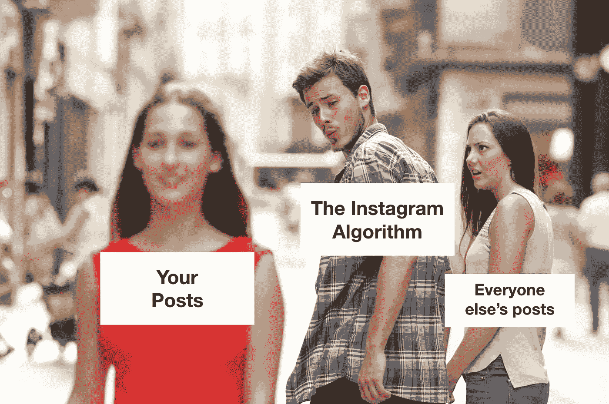

如果你正在阅读这篇文章，你可能会奇怪，为什么在最新的算法改变之后，没有人看到你的 Instagram 帖子。

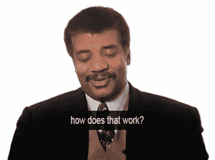

Btw, have you every asked yourself [if your Instagram is actually even worth growing?](/better-marketing/how-to-know-if-your-instagram-is-actually-worth-growing-c0874be37fc5) If not, you should. It might help save you a whole bunch of time and energy. It’s not worth it for everyone…

不要害怕，破译这一算法变化以及所有未来变化的关键在于理解算法做什么、如何工作以及 Instagram 如何改进它背后的原理。

停止寻找黑客来愚弄算法。这不可持续。争先恐后地让你的内容适应*算法的最新*变化只是一个短期的权宜之计。从长远来看，这将分散你的注意力，使你无法对你的 [Instagram 增长策略](/the-mission/how-to-grow-your-instagram-without-buying-followers-76e1d984d00e)做出必要的改变，以帮助你变得对算法有抵抗力，不管它在未来改变多少次。

那么，Instagram 算法背后的原理是什么呢？

要理解背后的原理，我们首先需要了解 Instagram 是一家公司。

## Instagram 是脸书旗下的一家公司，他们的存在是为了通过捕捉和出售你的注意力来从广告中赚钱。

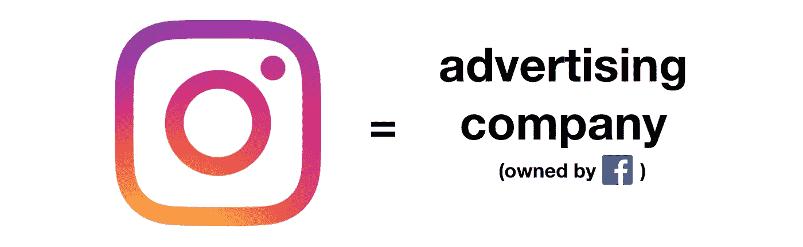

Instagram 的存在不是为了“创建社区”或把你和你的朋友联系起来，他们的存在是为了从广告中赚钱，他们的最终目的是为他们的股东创造价值(赚钱)。

## 你在 Instagram 上花的时间越多，他们赚的钱就越多。

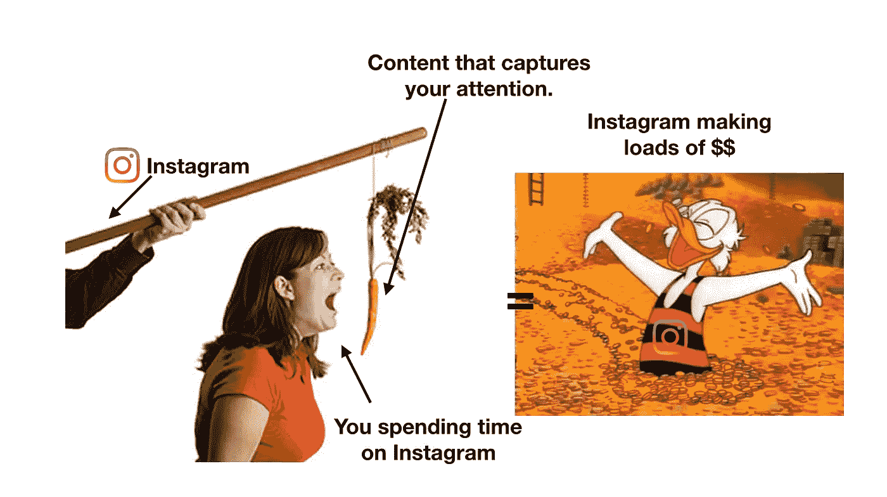

正因为如此，*所做的一切都围绕着尽可能长时间地吸引你的注意力，以便以尽可能高的价格卖给广告商。*

## 他们分析你的用户行为数据，以了解如何尽可能长时间地抓住你的注意力。

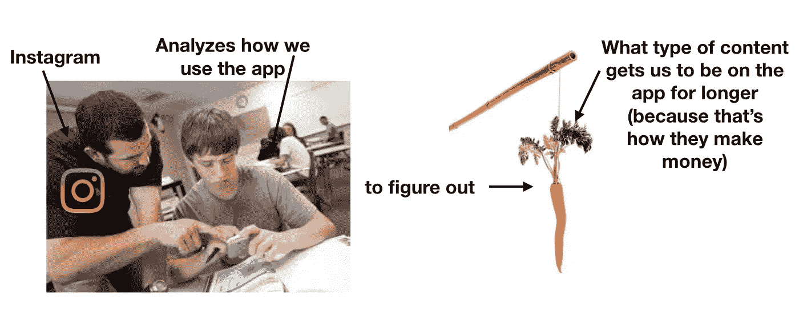

Instagram keeps track of every single thing you do while using the app. That includes the time your eyes spend viewing a particular post, the number of times you view someone’s profile or even [what the microphone records when you’re using the app](/@damln/instagram-is-listening-to-you-97e8f2c53023).

为了找出他们如何改进 Instagram，以便我们在该应用上花费尽可能多的时间(以便他们可以将这些时间卖给广告商)，他们分析了我们的用户行为数据(我们如何使用该应用)，以确定是什么让我们在该应用上停留更长时间。

## 让我们在 Instagram 上停留更长时间的帖子是高参与度的帖子。

虽然我们使用 Instagram 的原因有很多(他们的 UI，社交压力等。)就内容而言，Instagram 已经确定，与其他帖子相比，当我们看到让我们与他们互动更多的帖子时，我们倾向于在应用上停留更长时间。更具体地说，具有高[参与度](/@edmo_nyc/how-to-measure-engagement-rates-on-instagram-and-why-its-important-d368486a984a)的帖子(帖子的参与度=点赞、评论、分享、保存等的数量。除以关注者总数。).

这是有道理的。我们喜欢、评论、分享、保存并花时间去看那些引起我们注意的帖子。没有的，我们就忽略。

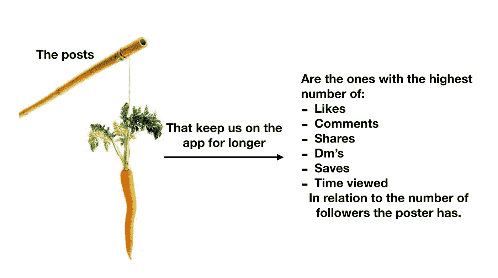

Interactions, in Instagram’s case, refers to likes, comments, shares, DMs, time spent viewing the post, saves, and a few other metrics none of us know Instagram is measuring. By dividing these metrics by the number of total followers the poster has, we get a post’s engagement. The higher the engagement, the more likely we are to pay attention to the post. Btw, here’s an article about the best [Instagram content scheduling and post automation tools](/better-marketing/the-best-instagram-content-scheduling-and-post-automation-tools-2e52e48373d3). Using them will help your posting process a lot more efficient 👍🏽

## Instagram 算法内置于首先向您显示高参与度帖子。

在某个时候，Instagram 还测量了按时间顺序向我们显示我们关注的人的帖子，与首先向我们显示最高度参与的照片相比，在让我们在应用上停留更长时间方面效果不佳。正因为如此，他们创造了 Instagram 算法。它的目的是首先在 home feed 上向每个用户展示他们最有可能参与的帖子(来自他们关注的人)。

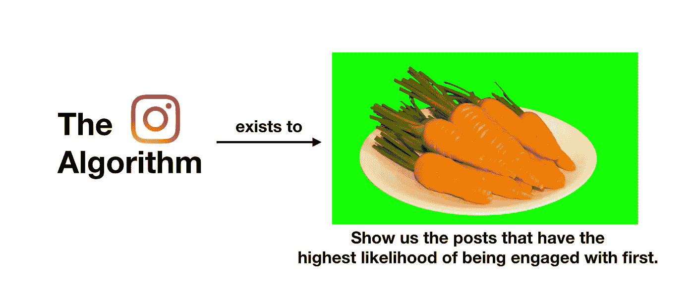

Making sure users see high-engagement posts as soon as they open the app is of utmost importance to Instagram because those posts are the ones that keep us on the app for the longest (and they make more money the longer we are on the app). That’s what the algorithm does. It serves us the posts we are most likely to engage with, first.

## 现在，它决定以如下方式在哪里以及如何显示我们的帖子:

1.  我们张贴一些东西。

2.Instagram 算法向我们的总关注者显示一个很小但具有统计意义的百分比，以衡量他们与过去类似日期和时间的类似帖子相比如何参与该帖子。

3.它使用该数据来预测我们的每个关注者与我们的每个关注者自上次登录并看到主页订阅源以来关注的所有其他帐户的所有其他帖子相比，参与我们帖子的可能性有多大(每次有人登录并看到主页订阅源时，它都会“重置”并显示一组新的帖子)。

4.该算法显示了我们的帖子在我们的追随者的每个主页订阅源中的顺序，与当时所有其他可用的帖子相比，该顺序是最有可能参与的。由于 Instagram 上的每个人都关注不同的账户，并以独特的方式互动，每个人都会在自己的主页上看到不同的帖子。

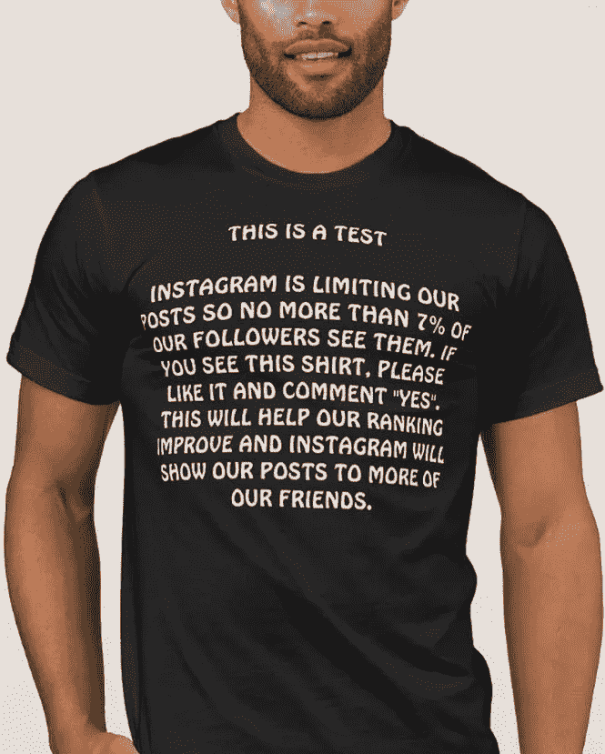

Have you seen a post like this on Instagram? it’s actually not true that Instagram “limits” your posts. What happens is that they show it at a point in your followers’ home feeds that they don’t scroll all the way down to. Btw, this shirt is awesome and you can buy it [here](https://www.instagram.com/p/Bst9bGSB7Zr/).

最有可能被关注的帖子显示在最前面，最不可能被关注的帖子显示在最后，但是所有的帖子都会出现在我们每个关注者的主页上。

是的，根据目前的算法，很可能只有一小部分粉丝会看到我们的帖子，但这并不是因为 Instagram 没有在他们的主页订阅源上显示(或“限制”)它，而是因为该算法将帖子放在了他们的订阅源的下方，以至于他们大多数人不会一直滚动到那个位置，所以他们不会看到它。

## 但每当 Instagram 开发新技术来更好地衡量哪些帖子最有可能被关注时，这种情况就会发生变化。

所以算法才会不断变化(永远…)！因为 Instagram 通过最大化你使用应用程序的时间来最大化利润，他们将继续投资和开发技术，以更好地识别我们最有可能参与的帖子，并让我们在应用程序上停留更长时间。

## 因此，为了抵抗算法，我们需要在一个不饱和的类别中创建高度差异化的超级吸引人的内容。

说真的，这里没有任何技巧或窍门。为了不受 Instagram 算法每一次新变化的负面影响，我们需要创建 Instagram 受到激励而不断优先考虑的内容，这是将保持人们注意力最长时间的内容。

通常情况下，这是人们会做出反应的内容(高参与度),人们寻找的内容是因为它很稀缺(高度差异化，并且属于未饱和的类别)。如果你想抵抗算法，你需要学习如何创建两者！

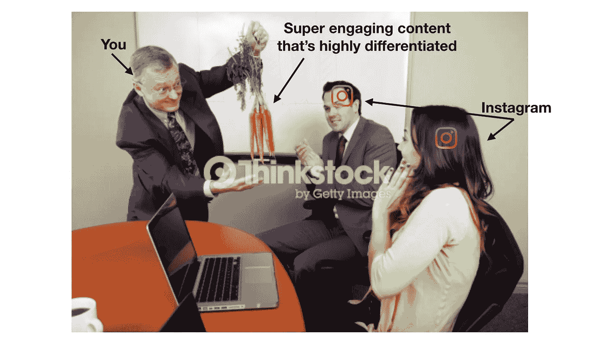

## 创建超级吸引人的内容。

我们知道，看到我们帖子的观众的总比例取决于一小部分观众如何参与每个新帖子，我们必须尽可能让每个帖子都有吸引力。超级吸引人的内容是由以下人员创建的:

*   [**衡量我们的参与度**](/@edmo_nyc/how-to-measure-engagement-rates-on-instagram-and-why-its-important-d368486a984a) **数据了解什么最能抓住我们观众的注意力:**在衡量你的参与度之前，你需要经常创造新的内容(否则你就没有什么可衡量的了)。一旦你做到了，我们就可以衡量你的受众最关注的帖子，从而客观地了解是什么吸引了我们受众的注意力。要找到这些信息，请使用您在 Instagram Insights 页面上发布的参与度数据。

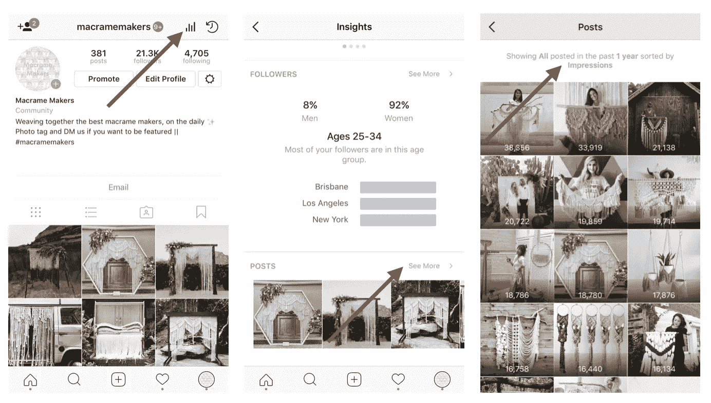

To measure your engagement data, go to your Instagram Insights page, tap into the Posts section, tap in the filter section at the top within that page, and filter All posts by Engagement within the last 6 months and Apply.

*   **让我们的高参与度内容活动变得更好:**一旦我们的参与度数据向我们展示了我们的受众想要哪种类型的帖子，努力让这些类型的帖子变得更好、更细致入微。

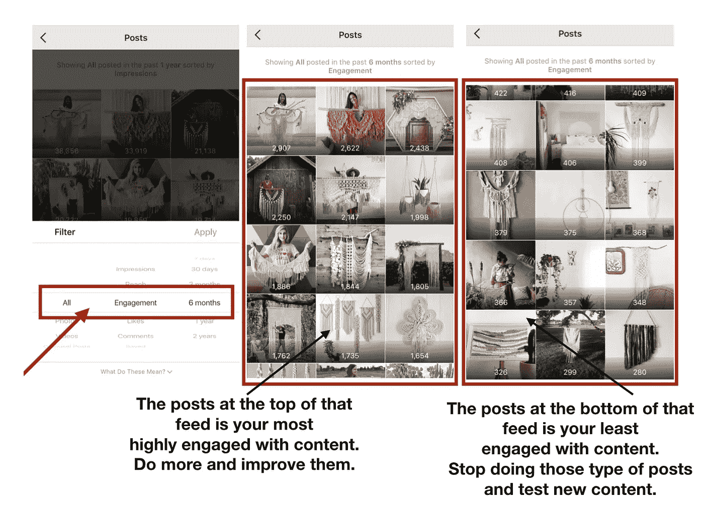

At the top of this feed, you’ll see the posts which get the highest engagement from your audience. These are the posts your audience has had the strongest emotional connection within the last 6 months. Those are your high engagement posts and they are the ones you need to continue to post and improve upon. In the case of one of my accounts, [@macramemakers](https://www.instagram.com/macramemakers/), the engagement data made it very clear to me that my audience likes to see complex macrame pieces with the person who makes it in the photo.

*   **不断测试新内容:**我们的追随者的口味会随着时间的推移而变化，因此为了能够识别它是如何变化的，并让他们保持参与，我们必须不断发布我们认为他们可能喜欢的新内容类型，并再次使用我们的参与数据来衡量它是否真的喜欢。

## 在不饱和的内容类别中保持高度差异化。

我们知道，我们在每个关注者主页订阅源中的排名取决于我们的帖子与当时所有其他帖子相比被关注的可能性，因此我们必须尽可能与我们的关注者关注的其他人区分开来。我们通过在内容类别中高度差异化来做到这一点，这通常通过以下方式来实现:

*   **在正确的时间发帖:**由于我们的帖子在关注者主页上的排名取决于它与我们发帖时*他们关注的其他账户的帖子的比较，我们需要在.</figcaption></figure><ul class=)*
*   *[**在我们的内容类别中尽可能与众不同:**另一方面，如果我们是我们类别中最有吸引力的内容创作者，我们将总是排名很高。问题是，要成为一个类别中最吸引人的内容创作者是非常非常困难的。但是，我们的差异越大，我们的机会就越大。差异化的真正含义取决于我们谈论的内容类别的类型，所以你越有创意越好。需要记住的是，如果人们对某个特定话题感兴趣，他们可以选择关注谁，而关注(和注意力)是一种稀缺资源。为什么他们会真的关注你而不是其他和你创造相似内容的人呢？如果我们对此没有一个清晰的答案，很可能我们没有很好的区分。](/the-mission/how-to-optimize-posting-times-to-fix-your-falling-engagement-rates-on-instagram-f9ecf87e82aa#Yoga has over 51,000,000 posts, #macrame over 1,300,000 posts and #cacaoceremony only slightly more than 14,000\. If I want to be in the least saturated topic, which of these categories should I choose? By far, I’ll have a higher likelihood of being the most engaging account within the Cacao Ceremony category in comparison to the other ones (because I’ll be competing with less content).</figcaption></figure><ul class=)*

*[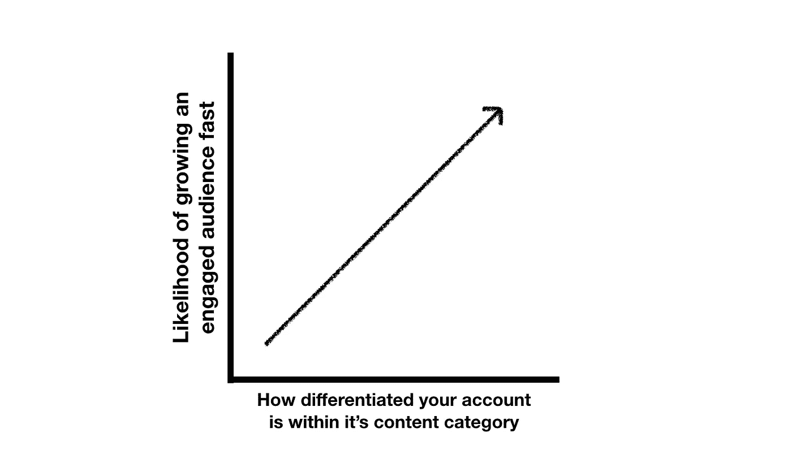](/the-mission/how-to-optimize-posting-times-to-fix-your-falling-engagement-rates-on-instagram-f9ecf87e82aa#Yoga has over 51,000,000 posts, #macrame over 1,300,000 posts and #cacaoceremony only slightly more than 14,000\. If I want to be in the least saturated topic, which of these categories should I choose? By far, I’ll have a higher likelihood of being the most engaging account within the Cacao Ceremony category in comparison to the other ones (because I’ll be competing with less content).</figcaption></figure><ul class=)*

*[Only until you’re growing organically by being differentiated enough should you do Instagram growth hacking tactics like exponential engagement. Best to always do it by hand, but if you’re interested in learning more about how to do it through](/the-mission/how-to-optimize-posting-times-to-fix-your-falling-engagement-rates-on-instagram-f9ecf87e82aa#Yoga has over 51,000,000 posts, #macrame over 1,300,000 posts and #cacaoceremony only slightly more than 14,000\. If I want to be in the least saturated topic, which of these categories should I choose? By far, I’ll have a higher likelihood of being the most engaging account within the Cacao Ceremony category in comparison to the other ones (because I’ll be competing with less content).</figcaption></figure><ul class=) [Instagram bot](https://bettermarketing.pub/the-best-instagram-bots-for-2022-the-most-effective-options-everything-else-you-need-to-know-73fa36f4e433) automation, here’s a guide on [how to automate an Instagram bot safely](/the-mission/how-to-automate-an-effective-instagram-bot-that-isnt-spammy-b2146a2c0b19).*

## ***算法总会变，但 Instagram 不会。***

*Instagram 是一家为了利润最大化而存在的公司。他们通过最大化我们在应用上花费的时间来做到这一点，这样他们就可以把我们的注意力卖给广告商。他们不断改进算法(以及整个应用程序)，向我们展示最吸引我们的内容，因为这些内容会让我们在应用程序上停留更长时间。为了抵抗算法变化，我们需要能够持续地创建高参与度的内容，这样它现在和将来都很有可能受到算法的青睐。从长远来看，没有其他方法可以避免成为算法变化的受害者。既然你已经知道了，那就看你自己去做了！*

*顺便说一句，如果你想更深入地了解有助于你更快发展 Instagram 业务的其他策略，请阅读这些文章，分别是关于[Instagram 到底是什么以及如何工作的](https://theeduardomorales.medium.com/what-instagram-really-is-how-it-works-ad5d7ff5b6a0)、[Instagram 算法如何工作的](https://theeduardomorales.medium.com/what-the-instagram-algorithm-does-how-it-works-how-to-use-it-to-your-advantage-752356122c67)、 [Instagram 利基市场以及它们为什么是增长的关键](/better-marketing/instagram-niches-why-they-are-the-new-key-to-growth-on-instagram-beca2878d55d)、如何建立一个赚钱的 insta gram 转发账户、[如何找到最好的 insta gram 标签](/the-mission/a-simple-system-to-find-the-30-most-effective-hashtags-for-your-instagram-4c2a4ffba34a)， [如何创建有效的 Instagram 故事广告](https://hackernoon.com/how-to-create-an-effective-instagram-story-ad-bf9aef9eb9)，[如何挑选正确的 Instagram 用户名](/better-marketing/how-to-pick-the-best-instagram-username-9af1b49b7ad)， [Instagram bots 2021](/better-marketing/instagram-bots-in-2021-everything-you-need-to-know-b57fb0a3b8e9) ，[为什么你的 Instagram 账户没有增长](/the-mission/why-your-instagram-account-isnt-growing-and-why-it-s-not-because-of-the-latest-instagram-523f6137014b)，[如何在 Instagram 上赚钱](/the-mission/how-to-make-money-on-instagram-7b13ce4b300d)，如何[检查你是否被屏蔽](https://hackernoon.com/3-simple-steps-to-check-if-youre-shadowbanned-what-shadowbanning-is-what-causes-it-and-how-to-175723df938b)，[如何创建有效的 Instagram 赞助帖子](/@edmo_nyc/how-to-create-effective-instagram-sponsored-posts-ea948b18f582)，如何[盈利](https://hackernoon.com/how-to-monetize-a-medium-article-b4c1aeb7fdae) [如何提高你在 Instagram 上的参与度](/swlh/how-to-measure-influencer-marketing-roi-on-instagram-321b9b397ef4)、[如何在 Instagram 上找到最佳时间时间帖子](/the-mission/how-to-optimize-posting-times-to-fix-your-falling-engagement-rates-on-instagram-f9ecf87e82aa)，以及[如何找到最有价值的 Instagram 影响者](https://hackernoon.com/how-to-search-for-and-find-the-most-valuable-influencers-on-instagram-df8ddd5b2243)、[如何衡量一个影响者的价值](https://hackernoon.com/how-to-measure-what-an-instagram-influencer-is-worth-cb488f605ffe)、[如何接触影响者](https://hackernoon.com/how-to-reach-out-to-instagram-influencers-to-maximize-response-rates-16f429008f62)，你需要了解的关于[抖音机器人](/better-marketing/tiktok-bots-the-best-bot-providers-ca6ebe9a0134)的一切，以及[如何衡量你的影响者营销投资回报率](/swlh/how-to-measure-influencer-marketing-roi-on-instagram-321b9b397ef4)*

## *非常感谢您花时间阅读我的文章！如果你喜欢它，你可以通过注册我的 [Instagram 小企业班](https://theinstaclass.co/)来支持我，分享这篇文章并给它一堆掌声。你也可以[在 Instagram](https://www.instagram.com/theeduardomorales/) 上关注我，每当我发布❤的新作品，你就可以获得更新*

**